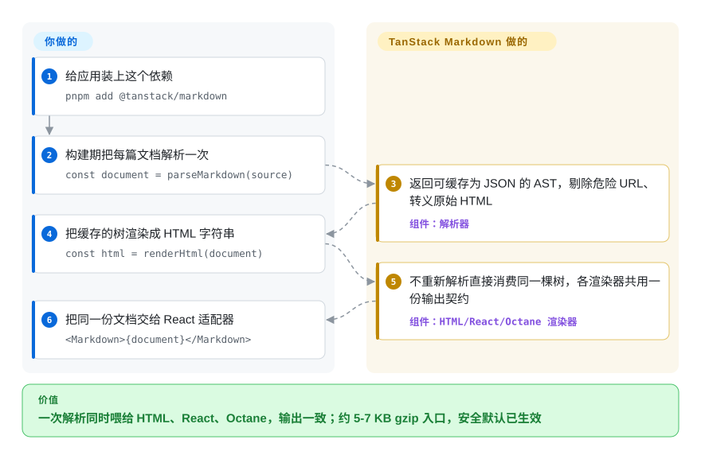

# TanStack Markdown

你要给文档站或博客接 Markdown 渲染，而渲染器总在吃掉你的包体预算——markdown-it 一个浏览器入口就拖约 53 KB gzip；只要内容不是你亲手写的，每个解析器都会变成一笔你欠自己的 XSS 审计。TanStack Markdown 把一份**成文公开过**的文档语法子集解析成一棵可以 `JSON.stringify` 的 AST，再把同一棵树渲染成 HTML、React 或 Octane，三者输出结构上完全一致——原始 HTML 默认转义、可执行 URL 协议默认剔除——解析器入口约 5 KB gzip，每个渲染器约 7 KB。

## 何时使用

你在维护一个技术博客或文档站——正文、表格、带 `file`/`framework`/行高亮元数据的围栏代码、脚注、提示框——内容是你或你的团队写的，不是匿名用户随手贴进来的。浏览器包体积是产品约束，不是事后才想起的账。你想要的是：TypeScript 里 `renderHtml(source)`、React 里 `<Markdown>{source}</Markdown>`，服务端和客户端产出结构一致，而不是把解析器缝在 react-markdown 包装层外面再祈祷注水对得上。它在相近 JS 替代品之间的决定性权衡是「包体与框架一致性，换取语料可审计」：按项目自己的度量口径，各入口约 4.9 KB（解析器）与 6.6–6.7 KB（HTML/React/Octane）gzip——约为 marked 的一半、markdown-it 的八分之一——而且大家通常要自己拼装的文档站零件（稳定且防重复的标题 ID、GFM 表格/任务列表/删除线、可选的 callout/tab/标题收集扩展）都以更小的独立入口出货。第二个定义它的场景是流式渲染 AI 回答：可选扩展每来一段增量就把整段文本重新解析——不存在那种可能停在半路 token 上而残缺的增量解析器状态——并把不完整的尾部块先压住，等闭合分隔符到达再正常呈现。

你明确交换掉的是完整的 CommonMark/GFM 行为。项目自己的兼容性报告显示 652 个规范样例匹配 403 个（61.8%，2026-09-11 生成），并且自我标注这是「兼容性记账，不是一致性承诺」；它的文档把强一致需求直接指向 commonmark.js、micromark 或 unified 管线。对能过语法档案与语料审计工具自查的受控语料，这是正确的押注；对来路不明的 Markdown，它是错误的。

## 怎么用起来

它的内核一分为二：`parseMarkdown(source)` 把 Markdown 走成一棵纯普通对象、可 `JSON.stringify` 的文档（`MarkdownDocument`），各渲染器入口只消费这棵树、不再重新解析——`@tanstack/markdown/html` 输出 HTML 字符串，`/react` 与 `/octane` 把同样的节点映射成框架元素，于是 SSR 的 HTML 与客户端注水「靠构造」一致，而不是靠测试纪律。安全边界设在解析期：原始块级与行内 HTML 默认转义，除非显式传入 `allowHtml: true`；`javascript:`、`vbscript:`、`file:` 与危险的 `data:` 协议在解析链接与图片目的地时被剔除，另有 `urlTransform(url, kind, defaultUrl)` 回调供你叠加自己的白名单。被刻意留在核心之外的有：语法高亮（你传入 `highlighter` 回调，其可信标记直接进 `<code>`；官方测试过的对接是 TanStack Highlight 适配器，语言语法因此永远不会膨胀 Markdown 包）、文档专用语法（callout、tab、注释组件、包管理器转换都是单独的可选 `/extensions/*` 入口）、以及通用插件管线（扩展面是有界的钩子，不是 unified 那种异步中间件栈）。流式 AI 输出交给约 0.2 KB gzip 的 streaming 扩展：文本累积期间压制尾部未闭合的标题、引用与列表项，闭合分隔符到达后正常补全。

<!-- flow-steps:begin (generated from flows/tanstack-markdown.json by tools/flow_card.py — do not edit) -->

流程文字版

1. **你**：给应用装上这个依赖 — `pnpm add @tanstack/markdown`
2. **你**：构建期把每篇文档解析一次 — `const document = parseMarkdown(source)`
3. **TanStack Markdown**：返回可缓存为 JSON 的 AST，剔除危险 URL、转义原始 HTML — 组件：`解析器`
4. **你**：把缓存的树渲染成 HTML 字符串 — `const html = renderHtml(document)`
5. **TanStack Markdown**：不重新解析直接消费同一棵树，各渲染器共用一份输出契约 — 组件：`HTML/React/Octane 渲染器`
6. **你**：把同一份文档交给 React 适配器 — `<Markdown>{document}</Markdown>`

**价值**：一次解析同时喂给 HTML、React、Octane，输出一致；约 5-7 KB gzip 入口，安全默认已生效

<!-- flow-steps:end -->

## 何时不用

- **你要渲染不可信的用户 Markdown（评论、论坛、个人简介）。** 安全默认不等于消毒器，项目文档直说了这一点：`allowHtml`、不做转义的 `highlighter`、扩展的 `renderHtml`、应用直接递给渲染器的 AST，全是信任边界；解析器的嵌套与分隔符扫描限额也明确**不是**总输入大小上限。大规模用户内容请改用 markdown-it 或 remark 体系，再叠一层你自己可审计的独立净化（DOMPurify / rehype-sanitize）。
- **你需要在来路不明的语料上保证 CommonMark/GFM 行为一致。** 实测 403/652 的匹配率，加上公开写明的不做项——setext 标题、缩进代码块、自动链接字面量、仅部分实体解码——意味着陌生 Markdown 一定会和参考实现有分歧。规范输出是硬要求就用 commonmark.js、markdown-it 或 micromark；项目自己的对比页也是这么建议的。
- **你想把组件嵌进正文（MDX/JSX 求值）。** 设计上明确不做（「MDX、JSX 解析或任意代码求值」列在刻意限制里）。请用 MDX 体系。
- **你需要庞大的插件目录或变换管线**（lint 规则、自定义 AST pass、多格式输出、KaTeX 数学）：remark/unified 或 markdown-it 有现成零件；TanStack Markdown 给的是有界钩子加一套 docs 预设，不是生态。若你今天就需要数学，issue #13 的社区备注反馈它只能作为外部扩展接进来。[推断]
- **你的组织带不动一个两个月大的 v0.0.x 依赖。** 至今每个版本都是 0.0.x 补丁，公共面仍在动（`urlTransform` 与 `InlineComponentNode` 都是 0.0.15 才落地），而且**仓库里没有 LICENSE 文件**——MIT 只写在 `package.json` 元数据里（2026-09-28 查证）。要稳妥的历史选择，请留在有十余年履历的 marked 或 markdown-it 上。

## 横向对比

| 替代品 | 是否收录 | 我们的评价 | 取舍 |
|---|---|---|---|
| [markdown-it](markdown-it.zh.md) | ✅ | 当严格 CommonMark 解析与成熟插件目录比客户端字节更重要时选 markdown-it；当约 8 倍的浏览器体积差正是你要偿还的债、且语料是文档形态时选 TanStack Markdown。 | markdown-it 买到规范保真与生态；TanStack Markdown 买到约 6.7 KB 的入口、内置 React/Octane 一致性与默认 URL 筛除，代价是刻意的规范不完整。 |
| [marked](marked.zh.md) | ✅ | 当你只需要一次调用的 Markdown→HTML 字符串、十年量级的履历，并且反正会自己净化输出、用不上框架渲染器与默认 URL 筛除时，选 marked。 | marked 赢在成熟与装机量；TanStack Markdown 赢在包体（约 6.7 对约 12.5 KB gzip）、安全默认与 HTML/React/Octane 输出一致，但它只有两个月大且是 v0.x。 |
| [micromark](micromark.zh.md) | ✅ | 当你在搭自己的内容管线、需要一个符合 CommonMark 的分词器去扩展时选 micromark；只有当你接受固定文档语法面时才选 TanStack Markdown。 | micromark 是 remark 底下的标准层、是可扩展的积木；TanStack Markdown 是成品小型渲染器，不是你随意延伸的底层。 |
| [remark](remark.zh.md) | ✅ | 当 Markdown 是变换管线里的一环（lint、自定义 AST pass、MDX、多格式输出）时选 remark/unified；当你只要「解析一次、渲染到 UI」并缓存一棵可序列化的 AST 时选 TanStack Markdown。 | remark 买到 mdast 生态与变换能力，运行时表面积大得多（同一工装下 unified+remark+rehype 约 37 KB gzip）；TanStack Markdown 买到可缓存的普通对象 AST 加一致性渲染器，约 7 KB。 |
| Streamdown | 未收录 | 当你需要面向 AI 流式、装机量现成的 react-markdown 直接替代品时选 Streamdown——它正是本项目在 React AI 回答渲染基准里对标的那个既有方案。 | 真实仓库（`vercel/streamdown`），本索引尚无页面——本轮 tab-intake 未收录。TanStack Markdown 的回答是约 6.7 KB 的 React 入口、非 React 的 HTML/Octane 渲染器、无状态的整段重解析式流式；Streamdown 抢先积累一年多的采用度它没有。 |

## 技术栈

- **语言/运行时：** 全仓库 TypeScript；发布形态为纯 ESM——`"type": "module"`，`exports` 映射只有 `import` 条件（2026-09-28 读取 package.json），CommonJS 项目需要打包器或转译层。浏览器与 Node 皆可运行。
- **入口：** `@tanstack/markdown`（默认汇总再导出）、`/parser`、`/html`、`/react`、`/octane`，外加 `/extensions/{callouts,docs,framework,headings,streaming,tabs,comment-components}`（见 exports 映射）。
- **工装：** `tsc` 构建；vitest 测试面（一致性、语料、安全、弹性、注水、包体积与预算测试）；Playwright 做浏览器流式校验；esbuild 加 gzip/brotli 出自适应体积报告；Changesets + GitHub Actions trusted publishing 走发布。
- **对端目标：** React ≥ 18 与 `octane` ≥ 0.1.12（npm 上那个自述为「Inferno 继任者」的 UI 框架）——两者皆为 optional peer，各自只被对应适配器入口引用。
- **代理面：** 包内随发布 `skills/*/SKILL.md` 任务卡，可用 `npx @tanstack/intent@latest install` 安装给编码代理。

## 依赖

- **运行时：** 零依赖（`@tanstack/markdown@0.0.15` 未声明任何 `dependencies`；npm registry 元数据 2026-09-28）。
- **可选 peer：** `react >=18`（仅 `/react` 入口需要）、`octane >=0.1.12`（仅 `/octane`）——`peerDependenciesMeta` 均标 optional。
- **高亮是独立安装件：** `highlighter` 回调由外部包供给（官方以 `@tanstack/highlight` 对接测试）；语言语法永不进 Markdown 包。
- **渲染不可信输入时仍需自备**消毒器（DOMPurify / rehype-sanitize）——被明确划在本库职责之外。

## 运维难度

**低。** 它是依赖不是服务：装上、按最窄入口引用、随应用出货——没有常驻进程、数据存储或基础设施。长期负担集中在版本位移（0.0.x 补丁仍会加公共 API，请锁定精确版本并逐条读 CHANGELOG 再升级），以及迁移前那件文档反复强调的事：先拿语法档案审计语料（其仓库自带 `MARKDOWN_CORPUS_DIRS=… pnpm run test:corpus` 与外部语料审计脚本，可直接抄作模板）。

## 健康度与可持续性

- **雷达（机器评分 2026-09-28）：总评 C——维护 A、响应 C、采用 C、寿命 D、治理 D、许可 `?`**（`license_declared_unverifiable`）；见上方卡片。
- **维护——异常活跃，但只有两个月大。** 仓库创建于 2026-07-21、最后推送 2026-09-26（GitHub API 2026-09-28）；npm 包（创建于 2026-06-21）约 3 个月发了 15 个版本，最新 v0.0.15（2026-09-13）。发布经 Changesets 由 CI 驱动、走 npm trusted publishing，CHANGELOG 逐版记录包体增减——节奏与纪律是真的，资历还浅。
- **治理与 bus factor——org 头衔之下目前是一人仓库。** 它挂在 `TanStack` GitHub 组织名下（owner type 为 Organization，2026-09-28 查证），品牌、CI、发布基建都有；但贡献者共 4 个，近 12 个月贡献窗口中 tannerlinsley 占约 89%（top1_share 0.889，health.py 2026-09-28）。当下的关键人风险在人，不在组织。[推断]
- **背书——押注的本体是 TanStack 这个品牌。** Query/Router/Table 家族背着大量生产采用；而这个仓库的文档、基准、语料审计工装、回归套件、随包 skills 文件的完成度，读起来是有意志、有节奏的持续投入，不是周末作品。[推断：依据本仓库物料与该组织履历判断，未见披露的财务信息]
- **采用——按年龄看量很大，但掺着热度，且还看不到下游。** 机器口径近一月 npm 下载 216,868（health.py 2026-09-28；npm API 截至 2026-09-27 的同名窗口为 223,185），对应约 412 个 GitHub star 与评分里 **0 个依赖本包的仓库**——有下载、无依赖图谱，正是发布潮而非沉淀使用的形态[推断]；且所有采用者都在把 v0.x 当依赖用。issue 首次响应中位数约 531 小时（响应轴 C，health.py 2026-09-28）。
- **年龄与 Lindy——还谈不上。** 约 2 个月大（评分时 repo_age_days 69），索引的 Lindy 先验在这一页给不了任何支撑；真正的赌注在组织，以及设计纪律（包体预算、有回归保护的兼容性记账、诚实的不做清单），而不是时间。
- **风险标记。** v0.0.x 公共 API 仍会动；**仓库中没有 LICENSE 文件**（GitHub license 端点 404；MIT 只写在 `package.json` 里）——对组织内采用是实打实的法务缺口，尽管该组织其他仓库都是 MIT；刻意的语法子集对审计过的语料是特性，对未审计的语料是地雷。

## 存疑（未验证）

- [未验证] 全部体积、基准与 403/652 一致性数字来自项目自己生成的报告（`reports/sizes.md`、`benchmarks.md`、`conformance.md`，2026-09-11/12 生成），本轮未复跑工装。
- [未验证] 22.3 万月度下载里，生产流量与 CI/尝鲜各占多少——registry 无法按消费者类型拆分。
- [推断] 「org 头衔、一人仓库」来自 contributors API 快照（2026-09-28）；TanStack 内部对这个项目的真实人力投入无法从外部观察。
- [推断] MIT 仅来自 `package.json` 声明；文件树里没有 LICENSE，GitHub 许可证探测返回 null（两项均于 2026-09-28 查证）。
- [未验证] Octane 框架的身份与成熟度取自其 npm registry 描述（「Inferno 的继任者」），未对该框架本身做评估。
- [推断] npm 包（2026-06-21 创建）早于公开仓库（2026-07-21）存在，暗示发布前有过私有孵化期；公开材料中未见相应说明。
- [推断] 称其「带热度」是对两个月大仓库 star 增速的解读，未查询独立的热度数据源。
