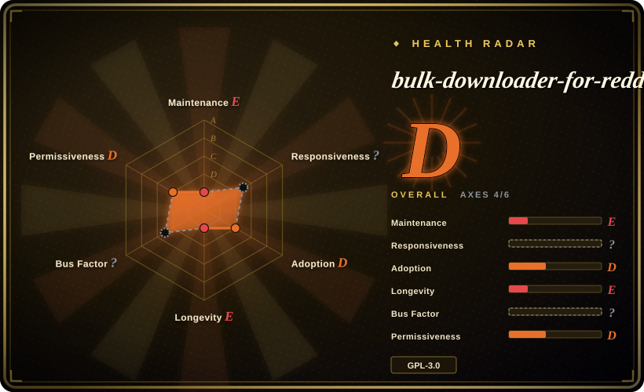
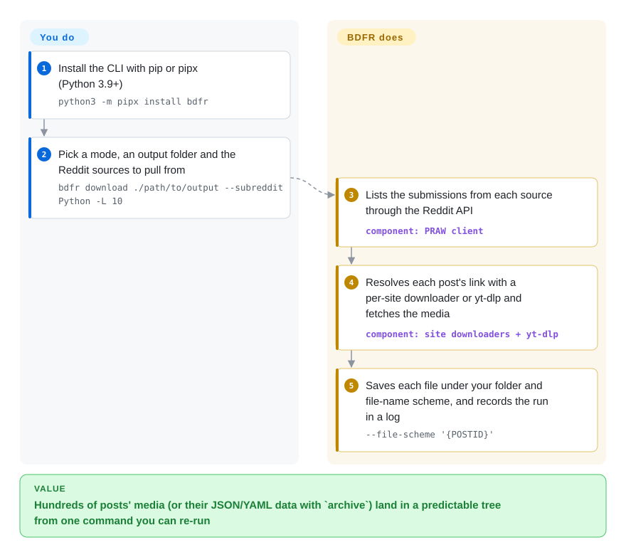

# bulk-downloader-for-reddit

A command-line tool (BDFR) that downloads media and/or archives metadata from Reddit — subreddits, multireddits, users, saved/upvoted posts, or direct links — via the official Reddit OAuth API.

## When to use

You're archiving a subreddit before it goes private, or backing up your own saved/upvoted posts, or building a personal dataset of images and videos from a handful of communities. You don't want to click through hundreds of threads, and you want both the *files* (images, galleries, Redgifs/Imgur/YouTube-hosted clips) and the *context* (post titles, scores, comment trees) on disk in a predictable folder layout. You `pipx install bdfr` and run `bdfr download ./out --subreddit pics --limit 200 --sort top`; public listings need no login, and for your own upvoted/saved posts you add `--authenticate` once (`bdfr clone ./out --user me --upvoted --authenticate`) to grab both files and metadata. BDFR resolves each submission's link through its own resolvers plus yt-dlp, names files by a template you control, and with `--search-existing --no-dupes` hashes what is already on disk so a re-run skips files it already has.

It's the right reach when you want a *scriptable, reproducible* Reddit archive — three modes (`download` files-only, `archive` metadata-only, `clone` both), YAML config for repeatable jobs, and a folder/naming scheme you can pin down — rather than a one-off browser extension grab.

## How it works

BDFR is a command you run on your own machine; there is no server. **You** choose one of three modes — `download` (the files a post links to), `archive` (the post itself: title, score, text and comments, saved as JSON, XML or YAML) or `clone` (both) — plus the sources (subreddits, users, multireddits, single links) and the folder/file-name scheme, either as flags or in a YAML options file. **It** asks Reddit's API, through the PRAW client library, for the posts in each source, then hands each post's link to a matching downloader — a per-site one for Imgur, Redgifs, Reddit galleries/videos and similar, or yt-dlp (a general video downloader) for anything else — and writes the results under your scheme. Login is only needed for private listings such as your saved or upvoted posts: `--authenticate` opens a one-time browser consent page and stores the token. Re-runs do not remember what they fetched on their own; you ask for that with `--search-existing --no-dupes` (hash what is already on disk and skip it) or an `--exclude-id-file` built from the run log.

<!-- flow-steps:begin (generated from flows/bulk-downloader-for-reddit.json by tools/flow_card.py — do not edit) -->

Text version of the flow

1. **You**: Install the CLI with pip or pipx (Python 3.9+) — `python3 -m pipx install bdfr`
2. **You**: Pick a mode, an output folder and the Reddit sources to pull from — `bdfr download ./path/to/output --subreddit Python -L 10`
3. **bulk-downloader-for-reddit**: Lists the submissions from each source through the Reddit API — component: `PRAW client`
4. **bulk-downloader-for-reddit**: Resolves each post's link with a per-site downloader or yt-dlp and fetches the media — component: `site downloaders + yt-dlp`
5. **bulk-downloader-for-reddit**: Saves each file under your folder and file-name scheme, and records the run in a log — `--file-scheme '{POSTID}'`

**Value**: Hundreds of posts' media (or their JSON/YAML data with `archive`) land in a predictable tree from one command you can re-run

<!-- flow-steps:end -->

## When NOT to use

- **You expect to pull more than ~1000 posts from a single source.** This is a hard Reddit API ceiling (listings cap at ~1000), and the README states plainly: "We cannot bypass this." For deep historical archives you need a different approach (e.g. Pushshift-style dumps, where still available).
- **You want a faithful, browsable clone of Reddit.** `clone` retrieves raw data, not a navigable replica — no rendered site, no guaranteed completeness of comment trees.
- **Your job depends on Reddit login working today.** Private listings (saved, upvoted, private multireddits) go through `--authenticate`, which uses the OAuth client id baked into BDFR's default config; open reports from 2025-12 and 2026-01 describe authentication and unauthorized-session failures, and the fix would land on an unreleased branch if at all. For a saved-posts backup you must not lose, test a run first and keep a fallback such as [gallery-dl](gallery-dl.md) (which also handles Reddit) or a small PRAW script with your own API app.
- **You need a maintained, frequently-released tool.** The last tagged release (v2.6.2) is from early 2023; commits continue but the release cadence has effectively stalled — later commits sit on the `development` branch, so getting a fix means installing from that branch rather than a blessed version (see Health).
- **Content on sites BDFR/yt-dlp can't resolve.** It handles Imgur, Redgifs, galleries, YouTube, and "anything yt-dlp supports," but an unsupported or newly-changed host will simply fail for those links. [推断]

## Comparison

| Alternative | In index | Our verdict | Tradeoff |
|---|---|---|---|
| [gallery-dl](gallery-dl.md) | ✅ | Choose gallery-dl when you need a broad multi-site media downloader that includes Reddit. | Broad multi-site media downloader (Reddit among many); strong for *files* across the web, but weaker at Reddit-specific metadata/comment archiving and the three-mode download/archive/clone model. |
| redditdownloader (shadowmoose) | 未收录 | Choose redditdownloader when you need another dedicated Reddit downloader with a web UI. | Another dedicated Reddit downloader with a web UI; more approachable for non-CLI users, but BDFR's scriptable CLI + YAML config suits automation better. [未验证] |
| Pushshift dumps / PRAW scripts | 未收录 | Choose Pushshift dumps or PRAW scripts when you want to bypass tooling and build directly on data/API access. | Going straight to data dumps or the API yourself bypasses tooling and the ~1000 cap (dumps) but is roll-your-own — BDFR packages resolvers, dedup, naming, and logging for you. |
| [yt-dlp](yt-dlp.md) (directly) | ✅ | Choose yt-dlp directly when you only need to download individual hosted-media links. | BDFR *uses* yt-dlp under the hood for hosted media; calling yt-dlp directly works for individual links but lacks Reddit-source enumeration, metadata archiving, and dedup. |

## Tech stack

- **Language:** Python 3.9+.
- **Reddit access:** the official Reddit API over OAuth2 (PRAW-style client) for enumerating submissions and metadata.
- **Media resolution:** built-in per-site resolvers (Imgur, Redgifs, Reddit galleries/video, Vidble, Erome, …) plus **yt-dlp** as the general fallback.
- **Output:** templated file naming, hash-based dedup, structured logs; YAML config for repeatable runs; three modes (download / archive / clone).

## Dependencies

- **Runtime:** Python 3.9+, installed via `pip install bdfr` / pipx (AUR package on Arch).
- **Credentials:** none for public sources; for private ones, a one-time browser OAuth consent with BDFR's bundled client id (bring your own API key/secret via `config.cfg` if you prefer).
- **Bundled libs:** PRAW (the Reddit API client), yt-dlp, requests, BeautifulSoup, click, PyYAML, dict2xml per `pyproject.toml`, plus BDFR's own per-site resolver code.
- **No database / no services** — it writes files and a log to local disk; state is the on-disk output + log.

## Ops difficulty

**Low.** It's a `pip`/pipx install (plus a one-time browser consent if you touch private listings), then a CLI invocation (or a cron'd YAML job). There's no server, datastore, or queue to operate; `--search-existing --no-dupes` (or `--exclude-id-file` built from the log) makes re-runs cheap and idempotent-ish. The realistic friction is operational, not infrastructural: respecting the ~1000-post ceiling, occasional resolver breakage when a host changes, and the fact that any recent fix lives on the unreleased `development` branch so you own keeping it current and verifying it still works.

## Health & viability

- **Maintenance**: Grade E — 0/13 active weeks in trailing 13; last commit on the default branch 1346 days ago (2023-01-31); later work is on `development`, last merged 2026-04-12.
- **Responsiveness**: Cannot be scored — no_traffic.
- **Adoption**: Grade D.
- **Longevity**: Grade E — 3038 days old.
- **Governance**: Cannot be scored — unattributable.
- **Risk / License**: Grade D — GPL-3.0 license.

## Caveats (unverified)

- [未验证] ~2.6k stars as of 2026-06 and v2.6.2 (2023-01) as the last tag — figures are date-sensitive; commit activity to 2026-04 is from the API but the "maintained but unreleased" read is a judgment.
- [未验证] The precise current resolver list is taken from the README; the Reddit client is PRAW per `pyproject.toml` (checked 2026-10-08).
- [未验证] Whether `--authenticate` and anonymous public-listing access still work against Reddit's API as of 2026-10 was not tested; the README says login is only needed for private listings, but open issues from 2025-12 ("Exception not allowing to even authenticate") and 2026-01 ("JSONDecodeError on unauthorized session") report failures.
- [推断] Per-host failure on unsupported/changed sites is inferred from the resolver+yt-dlp architecture, not a tested enumeration.
