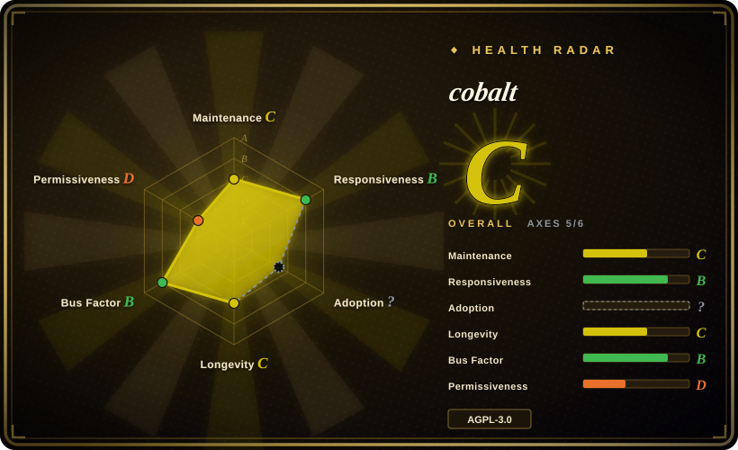
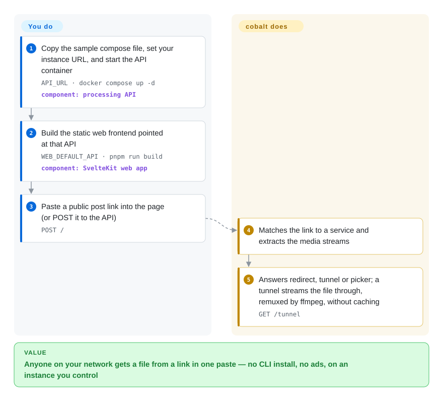

# cobalt

A self-hostable media downloader with a clean web UI and a JSON API — paste a link from many social sites and it hands back the video or audio, with no ads, trackers, or paywalls.

## When to use

You're a self-hoster (or a small team) who wants a friendly, browser-based way to save clips and audio from social platforms — YouTube, TikTok, Instagram, Twitter, Reddit, SoundCloud, Vimeo, and more — without installing a CLI on every machine or teaching non-technical people to run `pip` and command flags. You want a single page where anyone on your network pastes a URL and gets a download, and you don't want that page littered with ads, trackers, or a paywall nudging you toward a "pro" tier. You start the cobalt API (the `/api` backend) from its Docker image, build the static Svelte frontend (the `/web` directory) with `WEB_DEFAULT_API` pointing at your own API instance, and now you have a private, clean media saver you control — or you skip hosting entirely and use a public instance someone else runs.

You also reach for it when you want a *small JSON API* in front of media extraction rather than a scriptable binary: an internal tool or bot POSTs a URL to your cobalt instance and gets back a direct media link, so the extraction logic lives behind one HTTP endpoint you operate instead of being bundled into every caller. The draw is the product experience — clean UI, simple API, no nonsense — over raw scripting power.

## How it works

cobalt is two pieces: a processing API that does the work and a static web page that is only a front end for it. **What it does for you:** given a public post link, the API works out which site it belongs to, pulls out the video/audio streams, and replies in one of a few ways — `redirect` (here is the site's own file URL), `tunnel` (cobalt streams the file to you through itself, using ffmpeg, a media-conversion tool, to stitch separate video and audio tracks into one file when needed) or `picker` (the post has several items; choose one). Nothing is stored: a tunnel is a pass-through pipe, not a download cache. **What you do:** run the API container with your instance's public URL set, build the web page with that API's address baked in, put a reverse proxy in front if it faces the internet, and decide how to keep strangers off it (Turnstile bot checks or API keys, per the project's "protect an instance" guide). Think of it as a self-hosted "save this" button: the page is just the button, the API is the one who goes and fetches.

<!-- flow-steps:begin (generated from flows/cobalt.json by tools/flow_card.py — do not edit) -->

Text version of the flow

1. **You**: Copy the sample compose file, set your instance URL, and start the API container — `API_URL · docker compose up -d` — component: `processing API`
2. **You**: Build the static web frontend pointed at that API — `WEB_DEFAULT_API · pnpm run build` — component: `SvelteKit web app`
3. **You**: Paste a public post link into the page (or POST it to the API) — `POST /`
4. **cobalt**: Matches the link to a service and extracts the media streams
5. **cobalt**: Answers redirect, tunnel or picker; a tunnel streams the file through, remuxed by ffmpeg, without caching — `GET /tunnel`

**Value**: Anyone on your network gets a file from a link in one paste — no CLI install, no ads, on an instance you control

<!-- flow-steps:end -->

## When NOT to use

- **AGPL-3.0 network copyleft is a problem for you.** This is the sharpest filter. cobalt is AGPL-3.0: if you run a modified version as a *network service* that others interact with, the license requires you to offer those users your modified source. For an internal/personal instance that's usually fine, but if you want to fork it into a closed hosted product, the AGPL obligation follows the service — weigh it before building on top. [推断] The web frontend is a separate licence again: `/web` is CC-BY-NC-SA-4.0, which forbids commercial use of that code — for a commercial product, keep only the AGPL API and write your own UI, or pick a CLI such as [yt-dlp](yt-dlp.md).
- **You need a scriptable CLI or embeddable library for a pipeline.** cobalt is a *UI/API service*, not a pip-installable downloader you pin in `requirements.txt` and call from cron. For archival jobs, batch ingest, or anything that wants a binary returning files via output templates, use **yt-dlp** or [youtube-dl](youtube-dl.md) instead — they're built for the pipeline, cobalt is built for the browser.
- **Legal / ToS exposure.** Downloading copyrighted media or violating a site's Terms of Service is on you, not the tool. Many target sites prohibit downloading; running a *public* instance that others use can broaden that exposure. Check the law and each site's ToS before standing one up.
- **You can't or won't run the ops.** A self-hosted instance is a service you operate — exposed to the internet it attracts abuse, scraping, and bandwidth costs, so you'll need rate-limiting, monitoring, and probably auth/tokens. If you don't want to run and defend a service, a CLI that "executes and exits" is less to babysit.
- **You depend on one specific site working today.** Like all extractors, cobalt chases sites as they change their players; a given platform can break between updates. Verify the specific site you care about against the current instance, don't assume blanket coverage. [未验证] As of 2026-10-08 the `main` branch has had no commits since 2026-04-06 (~6 months) — for an extractor that is the warning sign to watch; if site fixes stop landing, [yt-dlp](yt-dlp.md) is the actively chased alternative.

## Comparison

| Alternative | In index | Our verdict | Tradeoff |
|---|---|---|---|
| [youtube-dl](youtube-dl.md) | ✅ | Pick youtube-dl when you need a local Python CLI/library workflow instead of a hosted web/API service. | Python CLI / library driven by ~1000 per-site extractors; built for scripting and pipelines, no service to run — but a command-line tool, not a browser UI, and its upstream release cadence has slowed (yt-dlp is the active successor). |
| [yt-dlp](yt-dlp.md) | ✅ | Pick yt-dlp when broad, fast-updated CLI extraction matters more than a browser UI. | The actively-maintained youtube-dl fork; the de-facto CLI for YouTube extraction with the broadest, fastest-updated site support. A scriptable binary, not a hosted UI/API service like cobalt. |
| [you-get](you-get.md) | ✅ | Pick you-get when you want a simpler Python CLI with its own site catalog. | Python command-line downloader with its own site list; simpler UX than yt-dlp but a smaller, less-actively-tracked extractor catalog — still a CLI, not a web service. |
| [gallery-dl](gallery-dl.md) | ✅ | Pick gallery-dl when the target is image/gallery sites rather than video/audio web downloads. | Specializes in *image/gallery* sites (boorus, social-media galleries) rather than video/audio; complementary to cobalt, not a substitute. |

## Tech stack

- **Frontend:** Svelte web app (the `/web` directory) — the clean single-page UI users paste links into.
- **Backend:** a Node-based JSON API (the `/api` directory) that does the extraction and returns media links; the UI is a client of this API and can be pointed at any instance.
- **Languages:** GitHub reports the repo as predominantly Svelte, with substantial JavaScript and TypeScript — consistent with a Svelte UI plus a JS/TS Node API.
- **Deployment:** the API ships as a Docker image (`ghcr.io/imputnet/cobalt`) configured by environment variables; the frontend is a static SvelteKit + Vite build configured at build time (`WEB_DEFAULT_API`). ffmpeg does the remuxing/transcoding.

## Dependencies

- **Runtime (yours to run):** to self-host you operate the API service (and typically the web UI); the documented path uses Docker, so a container runtime is the practical baseline.
- **Configuration:** environment variables configure an instance (e.g. its API URL and operational settings); the web UI must be pointed at an API instance to function.
- **Network:** outbound HTTP(S) to the target sites for extraction, plus an inbound entry point (and ideally a reverse proxy / TLS) if you expose the UI/API beyond localhost.
- **No download client needed by the user:** end users just need a browser — the "dependency" burden is on the operator, not the consumer.

## Ops difficulty

**Medium.** Unlike a CLI that executes and exits, cobalt is a *service you run and keep running*. The happy path is reasonable — `docker compose up -d` with `API_URL` set brings up the API (the sample compose file also runs watchtower to auto-update the image), and the UI is a static build — but operating it long-term means the usual service burdens: a reverse proxy and TLS if it's public, monitoring and restarts, and crucially **abuse control**. A publicly reachable downloader is a magnet for scraping and bandwidth abuse, so you'll want rate-limiting and likely API tokens/auth so it isn't an open relay. You also inherit extractor fragility: when a target site changes, you update the instance to keep it working. For a private, localhost-only instance this is light; for a public one, budget for the operational and bandwidth cost.

## Health & viability

- **Responsiveness**: Grade B — median first-response time 238.2 hours across 4 qualifying issues/PRs — first replies have slowed from about a day and a half in the 2026-09-27 scoring to about ten days.
- **Maintenance — quiet since 2026-04-06 (as of 2026-10-08).** Not archived, but the last commit on `main` (cobalt 11.7 plus a dependency revert) is ~6 months old and the trailing 13 weeks show no commits, so the maintenance grade is C and overall slipped from B to C in this re-score. Treat continued activity as load-bearing for this tool class — a stale extractor silently breaks — so re-check commit recency before you stand up a new instance.
- **Governance & backing.** `Org`-owned (`imputnet/cobalt`) — a small team/org behind a public-instance product, not a foundation and not a large vendor [推断]. Roadmap and the official public instance sit with that team; self-hosting insulates you from any single instance going away, which is the main resilience lever here.
- **Age & Lindy verdict — mid-young (created 2022-07, ~4y).** Old enough to have proven the product and accumulated ~45k stars, young enough that there's no decade-long track record; a reasonable-but-not-bulletproof bet whose real fragility is per-site extractor breakage, not project death [推断].
- **Risk flags — AGPL-3.0 network copyleft (load-bearing).** This is the sharpest flag: run a *modified* version as a network service and you owe users your source. Fine for internal/personal instances; a blocker if you want to fork it into a closed hosted product (see When NOT to use / Caveats) [推断]. The `/web` frontend is CC-BY-NC-SA-4.0 (non-commercial), so the repo is not uniformly AGPL. Plus the legal/ToS exposure inherent to running a public downloader.

## Caveats (unverified)

- [未验证] ~44.8k GitHub stars as of 2026-10 and the last `main` commit on 2026-04-06 — star counts and activity dates are time-sensitive; re-check the repo. Whether the ~6-month pause is a release lull or a slowdown is not known.
- [未验证] Frontend is Svelte (`/web`) and the backend is a Node JSON API (`/api`); the precise backend runtime/framework was inferred from the repo's reported language mix and directory layout, not read from source — verify against the repo.
- [未验证] The set of supported sites (YouTube, TikTok, Instagram, Twitter, Reddit, SoundCloud, Vimeo, VK, …) comes from project framing and changes over time; confirm the specific site you need against the current instance.
- [未验证] "No ads, trackers, or paywalls" is the project's own stated positioning, not independently audited here.
- [推断] AGPL-3.0 network-copyleft obligations for a hosted/modified service are a general reading of the license, not legal advice — consult the LICENSE and counsel if the obligation is load-bearing for your use.
- [推断] Docker + environment-variable configuration is described as the documented self-host path; exact required variables and minimum versions shift release-to-release — follow the repo's current docs.
- [推断] Frontmatter `license: AGPL-3.0` is the root `LICENSE` that GitHub reports; per `api/README.md` and `web/README.md` (read 2026-10-08) the API is AGPL-3.0 and the web frontend is CC-BY-NC-SA-4.0. How the NC clause applies to a self-hosted internal UI is a legal question, not settled here.
