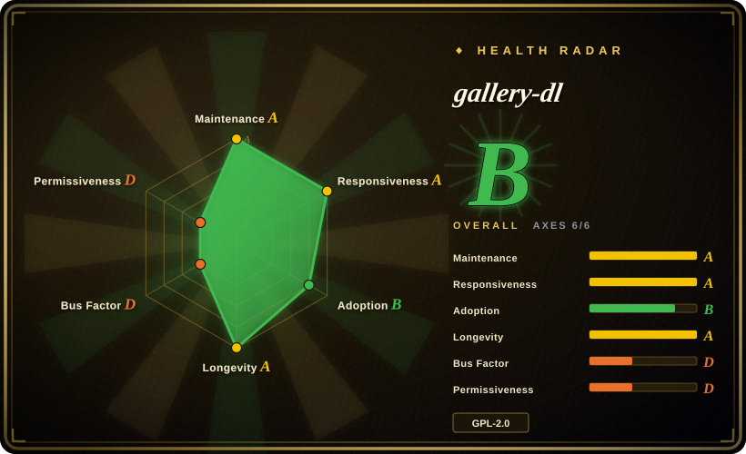
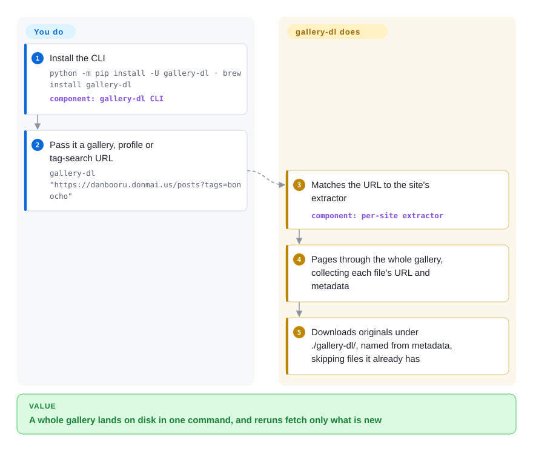

# gallery-dl

You want every image from an artist's Pixiv, DeviantArt or Instagram page, or every result of a tag search on an image board — saving them one by one is hundreds of clicks, the site pages the results, and next month you'd have to work out which ones are new. gallery-dl takes the page URL, walks the whole gallery through a site-specific extractor, and saves the original files with names built from their metadata, skipping any it already has.

## When to use

You archive art, photo or manga collections — your own uploads before leaving a platform, an artist you follow, a board's tag, a Reddit or Bluesky account — and the browser gives you no "download all". You reach for gallery-dl because it already knows roughly 390 sites (Pixiv, DeviantArt, Instagram, Twitter/X, Reddit, Kemono, Danbooru and many boorus and manga readers): one command such as `gallery-dl "https://danbooru.donmai.us/posts?tags=bonocho"` pages through the results and writes full-resolution originals into a tidy folder tree, and a rerun skips what's already on disk.

Pick it over [yt-dlp](yt-dlp.md) when the target is images and image galleries rather than video streams (gallery-dl even hands HLS/DASH video to yt-dlp when it meets one). Pick it over single-site tools such as [bulk-downloader-for-reddit](bulk-downloader-for-reddit.md) or Instaloader when you follow several sites and want one tool, one config file and one naming scheme for all of them.

## How it works

gallery-dl is a command-line program with one *extractor* per site — a small Python module that knows how that site lists a user's posts or a search's results, whether through its API or its HTML. You give it a URL; it picks the matching extractor, pages through the gallery, collects each file's direct URL plus metadata (artist, post ID, date, tags), and downloads the files into `./gallery-dl/<site>/…` by default, with directory and file names you can template from that metadata. What you do: supply the URL, and for sites behind a login, credentials — a username/password, OAuth, or cookies taken straight from your browser (`--cookies-from-browser firefox`). Everything else — rate-limit sleeps, retries, skipping files that already exist (or are listed in a `--download-archive` file) — is configured once in a JSON config file and then happens on every run, which is what makes a cron job of "fetch what's new" practical.

<!-- flow-steps:begin (generated from flows/gallery-dl.json by tools/flow_card.py — do not edit) -->

Text version of the flow

1. **You**: Install the CLI — `python -m pip install -U gallery-dl · brew install gallery-dl` — component: `gallery-dl CLI`
2. **You**: Pass it a gallery, profile or tag-search URL — `gallery-dl "https://danbooru.donmai.us/posts?tags=bonocho"`
3. **gallery-dl**: Matches the URL to the site's extractor — component: `per-site extractor`
4. **gallery-dl**: Pages through the whole gallery, collecting each file's URL and metadata
5. **gallery-dl**: Downloads originals under ./gallery-dl/, named from metadata, skipping files it already has

**Value**: A whole gallery lands on disk in one command, and reruns fetch only what is new

<!-- flow-steps:end -->

## When NOT to use

- **You want the code on GitHub to be the source of truth.** After a DMCA takedown notice in March 2026 forced a history rewrite on GitHub, active development moved to Codeberg (`codeberg.org/mikf/gallery-dl`). The GitHub repo now only carries release-version bumps, CI, nightly builds and Docker images; read code, file issues and pin sources from Codeberg, or install from PyPI.
- **Your main target is video.** For YouTube, Twitch or streaming sites, use [yt-dlp](yt-dlp.md) directly; gallery-dl's video support delegates to yt-dlp anyway.
- **Your site is not in the supported list and you can't write Python.** gallery-dl does not scrape arbitrary pages; an unsupported site needs a new extractor. For a one-off page, a browser-automation scraper such as [Playwright](../web-automation/playwright-family/playwright.md) or a generic crawler is quicker than waiting for one.
- **You need a library API with a stable contract.** gallery-dl is a CLI first; its Python internals are not a documented, versioned API, and extractors change whenever a site does (releases ship roughly weekly). Shell out to the CLI or pick a single-site library such as Instaloader (not indexed) if you are embedding it in a product.
- **You need permission-safe or bulk commercial scraping.** Many sites forbid mass downloading in their terms, and the March 2026 takedown targeted specific adult-site extractors. gallery-dl only passes your cookies and sleeps between requests; for anything beyond personal archiving, use the site's official export or API.
- **You need a GUI or a hosted web app.** gallery-dl is terminal-only; for paste-a-link downloads in a browser, self-host [cobalt](cobalt.md) instead (narrower site list, mostly video and social posts).

## Comparison

| Alternative | In index | Our verdict | Tradeoff |
|---|---|---|---|
| [yt-dlp](yt-dlp.md) | ✅ | For video and audio from streaming sites, choose yt-dlp; for image galleries, boorus and art sites, choose gallery-dl and let it call yt-dlp for the occasional video. | yt-dlp has the deepest video format selection and post-processing; gallery-dl covers image-board pagination, tags and metadata-based naming that yt-dlp does not target. |
| [bulk-downloader-for-reddit](bulk-downloader-for-reddit.md) | ✅ | If Reddit is the only source and you want its saved/upvoted lists and subreddit filters, pick BDFR; pick gallery-dl when Reddit is one of several sites. | BDFR understands Reddit-specific listings in depth but its last tagged release was 2023; gallery-dl is broader and ships weekly, with shallower Reddit-only features. |
| [cobalt](cobalt.md) | ✅ | For a browser UI or API that saves single social-media posts, self-host cobalt; for scripted bulk archiving of whole profiles and searches, use gallery-dl. | cobalt is friendly and hostable for many users; gallery-dl needs a terminal but handles pagination, archives and authenticated sites. |
| Instaloader | not indexed | When you need Instagram-only features (stories, highlights, comments, a Python API), choose Instaloader; choose gallery-dl to cover Instagram alongside other sites with one config. | Instaloader goes deeper on one platform and is MIT-licensed; gallery-dl is GPL-2.0 and broader but shallower per site. |
| RipMe | not indexed | Consider RipMe only if you need a Java desktop GUI for album ripping; gallery-dl is the better-maintained choice for scripted archiving. | RipMe gives a point-and-click window; gallery-dl has far more extractors and a faster release cadence but no GUI. |

## Tech stack

- **Language:** Python (3.8+ per README; PyPI metadata `requires_python >=3.8`).
- **Architecture:** a CLI around per-site extractor modules (`gallery_dl/extractor/*.py`), a downloader layer (HTTP, plus yt-dlp/youtube-dl for HLS/DASH video), and post-processors (metadata files, Ugoira → video via FFmpeg, zip, exec hooks).
- **Configuration:** JSON config files (YAML/TOML optional), merged from several locations; per-extractor options for credentials, cookies, filters and filename format strings.
- **Distribution:** PyPI, standalone Windows/Linux executables, Homebrew, Snap, Chocolatey, Scoop, MacPorts, Nix, and Docker images.

## Dependencies

- **Required:** Python 3.8+ and `requests` — or nothing, if you use the standalone executable.
- **Optional:** `yt-dlp` (or youtube-dl) for video, FFmpeg and mkvmerge for Pixiv Ugoira conversion, PySocks for SOCKS proxies, PyYAML/toml for non-JSON configs, SecretStorage for reading GNOME keyring cookies, Psycopg for a PostgreSQL download archive, Jinja for templates.
- **External:** network access to the target sites, and accounts/cookies for sites that require login (Pixiv needs OAuth; nijie needs a password).

## Ops difficulty

**Low to run, medium to keep working.** Installing and running it is a one-liner. The recurring cost is site churn: extractors break whenever a site changes its markup, API or anti-bot rules, so long-running archive jobs need regular upgrades (pip, or the `--update` path of the standalone build) and some tolerance for a broken site until the next release. Rate limits and bans are your problem to tune with `--sleep` options; sessions and cookies expire and must be refreshed.

## Health & viability

- **Maintenance — very active, but on Codeberg (2026-10-08).** Releases ship about weekly (v1.32.11 through v1.32.15 between 2026-09-04 and 2026-10-03), and Codeberg has commits from the same day. The radar's maintenance A is computed from the GitHub mirror, which now only receives release commits, so it understates day-to-day activity rather than overstating it.
- **Governance — one-person project.** Mike Fährmann (`mikf`) wrote over 90% of the commits since 2014; contributors add extractors around the edges. The radar's governance D is the honest signal here: the project's future rests on one maintainer.
- **Backing & Lindy.** No company or foundation. Twelve years of continuous releases is a strong Lindy prior for a scraper, a category where most tools die when their author loses interest.
- **Adoption.** Widely packaged (Homebrew, Snap, Scoop, Nix, Docker) and around 20k GitHub stars; the radar rates adoption B.
- **Risk flags.** The March 2026 DMCA notice from FAKKU removed named adult-site extractors from GitHub history and prompted the move to Codeberg — legal pressure on specific extractors is a real, recurring risk. GPL-2.0 (radar license D for copyleft) matters only if you embed the code.

## Caveats (unverified)

- [推断] "Roughly 390 sites" comes from counting rows in `docs/supportedsites.md` on Codeberg on 2026-10-08; some rows are site families or sub-sections.
- [未验证] Whether the removed extractors (nhentai, exhentai, hitomi, hentaifoundry) still exist on Codeberg or in PyPI releases was not checked file-by-file.
- [推断] The page's `repo` still points at GitHub because the index's snapshot and health tooling read GitHub; the GitHub mirror's commit counts do not reflect Codeberg development.
- [未验证] RipMe's current maintenance status and Java packaging were not re-verified for this page.
