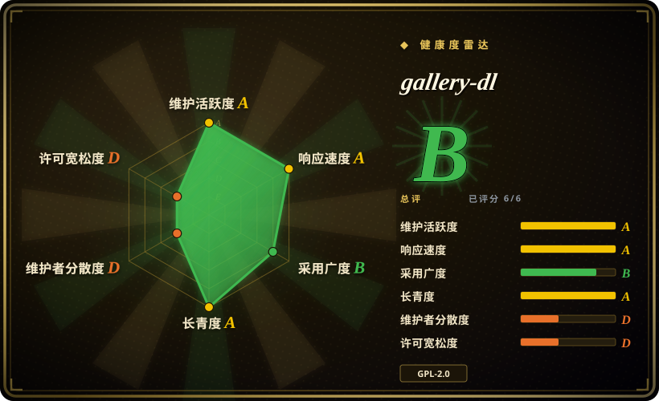
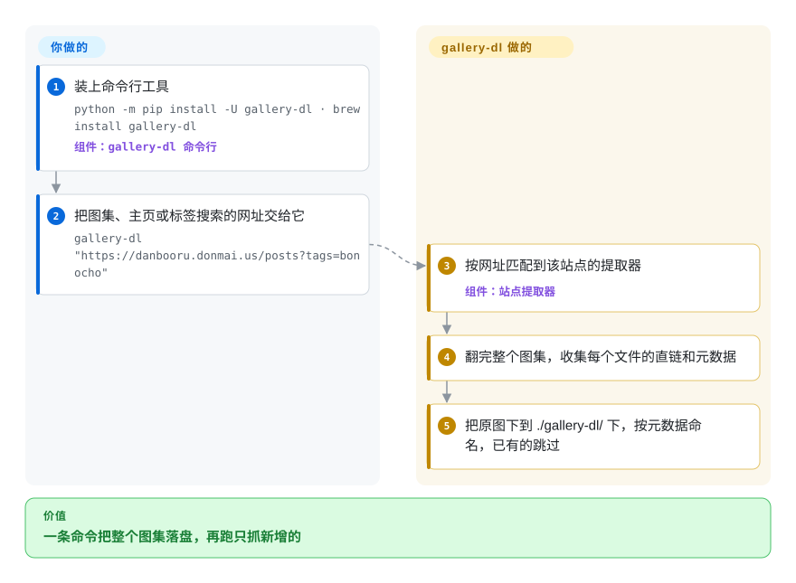

# gallery-dl

你想把一位画师在 Pixiv、DeviantArt 或 Instagram 上的全部作品，或者图站上某个标签的全部搜索结果存下来——一张张右键另存是几百次点击，网站还分页，下个月你还得自己分辨哪些是新的。gallery-dl 接过页面网址，用针对该站点写好的提取器把整个图集走一遍，按元数据给原图起名保存，已经有的自动跳过。

## 何时使用

你在归档美术、摄影或漫画收藏——离开某个平台前备份自己的作品，跟踪一位画师，存下图站上的一个标签，或一个 Reddit、Bluesky 账号——而浏览器没有“全部下载”。你用 gallery-dl，是因为它已经认识大约 390 个站点（Pixiv、DeviantArt、Instagram、Twitter/X、Reddit、Kemono、Danbooru 以及大量 booru 图站和漫画阅读站）：一条 `gallery-dl "https://danbooru.donmai.us/posts?tags=bonocho"` 就会翻完所有结果页，把全尺寸原图写进整齐的目录树，再跑一次会跳过磁盘上已有的文件。

目标是图片和图集而不是视频流时，选它而不是 [yt-dlp](yt-dlp.zh.md)（gallery-dl 遇到 HLS/DASH 视频时本身就交给 yt-dlp 处理）。你同时关注好几个站点、想用一个工具、一份配置、一套命名规则管所有站点时，选它而不是 [bulk-downloader-for-reddit](bulk-downloader-for-reddit.zh.md) 或 Instaloader 这类单站工具。

## 怎么用起来

gallery-dl 是一个命令行程序，每个站点对应一个*提取器*——一个小的 Python 模块，知道这个站点如何列出某个用户的帖子或某次搜索的结果，走的是站点 API 或 HTML 页面。你给它一个网址；它挑出匹配的提取器，逐页翻完图集，收集每个文件的直链和元数据（作者、帖子 ID、日期、标签），默认下载到 `./gallery-dl/<站点>/…`，目录名和文件名都能用这些元数据做模板。你要做的：提供网址；对需要登录的站点，再提供凭据——用户名密码、OAuth，或者直接从浏览器取 cookie（`--cookies-from-browser firefox`）。其余的事——限速等待、重试、跳过已存在的文件（或已记在 `--download-archive` 文件里的文件）——在一份 JSON 配置里设一次，之后每次运行都会照做，所以“定时抓新内容”的 cron 任务才可行。

<!-- flow-steps:begin (generated from flows/gallery-dl.json by tools/flow_card.py — do not edit) -->

流程文字版

1. **你**：装上命令行工具 — `python -m pip install -U gallery-dl · brew install gallery-dl` — 组件：`gallery-dl 命令行`
2. **你**：把图集、主页或标签搜索的网址交给它 — `gallery-dl "https://danbooru.donmai.us/posts?tags=bonocho"`
3. **gallery-dl**：按网址匹配到该站点的提取器 — 组件：`站点提取器`
4. **gallery-dl**：翻完整个图集，收集每个文件的直链和元数据
5. **gallery-dl**：把原图下到 ./gallery-dl/ 下，按元数据命名，已有的跳过

**价值**：一条命令把整个图集落盘，再跑只抓新增的

<!-- flow-steps:end -->

## 何时不用

- **你希望 GitHub 上的代码就是权威来源。** 2026 年 3 月一份 DMCA 下架通知迫使它在 GitHub 上重写历史，之后活跃开发迁到了 Codeberg（`codeberg.org/mikf/gallery-dl`）。GitHub 仓库现在只接收发版时的版本号提交、CI、每夜构建和 Docker 镜像；读代码、提 issue、锁定源码请去 Codeberg，或者从 PyPI 安装。
- **你的主要目标是视频。** YouTube、Twitch 或流媒体站点直接用 [yt-dlp](yt-dlp.zh.md)；gallery-dl 的视频支持本来就是委托给 yt-dlp 的。
- **你的站点不在支持列表里，而你不会写 Python。** gallery-dl 不抓任意网页；不支持的站点需要新写一个提取器。只抓一次的页面，用 [Playwright](../web-automation/playwright-family/playwright.zh.md) 这类浏览器自动化抓取器或通用爬虫，比等别人写提取器快。
- **你需要契约稳定的库 API。** gallery-dl 首先是命令行工具；它的 Python 内部没有文档化、带版本承诺的 API，而且站点一变提取器就跟着变（大约每周发一版）。要嵌进产品，就以子进程方式调用 CLI，或者选 Instaloader（未收录）这类单站库。
- **你要做合规敏感或商业化的批量抓取。** 许多站点的服务条款禁止批量下载，2026 年 3 月的下架通知点名的就是几个成人站点的提取器。gallery-dl 只会带上你的 cookie、在请求间等待；个人归档以外的用途，请用站点官方的导出功能或 API。
- **你需要图形界面或托管网页应用。** gallery-dl 只有终端；想在浏览器里贴链接下载，就自托管 [cobalt](cobalt.zh.md)（站点更少，以视频和社交帖子为主）。

## 横向对比

| 替代品 | 是否收录 | 我们的评价 | 取舍 |
|---|---|---|---|
| [yt-dlp](yt-dlp.zh.md) | ✅ | 从流媒体站下视频和音频选 yt-dlp；图集、booru 图站、美术站选 gallery-dl，偶尔遇到视频让它去调 yt-dlp。 | yt-dlp 的视频格式选择和后处理最深；gallery-dl 覆盖图站的翻页、标签和按元数据命名，这些不是 yt-dlp 的目标。 |
| [bulk-downloader-for-reddit](bulk-downloader-for-reddit.zh.md) | ✅ | 只抓 Reddit、需要收藏/点赞列表和子版块过滤时选 BDFR；Reddit 只是多个站点之一时选 gallery-dl。 | BDFR 对 Reddit 专有列表理解很深，但最后一个打标签的版本在 2023 年；gallery-dl 覆盖面更广、每周发版，Reddit 专属功能较浅。 |
| [cobalt](cobalt.zh.md) | ✅ | 要一个能保存单条社交媒体帖子的浏览器界面或 API，自托管 cobalt；要脚本化批量归档整个主页和搜索结果，用 gallery-dl。 | cobalt 界面友好、可托管给多人用；gallery-dl 要用终端，但能处理翻页、下载记录和需要登录的站点。 |
| Instaloader | 未收录 | 需要 Instagram 专属功能（快拍、精选、评论、Python API）时选 Instaloader；要用一份配置同时覆盖 Instagram 和其他站点时选 gallery-dl。 | Instaloader 在单一平台上更深，且是 MIT 许可；gallery-dl 是 GPL-2.0，覆盖更广但每个站点更浅。 |
| RipMe | 未收录 | 只有在需要 Java 桌面图形界面来扒相册时才考虑 RipMe；脚本化归档选维护更勤的 gallery-dl。 | RipMe 有点选式窗口；gallery-dl 提取器多得多、发版更快，但没有图形界面。 |

## 技术栈

- **语言：** Python（README 写 3.8+；PyPI 元数据 `requires_python >=3.8`）。
- **架构：** 命令行外壳包着按站点划分的提取器模块（`gallery_dl/extractor/*.py`）、下载层（HTTP，HLS/DASH 视频交给 yt-dlp/youtube-dl）和后处理器（元数据文件、用 FFmpeg 把 Ugoira 转成视频、zip 打包、exec 钩子）。
- **配置：** JSON 配置文件（可选 YAML/TOML），可从多个位置合并；每个提取器可单独配置凭据、cookie、过滤条件和文件名格式串。
- **分发：** PyPI、Windows/Linux 独立可执行文件、Homebrew、Snap、Chocolatey、Scoop、MacPorts、Nix 和 Docker 镜像。

## 依赖

- **必需：** Python 3.8+ 和 `requests`——用独立可执行文件则什么都不用装。
- **可选：** 视频用 `yt-dlp`（或 youtube-dl），Pixiv Ugoira 转换用 FFmpeg 和 mkvmerge，SOCKS 代理用 PySocks，非 JSON 配置用 PyYAML/toml，读取 GNOME 钥匙环里的 cookie 用 SecretStorage，PostgreSQL 下载记录用 Psycopg，模板用 Jinja。
- **外部条件：** 能访问目标站点的网络；需要登录的站点要有账号或 cookie（Pixiv 必须 OAuth，nijie 必须用户名密码）。

## 运维难度

**跑起来低，持续可用中等。** 安装和运行都是一行命令。反复出现的成本是站点变化：站点一改页面结构、API 或反爬规则，提取器就会坏，所以长期运行的归档任务需要定期升级（pip，或独立版的 `--update`），并能容忍某个站点在下一版发布前暂时失效。限流和封禁要你自己用 `--sleep` 系列选项调；会话和 cookie 会过期，需要刷新。

## 健康度与可持续性

- **维护——非常活跃，但在 Codeberg 上（2026-10-08）。** 大约每周发一版（2026-09-04 到 2026-10-03 之间发了 v1.32.11 到 v1.32.15），Codeberg 上当天就有提交。雷达维护轴的 A 是根据 GitHub 镜像算的，而镜像现在只收发版提交，所以它是低估而不是高估了日常活跃度。
- **治理——一个人的项目。** Mike Fährmann（`mikf`）自 2014 年以来写了 90% 以上的提交；其他贡献者在边缘补提取器。雷达治理轴的 D 在这里是诚实的信号：项目的未来系于一位维护者。
- **背书与 Lindy。** 没有公司或基金会。对抓取工具这个“作者一失去兴趣就死”的品类来说，十二年持续发版是很强的 Lindy 先验。
- **采用度。** 被广泛打包（Homebrew、Snap、Scoop、Nix、Docker），GitHub 上约 2 万星；雷达给采用度 B。
- **风险信号。** 2026 年 3 月 FAKKU 的 DMCA 通知让点名的成人站点提取器从 GitHub 历史中移除，并促成了迁往 Codeberg——针对特定提取器的法律压力是真实且会反复出现的风险。GPL-2.0（雷达许可证轴给 D 是因为 copyleft）只在你嵌入代码时才要紧。

## 存疑（未验证）

- [推断] “大约 390 个站点”是 2026-10-08 数 Codeberg 上 `docs/supportedsites.md` 的行数得来的；有些行是站点家族或子版块。
- [未验证] 被移除的提取器（nhentai、exhentai、hitomi、hentaifoundry）在 Codeberg 或 PyPI 发布包里是否还在，没有逐个文件核对。
- [推断] 本页的 `repo` 仍指向 GitHub，因为索引的快照和健康度工具读的是 GitHub；GitHub 镜像的提交统计反映不了 Codeberg 上的开发。
- [未验证] RipMe 当前的维护状态和 Java 打包方式没有为本页重新核实。
