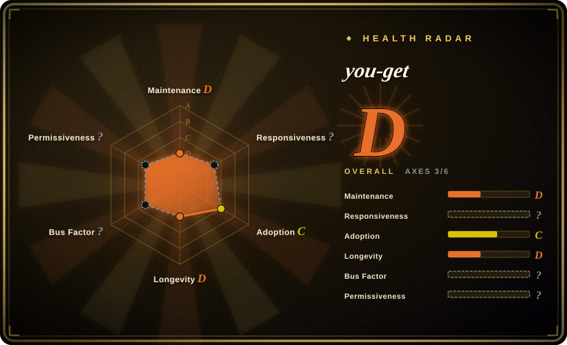
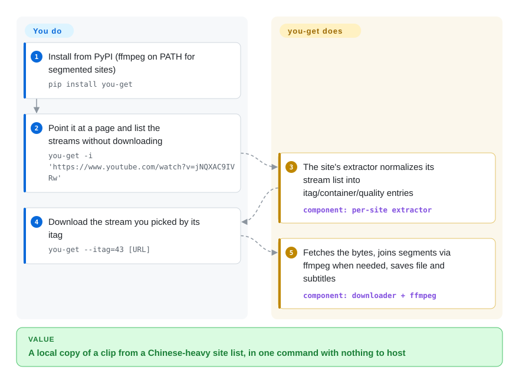

# you-get

You have a lecture recording on Bilibili or a clip on Youku, and the mainstream downloader either never covered the site or broke months ago. you-get is a small Python CLI with a curated, China-heavy site list (the README tabulates ~80 entries, plus a "universal extractor" that sniffs interesting resources on any other page): give it a URL, it lists the available streams, you pick one, and it saves the file — calling `ffmpeg` only when segments must be joined.

## When to use

You're a Chinese-language researcher or archivist pulling lecture recordings off Bilibili, a few clips from Youku, and the odd iQIYI or Tencent Video page into local files for offline review. The big Western tools either don't carry an extractor for these hosts or treat them as second-class, and you don't want to babysit a heavyweight downloader for a one-off grab. You reach for `you-get`: `pip install you-get`, then `you-get <url>` prints the available streams (itag, container, quality, size), `you-get -i <url>` inspects them without downloading, and `you-get --itag=43 <url>` fetches a chosen one. `-o`/`-O` set the output path and filename, `-l`/`--playlist` pulls a whole list (flag confirmed in `src/you_get/__main__.py`, though the README doesn't document it). It shells out to `ffmpeg` only when a download arrives as segments to join, so a single MP4 needs little more than the interpreter.

There are a few touches no big downloader bothers with: pass plain text instead of a URL (`you-get "Richard Stallman eats"`) and it searches Google Videos and grabs the top hit; `-p mpv` streams straight into a media player; Ctrl-C pauses into a `.download` file that resumes on the next identical run. For a one-off grab from a popular Chinese host whose extractor still works, it is the fewest-moving-parts option — no config, no service, one command. But read the first bullet of *When NOT to use* before depending on that: the repo has been frozen since 2025, so "still works" is now a claim about a snapshot, not a maintained guarantee.

## How it works

you-get is one downloader loop plus a set of per-site **extractors** (`you_get.extractors.*`) — each extractor knows how to ask one site for its stream list and normalize the answer into a uniform set of itag/container/quality items, falling back to a generic "universal extractor" that sniffs media URLs out of any page. What you do is tiny: point it at a URL (or list formats with `-i` first), pick a stream — or accept the highest-quality default — and choose the output path. What it does: performs the site's request dance, fetches the bytes with pause/resume via a temporary `.download` file, and shells out to `ffmpeg` to join segmented streams (required for Youku-style part streams and YouTube ≥1080p, where audio and video arrive separately). Nothing runs between invocations — no daemon, no config, no state beyond the output directory — which is exactly why it stays useful as a scripted one-off even while the project itself is on ice.

<!-- flow-steps:begin (generated from flows/you-get.json by tools/flow_card.py — do not edit) -->

Text version of the flow

1. **You**: Install from PyPI (ffmpeg on PATH for segmented sites) — `pip install you-get`
2. **You**: Point it at a page and list the streams without downloading — `you-get -i 'https://www.youtube.com/watch?v=jNQXAC9IVRw'`
3. **you-get**: The site's extractor normalizes its stream list into itag/container/quality entries — component: `per-site extractor`
4. **You**: Download the stream you picked by its itag — `you-get --itag=43 [URL]`
5. **you-get**: Fetches the bytes, joins segments via ffmpeg when needed, saves file and subtitles — component: `downloader + ffmpeg`

**Value**: A local copy of a clip from a Chinese-heavy site list, in one command with nothing to host

<!-- flow-steps:end -->

<!-- flow-steps:begin (generated from flows/you-get.json by tools/flow_card.py — do not edit) -->
<!-- flow-steps:end -->

## When NOT to use

- **The project is effectively dormant — abandonment flag (as of 2026-09).** The default branch `develop` has no commit after 2025-04-27 (a README fix; GitHub API), `master` no commit after 2025-01-04, and the last tagged release is v0.4.1743 (2025-01-04) — roughly 17 months of silence, with the issue tracker disabled so there is not even a bug-report channel. It is not archived, but nobody is patching extractors when a site changes: the longer a site's layout drifts from the 2025 snapshot, the more likely the fetch silently fails or returns the wrong format, with no upstream fix path. If you need something that must keep working, **pick [yt-dlp](yt-dlp.md) (or [lux](lux.md)) instead**; treat you-get as best-effort for hosts whose extractor happens to still work today.
- **You need maximum site breadth or the fastest YouTube fixes.** For sheer extractor count and the quickest turnaround when YouTube changes its player/signature code, **yt-dlp** (and to a lesser degree [youtube-dl](youtube-dl.md)) lead; you-get's curated, smaller catalog — and now frozen cadence — means a given non-Chinese site may be unsupported or permanently broken. Default to yt-dlp for breadth and YouTube-critical jobs.
- **You need transcoding / re-encoding.** you-get downloads and (via `ffmpeg`) *merges* segments; it is not a transcoder. If you need to re-encode, change codecs, or do filtering, that's **FFmpeg** directly — you-get just orchestrates the fetch.
- **JS-heavy / DRM-walled sites with no extractor.** It does not drive a browser or execute arbitrary page JavaScript; Widevine/PlayReady DRM, per-request token schemes, or SPA sites without a written extractor will simply fail.
- **Geo-restricted, login-walled, or large-scale scraping.** It can pass a proxy (`-x`, and a China-mainland `--extractor-proxy`/`-y` for sites like Youku) and cookies, but it won't solve CAPTCHAs, rotate identities, or shield you from IP bans; bulk-downloading from one IP gets throttled. Legal/ToS exposure for the media you fetch is your problem, not the tool's.
- **You want a stable library API.** It's primarily a CLI; importing internals is unsupported and changes without notice.

## Comparison

| Alternative | In index | Our verdict | Tradeoff |
|---|---|---|---|
| [youtube-dl](youtube-dl.md) | ✅ | Both classics are now slow-moving, but when you need the ~1000-site Python extractor catalog rather than you-get's ~80-site China-heavy list, youtube-dl still covers more ground; pick you-get only for a host whose you-get extractor works and youtube-dl's does not. | The classic Python downloader with a ~1000-site extractor catalog; far broader site coverage, and it does not depend on you-get's frozen 2025 extractor snapshot — while you-get retains the edge on some Chinese hosts. |
| [yt-dlp](yt-dlp.md) | ✅ | For anything that must keep working next month — YouTube in particular — pick yt-dlp: its release-per-days cadence is exactly the fix path you-get no longer has; you-get remains interesting only where its Chinese-host extractors work and cover a host yt-dlp treats poorly. | The actively-maintained youtube-dl fork; the broadest catalog and fastest YouTube fixes, more options (SponsorBlock, format sorting, aria2c). you-get stays appealing for its small footprint and Chinese-site focus. |
| [lux](lux.md) | ✅ | If you want the same "compact downloader with its own China-friendly list" idea but a project that still ships releases, pick lux — a Go single binary needs no Python runtime at all; choose you-get when Python packaging and its particular site coverage matter more. | Go single-binary downloader (formerly annie) with its own China-friendly site list; no Python runtime and fast, but a narrower, differently-curated catalog. |
| [cobalt](cobalt.md) | ✅ | Pick cobalt when the users are people clicking a web page rather than you scripting a grab — it's a self-hostable web/API service; you-get is the one-liner in a terminal or a script. | Web/API-first downloader (self-hostable service); clean browser UX, but it's a service to run rather than a pip-installable CLI for scripting. |

## Tech stack

- **Language:** Python — README requires 3.7.4 or above (a 2022 notice says support for 3.5/3.6/3.7 is being phased out).
- **Architecture:** a core downloader plus per-site **extractor** modules (`you_get.extractors.*`); each extractor normalizes one site's stream discovery into a common interface, and a universal extractor handles sites on no list.
- **Post-processing:** shells out to `ffmpeg` (≥1.0) to merge/join multi-segment streams (YouTube ≥1080p always needs it); optional `rtmpdump` for RTMP sources. you-get itself does not transcode.
- **Distribution:** PyPI package (`you-get`), plus source installs, Homebrew, and FreeBSD `pkg` per the README.

## Dependencies

- **Runtime:** a Python ≥3.7.4 interpreter is the only hard requirement to fetch single-file streams. No service, database, or daemon.
- **Optional binaries (yours to install):** `ffmpeg` (≥1.0) — needed whenever a download arrives as multiple segments that must be merged, which is common; `rtmpdump` for RTMP streams.
- **Network:** outbound HTTP(S) to target sites; optionally a proxy (`-x` / `--http-proxy`, and `--extractor-proxy`/`-y` for mainland-only Youku content) and a cookies file for login-gated content.
- **No backend to run:** it executes and exits — nothing to host.

## Ops difficulty

**Low to run, but the fragility is now structural.** Installing and invoking it is trivial: `pip install you-get`, one command, done — no infrastructure, and `ffmpeg` on PATH covers the merge cases. The ongoing cost used to be the same as every downloader in this class (sites change layout, an outdated extractor starts erroring, upstream patches it); with the repo frozen since 2025, that loop no longer closes for you — `pip install -U you-get` will keep handing you the 2025-01 release, and the `develop` branch offers no newer fixes either. The practical task is checking that a specific site's extractor still works before depending on it, and keeping a maintained fallback (yt-dlp) installed for the day it doesn't.

## Health & viability

- **Responsiveness**: Cannot be scored — issues are disabled on the repo, so there is no signal.
- **Maintenance — dormant (as of 2026-09).** Default branch `develop` last committed 2025-04-27, `master` last committed 2025-01-04 (the v0.4.1743 release commit), and no release since — ~17 months of silence per the GitHub API. Not archived, but for an extractor tool this is the failure mode: a site-side change after the freeze stays broken. Do not expect upstream fixes.
- **Governance / bus factor — single maintainer, confirmed by the freeze.** `User`-owned (`soimort/you-get`); the scorer cannot even attribute recent maintenance (`unattributable`). A ~57k-star project resting on one person's spare time, whose activity stopped in 2025 — this is what the bus-factor risk looks like when it cashes in.
- **Age & Lindy verdict — long history × no longer active ⇒ the Lindy prior does not rescue it.** Created 2012-08 (~14 years); age alone is not a positive signal once commits stop. Treat its 14-year run as evidence the *design* (CLI + per-site extractors) is sound, and the code as a useful pattern source, not as a betting target for new work.
- **Adoption — fading.** ~56.9k stars (GitHub API 2026-09) but only 8,849 PyPI downloads/month against yt-dlp's orders-of-magnitude larger volume (health scorer raw, 2026-09; the same channel read 17,280 nine days earlier) — usage is drifting to maintained tools; the radar's adoption axis grades C mainly on historical release-asset downloads.
- **Risk flags.** MIT — LICENSE.txt verified to be the standard MIT text (2026-09 read; GitHub's classifier still shows NOASSERTION). The real risks are operational: frozen extractors, disabled issue tracker, and the usual legal/ToS exposure of downloading. Its differentiated value (Chinese-host coverage) decays with each site redesign.

## Caveats (unverified)

- [未验证] ~80 entries in the README's supported-sites table (77 table rows counted 2026-09-28; some rows list several URLs for one site) — the effective extractor count in the package may differ from the documented table.
- [推断] "Stronger on Chinese sites than youtube-dl" is a widely-held community position, not measured here — re-confirm per the specific site you need at decision time.
- [推断] Whether any given download triggers an `ffmpeg` merge depends on the site/format — verify for your target.
- [未验证] Push activity on non-default branches (repo-level `pushed_at` moved as late as 2026-08) does not mean maintenance: no commit reached `develop` or `master` after 2025-04; a stray branch push could resume activity without notice.
- [推断] The PyPI download figure (~8.8k/month, ~17k nine days earlier) is the scorer's 2026-09 snapshot of one channel; Homebrew and distro packages add uncounted installs, though all are consistent with a declining trend vs yt-dlp.
