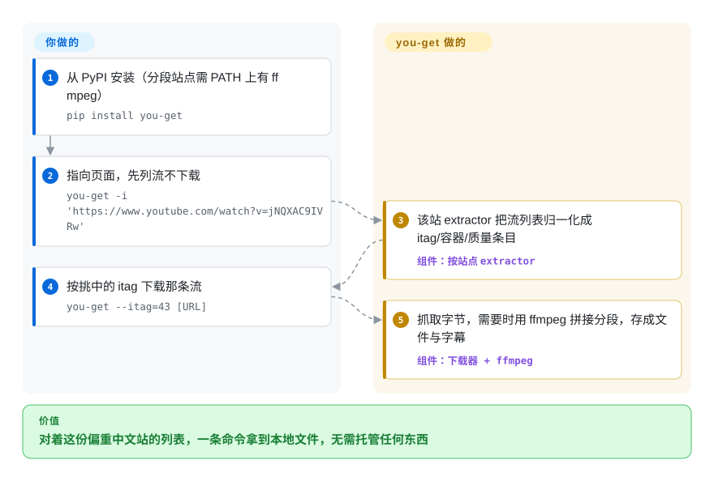

# you-get

Bilibili 上一段课程录像、Youku 上一个片段，主流下载器要么根本不覆盖这个站点，要么早就崩了没人修。you-get 是一个小巧的 Python 命令行工具，带一份偏重中文站的精选列表（README 表格列出约 80 个条目，外加一个对任意页面嗅探媒体资源的“通用 extractor”兜底）：把 URL 交给它，它列出可用的流，你挑一条，它把文件存下来——只有分段需要合并时才调用 `ffmpeg`。

## 何时使用

你是做中文内容的研究者或归档者，要把 Bilibili 上的课程录像、Youku 上的几段片子，外加偶尔一个 iQIYI 或腾讯视频页面拉到本地离线看。那些主流的西方工具，要么没有针对这些站点的 extractor，要么把它们当二等公民对待；而你又不想为了一次性抓取去伺候一个重型下载器。于是你选 `you-get`：`pip install you-get`，然后 `you-get <url>` 打印可用的流（itag、容器、质量、大小），`you-get -i <url>` 只看列表不下载，`you-get --itag=43 <url>` 抓你挑中的那条。`-o`/`-O` 指定输出路径与文件名，`-l`/`--playlist` 拉整个列表（该开关在 `src/you_get/__main__.py` 里核实过，README 并未写）。只有当下载结果是多个待拼接的分段时，它才去调 `ffmpeg`，所以从单个 URL 拿一个 MP4，除了解释器之外几乎不需要别的。

还有几处大下载器懒得做的细节：不传 URL 而直接传一段文字（`you-get "Richard Stallman eats"`），它会去 Google 视频搜索并抓最相关的那条；`-p mpv` 把视频直接喂给播放器边下边看；Ctrl-C 暂停会留下 `.download` 临时文件，下次同样的命令接着下。对一个 extractor 今天还能用的中文站点来说，它仍是移动部件最少的选择——零配置、零服务、一条命令。但依赖这一点之前，先读「何时不用」的第一条：仓库自 2025 年起已冻结，“还能用”如今是对一份快照的描述，而不是维护中的承诺。

## 怎么用起来

you-get 是一个下载主循环加一组按站点划分的 **extractor**（`you_get.extractors.*`）——每个 extractor 知道如何向对应站点请求流列表，并把它归一化成统一的 itag/容器/质量条目；不在列表上的页面则由一个通用 extractor 兜底嗅探媒体 URL。你要做的极少：给出 URL（或先用 `-i` 看格式列表），挑一条流——或直接接受最高质量的默认项——再定输出路径。它做的：完成该站点的请求往返、带断点续传地下载字节（临时 `.download` 文件）、并在分段到达时调用 `ffmpeg` 拼接（Youku 式分片流、以及音画分离的 YouTube ≥1080p 必须如此）。两次运行之间没有任何东西在跑——无守护进程、无配置、除输出目录外无状态——也正因如此，哪怕项目本身已经冻结，它作为脚本化的一次性抓取依然好用。

<!-- flow-steps:begin (generated from flows/you-get.json by tools/flow_card.py — do not edit) -->

流程文字版

1. **你**：从 PyPI 安装（分段站点需 PATH 上有 ffmpeg） — `pip install you-get`
2. **你**：指向页面，先列流不下载 — `you-get -i 'https://www.youtube.com/watch?v=jNQXAC9IVRw'`
3. **you-get**：该站 extractor 把流列表归一化成 itag/容器/质量条目 — 组件：`按站点 extractor`
4. **你**：按挑中的 itag 下载那条流 — `you-get --itag=43 [URL]`
5. **you-get**：抓取字节，需要时用 ffmpeg 拼接分段，存成文件与字幕 — 组件：`下载器 + ffmpeg`

**价值**：对着这份偏重中文站的列表，一条命令拿到本地文件，无需托管任何东西

<!-- flow-steps:end -->

<!-- flow-steps:begin (generated from flows/you-get.json by tools/flow_card.py — do not edit) -->
<!-- flow-steps:end -->

## 何时不用

- **项目实际处于休眠状态——废弃标注（截至 2026-09）。** 默认分支 `develop` 在 2025-04-27（一条 README 修改）之后没有任何提交，`master` 最后一次提交停在 2025-01-04，最后一个打 tag 的发布也是 v0.4.1743（2025-01-04）——约 17 个月的沉寂，且 issue 区被关闭，连报错的通道都没有。仓库未归档，但站点改版时没人补 extractor：站点布局离 2025 年快照越远，抓取就越可能悄悄失败或返回错误格式，且上游无修复路径。要一个能持续可用的东西，**请选 [yt-dlp](yt-dlp.zh.md)（或 [lux](lux.zh.md)）**；把 you-get 当作尽力而为，只用于 extractor 恰好今天还能用的站点。
- **你要的是最大的站点广度，或最快的 YouTube 修复。** 论 extractor 数量之多、以及 YouTube 改播放器/签名逻辑后修复之快，**yt-dlp**（其次是 [youtube-dl](youtube-dl.zh.md)）领先；you-get 精选而更小的目录——如今还冻结了节奏——意味着某个非中文站点可能不被支持或永久失效。要广度和 YouTube 关键任务，默认用 yt-dlp。
- **你需要转码 / 重编码。** you-get 负责下载并（通过 `ffmpeg`）*合并*分段；它不是转码器。若要重编码、换 codec 或做滤镜，那是直接用 **FFmpeg**——you-get 只负责编排抓取。
- **重 JS / DRM 锁、且没有 extractor 的站点。** 它不驱动浏览器，也不执行任意页面 JavaScript，Widevine/PlayReady DRM、逐请求 token 机制，或没有现成 extractor 的 SPA 站点，只会直接失败。
- **大规模下的地区限制、登录墙或抓取。** 它能传代理（`-x`，以及面向 Youku 大陆限定内容的 `--extractor-proxy`/`-y`）和 cookie，但不会帮你解 CAPTCHA、轮换身份或挡 IP 封禁；用单个 IP 批量下载会被限速。你抓取的媒体的法律 / ToS 风险是你的问题，不是工具的。
- **你想要一个稳定的库 API。** 它主要是 CLI，import 内部模块不受支持，会无预告变动。

## 横向对比

| 替代品 | 是否收录 | 我们的评价 | 取舍 |
|---|---|---|---|
| [youtube-dl](youtube-dl.zh.md) | ✅ | 两个经典如今都慢，但当你需要约 1000 站点的 Python extractor 目录、而不是 you-get 这份约 80 站点的中文向列表时，youtube-dl 覆盖广得多；只有某个站点 you-get 的 extractor 能用而 youtube-dl 的不能用时，才回来选 you-get。 | 经典的 Python 下载器，约 1000 个站点的 extractor 目录；站点覆盖广得多，也不依赖 you-get 那份 2025 年的冻结快照——而 you-get 在部分中文站上仍保有优势。 |
| [yt-dlp](yt-dlp.zh.md) | ✅ | 凡是要「下个月还能用」的东西——尤其 YouTube——选 yt-dlp：它几天一版的节奏正是 you-get 已失去的修复通道；只有在你需要的中文站点上 you-get 的 extractor 能用、而 yt-dlp 对该站支持差时，you-get 才更值得。 | 活跃维护的 youtube-dl 分叉；目录最广、YouTube 修复最快，选项更多（SponsorBlock、格式排序、aria2c）。you-get 仍因体积小、聚焦中文站而有吸引力。 |
| [lux](lux.zh.md) | ✅ | 喜欢「紧凑下载器 + 自带中国友好站点列表」这个思路、但要求项目还在发版的话，选 lux——Go 单二进制连 Python 运行时都不需要；Python 包装和 you-get 那份特定站点覆盖更重要时才选它。 | Go 写的单二进制下载器（原名 annie），自带对中国友好的站点列表；无需 Python 运行时、速度快，但目录更窄、收录取向不同。 |
| [cobalt](cobalt.zh.md) | ✅ | 使用者是点网页的人、而不是你在脚本里抓取时，选 cobalt——它是可自托管的 Web/API 服务；you-get 是终端和脚本里的那条命令。 | 以 Web/API 为先的下载器（可自托管的服务）；浏览器 UX 干净，但它是一个要跑的服务，而非可 pip 安装、便于脚本化的 CLI。 |

## 技术栈

- **语言：** Python——README 要求 3.7.4 及以上（2022 年的公告称 3.5/3.6/3.7 的支持正被逐步淘汰）。
- **架构：** 一个核心下载器 + 按站点划分的 **extractor** 模块（`you_get.extractors.*`）；每个 extractor 把某个站点的流发现归一化成统一接口，另有通用 extractor 处理不在列表上的站点。
- **后处理：** 调用 `ffmpeg`（≥1.0）合并/拼接多段流（YouTube ≥1080p 必然需要）；可选 `rtmpdump` 处理 RTMP 源。you-get 本身不转码。
- **分发：** PyPI 包（`you-get`），README 另给源码安装、Homebrew 与 FreeBSD `pkg` 等途径。

## 依赖

- **运行时：** 抓取单文件流只硬性需要一个 Python ≥3.7.4 解释器。无服务、无数据库、无守护进程。
- **可选二进制（你自己装）：** `ffmpeg`（≥1.0）——只要下载到的是需要合并的多段流就需要它，这相当常见；`rtmpdump` 处理 RTMP 流。
- **网络：** 到目标站点的出站 HTTP(S)；可选代理（`-x` / `--http-proxy`，以及大陆限定 Youku 内容的 `--extractor-proxy`/`-y`）和登录受限内容的 cookie 文件。
- **没有后端要跑：** 它执行完就退出——没东西要托管。

## 运维难度

**跑起来低，但脆弱性如今是结构性的。** 安装和调用都极简单：`pip install you-get`、一条命令、完事——零基础设施，PATH 上有 `ffmpeg` 就能覆盖合并场景。过去的持续成本和这一类下载器一样（站点改布局、过时的 extractor 开始报错、上游补补丁）；而仓库冻结在 2025 年之后，这个循环不再替你闭合——`pip install -U you-get` 永远给回 2025-01 那份发布，`develop` 分支也没有更新的修复。实际要做的维护，是在依赖某个站点前先确认它的 extractor 还工作，并随时备着一个仍在维护的替代品（yt-dlp）应对它失效的那天。

## 健康度与可持续性

- **响应速度**：无法计算——仓库关闭了 issue 区，没有任何信号。
- **维护——休眠（截至 2026-09）。** 默认分支 `develop` 最后提交 2025-04-27，`master` 最后提交 2025-01-04（即 v0.4.1743 的版本号提交），此后无发布——按 GitHub API 约 17 个月的沉寂。未归档，但对 extractor 工具而言这就是失败模式：冻结之后的任何一次站点改版都会一直坏着。别指望上游修复。
- **治理 / bus factor——单人维护，且冻结本身就是佐证。** `User` 所有（`soimort/you-get`）；评分器甚至无法归因近期的维护行为（`unattributable`）。约 57k star 的项目压在一个人业余时间上，其活跃停在 2025 年——这就是 bus factor 风险兑现的样子。
- **年龄与 Lindy 判断——长寿 × 已不活跃 ⇒ Lindy 先验救不了它。** 创建于 2012-08（约 14 年）；一旦提交停止，单凭年龄不再是正面信号。它的 14 年历史可作为「CLI + 按站点 extractor」这个*设计*成立的证据、以及有用的模式来源，而不是给新工作下注的对象。
- **采用度——在流失。** 约 56.9k star（GitHub API 2026-09），但 PyPI 月下载仅 8,849，比 yt-dlp 低了几个数量级（健康评分器原始值，2026-09；同一渠道九天前的读数是 17,280）——用量正在流向仍在维护的工具；雷达的采用度轴主要靠历史 release 下载量撑到 C。
- **风险标记。** MIT——已核实 LICENSE.txt 为标准 MIT 文本（2026-09 通读；GitHub 分类器仍显示 NOASSERTION）。真正的风险是运维性的：冻结的 extractor、关闭的 issue 区，以及下载本身常规的法律/ToS 暴露。它的差异化价值（中文站覆盖）会随着一次次站点改版而衰减。

## 存疑（未验证）

- [未验证] README 站点表约 80 个条目（2026-09-28 数得 77 行表格，个别行给一个站点列了多个 URL）——包内实际的 extractor 数与文档表格可能有出入。
- [推断] 「在中文站上比 youtube-dl 强」是社区普遍看法，此处未实测——决策时请就你需要的具体站点重新确认。
- [推断] 某次下载是否触发 `ffmpeg` 合并取决于站点/格式——请就你的目标站点核实。
- [未验证] 非默认分支上的推送活动（仓库级 `pushed_at` 最晚动到 2026-08）不代表维护：2025-04 之后没有任何提交进入 `develop` 或 `master`；某个零散分支的推送也可能随时让活动无声恢复。
- [推断] PyPI 月下载（约 8.8k，九天前还有约 1.7 万）是评分器 2026-09 对单一渠道的快照；Homebrew 与发行版包另有未计入的安装量，但都符合相对 yt-dlp 的下行趋势。
