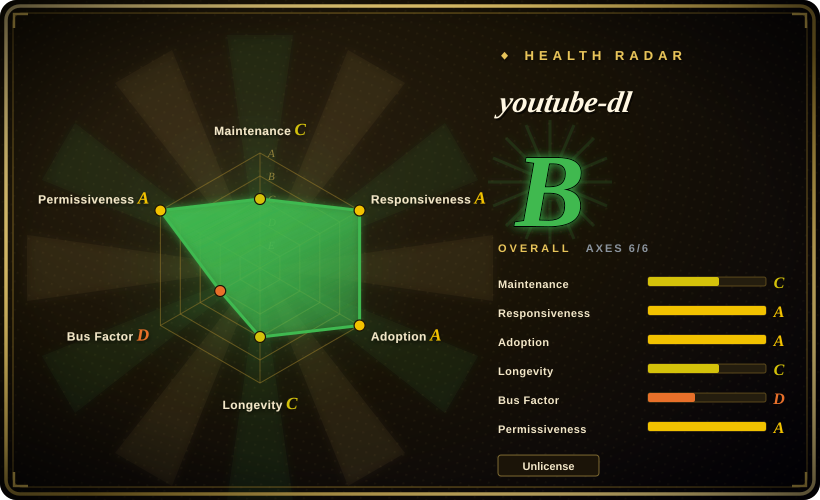
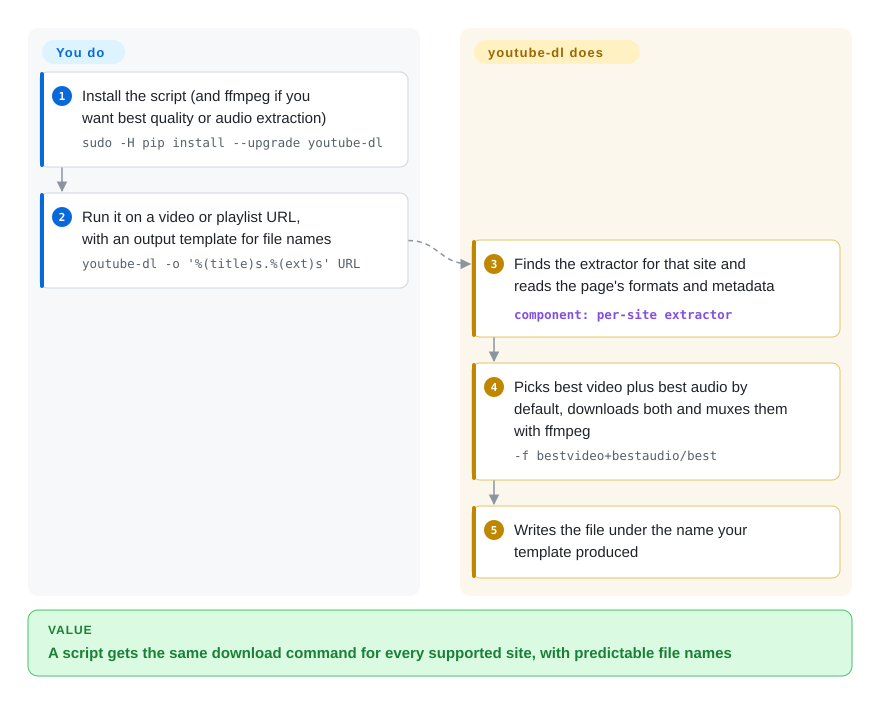

# youtube-dl

A command-line program to download video and audio from YouTube and ~1000 other sites, driven by per-site "extractor" plugins shipped in one Python package.

## When to use

You're scripting a small archival or ingest job — pulling a handful of conference talks, a podcast back-catalog, or a lecture playlist down to local files for a pipeline that then transcribes or re-encodes them. You want a single CLI you can pin in a `requirements.txt`, call from cron or a Makefile, and that returns predictable filenames via an output template (`-o '%(uploader)s/%(title)s.%(ext)s'`). You reach for `youtube-dl`: one `pip install`, one invocation, optional `ffmpeg` on PATH for `--extract-audio`/`--merge-output-format`, and it resolves formats, picks the best stream, and writes the file. Because it's Python with no service to run, it slots into existing automation without standing up infrastructure.

You also use it when the source isn't YouTube at all — the value is the extractor catalog (~1000 sites: Vimeo, SoundCloud, generic HTML5 `<video>`, many regional and niche hosts). You point it at a URL, and if an extractor exists it normalizes the site's quirks (auth, pagination, manifest parsing) into a uniform `--list-formats` / format-selection interface, so your script treats every supported site the same way.

## How it works

youtube-dl is a Python script that runs, downloads and exits. **What it does for you:** for each URL it finds the matching *extractor* — a per-site module that knows how that site's player hides its real media URLs — and gets back a list of formats plus metadata (title, uploader, playlist position). By default it then takes the best video-only and best audio-only formats, downloads both and has ffmpeg (a separate media tool) mux them into one file; without ffmpeg it falls back to the best single-file format. It names the file from your output template, so a script sees the same command and the same naming scheme whatever site the link came from. **What you do:** install it, install ffmpeg, pass URLs and options, and keep it current. That last part is the catch: `pip install` gives you the 2021.12.17 release (and the README's `yt-dl.org/downloads/latest` link now ends in a 404), while the later site fixes live only on master, so on YouTube you either install from git or move to [yt-dlp](yt-dlp.md).

<!-- flow-steps:begin (generated from flows/youtube-dl.json by tools/flow_card.py — do not edit) -->

Text version of the flow

1. **You**: Install the script (and ffmpeg if you want best quality or audio extraction) — `sudo -H pip install --upgrade youtube-dl`
2. **You**: Run it on a video or playlist URL, with an output template for file names — `youtube-dl -o '%(title)s.%(ext)s' URL`
3. **youtube-dl**: Finds the extractor for that site and reads the page's formats and metadata — component: `per-site extractor`
4. **youtube-dl**: Picks best video plus best audio by default, downloads both and muxes them with ffmpeg — `-f bestvideo+bestaudio/best`
5. **youtube-dl**: Writes the file under the name your template produced

**Value**: A script gets the same download command for every supported site, with predictable file names

<!-- flow-steps:end -->

## When NOT to use

- **You need it to actually keep working on YouTube today.** This is the decisive filter. youtube-dl's last *tagged* release is 2021.12.17 (still what `pip install` gives you) and master has had no commits since 2025-11-26 (~10 months as of 2026-10-08); the actively-maintained fork **yt-dlp** ships fixes far faster and is what most people now run when YouTube changes its player/signature code. For anything load-bearing against YouTube, default to yt-dlp and treat youtube-dl as the legacy upstream. [推断]
- **JS-heavy / SPA sites with no extractor.** It does not run a browser or execute arbitrary page JavaScript; sites that gate media behind heavy client-side JS, DRM (Widevine/PlayReady), or per-request token schemes without a written extractor will simply fail. It is not a headless-browser scraper.
- **Geo-restricted, login-walled, or rate-limited at scale.** It can pass cookies/proxies, but it won't solve CAPTCHAs, rotate identities, or shield you from IP bans; bulk-downloading from one IP gets throttled or blocked. Treat geo/ToS bypass as your problem, not the tool's.
- **Legal / ToS exposure.** Downloading copyrighted media or violating a site's Terms of Service is on you; many target sites prohibit downloading, and youtube-dl itself was the subject of a 2020 DMCA takedown of its GitHub repo (later reinstated). Don't build a product on top of it without checking the law and the ToS.
- **Live streams, very large fan-out, or high concurrency.** Live capture, segmented HLS/DASH at scale, and massive parallel jobs are fragile here; yt-dlp and dedicated tools handle these better.
- **You want a library API with stability guarantees.** It can be imported (`youtube_dl.YoutubeDL`), but the internal API and extractor behavior change without notice and break easily — fine for scripts, risky as an embedded dependency.

## Comparison

| Alternative | In index | Our verdict | Tradeoff |
|---|---|---|---|
| [yt-dlp](yt-dlp.md) | ✅ | Pick yt-dlp by default for YouTube-focused work unless you have a compatibility reason to pin original youtube-dl. | The actively-maintained fork of youtube-dl; faster extractor fixes, more options (SponsorBlock, better format sorting, aria2c integration), drop-in compatible CLI. For YouTube specifically it is the de-facto successor — pick it unless you have a reason to pin upstream. |
| [you-get](you-get.md) | ✅ | Pick you-get when you want a simpler Python downloader with its own narrower site catalog. | Python downloader with its own site list; simpler UX, smaller/less-actively-tracked extractor catalog than youtube-dl/yt-dlp. |
| [lux](lux.md) | ✅ | Pick lux when a Go single binary matters more than youtube-dl's Python ecosystem and extractor breadth. | Go single-binary downloader (formerly annie); no Python runtime, fast, but a narrower and differently-curated site list. |
| [cobalt](cobalt.md) | ✅ | Pick cobalt when you want a self-hosted web/API service rather than a local CLI. | Web/API-first downloader (self-hostable service); browser-friendly and clean UX, but it's a service to run, not a pip-installable CLI for scripting. |
| [gallery-dl](gallery-dl.md) | ✅ | Pick gallery-dl when the target is image/gallery sites rather than video extraction. | Specializes in *image/gallery* sites (boorus, social media galleries) rather than video; complementary, not a substitute for video extraction. |

## Tech stack

- **Language:** Python (runs on the system Python interpreter; historically targets a very wide range including Python 2.6/2.7 and 3.2+ per the README). [未验证]
- **Architecture:** a core downloader plus a large set of per-site **extractor** classes; format selection, output templates, and post-processors sit on top.
- **Post-processing:** shells out to external binaries — `ffmpeg`/`avconv` for audio extraction, remux, and merge; `rtmpdump` for RTMP; `mplayer`/`mpv` for some MMS/RTSP sources.
- **Distribution:** single self-contained Python zip/script, plus PyPI packaging and OS package-manager builds.

## Dependencies

- **Runtime:** a Python interpreter is the only hard requirement to run the basic downloader. No service, database, or daemon.
- **Optional binaries (yours to install):** `ffmpeg` (or `avconv`) for `--extract-audio` / format merging — needed for most "give me an MP3/MP4" workflows; `rtmpdump` for RTMP streams; `mplayer`/`mpv` for MMS/RTSP.
- **Network:** outbound HTTP(S) to the target sites; optionally a proxy and a cookies file (`--cookies`) for login-gated content.
- **No backend to run:** unlike a service-based downloader, there is nothing to host — it executes and exits.

## Ops difficulty

**Low to run, but high *fragility* to keep working.** Installing and invoking it is trivial: `pip install youtube-dl` (or a downloaded binary), one command, done — no infrastructure. The cost is upstream: because YouTube and other sites change their player and signature logic frequently, an outdated youtube-dl silently starts returning errors or wrong formats, and the slowed release cadence means fixes may lag for weeks or not come at all. The practical ops burden is *staying current* — pinning a version means accepting breakage, and tracking master/nightly or switching to yt-dlp is usually the real maintenance task. For one-off scripts this is fine; for anything long-lived against YouTube, budget for the breakage cycle.

## Health & viability

- **Responsiveness**: Grade A — median first-response time 31.5 hours across 6 qualifying issues/PRs.
- **Maintenance — coasting; the active path is the fork (last master commit 2025-11-26, last tagged release 2021.12.17, as of 2026-10-08).** Not archived and master took occasional YouTube fixes through late 2025, though none since, but the tagged-release gap of 4+ years against a fast-moving target (YouTube player/signature changes) is the decisive signal: upstream lags, and yt-dlp ships the fixes. Treat youtube-dl as legacy upstream [推断].
- **Governance & succession.** `Org`-owned (`ytdl-org/`) — a community org, no vendor or foundation. Roadmap momentum has effectively migrated to the **yt-dlp** fork, which is now the de-facto successor for YouTube extraction; the project's longevity lives on through that fork, not the original tag line [推断].
- **Age & Lindy verdict — old and historically vindicated, but for *durability* not *currency*.** Created 2010 (~16y old), ~140k stars: among the longest-Lindy tools in this index, and it survived a 2020 GitHub DMCA takedown (later reinstated). But age proves the *idea* endures, not that the upstream binary works on YouTube today — for currency, age × *still-active* points you to yt-dlp.
- **Risk flags.** Unlicense (public-domain) — no copyleft/relicense friction. The real risks are the 2020 DMCA legal history, the general legal/ToS exposure of downloading, and above all extractor staleness on the upstream tags. For anything load-bearing against YouTube, default to yt-dlp.

## Caveats (unverified)

- [未验证] ~141.4k GitHub stars as of 2026-10; star counts are date-sensitive and unreliable — indicative only.
- [未验证] Last *tagged* release is 2021.12.17 (also the latest on PyPI, checked 2026-10-08); the last master commit is 2025-11-26 per the commits API, while the repo's `pushed_at` of 2026-02-19 presumably reflects non-default-branch activity. Only git/nightly builds carry the master fixes. The gap between tagged and master is the key maintenance signal — verify current master activity before relying on it.
- [推断] yt-dlp being the more-active fork and the de-facto successor for YouTube is the widely-held community position; treat the "default to yt-dlp" recommendation as inference, and re-confirm both projects' activity at decision time.
- [未验证] README-stated Python support (2.6/2.7/3.2+) and the "~1000 sites" figure come from project docs and shift over time; verify against the current repo and `--list-extractors`.
- [未验证] The 2020 GitHub DMCA takedown and subsequent reinstatement are reported history, not re-verified here; check current repo status and any legal context yourself.
- [推断] License is Unlicense (public domain) per the repo; confirm the LICENSE file if license terms are load-bearing for your use.
- [未验证] On 2026-10-08 the README's install URL `https://yt-dl.org/downloads/latest/youtube-dl` redirected to a GitHub URL under `yt-dlp/yt-dlp` that returned 404; this may be temporary, so re-check before scripting an install from it.
