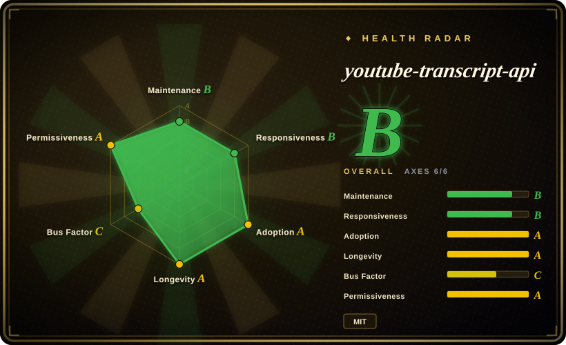
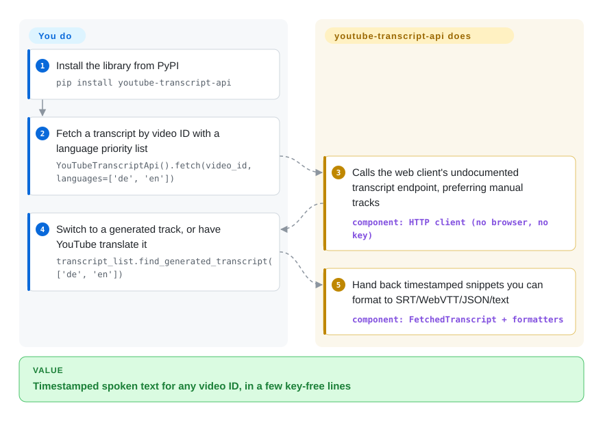

# youtube-transcript-api

You want the words spoken in a YouTube video — to summarize, index, or search them — but the official API keeps captions behind OAuth and channel ownership, and scraping the player with a browser is slow and brittle. This Python library calls the same undocumented transcript endpoint the YouTube web client calls: hand it a video ID and you get timestamped text back, with language preference, auto-generated fallback, YouTube-side translation, and SRT/WebVTT/JSON output — no key, no browser.

## When to use

You're building a pipeline that summarizes or indexes YouTube videos — a RAG corpus, a "TL;DR this talk" bot, a research tool that searches across hundreds of lecture transcripts — and you need the spoken text, not the audio. The official YouTube Data API doesn't hand you full caption text without OAuth and channel ownership, and spinning up Selenium to scrape the player is slow and brittle. You `pip install youtube-transcript-api`, then `YouTubeTranscriptApi().fetch(video_id)` returns a `FetchedTranscript` of timestamped snippets you can immediately feed to an LLM or a formatter (JSON, SRT, WebVTT, plain text). You pass a priority language list — `fetch(video_id, languages=['de', 'en'])` — the library defaults to preferring manually created tracks over auto-generated ones when both exist, and `YouTubeTranscriptApi().list(video_id)` shows you what's actually available per video. You can even have YouTube translate the transcript into another language (`transcript.translate('de')`) — all in a few lines.

It shines as a *building block*: the transcript-fetch layer under a larger app, used in notebooks and batch jobs where you want timestamped text out of an ID with minimal ceremony (there's also a `youtube_transcript_api <video_id>` CLI for quick grabs). From your own machine or a residential IP, the no-auth path "just works" — at ~16M PyPI downloads/month it is by far the most-used way to do this in Python.

## How it works

The library reproduces the request the YouTube *web player* makes when it needs subtitles — an undocumented HTTP endpoint that returns the caption tracks for a video — and parses the answer into `FetchedTranscript` snippets of `{text, start, duration}`, i.e. plain timestamped lines. What you do: install, call `fetch(video_id)` with a language priority list, and pick a track via `list()`/`find_generated_transcript()`/`translate()`; formatting to SRT/WebVTT/JSON is a one-liner through its formatter classes. What stays yours: dealing with YouTube's countermeasures — residential-proxy plumbing on cloud IPs, retry/backoff under rate-limiting, and version updates whenever the endpoint's response shape shifts (that's when releases land). There is no service to run and no state to keep; between calls it does nothing, and it never touches the audio, so a video without any caption track has nothing to return.

<!-- flow-steps:begin (generated from flows/youtube-transcript-api.json by tools/flow_card.py — do not edit) -->

Text version of the flow

1. **You**: Install the library from PyPI — `pip install youtube-transcript-api`
2. **You**: Fetch a transcript by video ID with a language priority list — `YouTubeTranscriptApi().fetch(video_id, languages=['de', 'en'])`
3. **youtube-transcript-api**: Calls the web client's undocumented transcript endpoint, preferring manual tracks — component: `HTTP client (no browser, no key)`
4. **You**: Switch to a generated track, or have YouTube translate it — `transcript_list.find_generated_transcript(['de', 'en'])`
5. **youtube-transcript-api**: Hand back timestamped snippets you can format to SRT/WebVTT/JSON/text — component: `FetchedTranscript + formatters`

**Value**: Timestamped spoken text for any video ID, in a few key-free lines

<!-- flow-steps:end -->

<!-- flow-steps:begin (generated from flows/youtube-transcript-api.json by tools/flow_card.py — do not edit) -->
<!-- flow-steps:end -->

## When NOT to use

- **Cloud / datacenter IPs without proxies.** The README states plainly that YouTube blocks *most* IPs known to belong to cloud providers (AWS, GCP, Azure…), so server deployments hit `RequestBlocked`/`IpBlocked` and must route through rotating residential proxies — the built-in Webshare integration exists precisely for this, but for reliable cloud use a paid proxy is now a *requirement*, not a nicety.
- **You need a stable, contractual API.** It rides an **undocumented** endpoint — the README's own Warning section says there is "no guarantee that it won't stop working tomorrow, if they change how things work." Don't build something you can't afford to see break on a YouTube-side change.
- **Age-restricted / login-walled videos.** Cookie-based authentication for restricted videos is currently unavailable: the README states recent YouTube API changes broke the existing implementation. So restricted videos simply can't be fetched today (as of 2026-09).
- **Videos with captions disabled.** If the uploader disabled captions and there's no auto-generated track, there's nothing to fetch — it doesn't transcribe audio itself; for that you'd run **Whisper** on the audio.
- **ToS-sensitive / high-volume scraping at scale.** Mass extraction against an undocumented endpoint sits in a gray area and invites rate-limiting/blocking (the README notes even self-hosted IPs get banned at high request volume); for sanctioned bulk access you'd need a different (often paid/proxied) strategy. [推断]

## Comparison

| Alternative | In index | Our verdict | Tradeoff |
|---|---|---|---|
| [yt-dlp](yt-dlp.md) (`--write-auto-subs`) | ✅ | When you're already pulling media files and want subtitle tracks to come along, reach for yt-dlp's `--write-auto-subs`; when the transcript itself *is* the product and you need per-snippet timestamps in-process, this library is the shorter path. | The heavyweight downloader can also pull subtitle tracks; far broader (media + subs from many sites) but heavier and CLI-oriented — this library is a focused, in-process Python call for transcripts only. |
| YouTube Data API v3 (Captions) | 未收录 | Choose the official captions API only when you own the channel (or have its OAuth) and need contractual access; for arbitrary third-party videos it can't download caption text at all, which is exactly the hole this library fills. | Official and contractual, but requires OAuth and (for caption *download*) channel ownership — you generally can't pull arbitrary third-party caption text, which is exactly this library's niche. |
| [Selenium](../web-automation/browser-driver-frameworks/selenium.md) / Playwright scraping | 部分已收录 | Drive a real browser only when you must render the player itself (DRM-adjacent or login-gated flows); for plain transcript text a browser is 100× the moving parts per video, which is why this library skips it. | A real browser survives some changes the player itself survives, but it is slow, resource-heavy, and brittle. This library avoids the browser entirely. Playwright is not indexed separately. |
| [Whisper](../media-processing/video-audio/speech-and-subtitles/whisper.md) (transcribe audio) | ✅ | When a video genuinely has no caption track, Whisper is the only route — you pay GPU/seconds-of-compute per video and lose YouTube's own timing; when captions exist, fetching them is free, instant, and already punctuated. | Generates a transcript from the audio when no caption track exists; far more compute and not timestamp-aligned to YouTube's own captions, but works on videos with captions disabled. |

## Tech stack

- **Language:** Python, packaged with Poetry; pyproject pins support to `python = ">=3.8,<3.15"` (verified 2026-09).
- **Transport:** plain HTTP requests against YouTube's undocumented web-client transcript endpoint — no headless browser, no official API client.
- **Surface:** an object API (`YouTubeTranscriptApi().fetch(...)`, `list()`, `find_generated_transcript()`, `translate()`) plus five formatter classes (JSON, PrettyPrint, Text, SRT, WebVTT — no CSV formatter exists despite the README's intro prose), a `youtube_transcript_api` CLI, and proxy config (first-class Webshare + generic HTTP/HTTPS).

## Dependencies

- **Runtime:** Python 3.8–3.14 and its HTTP stack. No API key, no browser, no database.
- **Network:** outbound access to YouTube; for cloud/datacenter deployment, rotating residential **proxies** are effectively required (the README documents Webshare as the provider the maintainer tested and integrated).
- **Optional:** cookie files are currently *not* a working dependency — cookie auth is broken upstream (see *When NOT to use*).
- **No services to run** — it's an in-process library you import (the CLI ships in the same package).

## Ops difficulty

**Low to medium.** As a library there's nothing to deploy — `pip install`, import, call. The operational weight is entirely in *staying unblocked*: from a laptop/residential IP it's frictionless; from a server you must wire up and pay for rotating residential proxies, handle `RequestBlocked`/`IpBlocked` with backoff, and be ready to update the package (or wait for a fix) when YouTube changes the endpoint and calls start failing. Treat it as a dependency that can break on someone else's schedule and design retries/fallbacks (e.g. yt-dlp `--write-subs` as a second source) accordingly.

## Health & viability

- **Responsiveness** (2026-09): Grade B on the radar — median first response 1.2 hours across 3 qualifying issues/PRs; the maintainer historically ships fixes for endpoint breakages quickly (1.2.x patch releases 2025-07 → 2026-01 tracked YouTube-side events). [推断]
- **Maintenance (2026-09).** Last commit to `master` 2026-09-09 (GitHub API); latest release v1.2.4, 2026-01-29, with a steady 1.2.0→1.2.4 cadence through 2025 — commits continue without new releases (README/docs churn), which for this library is normal between breakages. Not archived; **active**.
- **Governance / bus factor.** Single dominant maintainer (jdepoix): the scorer measures 4 committers in 12 months with top-1 share ~77% — one person owns the fix path when YouTube breaks the endpoint. Sponsorship (SerpApi et al. banner) funds maintenance; it has survived multiple breakage cycles since 2018, which is the relevant survival signal. [推断]
- **Age & Lindy verdict.** Created 2018-04 (~8.4 years) and still active ⇒ a **strong Lindy** signal for its niche — it has repeatedly outlived YouTube changes, the best durability evidence a tool riding an undocumented endpoint can offer.
- **Adoption.** ~8.4k stars and, far more meaningfully, 16,400,197 PyPI downloads/month with 205 dependent repos (health scorer raw) — it is the de-facto transcript layer of Python LLM/RAG tooling. Star count is noise here; the download volume is the real claim.
- **Risk flags.** Clean MIT, no relicensing history. The structural risks are external: the **undocumented-endpoint dependency** (a unilateral YouTube change breaks every version at once), **cloud-IP blocking** pushing production use onto paid proxies, and **maintainer concentration** on the single person who re-animates it after each break. Cookie/auth restrictions shrinking what's fetchable is an ongoing regression source.

## Caveats (unverified)

- [未验证] Whether high-volume use has drawn legal action or YouTube enforcement — ToS posture is an inference about an undocumented endpoint, not legal advice or a confirmed policy citation.
- [推断] "Releases track YouTube-side breakages" (the 1.2.x cadence mapping to breakage events) is read from release dates vs. community reports, not from changelog-to-incident matching.
- [推断] "Survives YouTube changes" durability is inferred from the maintenance history, not a guarantee about future breakage.
- [未验证] The README's formatter intro mentions a comma-separated (.csv) output, but no `CSVFormatter` class exists in `formatters.py` (checked 2026-09) — prose and code disagree; treat the class list as authoritative.
