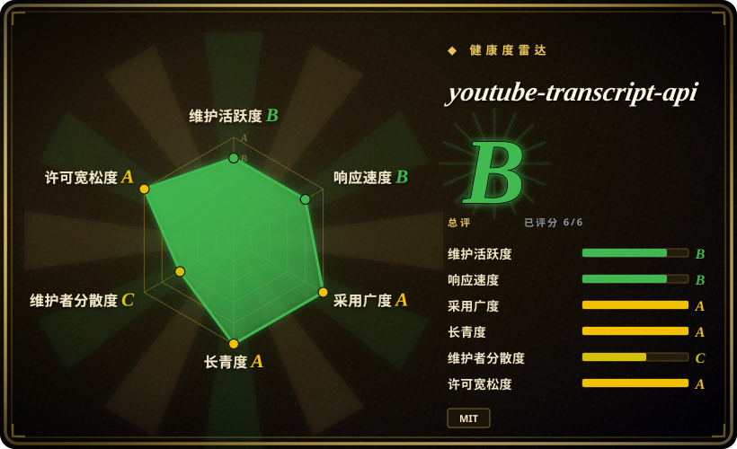
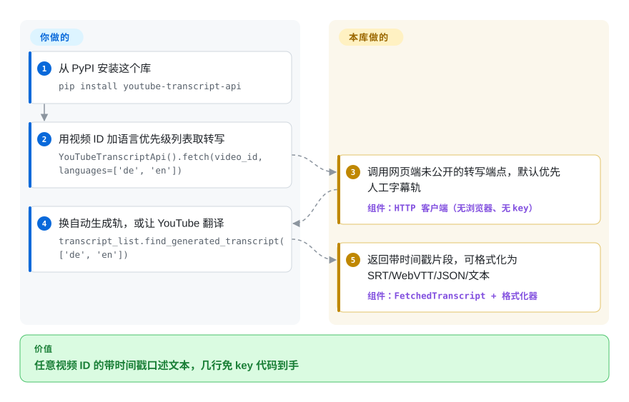

# youtube-transcript-api

你想要一个 YouTube 视频里的口述文本——拿来做摘要、建索引或全文检索——但官方 API 把字幕锁在 OAuth 和频道所有权后面，用浏览器去爬播放器又慢又脆。这个 Python 库调用 YouTube 网页播放器自己调用的那个未公开转写端点：给它一个视频 ID，返回带时间戳的文本，支持语言优先级、自动生成字幕兜底、借 YouTube 做翻译，以及 SRT/WebVTT/JSON 输出——不要 key，不开浏览器。

## 何时使用

你在搭一条对 YouTube 视频做摘要或建索引的流水线——一个 RAG 语料库、一个「把这场演讲 TL;DR 一下」的机器人、一个能在数百份讲座转写里检索的研究工具——你要的是口述文本，不是音频。官方 YouTube Data API 不经 OAuth 和频道所有权不会把完整字幕文本给你，而起一套 Selenium 去爬播放器既慢又脆。你 `pip install youtube-transcript-api`，然后 `YouTubeTranscriptApi().fetch(video_id)` 返回一个 `FetchedTranscript`，里面是带时间戳的片段，可以直接喂给 LLM 或格式化器（JSON、SRT、WebVTT、纯文本）。你传一个按优先级排列的语言列表——`fetch(video_id, languages=['de', 'en'])`——当同一语言既有人工字幕又有自动字幕时，库默认优先取人工轨，`YouTubeTranscriptApi().list(video_id)` 则先告诉你这个视频上到底有哪些轨。你甚至能让 YouTube 把转写翻译成另一种语言（`transcript.translate('de')`）——全都几行代码。

它作为一块*积木*最闪光：更大应用底下的「转写获取」层，用在 notebook 和批处理任务里，以最少仪式从一个视频 ID 拿到带时间戳的文本（还有一个 `youtube_transcript_api <video_id>` CLI 供随手取用）。从自己的机器或住宅 IP 跑，免鉴权路径「就是能用」——以约 1600 万/月的 PyPI 下载量计，它是 Python 里做这件事用得最多的方式。

## 怎么用起来

这个库复刻的是 YouTube *网页播放器*需要字幕时发的那个请求——一个返回该视频字幕轨道的未公开 HTTP 端点——并把响应解析成 `{text, start, duration}` 的 `FetchedTranscript` 片段，也就是朴素的带时间戳文本行。你要做的：装好，带语言优先级列表调 `fetch(video_id)`，用 `list()`/`find_generated_transcript()`/`translate()` 挑轨道；要 SRT/WebVTT/JSON，套它的格式化器类就是一行。仍归你管的是 YouTube 的反制手段——云端 IP 上的住宅代理管道、限流下的重试/退避，以及端点响应格式变化时的版本升级（那也正是新版本落地的时候）。没有要跑的服务，也没有要保的状态：不调用时它什么都不做；它从不碰音频，所以没有任何字幕轨道的视频对它而言无可返回。

<!-- flow-steps:begin (generated from flows/youtube-transcript-api.json by tools/flow_card.py — do not edit) -->

流程文字版

1. **你**：从 PyPI 安装这个库 — `pip install youtube-transcript-api`
2. **你**：用视频 ID 加语言优先级列表取转写 — `YouTubeTranscriptApi().fetch(video_id, languages=['de', 'en'])`
3. **youtube-transcript-api**：调用网页端未公开的转写端点，默认优先人工字幕轨 — 组件：`HTTP 客户端（无浏览器、无 key）`
4. **你**：换自动生成轨，或让 YouTube 翻译 — `transcript_list.find_generated_transcript(['de', 'en'])`
5. **youtube-transcript-api**：返回带时间戳片段，可格式化为 SRT/WebVTT/JSON/文本 — 组件：`FetchedTranscript + 格式化器`

**价值**：任意视频 ID 的带时间戳口述文本，几行免 key 代码到手

<!-- flow-steps:end -->

<!-- flow-steps:begin (generated from flows/youtube-transcript-api.json by tools/flow_card.py — do not edit) -->
<!-- flow-steps:end -->

## 何时不用

- **没有代理的云 / 数据中心 IP。** README 明说：YouTube 已封禁*大多数*已知属于云厂商（AWS、GCP、Azure 等）的 IP，服务器上部署会撞上 `RequestBlocked`/`IpBlocked`，必须走轮换住宅代理——内置的 Webshare 集成正是为此而生，但对可靠的云端使用，付费代理已是*必需*而非锦上添花。
- **你需要稳定、有契约的 API。** 它骑在一个**未公开**端点上——README 自己的 Warning 一节写着：若 YouTube 改了实现，“no guarantee that it won't stop working tomorrow”。别拿它去建一个你输不起「某天突然崩」的东西。
- **年龄限制 / 需登录的视频。** 针对受限内容的 Cookie 鉴权目前*不可用*：README 明言 YouTube 近期的 API 变更破坏了现有实现。所以受限视频今天就取不到（截至 2026-09）。
- **关闭了字幕的视频。** 若上传者关了字幕又没有自动生成轨道，就没什么可取的——它自己不转写音频；那要拿音频去跑 **Whisper**。
- **对 ToS 敏感 / 大规模高频抓取。** 对着未公开端点做海量抽取处于灰色地带，会招致限流/封禁（README 也提到自托管 IP 在请求量过大时同样会被封）；要走获许可的批量访问，你得换一套（往往付费/带代理的）策略。[推断]

## 横向对比

| 替代品 | 是否收录 | 我们的评价 | 取舍 |
|---|---|---|---|
| [yt-dlp](yt-dlp.zh.md)（`--write-auto-subs`） | ✅ | 当你本来就在拉媒体文件、顺手希望字幕轨道一起落地时，用 yt-dlp 的 `--write-auto-subs`；当转写文本本身就是产物、你需要进程内逐片段的时间戳时，本库是更短的路。 | 这个重量级下载器也能拉字幕轨道；面广得多（多站点的媒体 + 字幕）但更重、偏 CLI——本库是聚焦、进程内、只取转写的 Python 调用。 |
| YouTube Data API v3（Captions） | 未收录 | 只有当你拥有频道（或其 OAuth）、且需要契约化访问时，才选官方字幕 API；对任意第三方视频它根本不能下载字幕文本，而这正是本库填的坑。 | 官方且有契约，但需要 OAuth，且字幕*下载*要频道所有权——你一般取不到任意第三方的字幕文本，而这正是本库的生态位。 |
| [Selenium](../web-automation/browser-driver-frameworks/selenium.zh.md) / Playwright 爬取 | 部分已收录 | 只有当你必须渲染真实播放器本身（涉 DRM 或登录墙的流程）时才开浏览器；纯取转写文本时，浏览器是每个视频多一百倍的活动部件，这正是本库绕开它的原因。 | 真实浏览器能扛住一些播放器本身能扛的变更，但慢、吃资源、脆。本库完全绕开浏览器。Playwright 未单独收录。 |
| [Whisper](../media-processing/video-audio/speech-and-subtitles/whisper.zh.md)（转写音频） | ✅ | 当视频确实没有任何字幕轨道时，Whisper 是唯一的路——代价是每个视频按算力/秒计费、且时间戳不再对齐 YouTube 自家字幕；而有字幕时，取它们是免费、即时、自带断句的。 | 当没有字幕轨道时从音频*生成*转写；算力大得多，也不与 YouTube 自家字幕时间戳对齐，但能处理关掉字幕的视频。 |

## 技术栈

- **语言：** Python，用 Poetry 打包；pyproject 把支持范围钉为 `python = ">=3.8,<3.15"`（2026-09 核实）。
- **传输：** 直接对 YouTube 未公开的网页端转写端点发 HTTP 请求——无无头浏览器、无官方 API 客户端。
- **接口面：** 一套对象 API（`YouTubeTranscriptApi().fetch(...)`、`list()`、`find_generated_transcript()`、`translate()`），五个格式化器类（JSON、PrettyPrint、Text、SRT、WebVTT——README 引言提到 CSV，但代码里并不存在 CSVFormatter），一个 `youtube_transcript_api` CLI，以及代理配置（一等公民的 Webshare + 通用 HTTP/HTTPS）。

## 依赖

- **运行时：** Python 3.8–3.14 及其 HTTP 栈。无 API key、无浏览器、无数据库。
- **网络：** 对 YouTube 的出站访问；云/数据中心部署时，轮换住宅**代理**实际上是必需的（README 写明 Webshare 是维护者实测并集成的供应商）。
- **可选：** cookie 文件目前*不是*一个可用的依赖——Cookie 鉴权已被上游变更打断（见「何时不用」）。
- **无服务要跑**——它是你 import 进来的进程内库（CLI 与包同体）。

## 运维难度

**低到中。** 作为库没什么要部署——`pip install`、import、调用。运维重量全在*保持不被封*：从笔记本/住宅 IP 上零摩擦；从服务器上你必须接好并付费用上轮换住宅代理、用退避处理 `RequestBlocked`/`IpBlocked`，并在 YouTube 改端点、调用开始失败时准备好更新这个包（或等修复）。把它当作一个会按别人时间表崩的依赖，据此设计重试与回退（例如拿 yt-dlp `--write-subs` 当第二来源）。

## 健康度与可持续性

- **响应速度**（2026-09）：雷达 Grade B——3 个 qualifying issues/PRs 的中位首次响应 1.2 小时；维护者历史上对端点崩坏的修复发布很快（1.2.x 补丁节奏 2025-07 至 2026-01 跟着 YouTube 侧事件走）。[推断]
- **维护（2026-09）。** `master` 最后提交 2026-09-09（GitHub API）；最新发布 v1.2.4，2026-01-29，2025 全年保持 1.2.0→1.2.4 的稳定节奏——提交在继续而发布暂无新增（README/文档改动），对这类库来说这正是两次崩坏之间的常态。未归档；**活跃**。
- **治理 / bus factor。** 单一主导维护者（jdepoix）：评分器测得 12 个月内 4 位提交者、top-1 占比约 77%——YouTube 打断端点时，修复通道系于一人。赞助（SerpApi 等的横幅）为维护供血；自 2018 年它已挺过多轮崩坏，这才是此处相关的存活信号。[推断]
- **年龄与 Lindy 判断。** 2018-04 创建（约 8.4 年）且仍活跃 ⇒ 在其生态位上是**强 Lindy** 信号——它反复挺过 YouTube 的变更，对一个骑在未公开端点上的工具而言，这是耐久性所能给出的最好证据。
- **采用度。** 约 8.4k star，更有意义的是每月 16,400,197 次 PyPI 下载与 205 个依赖仓库（健康评分器原始值）——它是 Python LLM/RAG 工具链事实上的转写层。这里的 star 数是噪声，下载量才是真主张。
- **风险标记。** 干净 MIT，无 relicense 史。结构性风险都在外部：**未公开端点依赖**（YouTube 单方面一改，所有版本同时失效）、**云 IP 封禁**把生产使用推上付费代理、以及每次崩坏后让它「复活」的那条通道上的**维护者集中**。Cookie/鉴权受限导致可取内容收窄，是持续的退步来源。

## 存疑（未验证）

- [未验证] 高频使用是否招来过法律行动或 YouTube 的执行动作——ToS 姿态是对未公开端点的推断，并非法律意见或确认引用的政策。
- [推断] 「发布跟着 YouTube 侧崩坏走」（1.2.x 节奏对应崩坏事件）是从发布日期与社区报告读出的，并未做 changelog 与事件的逐一比对。
- [推断] 「挺过 YouTube 变更」的耐久性是从维护历史推断，并非对未来不崩的保证。
- [未验证] README 格式化器引言提到逗号分隔（.csv）输出，但 `formatters.py` 里并不存在 `CSVFormatter` 类（2026-09 查证）——文档与代码不一致；以类列表为准。
