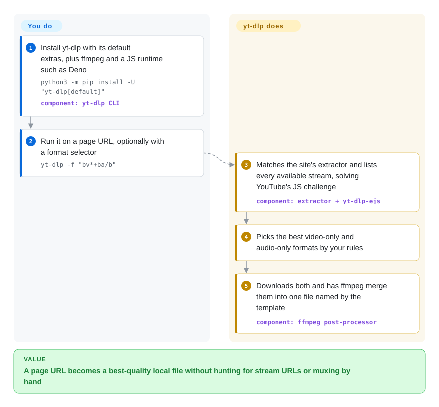

# yt-dlp

You need a lecture, a podcast episode or a whole playlist as files on disk, but the site only offers a player — and the URL you see is a web page, not a video: the real streams are split into separate video and audio tracks behind tokens that change per visit. yt-dlp knows how each of thousands of sites hides its streams, picks the best video and audio, and merges them into one file with a predictable name.

## When to use

You're building a media pipeline, archiving a channel, feeding audio to a transcription model, or just need `talk.mp4` from a page that has no download button. You reach for yt-dlp because it ships extractors for thousands of sites (YouTube, Vimeo, Twitch VODs, Bilibili, news sites, podcasts), and one command such as `yt-dlp -f "bv*+ba/b" URL` resolves the page, selects the best video-only plus best audio-only streams, downloads them and has ffmpeg merge them; `-x` turns the same run into an audio extract, `--sponsorblock-remove` cuts sponsor segments, and `--download-archive` makes a cron job fetch only new uploads.

You choose it over [youtube-dl](youtube-dl.md) because youtube-dl's last tagged release is from 2021 while sites like YouTube change monthly; yt-dlp ships stable builds about monthly plus nightlies. You choose it over [you-get](you-get.md) or [lux](lux.md) when you need breadth of sites, fine-grained format selection and post-processing rather than a single small binary focused on a few platforms.

## How it works

yt-dlp is a Python command-line program with one *extractor* per site — code that knows how to turn that site's page or API into a list of available formats (each format being one stream at a given resolution, codec and bitrate). For YouTube that now includes solving a JavaScript challenge in the player, which yt-dlp hands to an external JavaScript runtime (Deno by default) through the `yt-dlp-ejs` component. You supply the URL and, optionally, a format selector (`-f`), an output filename template (`-o`, default `%(title)s [%(id)s].%(ext)s`), cookies for logged-in content (`--cookies-from-browser`) and post-processing flags. yt-dlp does the rest: picks formats by your rules, downloads them (in fragments for HLS/DASH, the segmented formats streaming sites use), and runs ffmpeg to merge, remux, extract audio, or embed subtitles, thumbnails and chapters. The same engine is importable from Python (`yt_dlp.YoutubeDL`), but the README tells programs in other languages to call the CLI and parse `-J` JSON instead of normal output.

<!-- flow-steps:begin (generated from flows/yt-dlp.json by tools/flow_card.py — do not edit) -->

Text version of the flow

1. **You**: Install yt-dlp with its default extras, plus ffmpeg and a JS runtime such as Deno — `python3 -m pip install -U "yt-dlp[default]"` — component: `yt-dlp CLI`
2. **You**: Run it on a page URL, optionally with a format selector — `yt-dlp -f "bv*+ba/b"`
3. **yt-dlp**: Matches the site's extractor and lists every available stream, solving YouTube's JS challenge — component: `extractor + yt-dlp-ejs`
4. **yt-dlp**: Picks the best video-only and audio-only formats by your rules
5. **yt-dlp**: Downloads both and has ffmpeg merge them into one file named by the template — component: `ffmpeg post-processor`

**Value**: A page URL becomes a best-quality local file without hunting for stream URLs or muxing by hand

<!-- flow-steps:end -->

## When NOT to use

- **DRM-protected streams.** yt-dlp does not decrypt Widevine, PlayReady or FairPlay; Netflix-style services will fail. Use the provider's offline-download feature in its licensed app instead.
- **You want full YouTube support without installing a JavaScript runtime.** Since late 2025 the README lists `yt-dlp-ejs` plus a JS runtime (Deno recommended; Node, Bun or QuickJS as alternatives) as required for full YouTube support; without one, fewer clients and formats work. If your environment cannot run Deno or Node, expect degraded YouTube results — use the site's official API for metadata, or accept lower-quality formats.
- **A site that isn't supported, or needs arbitrary page JavaScript.** yt-dlp runs JS only for specific extractor challenges; it does not render pages. For an unsupported site, capture the stream URL with a browser-automation tool such as [Playwright](../web-automation/playwright-family/playwright.md), then hand it to yt-dlp or [FFmpeg](../media-processing/video-audio/transcoding-and-pipelines/ffmpeg.md).
- **Large-scale scraping against anti-bot defenses.** yt-dlp passes cookies and proxies and can impersonate browser TLS fingerprints (`--impersonate` via curl_cffi), but YouTube increasingly asks for PO tokens and rate-limits IPs. For bulk metadata, use the platform's official API (e.g. YouTube Data API) instead of rotating accounts — and check the site's terms; youtube-dl itself drew a 2020 DMCA takedown (later reversed).
- **Recording live streams reliably for hours.** `--live-from-start` is marked experimental in the README. For dedicated live capture, use Streamlink (not indexed) piped into [FFmpeg](../media-processing/video-audio/transcoding-and-pipelines/ffmpeg.md).
- **Non-technical users who want a web page to paste links into.** yt-dlp is a CLI; self-host [cobalt](cobalt.md) for a browser UI and API.
- **You redistribute the bundled binaries and care about license.** The repo and PyPI packages are Unlicense, but the README notes the PyInstaller-built executables include GPLv3+ code, so the combined binaries are GPLv3+. Ship the PyPI wheel or the zipimport build if that matters.

## Comparison

| Alternative | In index | Our verdict | Tradeoff |
|---|---|---|---|
| [youtube-dl](youtube-dl.md) | ✅ | For anything that must keep working on YouTube and other fast-changing sites, pick yt-dlp; keep youtube-dl only for legacy scripts that cannot change options, since its last tagged release is 2021.12.17. | youtube-dl supports very old Pythons and has a familiar option set; yt-dlp drops EOL Pythons but gets extractor fixes monthly, plus SponsorBlock, browser cookies and better format sorting. |
| [you-get](you-get.md) | ✅ | If you only need a few Chinese video sites and want a tiny script, you-get still works; for anything else pick yt-dlp, because you-get has had no default-branch commit since 2025-04. | you-get is simpler with fewer options; yt-dlp covers far more sites and is actively maintained, at the cost of a larger option surface. |
| [lux](lux.md) | ✅ | Choose lux when you want a single Go binary with no Python and your sites are on its list; choose yt-dlp for breadth and format control. | lux deploys as one static file; its last tagged release was 2024-05 and its site list is much shorter. |
| [cobalt](cobalt.md) | ✅ | For a self-hosted web UI or HTTP API that non-technical users can paste links into, choose cobalt; for scripted pipelines, archives and post-processing, choose yt-dlp. | cobalt is friendly and shareable but supports fewer sites and options; yt-dlp is a CLI with deep control and no UI. |
| [gallery-dl](gallery-dl.md) | ✅ | For image galleries, boorus and art sites, use gallery-dl; for video and audio, use yt-dlp — gallery-dl calls yt-dlp itself when it meets video. | They are complements: gallery-dl handles image pagination and metadata naming, yt-dlp handles stream selection and muxing. |

## Tech stack

- **Language:** Python (CPython 3.10+, PyPy 3.11+), Unlicense.
- **Architecture:** per-site extractor classes → format selection and sorting engine → downloaders (native HTTP, HLS/DASH fragment downloader, optional external downloaders such as aria2c) → post-processors (mostly ffmpeg/ffprobe for merge, remux, audio extraction, embedding).
- **YouTube JS challenges:** `yt-dlp-ejs` JavaScript components run in an external runtime (Deno enabled by default; Node, Bun, QuickJS opt-in via `--js-runtimes`).
- **Extensibility:** plugin system for third-party extractors and post-processors; Python embedding via `yt_dlp.YoutubeDL`.
- **Distribution:** PyPI (`yt-dlp[default]`), standalone executables for Windows/macOS/Linux, a zipimport binary, and third-party package managers; release channels `stable`, `nightly`, `master`.

## Dependencies

- **Required:** Python 3.10+ (or none, with a standalone executable).
- **Highly recommended:** `ffmpeg` and `ffprobe` (merging separate video/audio, audio extraction, embedding), `yt-dlp-ejs` plus a JavaScript runtime such as Deno (full YouTube support).
- **Optional:** `curl_cffi` for browser impersonation, `certifi`, `brotli`, `websockets`, `requests`, `mutagen`/AtomicParsley for thumbnail embedding, `secretstorage` for Linux browser keyring cookies.
- **No service to run:** it executes and exits; nothing to host.

## Ops difficulty

**Low to run, medium to keep current.** Installing is one command and a run is one command. The ongoing work is staying current: extractors break when sites change, YouTube in particular, so a long-lived pipeline should pin a version, test upgrades, and update often (`yt-dlp -U` for binaries, re-run pip otherwise; versions older than 90 days print a warning). Recent requirements such as a JS runtime for YouTube and PO tokens for some clients mean environment changes, not just version bumps. Expect to manage cookies, proxies and rate limits yourself.

## Health & viability

- **Maintenance — very active (2026-10-08).** Stable releases land about monthly (2026.06.09, 2026.07.04, 2026.08.19) with nightly builds in between; the default branch gets commits most weeks.
- **Governance — team, not a single author.** The `yt-dlp` GitHub organization counts 40 active maintainers and contributors in the last 12 months; the radar's governance B reflects the top three contributors holding about 75% of recent commits, so a small core still carries most of the work.
- **Backing & Lindy.** Volunteer-run with no corporate owner. The fork dates from 2020, but it inherits youtube-dl's lineage back to 2008; age × still-active makes it the safest bet in this category, with the caveat that its survival depends on volunteer energy and legal climate.
- **Adoption.** Among the most-starred Python tools on GitHub and the de-facto engine behind many GUIs, bots and archiving tools; it is a dependency of [gallery-dl](gallery-dl.md) for video.
- **Risk flags.** Legal pressure on downloaders (the 2020 youtube-dl DMCA) and platform countermeasures (JS challenges, PO tokens) are the real risks, not the license; the Unlicense core is permissive, but the bundled executables are GPLv3+.

## Caveats (unverified)

- [推断] "Thousands of sites" is the README's claim; `supportedsites.md` lists about 1,700 extractor entries on 2026-10-08, and many work only partially or need login.
- [推断] "Since late 2025" for the JS-runtime requirement is inferred from release notes that first mention EJS/Deno in 2025.10.22 and 2025.11.12; which release made it mandatory for full YouTube support was not pinned down.
- [未验证] "De-facto engine behind many GUIs and bots" is based on ecosystem familiarity, not a dependency census.
- [未验证] Streamlink's suitability for multi-hour live capture was not re-verified for this page.
