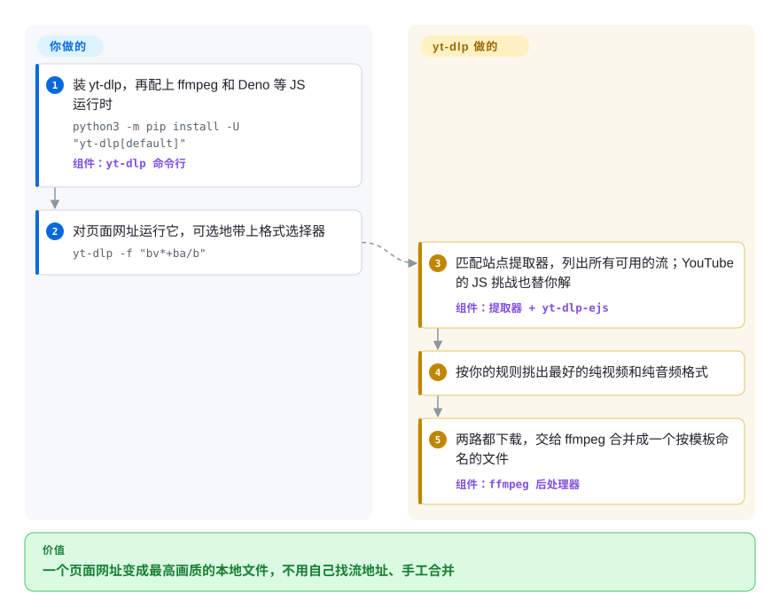

# yt-dlp

你想把一场讲座、一期播客或整个播放列表存成本地文件，但网站只给一个播放器——你看到的网址只是网页，不是视频：真正的流被拆成独立的视频轨和音频轨，藏在每次访问都会变的令牌后面。yt-dlp 知道几千个站点各自怎么藏流，挑出最好的视频和音频，合并成一个名字可预期的文件。

## 何时使用

你在搭媒体处理流水线、归档一个频道、给转写模型喂音频，或者只是想从一个没有下载按钮的页面拿到 `talk.mp4`。你用 yt-dlp，是因为它自带几千个站点的提取器（YouTube、Vimeo、Twitch 回放、哔哩哔哩、新闻站、播客），一条 `yt-dlp -f "bv*+ba/b" URL` 就会解析页面、选出最好的纯视频流加最好的纯音频流、下载后交给 ffmpeg 合并；加 `-x` 同一次运行就变成抽音频，`--sponsorblock-remove` 剪掉赞助片段，`--download-archive` 让定时任务只抓新上传的内容。

选它而不是 [youtube-dl](youtube-dl.zh.md)，是因为 youtube-dl 最后一个打标签的版本停在 2021 年，而 YouTube 这类站点每个月都在变；yt-dlp 大约每月发一次稳定版，中间还有每夜构建。当你需要站点覆盖面、细粒度的格式选择和后处理，而不是一个只盯几个平台的小巧二进制时，选它而不是 [you-get](you-get.zh.md) 或 [lux](lux.zh.md)。

## 怎么用起来

yt-dlp 是一个 Python 命令行程序，每个站点对应一个*提取器*——知道如何把该站点的页面或 API 变成一份可用格式清单的代码（每个“格式”就是一条特定分辨率、编码和码率的流）。对 YouTube 来说，这一步现在还包括破解播放器里的一道 JavaScript 挑战，yt-dlp 通过 `yt-dlp-ejs` 组件把它交给外部 JavaScript 运行时（默认 Deno）去算。你提供网址，以及可选的格式选择器（`-f`）、输出文件名模板（`-o`，默认 `%(title)s [%(id)s].%(ext)s`）、登录内容用的 cookie（`--cookies-from-browser`）和后处理参数。其余都由 yt-dlp 完成：按你的规则挑格式，下载（HLS/DASH 这类流媒体站常用的分段格式会按分片下载），再调用 ffmpeg 合并、转封装、抽音频，或嵌入字幕、封面和章节。同一套引擎也能在 Python 里导入（`yt_dlp.YoutubeDL`），但 README 建议其他语言的程序调用 CLI 并解析 `-J` 输出的 JSON，而不是解析普通输出。

<!-- flow-steps:begin (generated from flows/yt-dlp.json by tools/flow_card.py — do not edit) -->

流程文字版

1. **你**：装 yt-dlp，再配上 ffmpeg 和 Deno 等 JS 运行时 — `python3 -m pip install -U "yt-dlp[default]"` — 组件：`yt-dlp 命令行`
2. **你**：对页面网址运行它，可选地带上格式选择器 — `yt-dlp -f "bv*+ba/b"`
3. **yt-dlp**：匹配站点提取器，列出所有可用的流；YouTube 的 JS 挑战也替你解 — 组件：`提取器 + yt-dlp-ejs`
4. **yt-dlp**：按你的规则挑出最好的纯视频和纯音频格式
5. **yt-dlp**：两路都下载，交给 ffmpeg 合并成一个按模板命名的文件 — 组件：`ffmpeg 后处理器`

**价值**：一个页面网址变成最高画质的本地文件，不用自己找流地址、手工合并

<!-- flow-steps:end -->

## 何时不用

- **受 DRM 保护的流。** yt-dlp 不解密 Widevine、PlayReady 或 FairPlay；Netflix 这类服务会失败。请用服务商正版应用里的离线下载功能。
- **你想在不装 JavaScript 运行时的情况下完整支持 YouTube。** 从 2025 年底起，README 把 `yt-dlp-ejs` 加一个 JS 运行时（推荐 Deno，也可用 Node、Bun 或 QuickJS）列为完整支持 YouTube 的必需项；没有它，可用的客户端和格式会变少。如果你的环境跑不了 Deno 或 Node，就要接受 YouTube 效果打折——元数据改用站点官方 API，或者接受较低画质的格式。
- **站点不受支持，或需要执行任意页面 JavaScript。** yt-dlp 只为特定提取器的挑战运行 JS，并不渲染页面。不支持的站点，先用 [Playwright](../web-automation/playwright-family/playwright.zh.md) 这类浏览器自动化工具抓到流地址，再交给 yt-dlp 或 [FFmpeg](../media-processing/video-audio/transcoding-and-pipelines/ffmpeg.zh.md)。
- **对抗反爬的大规模抓取。** yt-dlp 能带 cookie 和代理，也能伪装浏览器 TLS 指纹（经 curl_cffi 的 `--impersonate`），但 YouTube 越来越多地要求 PO token 并限制 IP。批量拿元数据，请用平台官方 API（比如 YouTube Data API），不要靠轮换账号——同时看清站点条款；youtube-dl 本身在 2020 年就收到过 DMCA 下架（后来撤回）。
- **要可靠地连续录几个小时直播。** README 把 `--live-from-start` 标为实验性功能。专门录直播，用 Streamlink（未收录）接 [FFmpeg](../media-processing/video-audio/transcoding-and-pipelines/ffmpeg.zh.md)。
- **给只想在网页里贴链接的非技术用户用。** yt-dlp 是命令行工具；要浏览器界面和 API，自托管 [cobalt](cobalt.zh.md)。
- **你要再分发打包好的二进制，并且在意许可证。** 仓库和 PyPI 包是 Unlicense，但 README 指出用 PyInstaller 打的可执行文件含 GPLv3+ 代码，整体按 GPLv3+ 授权。在意这一点就分发 PyPI wheel 或 zipimport 版本。

## 横向对比

| 替代品 | 是否收录 | 我们的评价 | 取舍 |
|---|---|---|---|
| [youtube-dl](youtube-dl.zh.md) | ✅ | 凡是要在 YouTube 等快速变化的站点上持续可用的场景，都选 yt-dlp；只有改不动参数的老脚本才留着 youtube-dl，因为它最后一个打标签的版本是 2021.12.17。 | youtube-dl 支持非常老的 Python、参数大家都熟；yt-dlp 放弃了停止维护的 Python 版本，但每月都有提取器修复，还多了 SponsorBlock、浏览器 cookie 和更好的格式排序。 |
| [you-get](you-get.zh.md) | ✅ | 只需要几个国内视频站、想要一个小脚本时，you-get 还能用；其他情况选 yt-dlp，因为 you-get 自 2025-04 起默认分支就没有提交了。 | you-get 更简单、参数更少；yt-dlp 覆盖的站点多得多且在积极维护，代价是参数面更大。 |
| [lux](lux.zh.md) | ✅ | 想要不依赖 Python 的单个 Go 二进制、且你的站点在它的列表里时选 lux；要覆盖面和格式控制时选 yt-dlp。 | lux 一个静态文件就能部署；它最后一个打标签的版本在 2024-05，站点列表也短得多。 |
| [cobalt](cobalt.zh.md) | ✅ | 要一个非技术用户能贴链接的自托管网页界面或 HTTP API，选 cobalt；要脚本化流水线、归档和后处理，选 yt-dlp。 | cobalt 友好、方便分享，但站点和选项更少；yt-dlp 是命令行工具，控制力深，没有界面。 |
| [gallery-dl](gallery-dl.zh.md) | ✅ | 图集、booru 图站和美术站用 gallery-dl；视频和音频用 yt-dlp——gallery-dl 遇到视频时自己也会调用 yt-dlp。 | 两者互补：gallery-dl 管图片翻页和按元数据命名，yt-dlp 管流的选择和封装。 |

## 技术栈

- **语言：** Python（CPython 3.10+、PyPy 3.11+），Unlicense 许可。
- **架构：** 按站点划分的提取器类 → 格式选择与排序引擎 → 下载器（原生 HTTP、HLS/DASH 分片下载器，可选 aria2c 等外部下载器）→ 后处理器（主要靠 ffmpeg/ffprobe 做合并、转封装、抽音频、嵌入）。
- **YouTube JS 挑战：** `yt-dlp-ejs` 的 JavaScript 组件在外部运行时里执行（默认启用 Deno；Node、Bun、QuickJS 需经 `--js-runtimes` 开启）。
- **扩展性：** 插件系统支持第三方提取器和后处理器；可在 Python 里通过 `yt_dlp.YoutubeDL` 嵌入。
- **分发：** PyPI（`yt-dlp[default]`）、Windows/macOS/Linux 独立可执行文件、zipimport 二进制以及第三方包管理器；发布渠道分 `stable`、`nightly`、`master`。

## 依赖

- **必需：** Python 3.10+（用独立可执行文件则不需要）。
- **强烈推荐：** `ffmpeg` 和 `ffprobe`（合并分开的视频/音频、抽音频、嵌入），`yt-dlp-ejs` 加 Deno 等 JavaScript 运行时（完整支持 YouTube）。
- **可选：** `curl_cffi`（浏览器伪装）、`certifi`、`brotli`、`websockets`、`requests`、`mutagen`/AtomicParsley（嵌入封面）、`secretstorage`（读取 Linux 上 GNOME 钥匙环里的浏览器 cookie）。
- **没有服务要跑：** 执行完就退出，不需要托管任何东西。

## 运维难度

**跑起来低，保持最新中等。** 安装是一条命令，运行也是一条命令。持续的工作是跟版本：站点一变提取器就会坏，YouTube 尤甚，所以长期运行的流水线应该锁定版本、测试升级并经常更新（二进制用 `yt-dlp -U`，否则重跑 pip；超过 90 天的版本会打印警告）。最近 YouTube 要求 JS 运行时、部分客户端要求 PO token，这意味着要改环境，而不只是升版本。cookie、代理和限速都得你自己管。

## 健康度与可持续性

- **维护——非常活跃（2026-10-08）。** 稳定版大约每月一次（2026.06.09、2026.07.04、2026.08.19），中间有每夜构建；默认分支多数周都有提交。
- **治理——团队而非单人。** `yt-dlp` GitHub 组织近 12 个月有 40 位活跃的维护者和贡献者；雷达治理轴的 B 反映前三名贡献者占近期提交的约 75%，核心仍是一个小团队在扛。
- **背书与 Lindy。** 志愿者运营，没有公司所有者。这个分叉始于 2020 年，但继承了 youtube-dl 自 2008 年起的血统；“年龄 × 仍活跃”让它成为本品类最稳的选择，前提是志愿者的精力和法律环境都还在。
- **采用度。** 是 GitHub 上星标最多的 Python 工具之一，也是许多图形界面、机器人和归档工具背后的事实标准引擎；[gallery-dl](gallery-dl.zh.md) 下载视频时就依赖它。
- **风险信号。** 真正的风险是针对下载器的法律压力（2020 年 youtube-dl 的 DMCA）和平台的对抗措施（JS 挑战、PO token），而不是许可证；Unlicense 的核心很宽松，但打包好的可执行文件是 GPLv3+。

## 存疑（未验证）

- [推断] “几千个站点”是 README 的说法；2026-10-08 的 `supportedsites.md` 列了约 1,700 个提取器条目，其中不少只部分可用或需要登录。
- [推断] JS 运行时要求“从 2025 年底起”，是根据 2025.10.22 和 2025.11.12 的发布说明首次提到 EJS/Deno 推断的；具体哪一版开始把它列为完整支持 YouTube 的必需项没有确认。
- [未验证] “许多图形界面和机器人背后的事实标准引擎”基于对生态的了解，不是依赖普查。
- [未验证] Streamlink 能否胜任数小时的直播录制，没有为本页重新核实。
