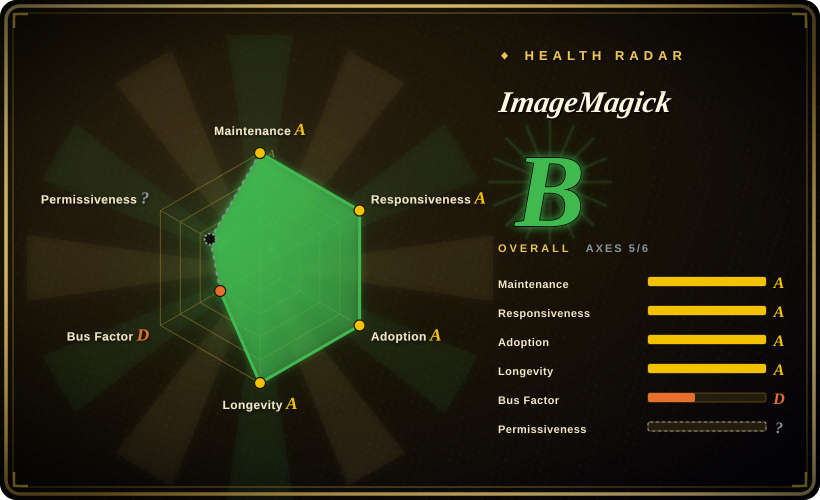
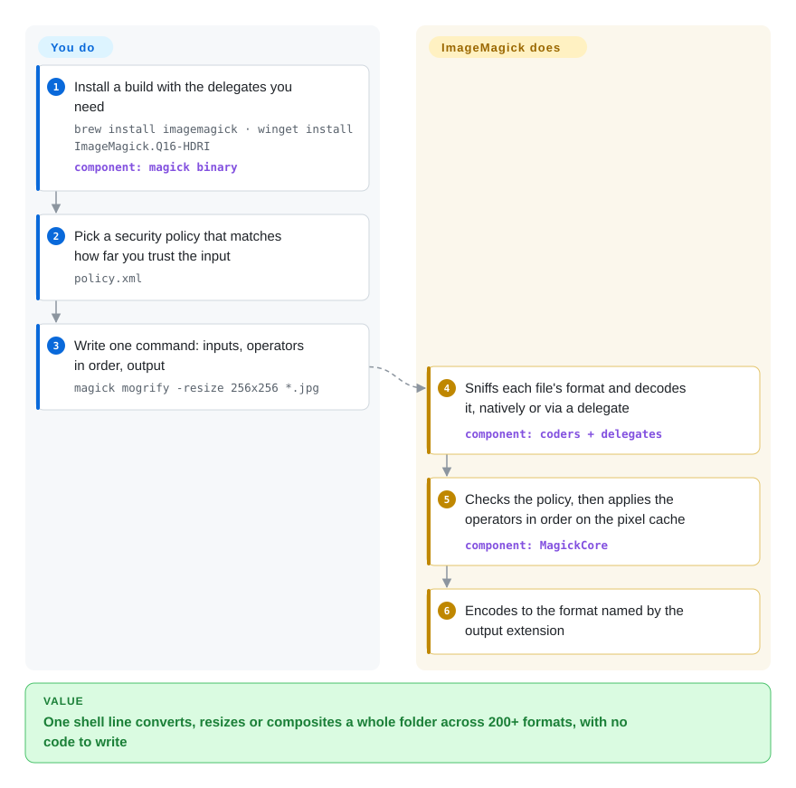

# ImageMagick

A vendor drops thousands of TIFF scans, a few PSD mockups and some multi-page PDFs on you and wants web-sized JPEGs with a logo in the corner — and half your tools can't even open half of those files. ImageMagick is one `magick` command (plus a C library and bindings for most languages) that reads and writes 200+ formats and chains resize, crop, composite and colour operations in a single invocation.

## When to use

You're the backend or ops engineer who owns "the image job": a nightly script that normalises whatever customers upload, a CI step that generates thumbnails and contact sheets, or a one-off migration of an archive full of `.tif`, `.psd`, `.eps`, `.heic` and `.pdf` files. Writing that against a library means picking a language and finding out format by format what it can't decode. With ImageMagick you write one shell line per transformation — `magick mogrify -resize 256x256 *.jpg` resizes a whole folder in place — and the same operators are available from C (MagickWand), .NET (Magick.NET) and the PHP/Python/Ruby bindings when the job later moves into an application.

You pick it over [sharp](sharp.md) / libvips when **format breadth and a scriptable CLI** matter more than raw resize throughput: sharp's prebuilt binaries cover JPEG, PNG, WebP, AVIF, TIFF, GIF and SVG input, while ImageMagick also handles PostScript/PDF (via Ghostscript), HEIC (via libheif), camera RAW, PSD, multispectral TIFF and dozens of legacy formats, plus operations sharp doesn't aim at (montage, morphology, connected-component labelling, perceptual hashing, Fourier transforms). You pay for it in speed and in the security work described below.

## How it works

ImageMagick is a C library (MagickCore for pixels, MagickWand as the friendlier API) with a single front-door program, `magick`; the old tool names (`convert`, `mogrify`, `identify`, `composite`, `montage`…) are symlinks to it in version 7. A command reads left to right: inputs, then operators applied in order, then the output file, whose extension picks the encoder. It does the format sniffing, decoding (natively or by handing off to a **delegate** — an external library or program such as Ghostscript for PDF/PostScript or libheif for HEIC), the in-memory **pixel cache** (spilling to disk for very large images) and multithreaded processing via OpenMP. Your part is choosing the operator chain and, before any untrusted file touches it, choosing a **security policy** — the `policy.xml` file that says which formats, delegates, paths and resource limits are allowed; the shipped default is deliberately "open", meant for sandboxed environments.

<!-- flow-steps:begin (generated from flows/imagemagick.json by tools/flow_card.py — do not edit) -->

Text version of the flow

1. **You**: Install a build with the delegates you need — `brew install imagemagick · winget install ImageMagick.Q16-HDRI` — component: `magick binary`
2. **You**: Pick a security policy that matches how far you trust the input — `policy.xml`
3. **You**: Write one command: inputs, operators in order, output — `magick mogrify -resize 256x256 *.jpg`
4. **ImageMagick**: Sniffs each file's format and decodes it, natively or via a delegate — component: `coders + delegates`
5. **ImageMagick**: Checks the policy, then applies the operators in order on the pixel cache — component: `MagickCore`
6. **ImageMagick**: Encodes to the format named by the output extension

**Value**: One shell line converts, resizes or composites a whole folder across 200+ formats, with no code to write

<!-- flow-steps:end -->

## When NOT to use

- **You're decoding untrusted uploads on a public endpoint and won't sandbox it.** ImageMagick's huge decoder surface is a steady CVE source: GitHub lists 219 security advisories for the repo published between 2025-10 and 2026-10 (21 rated high), and the default policy is open. If you need web thumbnails of common formats, use [sharp](sharp.md) (or libvips directly) and let its narrower prebuilt format set limit what an attacker can reach; if you must use ImageMagick, install the `websafe` policy and run it in a container with resource limits.
- **Resizing is in a hot request path.** For high-volume resize/convert inside a Node.js service, use [sharp](sharp.md): its README claims 4–5x faster resizing than the quickest ImageMagick settings thanks to libvips's streaming design. For an on-the-fly resizing server, imgproxy (not indexed) is built for exactly that job.
- **You want in-process manipulation from Python without shelling out.** Use Pillow (not indexed) for the common formats; reach for ImageMagick (through Wand) only when Pillow can't read the format.
- **You need to render HTML/CSS (cards, OG images) to pixels.** ImageMagick can draw text but has no browser layout engine; use [Screenshot Service](screenshot-service.md) or another headless-browser renderer.
- **The input is video.** Frame extraction, transcoding and GIF-from-video belong to [FFmpeg](../video-audio/transcoding-and-pipelines/ffmpeg.md); ImageMagick itself delegates video formats to FFmpeg.
- **Your legal allowlist only accepts OSI-catalogue licenses.** The ImageMagick License is a permissive, Apache-2.0-style license with its own name (SPDX `ImageMagick`) that requires attribution and a copy of the license on redistribution; some corporate scanners flag it for manual review. PDF/PostScript support additionally pulls in Ghostscript, which is AGPL-licensed.

## Comparison

| Alternative | In index | Our verdict | Tradeoff |
|---|---|---|---|
| [sharp](sharp.md) | ✅ | For resizing and converting common web formats inside a Node.js service, pick sharp; pick ImageMagick when the job is a shell or batch script that has to open exotic formats (PDF, PSD, RAW, multispectral TIFF) or needs operators beyond resize/composite. | sharp gains speed, low memory and a smaller default format surface from libvips; it gives up ImageMagick's format breadth, its CLI and its long operator catalogue. |
| libvips | not indexed | When you want the speed and memory profile behind sharp from C, Python (pyvips), Go or Ruby, or as a `vips` CLI, pick libvips; stay with ImageMagick when the operator you need (montage, morphology, Fourier, perceptual hash) or the format only exists there. | Demand-driven, horizontally threaded library with low memory use; LGPL-2.1-or-later and a smaller operator set than ImageMagick. |
| GraphicsMagick | not indexed | When you want an ImageMagick-style CLI with a smaller codebase and a reputation for stability, try GraphicsMagick; pick ImageMagick when you need the newer formats, HDRI processing and the much larger contributor and binding ecosystem. | 2002 fork of ImageMagick 5.5.2 with a conservative change policy; mostly compatible syntax (`gm convert`), fewer features and a smaller community; lives in Mercurial on SourceForge rather than GitHub. |
| Pillow | not indexed | For Python code that opens, crops and saves mainstream formats in-process, pick Pillow; call ImageMagick (via Wand or a subprocess) only for the formats or operators Pillow lacks. | Pure Python API with C extensions, easy to install from PyPI; narrower format coverage and no shell-level CLI. |
| imgproxy | not indexed | When the requirement is "resize images on the fly behind a URL", deploy imgproxy rather than wrapping ImageMagick in your own HTTP service. | Go server on top of libvips with signed URLs and built-in limits against decompression bombs; it is a service to run, not a library or CLI. |

## Tech stack

- **Language:** C (MagickCore pixel engine + MagickWand API); `Magick++` (C++) and PerlMagick (Perl) APIs live in the same repo.
- **Command line:** single `magick` binary in v7; legacy names (`convert`, `mogrify`, `identify`, `composite`, `montage`, `compare`, `display`) are symlinks. ImageMagick 6 is maintained separately as a legacy line.
- **Parallelism and precision:** OpenMP-threaded algorithms; default build is Q16 HDRI (16-bit quantum, floating-point pixels); Q8 non-HDRI builds trade precision for half the memory.
- **Bindings:** Magick.NET (.NET, maintained by the same core maintainer), plus third-party bindings such as Wand (Python), Imagick (PHP) and RMagick (Ruby).

## Dependencies

- **Delegate libraries:** most formats depend on optional libraries detected at build time (libjpeg, libpng, libtiff, libwebp, libheif, librsvg, lcms2, freetype…). Which formats a given binary supports depends on how it was built; check with `magick -list format`.
- **External programs:** Ghostscript for PDF/PostScript/EPS reading; FFmpeg for video formats; dcraw-style decoders for some RAW files.
- **Distribution:** Homebrew (`brew install imagemagick`), winget (`ImageMagick.Q16-HDRI`), an AppImage as the only upstream Linux binary, or your distro's package (often older and sometimes still v6). No runtime services.

## Ops difficulty

**Low to run, medium to run safely.** A command-line call needs nothing beyond the binary. The work is in operating it on input you don't control: install a restrictive policy (`limited`, `secure` or `websafe`, selectable at build time since 7.1.1-16) or hand-edit `policy.xml`, set memory/disk/time resource limits so a crafted image can't exhaust the host, run it in a container, and keep up with frequent point releases (7.1.2-28 to 7.1.2-32 shipped between late July and late September 2026). Also watch for distro builds that are v6 or lack the delegate you need — the command line and the format list differ between installs.

## Health & viability

- **Maintenance (2026-10): very active.** Commits land almost daily and point releases ship every few weeks (latest 7.1.2-32 on 2026-09-27); most fixes are security patches to individual coders.
- **Governance and bus factor — the weak axis.** Development is concentrated in two long-time maintainers (Cristy, the original author, and Dirk Lemstra, who also maintains Magick.NET); the radar grades governance D on commit concentration. The trademark and license belong to ImageMagick Studio LLC, funded through GitHub Sponsors and donations.
- **Age and Lindy: very strong.** Started at DuPont in 1987 and freely released in 1990, with the GitHub repo active since 2015; nearly four decades of continuous maintenance is about as good as a Lindy prior gets.
- **Adoption: ubiquitous.** Shipped by every major Linux distribution and Homebrew, wrapped by bindings in most languages, and fuzzed continuously by OSS-Fuzz.
- **Risk flags.** Security, not abandonment: ~219 advisories in twelve months means you must budget for patching. The custom license is permissive but non-standard (the radar's license axis is unscored because GitHub reports it as `NOASSERTION`).

## Caveats (unverified)

- [未验证] The 4–5x resize speed advantage of sharp over ImageMagick is the sharp README's own benchmark claim, not something this page measured.
- [未验证] Format support depends on the delegates compiled into a particular binary; the format list here reflects the upstream formats page, not any specific distro build.
- [推断] The surge in published advisories (212 of 236 in 2026) may partly reflect more reporting and fuzzing rather than a worsening codebase; the count is from GitHub's advisory API, the cause is not established.
- [推断] Governance concentration is inferred from commit counts (Cristy's commits are not linked to a GitHub account, so contributor stats under-count them); there is no published governance document.
- [未验证] GraphicsMagick's fork origin (ImageMagick 5.5.2, 2002) and its Mercurial/SourceForge hosting are from general knowledge, not re-checked this pass.
- [未验证] Binding status for Wand, Imagick and RMagick (maintenance level, IM7 support) was not checked this pass.
