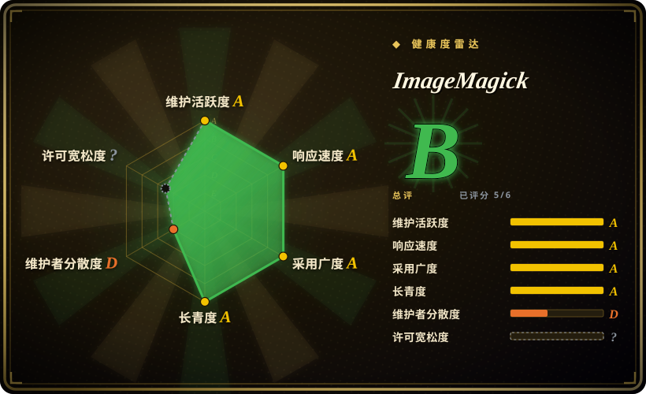
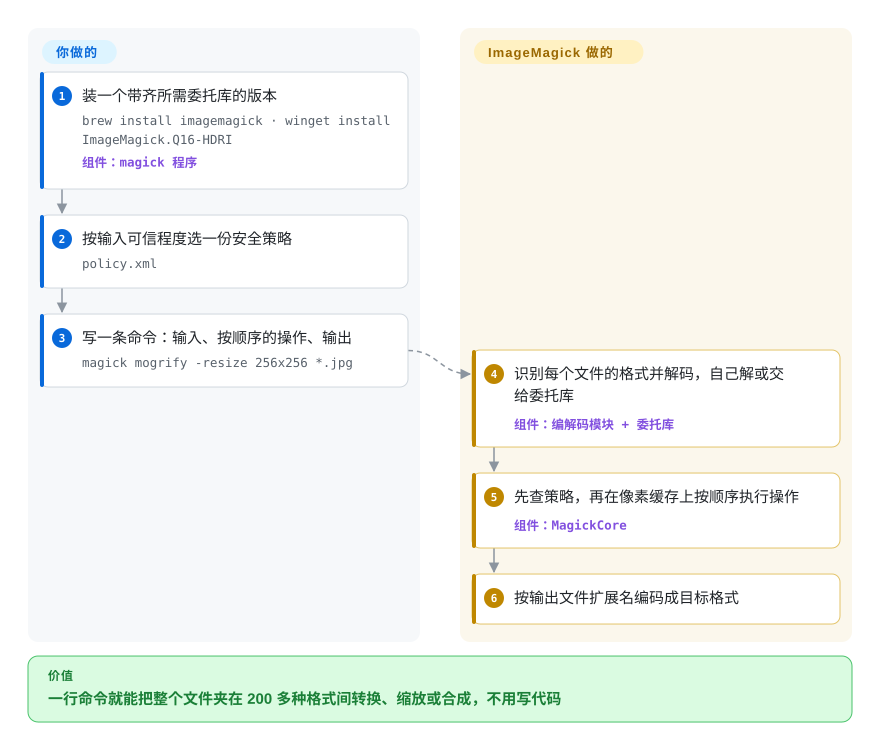

# ImageMagick

供应商甩来几千张 TIFF 扫描件、几个 PSD 设计稿和一堆多页 PDF，要你全部转成网页尺寸、右下角带 logo 的 JPEG，而你手头的工具有一半连这些文件都打不开。ImageMagick 就是一条 `magick` 命令（外加 C 库和各语言绑定），能读写 200 多种格式，在一次调用里串起缩放、裁剪、合成、调色。

## 何时使用

你是负责“图片活”的后端或运维：每晚跑一个脚本把用户上传的五花八门的图规整一遍，CI 里生成缩略图和联系表，或者一次性迁移一个塞满 `.tif`、`.psd`、`.eps`、`.heic`、`.pdf` 的老档案库。拿某个库来写，得先选语言，再逐个格式踩坑看它解不开什么。用 ImageMagick，每种变换写一行 shell 就行——`magick mogrify -resize 256x256 *.jpg` 原地缩放整个文件夹；等这活以后搬进应用，同样的操作也能从 C（MagickWand）、.NET（Magick.NET）以及 PHP/Python/Ruby 绑定里调用。

当**格式覆盖面和可脚本化的命令行**比纯缩放吞吐更重要时，你选它而不是 [sharp](sharp.zh.md) / libvips：sharp 的预编译二进制只读 JPEG、PNG、WebP、AVIF、TIFF、GIF 和 SVG，而 ImageMagick 还能处理 PostScript/PDF（经 Ghostscript）、HEIC（经 libheif）、相机 RAW、PSD、多光谱 TIFF 和几十种老格式，并提供 sharp 不打算做的操作（拼图、形态学、连通域标记、感知哈希、傅里叶变换）。代价是速度，以及下面要讲的安全工作。

## 怎么用起来

ImageMagick 是一套 C 库（MagickCore 管像素，MagickWand 是更好用的 API），对外只有一个入口程序 `magick`；在第 7 版里，老命令名（`convert`、`mogrify`、`identify`、`composite`、`montage` 等）都只是指向它的符号链接。命令从左往右读：先是输入，然后按顺序执行的操作，最后是输出文件，输出扩展名决定用哪种编码器。识别格式、解码（自己解，或交给**委托**——外部库或程序，比如 PDF/PostScript 交给 Ghostscript，HEIC 交给 libheif）、内存里的**像素缓存**（超大图会溢出到磁盘）、用 OpenMP 多线程处理，这些都是它做的。你要做的是挑好操作链，并且在任何不可信文件碰到它之前，先选一份**安全策略**——也就是 `policy.xml`，规定允许哪些格式、委托、路径和资源上限；出厂默认是刻意“全开放”的，预设你跑在沙箱里。

<!-- flow-steps:begin (generated from flows/imagemagick.json by tools/flow_card.py — do not edit) -->

流程文字版

1. **你**：装一个带齐所需委托库的版本 — `brew install imagemagick · winget install ImageMagick.Q16-HDRI` — 组件：`magick 程序`
2. **你**：按输入可信程度选一份安全策略 — `policy.xml`
3. **你**：写一条命令：输入、按顺序的操作、输出 — `magick mogrify -resize 256x256 *.jpg`
4. **ImageMagick**：识别每个文件的格式并解码，自己解或交给委托库 — 组件：`编解码模块 + 委托库`
5. **ImageMagick**：先查策略，再在像素缓存上按顺序执行操作 — 组件：`MagickCore`
6. **ImageMagick**：按输出文件扩展名编码成目标格式

**价值**：一行命令就能把整个文件夹在 200 多种格式间转换、缩放或合成，不用写代码

<!-- flow-steps:end -->

## 何时不用

- **你要在公网接口上解码不可信的上传图片，又不打算做隔离。** ImageMagick 解码器面极大，CVE 源源不断：GitHub 上该仓库在 2025-10 到 2026-10 之间发布了 219 条安全公告（21 条高危），而默认策略是全开放。如果只是给常见格式做网页缩略图，用 [sharp](sharp.zh.md)（或直接用 libvips），靠它更窄的预编译格式集限制攻击者能碰到的解码器；非用 ImageMagick 不可，就装 `websafe` 策略，并放进限了资源的容器里跑。
- **缩放发生在高频请求路径上。** Node.js 服务里大批量缩放、转格式，用 [sharp](sharp.zh.md)：它的 README 称借助 libvips 的流式设计，缩放比 ImageMagick 最快的设置还快 4–5 倍。要一个按 URL 实时缩图的服务，imgproxy（未收录）就是专门干这个的。
- **你想在 Python 进程内直接处理图片，不想起子进程。** 常见格式用 Pillow（未收录）；只有 Pillow 读不了的格式才通过 Wand 调 ImageMagick。
- **你要把 HTML/CSS（分享卡片、OG 图）渲染成图片。** ImageMagick 能画字，但没有浏览器排版引擎；用 [Screenshot Service](screenshot-service.zh.md) 或别的无头浏览器渲染器。
- **输入是视频。** 抽帧、转码、视频转 GIF 归 [FFmpeg](../video-audio/transcoding-and-pipelines/ffmpeg.zh.md)；ImageMagick 自己处理视频格式时也是交给 FFmpeg。
- **你们法务白名单只认 OSI 目录里的许可证。** ImageMagick License 是一份类 Apache-2.0 的宽松许可证，但有自己的名字（SPDX `ImageMagick`），再分发时要求署名并附许可证全文；有些公司的扫描工具会把它标成需人工审核。读 PDF/PostScript 还会引入 Ghostscript，而它是 AGPL 许可。

## 横向对比

| 替代品 | 是否收录 | 我们的评价 | 取舍 |
|---|---|---|---|
| [sharp](sharp.zh.md) | ✅ | 在 Node.js 服务里缩放、转换常见网页格式，选 sharp；任务是要打开冷门格式（PDF、PSD、RAW、多光谱 TIFF）的 shell 或批处理脚本，或者需要缩放和合成以外的操作，选 ImageMagick。 | sharp 借 libvips 换来速度、低内存和更窄的默认格式面；放弃的是 ImageMagick 的格式广度、命令行和长长的操作清单。 |
| libvips | 未收录 | 想在 C、Python（pyvips）、Go、Ruby 或 `vips` 命令行里拿到 sharp 背后那套速度和内存表现，选 libvips；你要的操作（拼图、形态学、傅里叶、感知哈希）或格式只有 ImageMagick 有，就留在 ImageMagick。 | 按需计算、横向多线程，内存占用低；LGPL-2.1-or-later，操作集比 ImageMagick 小。 |
| GraphicsMagick | 未收录 | 想要 ImageMagick 风格的命令行、代码更少、以稳定著称，可以试 GraphicsMagick；需要新格式、HDRI 处理以及大得多的贡献者和绑定生态，选 ImageMagick。 | 2002 年从 ImageMagick 5.5.2 分出来的分支，改动策略保守；语法大体兼容（`gm convert`），功能更少、社区更小；代码在 SourceForge 的 Mercurial 上而不是 GitHub。 |
| Pillow | 未收录 | Python 代码里在进程内打开、裁剪、保存主流格式，选 Pillow；只有 Pillow 缺的格式或操作才调 ImageMagick（经 Wand 或子进程）。 | 纯 Python API 加 C 扩展，从 PyPI 一装就好；格式覆盖更窄，没有 shell 级命令行。 |
| imgproxy | 未收录 | 需求是“URL 后面实时缩图”时，直接部署 imgproxy，不要自己拿 ImageMagick 包一层 HTTP 服务。 | 基于 libvips 的 Go 服务，自带 URL 签名和防解压炸弹的尺寸检查；它是要运维的服务，不是库也不是命令行。 |

## 技术栈

- **语言：** C（MagickCore 像素引擎 + MagickWand API）；同一仓库里还有 `Magick++`（C++）和 PerlMagick（Perl）接口。
- **命令行：** 第 7 版只有一个 `magick` 程序；老名字（`convert`、`mogrify`、`identify`、`composite`、`montage`、`compare`、`display`）都是符号链接。ImageMagick 6 作为旧版线单独维护。
- **并行与精度：** 算法用 OpenMP 多线程；默认构建是 Q16 HDRI（16 位量子、浮点像素）；Q8 非 HDRI 构建用精度换一半内存。
- **绑定：** Magick.NET（.NET，由同一位核心维护者维护），以及 Wand（Python）、Imagick（PHP）、RMagick（Ruby）等第三方绑定。

## 依赖

- **委托库：** 多数格式依赖构建时探测到的可选库（libjpeg、libpng、libtiff、libwebp、libheif、librsvg、lcms2、freetype 等）。某个二进制支持哪些格式取决于它怎么编译的，用 `magick -list format` 查。
- **外部程序：** 读 PDF/PostScript/EPS 要 Ghostscript；视频格式要 FFmpeg；部分 RAW 文件要 dcraw 一类解码器。
- **分发渠道：** Homebrew（`brew install imagemagick`）、winget（`ImageMagick.Q16-HDRI`）、上游唯一提供的 Linux 二进制 AppImage，或发行版自带的包（往往更旧，有时还是 v6）。不需要任何常驻服务。

## 运维难度

**跑起来容易，安全地跑属于中等。** 命令行调用除了二进制什么都不需要。功夫在处理你控制不了的输入时：装一份收紧的策略（7.1.1-16 起构建时可选 `limited`、`secure`、`websafe`）或手改 `policy.xml`；设好内存、磁盘、时间的资源上限，防止构造过的图片拖垮主机；放进容器里跑；并跟上频繁的小版本（2026 年 7 月底到 9 月底就发了 7.1.2-28 到 7.1.2-32）。还要留意发行版的包可能是 v6，或者缺你要的委托库——不同安装之间命令行和格式列表都不一样。

## 健康度与可持续性

- **维护（2026-10）：非常活跃。** 几乎每天都有提交，每隔几周发一个小版本（最新 7.1.2-32，2026-09-27）；大多数修复是针对单个编解码模块的安全补丁。
- **治理与巴士因子——短板。** 开发集中在两位老维护者身上（原作者 Cristy，以及同时维护 Magick.NET 的 Dirk Lemstra）；雷达按提交集中度给治理打 D。商标和许可证归 ImageMagick Studio LLC，资金来自 GitHub Sponsors 和捐赠。
- **年龄与 Lindy：非常强。** 1987 年起源于杜邦，1990 年免费发布，GitHub 仓库自 2015 年起一直活跃；近四十年持续维护，Lindy 先验几乎不能更好了。
- **采用：无处不在。** 各大 Linux 发行版和 Homebrew 都打包，绝大多数语言都有绑定，并由 OSS-Fuzz 持续模糊测试。
- **风险信号。** 风险是安全而不是废弃：一年约 219 条公告，意味着你得为打补丁留出预算。自定义许可证虽宽松但不标准（GitHub 报为 `NOASSERTION`，所以雷达的许可证轴未打分）。

## 存疑（未验证）

- [未验证] sharp 比 ImageMagick 缩放快 4–5 倍，是 sharp README 自己的基准结论，本页没有实测。
- [未验证] 支持哪些格式取决于具体二进制编进了哪些委托库；这里的格式清单来自上游格式页，不代表任何特定发行版的构建。
- [推断] 公告数激增（236 条里有 212 条发布于 2026 年）可能部分来自报告和模糊测试变多，而不是代码变差；数字来自 GitHub 公告 API，原因没有查实。
- [推断] 治理集中度是从提交数推出来的（Cristy 的提交没有关联 GitHub 账号，贡献者统计会少算这部分）；项目没有公开的治理文档。
- [未验证] GraphicsMagick 的分叉来源（2002 年的 ImageMagick 5.5.2）以及托管在 SourceForge Mercurial 上，来自常识，本轮没有复核。
- [未验证] Wand、Imagick、RMagick 等绑定的维护状态（活跃程度、是否支持 IM7）本轮没有检查。
