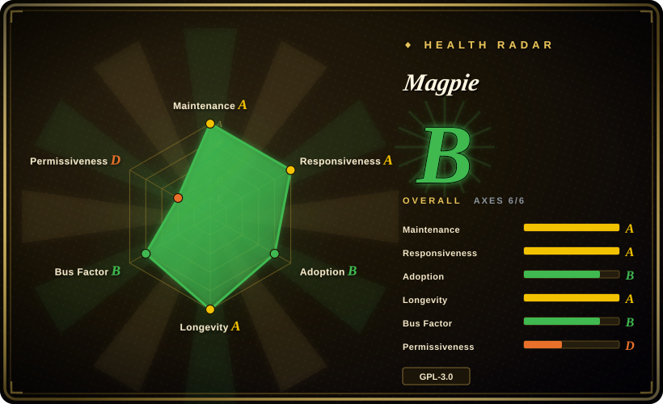
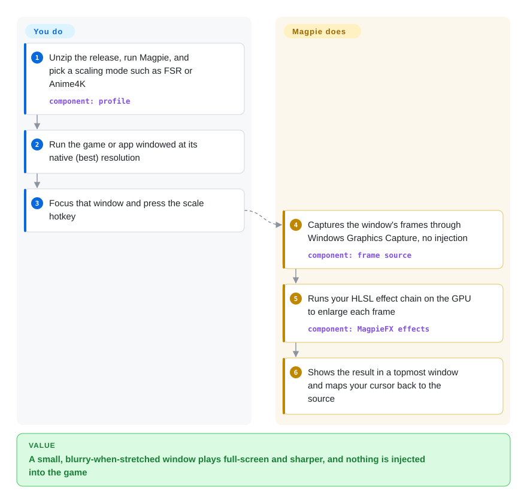

# Magpie

An old game or a fixed-size app on a 1440p/4K monitor is either a postage-stamp window or, stretched by Windows, a blurry smear. Magpie grabs that window's picture every frame, enlarges it on the GPU with a real upscaling filter (FSR, Anime4K, Lanczos, CRT shaders…), and lays the result full-screen over the original so you keep using the original window underneath.

## When to use

You play a 2010s visual novel or a 2D RPG that only runs at 1280×720 on a 2560×1440 Windows 11 laptop. Its own "fullscreen" is either missing or a bilinear stretch that turns every line of text into mush, and Windows' DPI scaling makes it worse (the game is not DPI-aware, so the OS bicubic-blurs it for you). You want it to fill the screen and look *sharper*, not softer — and you don't want to inject a DLL into the game.

That is Magpie's exact trigger: a **non-intrusive, per-window upscaler** for Windows 10/11. It captures the window through a normal Windows capture API, runs a chain of HLSL compute shaders (Anime4K for anime art, FSR/NIS/SGSR for 3D games, xBRZ/pixel-art filters, CRT emulation, Lanczos/Jinc for general use), and presents the enlarged image in a topmost window, mapping your cursor back to the source. You pick it over the paid Lossless Scaling when you want it free and GPL, and when image *quality* for 2D/anime content matters more than frame generation; you pick it over ReShade / Special K when you must not touch the game process (anti-cheat, fragile old games, non-game apps).

## How it works

Magpie never loads into the game. When you press its scale hotkey, it asks Windows for a copy of the target window's frames — through Windows Graphics Capture by default, or Desktop Duplication, GDI, or DWM shared surface, each with different compatibility trade-offs (a "capture method" is just which OS pipe the pixels come through). Each frame goes through the effect chain you configured — small GPU programs ("compute shaders", written in HLSL, Microsoft's shader language) that each take an image and output a bigger or cleaner one — and the result is drawn into a borderless, always-on-top window that covers the screen (or a resizable window in windowed-scaling mode). Your mouse is still really pointing at the small original window: Magpie maps the cursor position and speed between the two, so clicks land where you see them. You do the choosing — which window, which effect chain per app ("profile"), which capture method when the default stutters; Magpie does the capture, GPU processing, presentation and cursor mapping. Think of it as a magnifying glass with a very good lens held in front of one window, rather than a mod installed inside it.

<!-- flow-steps:begin (generated from flows/magpie.json by tools/flow_card.py — do not edit) -->

Text version of the flow

1. **You**: Unzip the release, run Magpie, and pick a scaling mode such as FSR or Anime4K — component: `profile`
2. **You**: Run the game or app windowed at its native (best) resolution
3. **You**: Focus that window and press the scale hotkey
4. **Magpie**: Captures the window's frames through Windows Graphics Capture, no injection — component: `frame source`
5. **Magpie**: Runs your HLSL effect chain on the GPU to enlarge each frame — component: `MagpieFX effects`
6. **Magpie**: Shows the result in a topmost window and maps your cursor back to the source

**Value**: A small, blurry-when-stretched window plays full-screen and sharper, and nothing is injected into the game

<!-- flow-steps:end -->

## When NOT to use

- **You want more FPS, not a sharper picture.** Magpie has no frame generation and the FAQ rules out FSR 2/3-style temporal upscaling (it cannot see motion vectors or depth). If performance is the goal, use the game's built-in DLSS/FSR/XeSS, or the paid Lossless Scaling (frame generation), instead of Magpie.
- **The game runs in HDR.** HDR support has been an open issue since 2021 (#55, still open 2026-09); scaled HDR content is washed out or over-exposed. Use Special K (injects into the game and retrofits HDR) or the game's native resolution instead.
- **You are not on Windows 10 v1903+ / 11 with a DirectX feature level 11 GPU.** There is no Linux/macOS build. On Linux/Wine or for RetroArch-style shader overlays, use ShaderGlass, which also runs under Wine.
- **You need in-engine post-processing (depth-aware effects, UI-free AO/DOF).** Magpie only sees the finished 2D frame. Use ReShade, which injects into the render pipeline — accepting the anti-cheat risk that brings.
- **Competitive multiplayer where any overlay could be flagged.** The FAQ says there have been no ban reports, but that is the maintainer's claim, not an anti-cheat vendor's guarantee [未验证]. If a ban is unacceptable, run the game at native resolution or use driver-level scaling (NVIDIA Image Scaling / AMD RSR) instead.
- **Games with multiple top-level windows or that fight "topmost".** Multi-window games do not stack correctly (#1408, open), and overlays/RTSS can double up. For such titles, prefer the game's own borderless mode or GPU driver scaling.
- **You need a library/SDK to upscale images or video programmatically.** Magpie is a GUI app; its only programmatic surface is a window-message/window-property protocol for *reacting to* scaling. For batch image/video upscaling use a library or tool (e.g. an ESRGAN-family tool, or FFmpeg filters) instead.
- **Locked-down corporate machines.** Touch support requires admin rights and adds a self-signed certificate to the machine's *trusted root* store plus a helper in `System32\Magpie`. If root-store changes are unacceptable, leave touch support off (the default) or don't use Magpie there.

## Comparison

| Alternative | In index | Our verdict | Tradeoff |
|---|---|---|---|
| Lossless Scaling | not a repo | When you want frame generation and 3D-game performance on Windows, pick the paid Lossless Scaling; pick Magpie when you want a free GPL tool whose focus is image quality and a wide choice of 2D/anime/pixel-art filters. | Paid closed-source Steam app (out of scope by shape); it trades filter variety and source access for frame generation and a performance focus (per Magpie's own FAQ). |
| ShaderGlass | not indexed | For retro/emulator content where you want RetroArch's 1200+ CRT/handheld shaders as a desktop overlay, or you are on Linux/Wine, pick ShaderGlass; pick Magpie for tight integration with a single scaled window (cursor mapping, resize, windowed scaling). | Real repo (`mausimus/ShaderGlass`, GPL-3.0), not added in this tab-intake batch; much larger shader library, but a glass/overlay model that handles resizing and mouse passthrough less smoothly [未验证]. |
| ReShade | not indexed | When you need in-engine effects (depth buffer, pre-UI injection) in a single-player game, pick ReShade; pick Magpie when you must not modify the game process or need to scale non-game apps. | Real repo (`crosire/reshade`, BSD-3-Clause), not added in this tab-intake batch; injection unlocks depth-aware effects but conflicts with anti-cheat and can break fragile games. |
| Special K | not indexed | When you want HDR retrofit, frame pacing and deep per-game fixes, pick Special K; pick Magpie for a non-injecting, app-agnostic upscaler that also works on anti-cheat titles and non-games. | Real repo (`SpecialKO/SpecialK`, GPL-3.0), not added in this tab-intake batch; far more capability per game, at the price of injecting into every target process. |
| IntegerScaler | not a repo | Pick IntegerScaler only for pure pixel-perfect integer scaling on old hardware; pick Magpie for any smoothing, sharpening or ML-style upscaling. | Closed-source freeware (its site states the source is closed), built on the Magnification API with only nearest-neighbour/integer scaling. |

## Tech stack

- **C++ (C++/WinRT)** for the app and scaling runtime; UI is **WinUI via XAML Islands**; core modules include separate frame sources for Graphics Capture, Desktop Duplication, GDI and DwmSharedSurface.
- **HLSL** compute shaders for every effect (the repo's largest language by bytes), in Magpie's own **MagpieFX** format (`//!MAGPIE EFFECT` header, declared textures/passes/parameters), running on **Direct3D 11**.
- Bundled algorithm ports: Anime4K, FSR (1), NIS, SGSR, CAS, FSRCNNX, RAVU, NNEDI3, ACNet, CuNNy2, xBRZ, SMAA/FXAA, CRT shaders, ArtCNN.
- Build: Visual Studio 2022/2026 (C++ + UWP workloads, Windows SDK 26100+), CMake, Python 3.11+, Conan for native deps.

## Dependencies

- **Runtime:** Windows 10 v1903+ or Windows 11, a GPU with DirectX feature level 11. Release zips for x64 and ARM64; no installer service, no network service.
- **Optional:** admin rights for touch support (installs a self-signed root certificate and `TouchHelper.exe` under `System32\Magpie`); RTSS or similar if you want the *game's* FPS (Magpie shows only its own).
- **No hosted dependency** for scaling; the app has an update checker that reads the release manifest (`version.json`) from the repo [推断].

## Ops difficulty

**Low** for a desktop user: unzip, run, press a hotkey. The real tuning cost is per-app: choosing capture method, effect chain, and toggles (DirectFlip, 3D game mode, DPI override) when a title stutters or mis-renders — the project's own performance guide is mostly NVIDIA driver/VSync troubleshooting. Building from source is **medium** (VS + UWP workload + Conan + signing for touch).

## Health & viability

- **Maintenance (2026-09-29):** the `dev` branch is active (commits through 2026-09-27, feature work in 2026-09), but the last tagged release is **v0.12.1 from 2025-08-27** — over a year without a release, so users on the zip get none of the newer fixes. Treat "active code, stalled releases" as the current state.
- **Governance / bus factor:** a personal project owned by one user account (Blinue); ~2,600 of the commits are the owner's versus 12 for the next human contributor. Translations come via Weblate. Bus factor is effectively 1.
- **Longevity (Lindy):** created 2021-02-20, ~5.6 years old and still actively developed — a decent prior for a single-maintainer desktop tool, not a foundation-grade one.
- **Adoption:** ~15.1k stars, ~700 forks; the v0.12.1 release zips have ~376k downloads combined (as of 2026-09-29). It is the reference open-source answer in its niche; the closest alternative is a paid app.
- **Risk flags:** GPL-3.0, but **CONTRIBUTING requires contributors to transfer copyright** to the owner so the license can change; the stated promise is "only newer GPL versions". Touch support modifies the trusted root certificate store. Anti-cheat safety rests on the FAQ's "no reports", not a guarantee.

## Caveats (unverified)

- [未验证] "No ban reports" for multiplayer use is the maintainer's FAQ statement; no anti-cheat vendor documentation was found.
- [未验证] ShaderGlass handling resizing/mouse passthrough less smoothly than Magpie comes from a user comment on issue #55, not from testing.
- [推断] The update check reads `version.json` from the repo — inferred from that file's content (version + download URLs + hashes), the code path was not read.
- [推断] Why releases stalled after v0.12.1 is unknown; work in progress includes a D3D12 renderer (#1348) and an ONNX-model preview (`onnx-preview2`, 2025-04), which may be the reason.
- [未验证] Real-world latency and GPU cost of the heavier effects (Anime4K L variants, FSRCNNX) vary by GPU; no benchmark was run.
