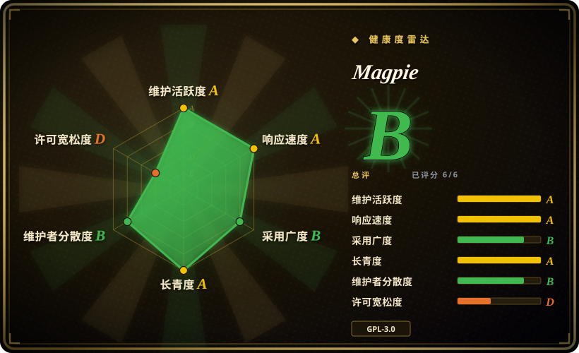
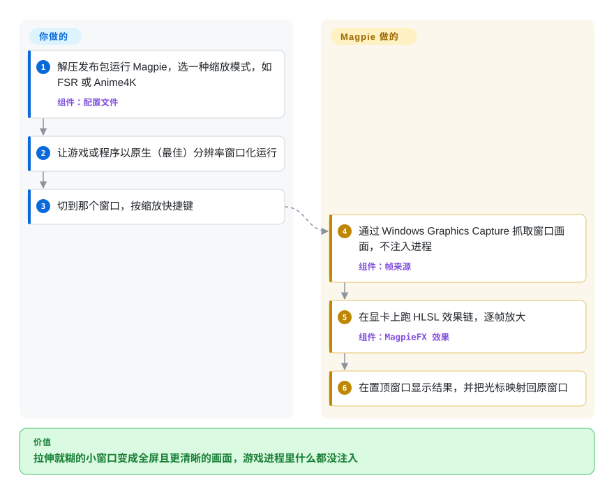

# Magpie

老游戏或固定尺寸的小程序放到 2K／4K 屏上，要么是邮票大小的小窗口，要么被 Windows 拉伸成一团糊。Magpie 每一帧把那个窗口的画面抓下来，在显卡上用真正的放大算法（FSR、Anime4K、Lanczos、CRT 着色器等）放大，再全屏盖在原窗口上面，你照常操作底下的原窗口。

## 何时使用

你在一台 2560×1440 的 Windows 11 笔记本上玩一款只支持 1280×720 的老视觉小说或 2D RPG。它自带的“全屏”要么没有，要么是双线性拉伸，每行字都糊成一片；Windows 的 DPI 缩放还雪上加霜（游戏不支持高 DPI，系统替你再做一遍双三次模糊）。你想让它铺满屏幕、而且看起来更“锐”而不是更“软”，同时不想往游戏里注入任何 DLL。

这正是 Magpie 的触发场景：一个 Windows 10／11 上**不侵入进程、按窗口工作的放大器**。它通过 Windows 自带的捕获接口抓取窗口画面，跑一串 HLSL 计算着色器（动漫画面用 Anime4K，3D 游戏用 FSR／NIS／SGSR，像素风用 xBRZ 等，另有 CRT 模拟和 Lanczos／Jinc 通用插值），把放大后的画面显示在一个置顶窗口里，并把鼠标位置映射回原窗口。和收费的 Lossless Scaling 比，你选 Magpie 是因为它免费、GPL 开源，而且在 2D／动漫内容上更看重画质而不是补帧；和 ReShade／Special K 比，你选 Magpie 是因为你不能碰游戏进程（反作弊、脆弱的老游戏、非游戏软件）。

## 怎么用起来

Magpie 从不加载进游戏。你按下缩放快捷键后，它向 Windows 要一份目标窗口的画面——默认走 Windows Graphics Capture，也可以换成 Desktop Duplication、GDI 或 DWM 共享表面，各有兼容性取舍（“捕获方式”就是像素从哪条系统管道流过来）。每一帧都经过你配置的效果链——一个个在显卡上跑的小程序（“计算着色器”，用微软的着色器语言 HLSL 写成），每个接收一张图、输出一张更大或更干净的图——结果画进一个无边框、始终置顶、铺满屏幕的窗口（窗口模式缩放下则是可调大小的窗口）。你的鼠标其实仍然指着那个小的原窗口：Magpie 在两者之间换算光标位置和移动速度，所以你点在看到的地方就能点中。你负责选择——缩放哪个窗口、每个程序用哪套效果链（“配置文件”）、默认方式卡顿时换哪种捕获方式；抓取、GPU 处理、呈现和光标映射都是 Magpie 做的。可以把它想成举在某个窗口前面的一块高级放大镜，而不是装进窗口里的一个 mod。

<!-- flow-steps:begin (generated from flows/magpie.json by tools/flow_card.py — do not edit) -->

流程文字版

1. **你**：解压发布包运行 Magpie，选一种缩放模式，如 FSR 或 Anime4K — 组件：`配置文件`
2. **你**：让游戏或程序以原生（最佳）分辨率窗口化运行
3. **你**：切到那个窗口，按缩放快捷键
4. **Magpie**：通过 Windows Graphics Capture 抓取窗口画面，不注入进程 — 组件：`帧来源`
5. **Magpie**：在显卡上跑 HLSL 效果链，逐帧放大 — 组件：`MagpieFX 效果`
6. **Magpie**：在置顶窗口显示结果，并把光标映射回原窗口

**价值**：拉伸就糊的小窗口变成全屏且更清晰的画面，游戏进程里什么都没注入

<!-- flow-steps:end -->

## 何时不用

- **你要的是更高帧率，不是更清晰的画面。** Magpie 没有补帧，FAQ 也明确不做 FSR 2／3 这类时域放大（它拿不到运动矢量和深度）。以性能为目标时，用游戏内置的 DLSS／FSR／XeSS，或收费的 Lossless Scaling（带补帧），而不是 Magpie。
- **游戏开着 HDR。** HDR 支持从 2021 年起就是未关闭的 issue（#55，2026-09 仍开着），缩放后的 HDR 画面发灰或过曝。改用 Special K（注入游戏并补上 HDR），或者直接用原生分辨率。
- **你不在 Windows 10 v1903+／11 上，或显卡不到 DirectX 功能级别 11。** 没有 Linux／macOS 版本。在 Linux／Wine 下，或者想要 RetroArch 那套着色器覆盖层，用同样能在 Wine 下跑的 ShaderGlass。
- **你需要引擎内的后处理（依赖深度的效果、不影响 UI 的 AO／景深）。** Magpie 只看得到最终的 2D 画面。改用注入渲染管线的 ReShade，并接受随之而来的反作弊风险。
- **在任何覆盖层都可能被判定的竞技多人游戏里。** FAQ 说目前没有封号报告，但这是维护者的说法，不是反作弊厂商的保证 [未验证]。封号不可接受时，用原生分辨率运行，或改用显卡驱动级缩放（NVIDIA Image Scaling／AMD RSR）。
- **游戏有多个顶层窗口，或者和“置顶”互相抢。** 多窗口游戏的叠放顺序不对（#1408，未关闭），覆盖层／RTSS 也可能出现两份。这类游戏优先用游戏自己的无边框模式或驱动级缩放。
- **你需要以编程方式放大图片或视频的库／SDK。** Magpie 是 GUI 应用，唯一的编程接口是一套窗口消息／窗口属性协议，只用来“响应”缩放状态。批量放大图片或视频请用库或工具（例如 ESRGAN 一类工具，或 FFmpeg 滤镜）。
- **管控严格的公司电脑。** 触控支持需要管理员权限，会往本机的*受信任根证书*存储里加一张自签名证书，并在 `System32\Magpie` 下放一个辅助程序。不能接受改根证书时，保持触控支持关闭（默认即关闭），或者不在那台机器上用 Magpie。

## 横向对比

| 替代品 | 是否收录 | 我们的评价 | 取舍 |
|---|---|---|---|
| Lossless Scaling | 非仓库 | 在 Windows 上想要补帧和 3D 游戏性能时，选收费的 Lossless Scaling；想要免费的 GPL 工具、重点是画质和丰富的 2D／动漫／像素风滤镜时，选 Magpie。 | Steam 上的闭源收费软件（形态上不在收录范围）；按 Magpie 自己的 FAQ，它放弃滤镜多样性和源码可得性，换来补帧与性能取向。 |
| ShaderGlass | 未收录 | 复古／模拟器内容想把 RetroArch 那 1200 多个 CRT／掌机着色器做成桌面覆盖层，或者你在 Linux／Wine 上时，选 ShaderGlass；需要和单个被缩放窗口紧密配合（光标映射、调整大小、窗口模式缩放）时，选 Magpie。 | 真实仓库（`mausimus/ShaderGlass`，GPL-3.0），本批 tab 收录未添加；着色器库大得多，但它是“玻璃”／覆盖层模型，处理窗口缩放和鼠标穿透没那么顺 [未验证]。 |
| ReShade | 未收录 | 单机游戏需要引擎内效果（深度缓冲、在 UI 之前注入）时，选 ReShade；必须不改动游戏进程、或要缩放非游戏软件时，选 Magpie。 | 真实仓库（`crosire/reshade`，BSD-3-Clause），本批 tab 收录未添加；注入换来依赖深度的效果，但会和反作弊冲突，也可能弄坏脆弱的游戏。 |
| Special K | 未收录 | 想要补 HDR、帧节奏调校和逐游戏深度修复时，选 Special K；想要不注入、与具体程序无关、在反作弊游戏和非游戏软件上也能用的放大器时，选 Magpie。 | 真实仓库（`SpecialKO/SpecialK`，GPL-3.0），本批 tab 收录未添加；单个游戏上能力强得多，代价是要注入每一个目标进程。 |
| IntegerScaler | 非仓库 | 只在老硬件上需要纯粹的像素级整数倍缩放时选 IntegerScaler；只要有任何平滑、锐化或类机器学习放大需求，就选 Magpie。 | 闭源免费软件（官网写明源码不公开），基于 Magnification API，只有最近邻／整数倍缩放。 |

## 技术栈

- **C++（C++/WinRT）** 实现应用与缩放运行时；界面是**通过 XAML Islands 承载的 WinUI**；核心模块为 Graphics Capture、Desktop Duplication、GDI、DwmSharedSurface 各写了一个帧来源。
- 所有效果都是 **HLSL** 计算着色器（按字节数是仓库最大的语言），采用 Magpie 自己的 **MagpieFX** 格式（`//!MAGPIE EFFECT` 文件头，声明纹理／pass／参数），运行在 **Direct3D 11** 上。
- 内置的算法移植：Anime4K、FSR（1）、NIS、SGSR、CAS、FSRCNNX、RAVU、NNEDI3、ACNet、CuNNy2、xBRZ、SMAA／FXAA、CRT 着色器、ArtCNN。
- 构建：Visual Studio 2022／2026（C++ 与 UWP 工作负载，Windows SDK 26100+）、CMake、Python 3.11+、用 Conan 管原生依赖。

## 依赖

- **运行时：** Windows 10 v1903+ 或 Windows 11，支持 DirectX 功能级别 11 的显卡。发布包有 x64 和 ARM64 两种 zip；没有安装服务，也没有网络服务。
- **可选：** 触控支持需要管理员权限（安装一张自签名根证书，并把 `TouchHelper.exe` 放到 `System32\Magpie` 下）；想看*游戏*帧率要配 RTSS 之类工具（Magpie 只显示它自己的帧率）。
- **缩放本身不依赖任何托管服务**；应用的更新检查会读取仓库里的发布清单 `version.json` [推断]。

## 运维难度

对桌面用户是**低**：解压、运行、按快捷键。真正的调校成本在每个程序身上：某个游戏卡顿或画面异常时，要挑捕获方式、效果链和各种开关（DirectFlip、3D 游戏模式、DPI 覆盖）——项目自己的性能优化指南大半篇幅是 NVIDIA 驱动／垂直同步排错。从源码构建是**中**（VS + UWP 工作负载 + Conan，触控还要签名）。

## 健康度与可持续性

- **维护（2026-09-29）：** `dev` 分支很活跃（提交到 2026-09-27，2026-09 仍有新功能），但最近一个发布标签是 **2025-08-27 的 v0.12.1**——一年多没发版，下载 zip 的用户拿不到之后的修复。当前状态应理解为“代码活跃、发版停滞”。
- **治理／巴士因子：** 个人项目，归属一个用户账号（Blinue）；约 2600 次提交出自作者本人，第二位人类贡献者只有 12 次。翻译经 Weblate 进来。巴士因子实际为 1。
- **长寿（Lindy）：** 2021-02-20 创建，约 5.6 年且仍在积极开发——对单人维护的桌面工具来说是不错的先验，但不是基金会级别的保障。
- **采用度：** 约 1.51 万 star、约 700 fork；v0.12.1 两个发布包合计约 37.6 万次下载（截至 2026-09-29）。它是这个细分领域开源的首选答案，最接近的替代品是收费软件。
- **风险信号：** 许可证是 GPL-3.0，但 **CONTRIBUTING 要求贡献者把版权转让给作者**，以便日后改许可证；给出的承诺是“只会改成更新版本的 GPL”。触控支持会改动受信任根证书存储。反作弊安全性只依据 FAQ 的“没有报告”，不是保证。

## 存疑（未验证）

- [未验证] 多人游戏“没有封号报告”是维护者在 FAQ 里的说法；没找到任何反作弊厂商的文档。
- [未验证] ShaderGlass 处理窗口缩放／鼠标穿透不如 Magpie 顺，来自 issue #55 里一位用户的评论，未实测。
- [推断] 更新检查读取仓库中的 `version.json`——依据是该文件内容（版本号、下载地址、哈希），没有读对应代码路径。
- [推断] v0.12.1 之后为什么停止发版未知；进行中的工作包括 D3D12 渲染器（#1348）和 ONNX 模型预览（`onnx-preview2`，2025-04），可能是原因。
- [未验证] 较重效果（Anime4K L 系列、FSRCNNX）的实际延迟和显卡开销因显卡而异；没有跑基准测试。
