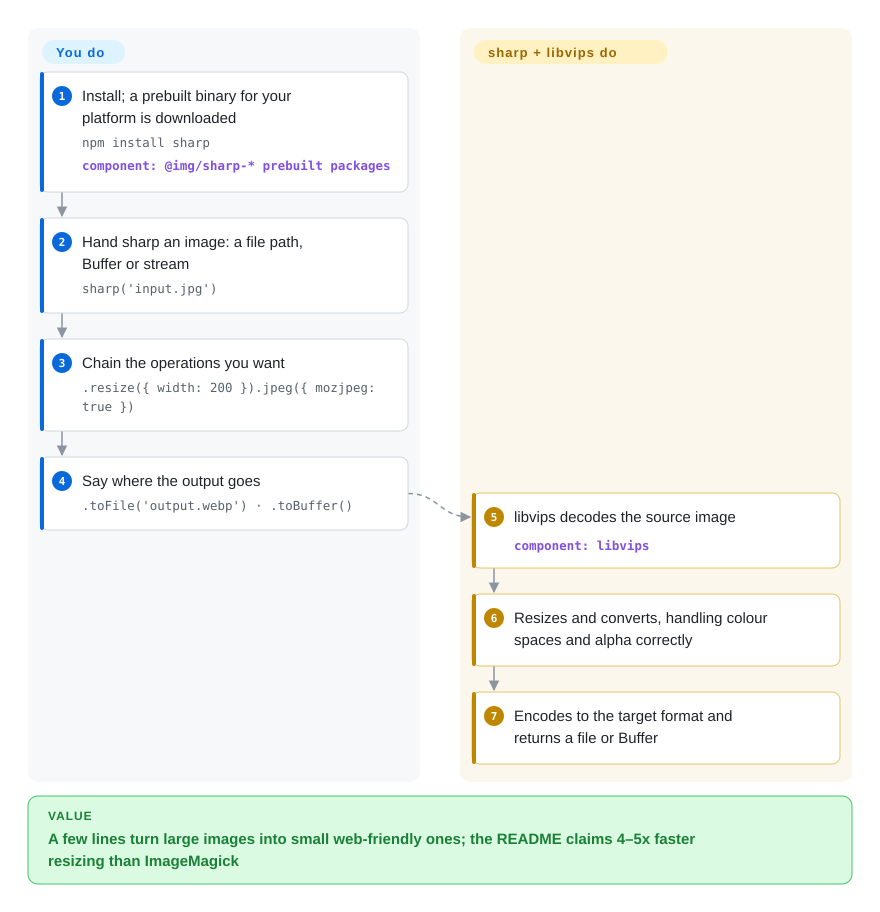

# sharp

Users upload 12-megapixel phone photos and your Node.js app serves them as-is, so a product page pulls 40 MB of JPEGs over a phone connection. sharp resizes and re-encodes them inside your Node process in a few lines of code, using the C library libvips underneath so it stays fast and light on memory.

## When to use

You're a JavaScript/TypeScript developer whose app handles images: an upload handler that must produce a 320-px thumbnail and a 1600-px WebP of every photo, a build step that pre-renders responsive image sets, or an API route that converts on request. Shelling out to ImageMagick from Node means a system package on every host and a process per image; a pure-JavaScript library is easy to install but chews CPU on a 4000×3000 JPEG. With sharp you `npm install sharp`, write `sharp(input).resize({ width: 320 }).webp().toBuffer()`, and the work happens in-process on native code that `npm` downloaded for your platform.

You pick it over [ImageMagick](imagemagick.md) when **speed inside a Node.js service** is the requirement — the README claims 4–5x faster resizing than ImageMagick's quickest settings, and libvips processes images in a streaming, low-memory way — and over pure-JS libraries such as Jimp when CPU time matters more than avoiding a native binary. You give up format breadth: the prebuilt binaries cover JPEG, PNG, Ultra HDR, WebP, AVIF, TIFF, GIF and SVG input, not PDF, PSD, RAW or HEIC.

## How it works

sharp is a Node package; the pixel work is done underneath by the C library **libvips**, which sharp wraps in a chainable JavaScript API through **Node-API** (Node's stable interface for native add-ons, so it also runs on Deno and Bun). `npm install` pulls a prebuilt sharp + libvips binary for your platform from optional `@img/sharp-*` packages, so most macOS / Windows / Linux machines need nothing else installed. Your part is small: hand an image (a file path, a Buffer or a stream) to `sharp()`, chain what you want done (resize, convert format, rotate, composite), and say whether the result goes to a file or a Buffer; decoding, colour-space and alpha handling, resizing and encoding are all sharp's. There is no service and no config — it is a function library, like a darkroom you call with a recipe.

<!-- flow-steps:begin (generated from flows/sharp.json by tools/flow_card.py — do not edit) -->

Text version of the flow

1. **You**: Install; a prebuilt binary for your platform is downloaded — `npm install sharp` — component: `@img/sharp-* prebuilt packages`
2. **You**: Hand sharp an image: a file path, Buffer or stream — `sharp('input.jpg')`
3. **You**: Chain the operations you want — `.resize({ width: 200 }).jpeg({ mozjpeg: true })`
4. **You**: Say where the output goes — `.toFile('output.webp') · .toBuffer()`
5. **sharp**: libvips decodes the source image — component: `libvips`
6. **sharp**: Resizes and converts, handling colour spaces and alpha correctly
7. **sharp**: Encodes to the target format and returns a file or Buffer

**Value**: A few lines turn large images into small web-friendly ones; the README claims 4–5x faster resizing than ImageMagick

<!-- flow-steps:end -->

## When NOT to use

- **Your inputs include HEIC, PDF, PSD or camera RAW.** The prebuilt binaries don't decode them; you'd have to compile a custom global libvips with the extra loaders. For an archive of mixed exotic formats, use [ImageMagick](imagemagick.md); for HEIC on AWS Lambda, the sharp docs point to third-party layers that bundle a custom build.
- **You need to render HTML/CSS (social cards, invoices) to an image.** sharp transforms existing pixels and has no layout engine; use [Screenshot Service](screenshot-service.md) or another headless-browser renderer, then optionally pass its output through sharp.
- **Your runtime can't load native add-ons.** sharp needs a Node-API v9 runtime (Node.js >= 20.9.0, Deno, Bun); a browser or an edge platform without Node-API can't run it. Use Jimp (not indexed), which is pure JavaScript, or check whether the optional `@img/sharp-wasm32` WebAssembly build — which needs multi-threaded Wasm via Workers — fits your platform.
- **You want an image-resizing service shared by several apps.** Rather than wrapping sharp in your own HTTP server, deploy imgproxy (not indexed), a Go server on libvips with signed URLs and checks against decompression bombs.
- **You're stuck on Node.js 18 or rely on removed options.** v0.35.0 (2026-06-10) dropped Node 18 and shipped eight breaking changes (removed `install` script, removed deprecated `failOnError`, renamed `format.jp2k`); the package is still 0.x, so minor bumps can break you. Pin `0.34.x` until you can migrate.

## Comparison

| Alternative | In index | Our verdict | Tradeoff |
|---|---|---|---|
| [ImageMagick](imagemagick.md) | ✅ | For resizing and converting common web formats inside a Node.js service, pick sharp; pick ImageMagick for shell and batch jobs that must open exotic formats (PDF, PSD, RAW) or need operators sharp lacks. | ImageMagick gives 200+ formats, a CLI and a long operator list; it costs a system install, a subprocess per call, slower resizing and a much larger decoder attack surface. |
| libvips | not indexed | When you're not on Node.js — Python (pyvips), Go, Ruby, C or the `vips` CLI — use libvips directly and get the same engine; on Node, sharp is the libvips binding to pick because it ships prebuilt binaries and a friendlier chain API. | Same speed and memory profile with more operations exposed; you install libvips yourself and write against a lower-level API. |
| Jimp | not indexed | When native binaries are forbidden (restricted runtimes, zero-dependency packages), pick Jimp; for any real image volume, pick sharp because native libvips is far faster than JavaScript pixel loops. | Pure JavaScript, MIT, no native install problems; fewer formats, higher CPU and memory per image. |
| imgproxy | not indexed | When several apps need on-the-fly resizing behind URLs, deploy imgproxy; keep sharp when the transform belongs inside your own Node code path or build step. | A ready, hardened service on libvips (URL signing, image-bomb checks); an extra service to run and no in-process API. |
| [Screenshot Service](screenshot-service.md) | ✅ | When the source is HTML/CSS rather than an image, use a headless-browser renderer like Screenshot Service; sharp only takes over once you have pixels. | Browser fidelity for layout and web fonts, at the cost of running Chromium; sharp is far cheaper but cannot lay out a page. |

## Tech stack

- **Languages:** JavaScript API with TypeScript definitions; C++ glue to **libvips** (C) via Node-API.
- **Engine:** libvips (>= 8.18.7 required by v0.35.5), demand-driven and multithreaded; mozjpeg, libspng, libwebp, libheif (AVIF) and other codecs are bundled into the prebuilt libvips.
- **Binaries:** per-platform optional packages (`@img/sharp-<os>-<arch>` + `@img/sharp-libvips-<os>-<arch>`) for macOS, Linux (glibc and musl), Windows and FreeBSD (Wasm); a WebAssembly build for other runtimes.
- **Runtime JS dependencies:** only `@img/colour`, `detect-libc` and `semver`.

## Dependencies

- **Runtime:** Node.js >= 20.9.0 (or Deno/Bun with Node-API v9). On Linux, glibc >= 2.28 or musl >= 1.2.5 for x64/ARM64; x64 also needs an SSE4.2 CPU.
- **System libraries:** none on supported platforms — libvips comes inside the prebuilt package. A globally installed libvips is optional and unsupported on Windows.
- **Build from source:** only for unsupported platforms or custom libvips; needs a C++17 toolchain plus `node-addon-api` and `node-gyp`.

## Ops difficulty

**Low, with three packaging traps.** (1) **Cross-platform installs:** `npm install` picks binaries for the machine it runs on, so a `node_modules` built on macOS won't work in a Linux container or on AWS Lambda; install with `--os/--cpu/--libc` flags or inside the target image, and keep sharp out of webpack/esbuild/vite bundles (the docs give the `externals` config). (2) **Memory on glibc Linux:** the default glibc allocator fragments under long-running multithreaded load, so sharp reduces its own thread concurrency there; the docs recommend jemalloc, or use a musl-based (Alpine) image. (3) **Known conflicts:** loading `canvas` and sharp in the same Windows process, or using sharp inside Electron on Linux, can crash with library symbol clashes.

## Health & viability

- **Maintenance (2026-10): very active.** Releases roughly monthly (v0.35.4 on 2026-08-26, v0.35.5 on 2026-09-27), each preceded by release candidates; libvips upgrades are tracked closely.
- **Governance and bus factor — the risk.** Effectively a single-maintainer project: Lovell Fuller wrote about 83% of the commits and the repo sits under a personal account; the radar grades governance D. The libvips maintainer (kleisauke) contributes, which partly offsets this.
- **Age and Lindy: strong.** Created in 2013 and still actively developed after 13 years; it has survived several Node.js and libvips generations.
- **Adoption: massive.** 415,812,769 npm downloads in the scorer's last-month window and 178,353 dependent repositories, which makes it a default dependency of the Node image-processing ecosystem.
- **Risk flags.** Apache-2.0, no relicensing history. Still 0.x after 13 years, and minor versions carry breaking changes (v0.35.0 had eight); read the changelog before every minor upgrade.

## Caveats (unverified)

- [未验证] The 4–5x resize speed advantage over ImageMagick/GraphicsMagick is the README's own benchmark claim, not measured here.
- [未验证] Which codec libraries are compiled into the prebuilt libvips (mozjpeg, libspng, libheif…) is based on the README's format list and general knowledge of sharp-libvips, not a manifest read this pass.
- [推断] "Edge platforms without Node-API can't run it" is inferred from the Node-API v9 requirement; specific edge platforms were not tested.
- [未验证] Jimp's performance and format coverage relative to sharp were not benchmarked this pass.
