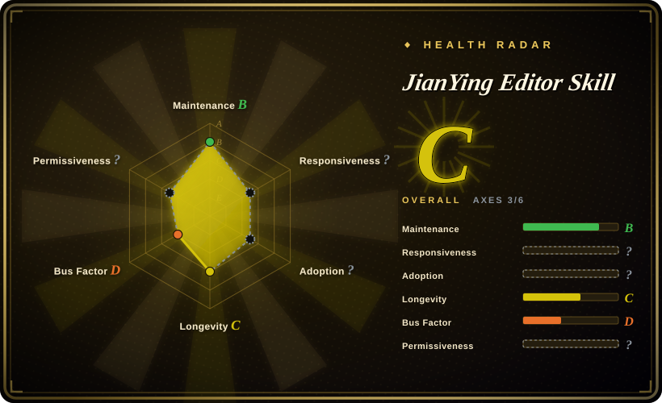
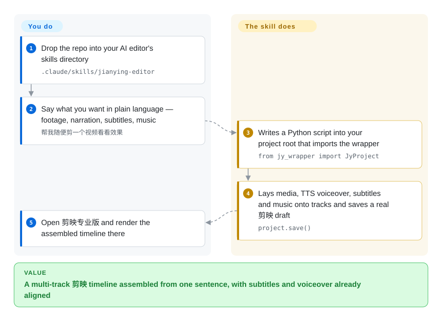

# Jianying Editor Skill

An agent skill plus Python automation layer that builds desktop 剪映 Pro (CapCut CN) timelines from natural language — importing B-roll, generating voiceovers and captions, applying effects, and (on Windows only) driving the export UI — on top of a vendored, extended copy of pyJianYingDraft.

## When to use

You cut Chinese short-form video for Douyin / Xiaohongshu / WeChat Channels, your finishing tool is desktop 剪映 Pro, and the tedious part is not the creative call — it is assembling the timeline: dropping a folder of clips in order, writing narration, splitting captions line by line, finding a BGM from 剪映's own library, then applying the same three transitions again. You already run Claude Code / Cursor / Trae / Antigravity, and you want to describe the video in one paragraph and get an editable 剪映 project out.

Reach for this skill rather than the library it is built on ([pyJianYingDraft](pyjianyingdraft.md)) when what you lack is the *procedure*, not the file-writing: it ships `SKILL.md` plus `rules/` and `examples/` so the agent knows which API to reach for (tracks, keyframes, effects, TTS, web-capture) and in what order, and it adds the production conveniences pyJianYingDraft leaves to you — one-call narration-with-captions (`add_narrated_subtitles`), a mined `data/cloud_music_library.csv` of 剪映 cloud tracks you have used before, Playwright-based "web animation → video clip" capture, screen recording with automatic smart zoom, and a movie-commentary builder. The deciding tradeoff against [Jianying Headless](jianying-headless.md): that project buys current-version drafts and export through the app's own engine on macOS at the price of one pinned build and a non-commercial licence, while this one is MIT, cross-platform for drafting, and gets its MP4 by clicking the UI on an old Windows install — or by your hands on macOS.

## How it works

The skill is a Python library (`JyProject`, provided by the vendored and extended `pyJianYingDraft`) wrapped in an agent playbook. When you ask for a video, the agent finds your 剪映 draft folder, creates a project, and assembles tracks by calling that API — media import, text/subtitle segments, audio, keyframes, filters/effects/transitions, compound clips — which ultimately writes the draft's `draft_info.json` into the folder. Nothing is rendered by the skill: 剪映 itself is still the renderer, so the deliverable is an editable project, and you have to restart the app for the new draft to appear in the list. Two mechanisms sit beside that core: the TTS/ASR path (`add_narrated_subtitles` turns a script into voiceover segments, then aligns generated subtitles to them, using either 剪映's native voices or Microsoft voices via `edge-tts`), and the export path, which is Windows-only UI automation that clicks 剪映's own export controls. What stays your job: installing the Python side once, telling the agent what the video is about, restarting 剪映, and — on macOS — pressing export yourself.

<!-- flow-steps:begin (generated from flows/jianying-editor-skill.json by tools/flow_card.py — do not edit) -->

Text version of the flow

1. **You**: Clone the skill into the folder your agent loads skills from — `git clone <repo> .claude/skills/jianying-editor`
2. **You**: Install the Python side once, including the browser for web capture — `pip install -r requirements.txt · playwright install chromium`
3. **You**: Describe the video in plain language — footage folder, style, title
4. **Jianying Editor Skill**: Finds the 剪映 draft folder and writes a draft with tracks, captions and voiceover aligned
5. **You**: Restart 剪映 so the new draft appears in the project list
6. **Jianying Editor Skill**: On Windows with 剪映 5.9 or older it also clicks through the export UI

**Value**: A 剪映 timeline assembled from one sentence, which you can keep editing by hand in the app

<!-- flow-steps:end -->

## When NOT to use

- **You cut in CapCut (international) or on mobile.** The README states plainly that only the Chinese desktop 剪映 Pro is adapted; CapCut intl. and the mobile app are unsupported. For CapCut drafts there is no maintained permissive route — the pyCapCut variant carries no licence file and has not been committed to since 2025-09-12 (see [pyJianYingDraft](pyjianyingdraft.md)), so treat international CapCut as manually edited for now.
- **You need the finished MP4 without a human.** Auto-export is Windows-only and documented as most reliable on 剪映 **5.9 or older**; on macOS you generate the draft and export by hand. When nobody should touch the app at all — or the deliverable is just a file — render with [MoviePy](../video-audio/moviepy.md) or [FFmpeg](../video-audio/ffmpeg.md) instead.
- **You are on macOS and want native export.** Use [Jianying Headless](jianying-headless.md), which drives 剪映's own engine headlessly on a pinned build, at the cost of macOS 26, a compiled bridge and a non-commercial licence.
- **Your 剪映 updates itself.** The open-issue list already includes a report that automatic 剪映 updates cannot be blocked, and a PR fixing "seven defects that silently produced wrong finished videos". Fingerprint the exact editor build on your render host, or don't automate the last mile: prefer [pyJianYingDraft](pyjianyingdraft.md), whose version matrix is at least documented, and verify output before publishing.
- **You need a tested, auditable pipeline.** The changelog claims "full test coverage and regression verification", but the repository's test suite is a single file (`tests/test_wrapper.py`, 19 test functions) and CI lints a hand-picked script whitelist — the coverage is far thinner than that wording suggests. For a library with an actual pytest suite, use [pyJianYingDraft](pyjianyingdraft.md).
- **Your team cannot read Chinese.** `SKILL.md`, `rules/`, `usage.md` and most docs are Chinese-only, so an agent that must justify each step to English-speaking reviewers is working from untranslated instructions.
- **You want an open-source editor instead of depending on 剪映 at all.** Use [Concat](../video-editing/concat.md): it renders its own timeline with bundled FFmpeg, where this project can only write drafts *into* a proprietary app.

## Comparison

| Alternative | In index | Our verdict | Tradeoff |
| --- | --- | --- | --- |
| [pyJianYingDraft](pyjianyingdraft.md) | ✅ | Pick pyJianYingDraft when you are writing the pipeline yourself and want a maintained, Apache-2.0, pytest-covered library plus its version matrix; pick this skill when you want the agent-facing procedure layer on top — narration+captions in one call, cloud-music mining, web-capture and recording — accepting that the vendored copy is a fork maintained by one other person. | pyJianYingDraft: narrower, upstream, permissively licensed, documented version support. This skill: broader feature surface and agent playbook, with a forked core and a thin test suite. |
| [Jianying Headless](jianying-headless.md) | ✅ | Pick Jianying Headless when the MP4 must come out of 剪映's own engine on macOS and the licence terms are acceptable; pick this skill when drafting must run on Windows/macOS CI-style machines and you want MIT terms, because Jianying Headless pins one 剪映 build behind a compiled bridge and forbids commercial use. | Jianying Headless: native headless export, macOS 26 + pinned build, non-commercial. This skill: permissive and cross-platform for drafting, Windows-only for export. |
| [video-shotcraft](../../video-production/video-shotcraft.md) | ✅ | Pick video-shotcraft when the film should be composed in Remotion code and only handed to 剪映 for finishing; pick this skill when the timeline itself should be built inside 剪映 and stay hand-editable there, because the two meet at the draft file while starting from opposite ends. | video-shotcraft: code-first Remotion with an export into 剪映; this skill: 剪映-first authoring with no code-rendering step of its own. |
| 剪映专业版 / CapCut (closed app) | 未收录 | When the edit is a one-off, use 剪映 by hand — it is free, vendor-maintained and every effect is available; pick this skill when the same structure must be produced repeatedly or by an agent, because the app itself exposes no scriptable authoring surface. | The app: polish and full effect coverage, zero automation. This skill: reversible, reproducible drafting, coupled to one app's draft format and version. |
| [Concat](../video-editing/concat.md) | ✅ | Pick Concat when you want an open-source editor whose whole timeline you can script and render without a proprietary app; pick this skill when the team lives in 剪映 and only the assembly needs automating, because Concat replaces the editor while this writes into one. | Concat: AGPL, self-contained renderer, immature beta; this skill: MIT, mature effect ecosystem inherited from 剪映, version-coupled and Windows-limited for export. |

## Tech stack

- Python 3.12 (82 `.py` files), exposing `JyProject` as the editing API and `scripts/` CLIs (`draft_inspector.py`, `asset_search.py`, `universal_tts.py`, `auto_exporter.py`, `build_cloud_music_library.py`, `movie_commentary_builder.py`, …).
- Draft writing is delegated to a vendored, extended copy of pyJianYingDraft under `scripts/vendor/pyJianYingDraft/` (Apache-2.0), upgraded for 剪映 Pro 5.9+/6.x `draft_info.json`, plus draft self-containment and `ffprobe` fallbacks.
- Media/voice: `edge-tts` for TTS, `opencv-python` / `numpy` / `imageio` / `pymediainfo` for media analysis, `playwright` (Chromium) for web-animation capture, `pynput` / `uiautomation` for recording and Windows UI automation, `websockets` / `psutil` / `requests` for tooling.
- Agent surface: `SKILL.md` + `rules/*.md` + `prompts/` + `examples/` + a draft-inspector CLI, installable into Claude Code, Cursor, Trae, Antigravity or a generic `skills/` directory.
- CI: `.github/workflows/ci.yml` on `windows-latest` — `ruff` over a whitelisted script list, `python -m unittest` in `tests/`, `black --check`.

## Dependencies

- Python 3.12 plus `requirements.txt` (`uiautomation`, `playwright`, `pynput`, `edge-tts`, `pymediainfo`, `opencv-python`, `numpy`, `imageio`, `psutil`, `requests`, `websockets`), and `playwright install chromium` for the web-capture feature.
- A desktop install of **剪映专业版 (JianyingPro)** and its draft folder: `%LOCALAPPDATA%/JianyingPro/User Data/Projects/com.lveditor.draft` on Windows, `~/Movies/JianyingPro/User Data/Projects/com.lveditor.draft` on macOS (auto-detected, else you tell the agent).
- `ffprobe` (or `pymediainfo`) for media metadata; a display for the recording/smart-zoom and Windows export features.
- **Auto-export:** Windows with 剪映 **5.9 or older**, and a machine you are not using while it runs (it drives the mouse).
- No server, database, GPU or cloud account; repo is ~25 MB.

## Ops difficulty

**Medium.** Installation is scriptable (clone into the harness's skills directory, `pip install -r requirements.txt`) and there is no service to run, but three things make it heavier than a library: it depends on a **proprietary desktop app whose draft format moves with each release**, the only unattended path (export) is **Windows + an old 剪映 build** plus a machine the automation can drive, and drafts only appear after 剪映 re-reads its project list, so a "generate then verify" loop cannot be fully headless on macOS. Operationally you should pin the editor version on the render host, keep the skill's own `VERSION` recorded, and re-run one golden project after any 剪映 update — because silent wrong output, not a crash, is the documented failure mode.

## Health & viability

- **Maintenance (radar B, 2026-09-21):** active but young. Created 2026-01-24, 116 commits, last push 2026-09-11, version `v1.7` recorded in a `VERSION` file with no GitHub releases or tags; changelog entries land roughly monthly (v1.2 Jan → v1.7 Sep). First-response time on the recent qualifying issues sits around three weeks (radar B).
- **Governance / bus factor (radar D):** essentially one person — `luoluoluo22` holds 98.3% of commits across 3 contributors, the other two contributing one commit each (the macOS-compat and media-loss fixes). No organisation, foundation or commercial entity owns the roadmap. [推断]
- **Backing & Lindy (radar C):** ~8 months old with 3.3k stars / 445 forks — attention, not yet a track record. The Lindy prior is unfavourable; the counterweight is that it is built on a two-year-old, still-released upstream ([pyJianYingDraft](pyjianyingdraft.md)) whose draft model it inherits.
- **Adoption & ecosystem (radar E):** the star/fork ratio suggests real use among Chinese-language creators (a Bilibili walkthrough and a Netlify FAQ site are linked from the README); issue traffic is small (26 issues lifetime, 3 of them pull requests), so external contribution is thin. The axis scores E for a structural reason — a skill installed by `git clone` has no package registry to measure.
- **Risk flags (radar ?):** MIT declared for the project while the core draft layer is a vendored Apache-2.0 fork — the attribution obligation is stated in `LICENSE`, but GitHub reads the licence as **NOASSERTION**, so automated licence scanners cannot confirm MIT (hence the unscored axis); the recommended Windows one-liner pipes a URL shortener (`is.gd`) straight into PowerShell, a supply-chain shape worth avoiding; and the project's own changelog overstates test coverage relative to the single test module in the tree.

## Caveats (unverified)

- [未验证] Nothing here was executed: the feature set, platform matrix and API names come from the README, `SKILL.md`, `requirements.txt`, `pyproject.toml`, the CI workflow and the changelog, read 2026-09-21.
- [未验证] Platform behaviour (draft generation on macOS, auto-export on Windows with 剪映 ≤5.9, smart zoom, web-capture) is author-reported and was not reproduced; it needs a licensed 剪映 install and a Windows host.
- [未验证] Star / fork / commit / issue counts are point-in-time GitHub API values (2026-09-21).
- [未验证] GitHub's licence API reports **NOASSERTION** for this repo (the `LICENSE` file adds a third-party notice on top of MIT); the MIT reading comes from the file itself, not from an automated scanner.
- [推断] "19 test functions in one module" is a count of `def test_` occurrences in `tests/test_wrapper.py`; what those tests actually assert was not reviewed line by line, only the file inventory.
- [未验证] Whether the vendored pyJianYingDraft fork tracks upstream fixes was not compared commit by commit — only the divergence described in the changelog (5.9+/6.x draft architecture, self-containment, macOS sandbox).
- [推断] The `irm is.gd/... | iex` install line is flagged as a supply-chain smell because the fetched content is not auditable from the README; it is not evidence of malicious content.
- [未验证] Generated drafts were not opened in 剪映, so "editable timeline" and the claimed cloud-music/effect lookups were not verified end to end.
