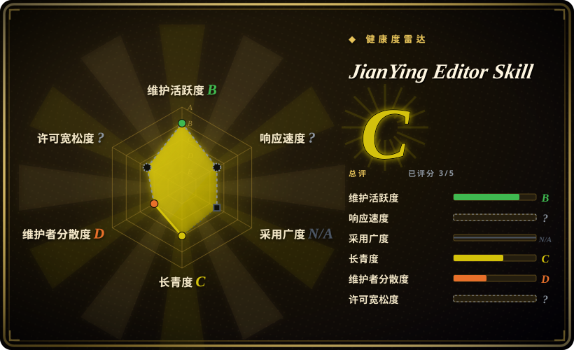
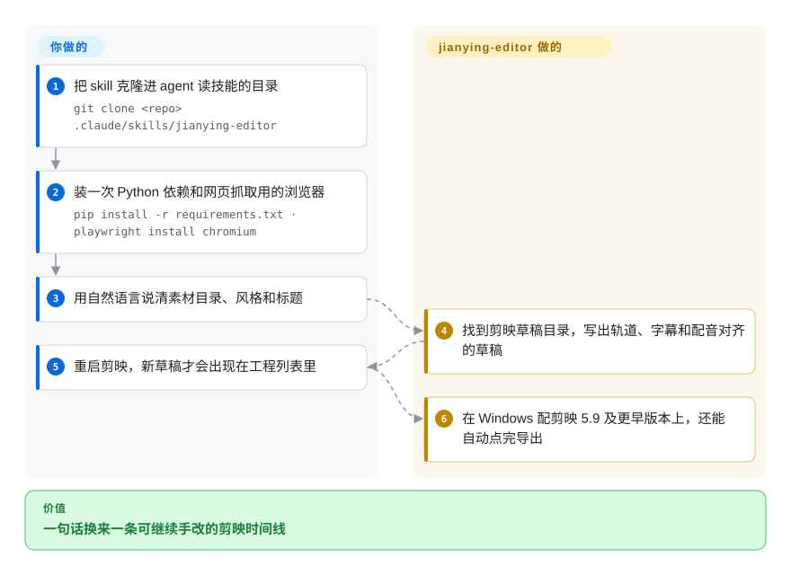

# Jianying Editor Skill

一个 agent skill 加 Python 自动化层：用自然语言把桌面版剪映专业版的时间线搭起来——导入 B-roll、生成配音与字幕、套特效，Windows 上还能自动点导出；底层是内嵌并二次开发的 pyJianYingDraft。

## 何时使用

你做的是国内短视频（抖音 / 小红书 / 视频号），收尾工具就是桌面版剪映专业版，而最耗时的不是创意判断，而是搭时间线：把一个文件夹的素材按顺序丢进去、写旁白、一句一句对字幕、从剪映曲库里挑 BGM、再把同样那三个转场套一遍。你已经在用 Claude Code / Cursor / Trae / Antigravity，希望用一段话描述要什么视频，直接得到一份可编辑的剪映工程。

如果缺的不是「怎么写草稿文件」而是**整套流程**，就该选这个 skill 而不是它依赖的库（[pyJianYingDraft](pyjianyingdraft.zh.md)）：它带 `SKILL.md` 加 `rules/`、`examples/`，让 agent 知道该调哪个 API（轨道、关键帧、特效、TTS、网页捕获）以及按什么顺序调；同时补上了 pyJianYingDraft 留给你的工程化便利——一次调用完成「配音 + 字幕对齐」（`add_narrated_subtitles`）、从历史工程挖出来的 `data/cloud_music_library.csv` 剪映云端曲库、基于 Playwright 的「网页动效录成视频素材」、录屏加自动智能变焦，以及影视解说生成器。和 [Jianying Headless](jianying-headless.zh.md) 相比的决定性取舍：那个项目用「锁定一个剪映版本 + 非商用许可」换来新版草稿能力与 macOS 上走剪映自家引擎的导出；这个项目是 MIT，生成草稿跨平台，导出则靠旧版 Windows 剪映的界面点击——或者在 macOS 上由你自己按导出。

## 怎么用起来

这个 skill 本质是一个 Python 库（`JyProject`，由内嵌并二次开发的 `pyJianYingDraft` 提供）外加一份给 agent 看的操作手册。你提出需求后，agent 找到你的剪映草稿目录、建工程，然后通过这套 API 组装轨道——导入素材、文字/字幕片段、音频、关键帧、滤镜特效转场、复合片段——最终把草稿的 `draft_info.json` 写进目录。skill 自己不渲染：渲染仍然由剪映完成，所以交付物是一份可编辑工程，而且必须重启剪映，新草稿才会出现在工程列表里。核心之外还有两条机制：配音/字幕链路（`add_narrated_subtitles` 把文案变成语音片段，再把生成的字幕与语音对齐，音色可用剪映原生或 `edge-tts` 的微软音色），以及导出链路，也就是仅限 Windows 的界面自动化点击剪映自带的导出按钮。你自己要做的：装一次 Python 依赖、告诉 agent 这条片子在讲什么、重启剪映，以及在 macOS 上亲手点导出。

<!-- flow-steps:begin (generated from flows/jianying-editor-skill.json by tools/flow_card.py — do not edit) -->

流程文字版

1. **你**：把 skill 克隆进 agent 读技能的目录 — `git clone <repo> .claude/skills/jianying-editor`
2. **你**：装一次 Python 依赖和网页抓取用的浏览器 — `pip install -r requirements.txt · playwright install chromium`
3. **你**：用自然语言说清素材目录、风格和标题
4. **Jianying Editor Skill**：找到剪映草稿目录，写出轨道、字幕和配音对齐的草稿
5. **你**：重启剪映，新草稿才会出现在工程列表里
6. **Jianying Editor Skill**：在 Windows 配剪映 5.9 及更早版本上，还能自动点完导出

**价值**：一句话换来一条可继续手改的剪映时间线

<!-- flow-steps:end -->

## 何时不用

- **你剪的是 CapCut 国际版或手机端。** README 写得很清楚：只适配国内版桌面剪映专业版，CapCut 国际版与手机端都不支持。国际版 CapCut 目前没有仍在维护的宽松许可路线——pyCapCut 那个变体连许可文件都没有，且自 2025-09-12 起没有提交（见 [pyJianYingDraft](pyjianyingdraft.zh.md)），所以先按「国际版只能手动剪」来规划。
- **你要的是不需要人参与就出 MP4。** 自动导出仅限 Windows，而且文档说明在剪映 **5.9 及更早版本**上最稳；macOS 上只能生成草稿后手动导出。完全不该有人碰剪映、或者交付物只是文件时，改用 [MoviePy](../video-audio/editing-and-cutting/moviepy.zh.md) 或 [FFmpeg](../video-audio/transcoding-and-pipelines/ffmpeg.zh.md) 渲染。
- **你在 macOS 上想要原生导出。** 用 [Jianying Headless](jianying-headless.zh.md)：它在锁定的剪映版本上无头驱动剪映自家引擎，代价是 macOS 26、要编译的桥接层与非商用许可。
- **你的剪映会自己更新。** 未关 issue 里已经有「无法阻止剪映自动更新」的报告，还有一个修复「七处静默产出错误成片」的 PR。请给渲染机上的剪映版本打指纹；或者干脆别自动化最后一公里：优先用 [pyJianYingDraft](pyjianyingdraft.zh.md)，至少它的版本支持矩阵写在文档里，并且发布前人工确认产出。
- **你需要一条经过测试、可审计的管线。** 更新日志写着「完善全套测试覆盖与回归验证」，但仓里的测试只有 `tests/test_wrapper.py` 一个文件（19 个测试函数），CI 也只对一份手写白名单脚本跑 lint——覆盖度远低于那句措辞给人的印象。要有真实 pytest 套件的库，用 [pyJianYingDraft](pyjianyingdraft.zh.md)。
- **团队读不了中文。** `SKILL.md`、`rules/`、`usage.md` 与多数文档都是中文，需要向英文评审逐步解释流程的 agent 只能从没翻译的说明里工作。
- **你想要的是一条不依赖剪映的开源路线。** 用 [Concat](../video-editing/concat.zh.md)：它用自带 FFmpeg 渲染自己的时间线，而本项目只能往一个专有应用里写草稿。

## 横向对比

| 替代品 | 是否收录 | 我们的评价 | 取舍 |
| --- | --- | --- | --- |
| [pyJianYingDraft](pyjianyingdraft.zh.md) | ✅ | 如果你自己写管线、要一个仍在维护、Apache-2.0、带 pytest 套件和版本矩阵的库，选 pyJianYingDraft；如果你要的是它上面那层面向 agent 的流程层——一次调用出配音加字幕、曲库挖掘、网页捕获、录屏，选本 skill，代价是内嵌的是一个由另一个人维护的分叉。 | pyJianYingDraft：更窄、上游、宽松许可、版本支持有文档。本 skill：功能面更宽、有 agent playbook，但核心是分叉、测试很薄。 |
| [Jianying Headless](jianying-headless.zh.md) | ✅ | 如果 MP4 必须由 macOS 上剪映自家引擎产出、且能接受许可条件，选 Jianying Headless；如果草稿生成要跑在 Windows/macOS 的机器上、并且要 MIT 条款，选本 skill，因为 Jianying Headless 把某个剪映版本锁在编译桥接层后面，且禁止商用。 | Jianying Headless：原生无头导出，macOS 26 加版本锁定，非商用。本 skill：生成草稿宽松许可且跨平台，导出仅限 Windows。 |
| [video-shotcraft](../../video-production/video-shotcraft.zh.md) | ✅ | 如果片子该先用 Remotion 代码做成，再交给剪映收尾，选 video-shotcraft；如果时间线本身就该在剪映里搭好并保持手改，选本 skill，因为两者在草稿文件处相遇，但出发方向相反。 | video-shotcraft：代码优先的 Remotion，再导出到剪映；本 skill：剪映优先，自己没有代码渲染环节。 |
| 剪映专业版 / CapCut（闭源应用） | 未收录 | 如果只剪一次，就手改剪映——免费、厂商维护、特效齐全；如果同一套结构要被重复产出或由 agent 产出，选本 skill，因为剪映本身不提供可脚本化的创作接口。 | 剪映：打磨成熟、特效全覆盖、零自动化。本 skill：可回滚、可复现的草稿生成，但绑定一个应用的草稿格式与版本。 |
| [Concat](../video-editing/concat.zh.md) | ✅ | 如果你要的是整条时间线都能脚本化、且渲染不依赖专有应用的开源编辑器，选 Concat；如果团队就活在剪映里、只需要自动化组装环节，选本 skill，因为 Concat 是替换编辑器，而本 skill 是写进编辑器。 | Concat：AGPL、自带渲染器、还是 beta；本 skill：MIT、继承剪映成熟特效生态，但版本耦合、导出限 Windows。 |

## 技术栈

- Python 3.12（82 个 `.py` 文件），核心 API 是 `JyProject`，另有 `scripts/` 下的 CLI（`draft_inspector.py`、`asset_search.py`、`universal_tts.py`、`auto_exporter.py`、`build_cloud_music_library.py`、`movie_commentary_builder.py` 等）。
- 草稿写出交给 `scripts/vendor/pyJianYingDraft/` 里内嵌并扩展过的 pyJianYingDraft（Apache-2.0），升级支持剪映 Pro 5.9+/6.x 的 `draft_info.json`，并加上草稿素材自包含与 `ffprobe` 回退。
- 媒体与语音：`edge-tts` 做语音合成，`opencv-python` / `numpy` / `imageio` / `pymediainfo` 做媒体分析，`playwright`（Chromium）做网页动效捕获，`pynput` / `uiautomation` 做录屏与 Windows 界面自动化，`websockets` / `psutil` / `requests` 做工具链。
- Agent 接口层：`SKILL.md` + `rules/*.md` + `prompts/` + `examples/` + 一个草稿检查 CLI，可装进 Claude Code、Cursor、Trae、Antigravity 或通用 `skills/` 目录。
- CI：`.github/workflows/ci.yml` 跑在 `windows-latest`——`ruff` 只检查白名单脚本，`tests/` 下 `python -m unittest`，外加 `black --check`。

## 依赖

- Python 3.12 加 `requirements.txt`（`uiautomation`、`playwright`、`pynput`、`edge-tts`、`pymediainfo`、`opencv-python`、`numpy`、`imageio`、`psutil`、`requests`、`websockets`），网页捕获功能还需要 `playwright install chromium`。
- 一份桌面版**剪映专业版（JianyingPro）**及其草稿目录：Windows 是 `%LOCALAPPDATA%/JianyingPro/User Data/Projects/com.lveditor.draft`，macOS 是 `~/Movies/JianyingPro/User Data/Projects/com.lveditor.draft`（会自动探测，探测失败就由你告诉 agent）。
- `ffprobe`（或 `pymediainfo`）读媒体元信息；录屏/智能变焦与 Windows 导出还需要可用的显示器。
- **自动导出：** Windows 加剪映 **5.9 及更早版本**，并且运行时你不能用这台机器（会抢占鼠标）。
- 不需要服务器、数据库、GPU 或云账号；仓库约 25 MB。

## 运维难度

**中等。** 安装本身可脚本化（克隆进 harness 的技能目录、`pip install -r requirements.txt`），也没有要跑的服务，但有三件事让它比普通库更重：它依赖一个**草稿格式随版本变化的专有桌面应用**；唯一无人值守的环节（导出）需要 **Windows 加旧版剪映**，还要一台能被自动化接管的机器；草稿必须等剪映重新读一遍工程列表才出现，所以「生成后校验」在 macOS 上无法完全无头完成。运维上应当：给渲染机上的剪映版本打指纹、记录 skill 自身的 `VERSION`，并在任何一次剪映更新后重跑一个黄金工程——因为文档记录的失败模式是**静默产出错误成片**，而不是崩溃。

## 健康度与可持续性

- **维护（雷达 B，2026-09-21）：** 活跃但年轻。创建于 2026-01-24，116 次提交，最后推送 2026-09-11，版本写在 `VERSION` 文件里（v1.7），GitHub 上没有任何 release 或 tag；更新日志大约按月推进（v1.2 一月 → v1.7 九月）。近期合格 issue 的首次响应大约在三周量级（雷达 B）。
- **治理 / bus factor（雷达 D）：** 基本是一个人——3 位贡献者里 `luoluoluo22` 占 98.3% 的提交，另外两位各提交 1 次（macOS 兼容与媒体丢失修复）。路线图背后没有组织、基金会或商业实体。[推断]
- **背书与 Lindy（雷达 C）：** 8 个月大、3.3k stars / 445 forks——是注意力，还谈不上履历，Lindy 先验不利；对冲因素是它建在一个已两年、仍在发版的 upstream（[pyJianYingDraft](pyjianyingdraft.zh.md)）之上，草稿模型继承自那边。
- **采用与生态（雷达 E）：** star 与 fork 的比例说明中文创作者里确实有人在用（README 链了 B 站介绍视频与 Netlify FAQ 站）；issue 流量很小（累计 26 个 issue，其中 3 个是 PR），外部贡献很薄。这个轴是 E 属于结构性原因——用 `git clone` 安装的 skill 没有包注册表可测。
- **风险信号（雷达 ?）：** 项目声明 MIT，但核心草稿层是内嵌的 Apache-2.0 分叉，`LICENSE` 里写明了保留署名的义务，而 GitHub 读到的许可是 **NOASSERTION**，自动化许可扫描无法确认 MIT（所以这个轴未评分）；推荐的 Windows 一键安装把短链（`is.gd`）直接管进 PowerShell，这种供应链形态值得避开；另外更新日志对测试覆盖的描述高于仓里实际的测试体量。

## 存疑（未验证）

- [未验证] 本页没有实际执行任何流程：功能、平台矩阵与 API 名称来自 2026-09-21 读到的 README、`SKILL.md`、`requirements.txt`、`pyproject.toml`、CI 工作流与更新日志。
- [未验证] 平台行为（macOS 草稿生成、Windows 剪映 ≤5.9 自动导出、智能变焦、网页捕获）均为作者自述，未复现；需要一份已安装的剪映和一台 Windows 主机。
- [未验证] star / fork / 提交 / issue 数是 2026-09-21 的 GitHub API 时点值。
- [未验证] GitHub 的许可 API 把这个仓读成 **NOASSERTION**（`LICENSE` 在 MIT 之上追加了第三方声明）；MIT 的判断来自文件本身，不是自动化扫描结果。
- [推断]「一个模块里 19 个测试函数」是按 `tests/test_wrapper.py` 中 `def test_` 出现次数统计的；这些测试具体断言了什么没有逐行审阅，只看清了文件清单。
- [未验证] 内嵌的 pyJianYingDraft 分叉是否跟随上游修复，没有逐提交对比——只按更新日志里描述的分歧（5.9+/6.x 草稿架构、素材自包含、macOS 沙盒）判断。
- [推断] 把 `irm is.gd/... | iex` 标为供应链气味，是因为从 README 无法审计它拉取的脚本内容；这不是「有恶意内容」的证据。
- [未验证] 生成的草稿没有在剪映里打开过，所以「可编辑时间线」以及曲库/特效检索的说法没有端到端验证。
