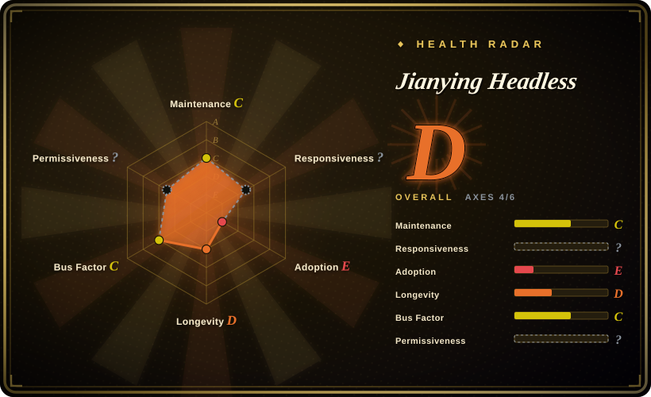
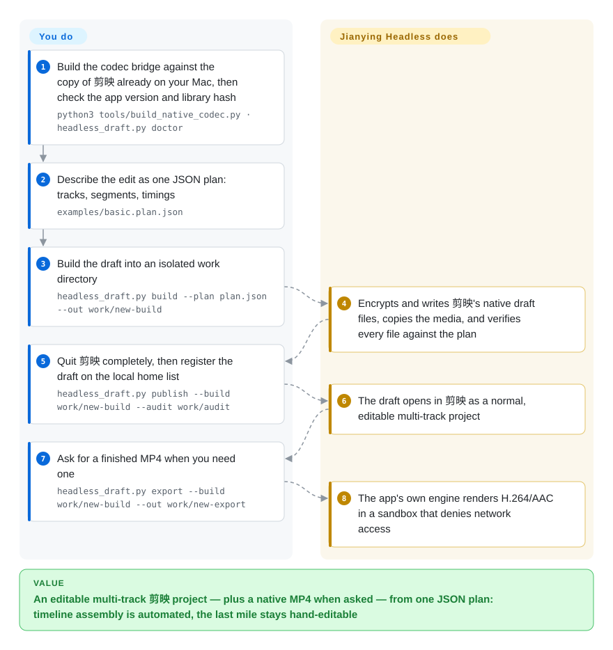

# Jianying Headless

A macOS-only CLI plus agent skill that compiles a JSON edit plan into an **editable multi-track 剪映专业版 / Jianying (CapCut's Chinese sibling) draft** and can render it with Jianying's own engine — a bridge to one pinned app build, not an official SDK, under a non-commercial license.

## When to use

You already cut in 剪映专业版, and the edit is not the bottleneck — producing the *editable project* is. A generated montage lands as a flattened MP4 you would have to re-cut from scratch, or an agent has just produced a timing structure (scenes, narration, captions) that a human still has to keep polishing in a real timeline. You want the agent to hand over 剪映 tracks, not a render.

You reach for Jianying Headless because it writes the editor's native, encrypted draft format and can render through the editor's own engine, so the last mile stays hand-editable and its fonts, masks and transitions match what 剪映 itself produces. The price is on the label: Apple Silicon + macOS 26, one exact 剪映 build whose library hash matches, a per-machine compiled bridge pinned to one codec hash, and personal-use-only terms. Pick [Concat](../video-editing/concat.md) instead when you need a cross-platform, freely licensed editor, and [MoneyPrinterTurbo](../../video-production/moneyprinter-turbo.md) when the deliverable is a finished short that nobody will re-cut.

## How it works

You describe the edit once, as a JSON plan of tracks and segments — source paths, microsecond timings, speed, volume, text. The project compiles that plan into the files 剪映 expects, encrypting the timeline and metadata with the app's *own* cryptography, reached through a small C++ bridge that is compiled on your machine against the `libvideoeditor.dylib` already inside your installed app (it is never downloaded and never patched). Registering the draft on 剪映's home list, and exporting an MP4, go through that same private library in a separate helper process, and the export helper runs under a macOS sandbox that denies network access and writes outside the job directory. The split of work is the point: you supply the plan, close the editor when asked, and do the final human review; it builds, verifies, registers, and — only if asked — renders, and it refuses to run at all when the installed app version or library hash is not one the maintainer has reviewed.

<!-- flow-steps:begin (generated from flows/jianying-headless.json by tools/flow_card.py — do not edit) -->

Text version of the flow

1. **You**: Build the codec bridge against the copy of 剪映 already on your Mac, then check the app version and library hash — `python3 tools/build_native_codec.py · headless_draft.py doctor`
2. **You**: Describe the edit as one JSON plan: tracks, segments, timings — `examples/basic.plan.json`
3. **You**: Build the draft into an isolated work directory — `headless_draft.py build --plan plan.json --out work/new-build`
4. **Jianying Headless**: Encrypts and writes 剪映's native draft files, copies the media, and verifies every file against the plan
5. **You**: Quit 剪映 completely, then register the draft on the local home list — `headless_draft.py publish --build work/new-build --audit work/audit`
6. **Jianying Headless**: The draft opens in 剪映 as a normal, editable multi-track project
7. **You**: Ask for a finished MP4 when you need one — `headless_draft.py export --build work/new-build --out work/new-export`
8. **Jianying Headless**: The app's own engine renders H.264/AAC in a sandbox that denies network access

**Value**: An editable multi-track 剪映 project — plus a native MP4 when asked — from one JSON plan: timeline assembly is automated, the last mile stays hand-editable

<!-- flow-steps:end -->

## When NOT to use

- **You are not on an Apple Silicon Mac running macOS 26**, or you cannot install the exact 剪映 build. Use [Concat](../video-editing/concat.md) or an FFmpeg/OTIO assembly route, because the bridge links the app's own arm64 library and pins its hash, the compiler/SDK/linker, and the signing identity.
- **Any commercial use** — client delivery, an internal company tool, a paid product or a SaaS. The license permits personal, non-commercial use only and needs written authorization otherwise; pick [MoneyPrinterTurbo](../../video-production/moneyprinter-turbo.md) (MIT) or [HyperFrames](../../video-production/hyperframes.md) (Apache-2.0).
- **You want a finished video from a topic, not an editable project.** Use [MoneyPrinterTurbo](../../video-production/moneyprinter-turbo.md) or [Hypit](../../video-production/hypit.md); here the draft *is* the product, and a single polished video is cheaper to cut by hand in 剪映.
- **You let 剪映 auto-update, or you must support several versions.** The export path depends on per-build function offsets, structure layouts and engine log strings; an unreviewed build is refused rather than attempted. Prefer a tool with no proprietary-ABI dependency.
- **You need unattended server-side batch on a Linux fleet.** There is no server component and no headless app — this is a desktop macOS integration that asks you to quit 剪映 before registering a draft. See [MoneyPrinterTurbo](../../video-production/moneyprinter-turbo.md).
- **You only need to write draft files and cannot install the app.** pyJianYingDraft writes 剪映/CapCut draft structures from Python and you open them in the editor yourself (`未收录` here, see Comparison).
- **You need online templates, cloud drafts, account entitlements, or paid effect caches.** Out of scope by design; plans referencing retired effects are rejected rather than silently downgraded.
- **Compound clips, or strict frame counts on image/GIF timelines.** Nested clips are experimental (offline build and frozen-snapshot export only), and an intermittent missing-frame bug on image/GIF material is open — the frame check refuses such output rather than shipping it.

## Comparison

| Alternative | In index | Our verdict | Tradeoff |
| --- | --- | --- | --- |
| [Hypit](../../video-production/hypit.md) | ✅ | When the source of truth is "clone this viral video into variants", pick Hypit; pick Jianying Headless when the deliverable must be a timeline a human keeps editing in 剪映, because Hypit's output is a rendered video plus its SVML workflow, not a 剪映 project. | Hypit is cross-platform and agent-first but renders through its own Chromium/FFmpeg stack and bills generation fees; Jianying Headless inherits 剪映's rendering ecosystem but only on one macOS build. |
| [MoneyPrinterTurbo](../../video-production/moneyprinter-turbo.md) | ✅ | When you want topic → finished short at near-zero marginal cost and nobody will re-cut it, pick MoneyPrinterTurbo; pick Jianying Headless when a human editor must finish the cut, because a stock-footage slideshow cannot be handed over as an editable 剪映 timeline. | MPT is MIT, self-hosted and Linux-friendly; Jianying Headless is non-commercial, macOS-bound, and delivers an editable project instead of just a render. |
| [Concat](../video-editing/concat.md) | ✅ | When the editor itself must be open source, offline and cross-platform, pick Concat; pick Jianying Headless when staying inside 剪映's effect/font ecosystem matters more than licensing freedom, because Concat replaces 剪映 while this one automates it. | Concat is AGPL and bundles its own FFmpeg/Whisper pipeline with far fewer effects; Jianying Headless gets 剪映-grade output by driving a proprietary ABI. |
| pyJianYingDraft | 未收录 | When you only need to *write* 剪映/CapCut draft files from Python and will open the editor yourself, pick pyJianYingDraft; pick Jianying Headless when you also need the app's own engine to render, or when your 剪映 version encrypts the draft — the pure file-writing route covers neither. | pyJianYingDraft is Apache-2.0 and app-independent; Jianying Headless adds native export and hash-pinned compatibility at the cost of the app, macOS 26 and a non-commercial license. |
| 剪映专业版 / CapCut (closed app) | 未收录 | When a human will click the timeline anyway, use 剪映 itself; pick Jianying Headless only when the same structure must be produced repeatedly or by an agent, because the app exposes no supported automation surface. | The app is free, polished and vendor-maintained; the bridge is unofficial, single-maintainer, and breaks on unreviewed updates. |

## Tech stack

- Python 3.9+ engine: draft construction (`engine/jy14_headless.py`), isolated-copy editing (`native_edit.py`), export orchestration (`native_export.py`), fonts, effects, resource catalogs, and per-feature test modules.
- A per-task C++17 helper compiled with `xcrun clang++` and linked against the installed app's `Contents/Frameworks/libvideoeditor.dylib` (`-lvideoeditor -Wl,-rpath,...`).
- `bridge/jy14_codec.cpp` + `bridge/runtime_io.py`: draft encrypt/decrypt and bounded file/lock primitives. The interface declarations adapt the MIT `jy-draftc` sample; the encryption implementation is the app's own `EncryptUtils`, resolved from the installed library at runtime.
- Draft format: 剪映's encrypted `draft_info.json` / `draft_meta_info.json`, plus `Timelines/project.json`, `timeline_layout.json`, `draft_virtual_store.json`, `draft_settings` and mirrored `template-2.tmp` / `.bak` copies.
- Native export: hand-declared private C++ ABI (`lvve::Draft`, `lyra::Server`, `ExportService::exportStart`, `DraftService`) with `static_assert`-pinned struct sizes and per-build function offsets; completion is detected from the engine's own log callbacks, not from the UI.
- Validation/sandboxing: `/usr/bin/sandbox-exec` profile, `ffmpeg`/`ffprobe` probes, SHA-256 pins, `codesign --deep --strict` checks, `flock`-based directory transactions.
- Bundled agent skill `skills/yichen-jianying-edit/` (also mirrored in the author's `mcncarl/yichen-skills` repository).

## Dependencies

- Apple Silicon Mac, macOS 26.0+ (verified on 26.5.1 per the repo).
- 剪映专业版 installed at `/Applications/VideoFusion-macOS.app`, version 11.5.0 (primary) or 11.4.2 (compat), bundle id `com.lemon.lvpro`, signed by team `X2JNK7LY8J`.
- A matching Apple toolchain: Apple clang 21.0.0, macOS SDK 26.5, linker 1267 — anything else is rejected; the compiled codec must match a fixed SHA-256.
- Python 3.9+, FFmpeg/ffprobe, Xcode Command Line Tools.
- Optional: `fonttools` (pinned 4.60.2) when assigning local fonts; an ASR provider for transcription (a separate, optional dependency).
- Not distributed: the app, its dylib, built-in resources/fonts/effects, cached paid sounds, and the compiled codec — each user rebuilds it locally.

## Ops difficulty

**High.** Setup is machine-specific by design: you build a codec bridge whose output must match one pinned hash using one exact compiler/SDK/linker combination, against one exact app build. There is no server, container or CI story — it runs on a single Apple Silicon desktop, writes into `~/Movies/JianyingPro/User Data/...`, and asks you to fully quit 剪映 before registering a draft. Day-2 burden is version tracking: a 剪映 update outside the reviewed profile stops native writes until the maintainer re-derives offsets, and the repo itself records clean-machine acceptance as not completed. Per-run audit artifacts (builds, audits, export logs) help traceability and add disk bookkeeping.

## Health & viability

- **Maintenance (2026-09-20):** created 2026-09-15, 6 commits on the default branch, last push 2026-09-20T06:12:56Z; no releases and no tags. Extremely active for its age, with no cadence to judge yet.
- **Governance / bus factor:** all 6 commits are authored by `mcncarl` on a personal user account (one carries a `Co-authored-by: wanchenxing` trailer), so the measured concentration is one maintainer at ~0.86 of commit volume — no foundation or company backing [推断].
- **Backing & Lindy:** 5 days old with ~1.66k stars and ~703 forks. That is a young-and-hyped profile; under the Lindy prior the star count is a hype signal, not durability evidence [推断].
- **Adoption & ecosystem:** the radar grades Adoption **E** because there is no package in any registry and zero dependent repositories — not because downloads were measured; the bundled agent skill is also published in the author's `yichen-skills` repository, and use beyond the author's own documented case is unconfirmed.
- **Risk flags:** custom non-commercial license (commercial requests are routed to a WeChat contact in `LICENSE`) — the radar shows Permissiveness as `?` since the license parses to no SPDX class, but the adoption constraint is real. The core capability depends on a proprietary app's private ABI, so the vendor controls whether it keeps working, and the repo states it is not an official SDK and that calling internal interfaces grants no integration permission.

## Caveats (unverified)

- [未验证] Author-reported case metrics (23 tracks / 154 segments / 39 assets / 1507-of-1507 frames, ~35.9 s export, audio correlation 0.9871–0.9999) — reproducing them needs a licensed 剪映 install, the pinned build, and the original media.
- [未验证] Whether the codec rebuild reproduces the pinned SHA-256 on another machine: the repo's own `project.json` records `clean_machine_acceptance: not-completed`.
- [未验证] The Hypit handoff is a single hand-written conversion for one project; the docs state no general Hypit-exporting converter ships with the repo.
- [未验证] Legal/ToS position of linking a signed application's private C++ ABI symbols — the repo asserts only that it is unofficial and grants no integration rights, not a legal conclusion.
- [推断] Any 剪映 update outside the reviewed profiles breaks native draft writes and export until offsets and layouts are re-derived, because the bridge hard-codes function offsets, struct sizes and engine log strings.
- [推断] Commercial intent: the license directs commercial users to contact the author, so a paid tier may be planned — no such product was found.
- [未验证] Star/fork/issue counts (1,657 / 703 / 6) are point-in-time GitHub values from 2026-09-20 and move quickly.
- [未验证] Nothing on this page was executed: macOS 26 plus Apple clang 21 excludes the machine this index was written on, so all mechanism claims come from reading the repository, not from a run.
