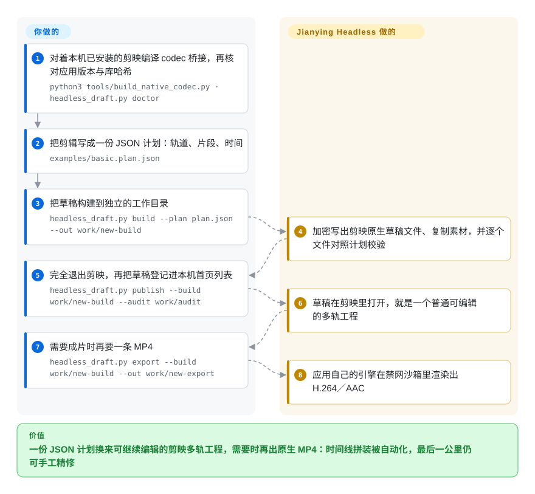

# Jianying Headless

仅限 macOS 的命令行工具加 Agent Skill：把一份 JSON 剪辑计划编译成**剪映专业版（CapCut 的中文兄弟）可继续编辑的多轨草稿**，需要时还能调用剪映自己的引擎导出成片——它是针对某一个固定应用版本搭的桥，不是官方 SDK，许可是非商用。

## 何时使用

你本来就在剪映专业版里剪片子，瓶颈不在剪辑本身，而在**把可编辑的工程做出来**。要么生成的蒙太奇落到你手里只是一条压平的 MP4，得从头重剪；要么 agent 刚产出了一套时间结构（画面、配音、字幕），而人还得在真正的时间线上继续打磨。你要的是 agent 把剪映的轨道交给你，不是一条成片。

你会选 Jianying Headless，是因为它直接写剪映原生的加密草稿格式，并且能借剪映自己的引擎渲染——最后一公里仍然可手工精修，字体、蒙版、转场的观感与手工剪映一致。代价写在明面上：Apple Silicon 加 macOS 26、某一个库哈希能对上的精确剪映版本、一台机器上编译且哈希固定的桥接产物，以及仅限个人使用的条款。要跨平台、许可自由的编辑器就改选 [Concat](../video-editing/concat.zh.md)；交付物是一条没人会再剪的成片则选 [MoneyPrinterTurbo](../../video-production/moneyprinter-turbo.zh.md)。

## 怎么用起来

你把剪辑描述一次，形式是一份 JSON 计划：轨道与片段，包含素材路径、微秒级时间、变速、音量和文字。项目把这份计划编译成剪映认识的那些文件——时间线与元数据用的是应用**自己**的加解密例程，通过一个小型 C++ 桥接调用，而这个桥接是在你机器上、对着已安装应用里的 `libvideoeditor.dylib` 编译出来的（它不下载应用，也不修改应用）。把草稿登记进剪映首页列表、以及导出 MP4，走的是同一个私有库，但跑在独立的辅助进程里；导出进程被关进 macOS 沙箱，禁网、且只允许写本次任务目录。分工正是重点：你提供计划、在被要求时关闭剪映、并做最终人工检查；它负责构建、校验、登记，以及在你明确要求时渲染——而一旦本机应用版本或库哈希不在它审查过的范围内，它会直接拒绝运行。

<!-- flow-steps:begin (generated from flows/jianying-headless.json by tools/flow_card.py — do not edit) -->

流程文字版

1. **你**：对着本机已安装的剪映编译 codec 桥接，再核对应用版本与库哈希 — `python3 tools/build_native_codec.py · headless_draft.py doctor`
2. **你**：把剪辑写成一份 JSON 计划：轨道、片段、时间 — `examples/basic.plan.json`
3. **你**：把草稿构建到独立的工作目录 — `headless_draft.py build --plan plan.json --out work/new-build`
4. **Jianying Headless**：加密写出剪映原生草稿文件、复制素材，并逐个文件对照计划校验
5. **你**：完全退出剪映，再把草稿登记进本机首页列表 — `headless_draft.py publish --build work/new-build --audit work/audit`
6. **Jianying Headless**：草稿在剪映里打开，就是一个普通可编辑的多轨工程
7. **你**：需要成片时再要一条 MP4 — `headless_draft.py export --build work/new-build --out work/new-export`
8. **Jianying Headless**：应用自己的引擎在禁网沙箱里渲染出 H.264／AAC

**价值**：一份 JSON 计划换来可继续编辑的剪映多轨工程，需要时再出原生 MP4：时间线拼装被自动化，最后一公里仍可手工精修

<!-- flow-steps:end -->

## 何时不用

- **你不是 Apple Silicon 的 macOS 26 机器**，或者装不了指定的那个剪映版本。改选 [Concat](../video-editing/concat.zh.md) 或走 FFmpeg／OTIO 的拼装路线，因为这个桥链接的是应用自带的 arm64 库，并且把库哈希、编译器／SDK／链接器、以及签名身份全部钉死。
- **任何商业用途**——客户交付、公司内部工具、付费产品或 SaaS。许可只允许个人非商用，否则要取得书面授权；请改选 [MoneyPrinterTurbo](../../video-production/moneyprinter-turbo.zh.md)（MIT）或 [HyperFrames](../../video-production/hyperframes.zh.md)（Apache-2.0）。
- **你要的是从主题直接出成片，而不是可编辑工程。** 用 [MoneyPrinterTurbo](../../video-production/moneyprinter-turbo.zh.md) 或 [Hypit](../../video-production/hypit.zh.md)；这里的交付物就是草稿本身，而单条精致视频在剪映里手剪更省。
- **你让剪映自动更新，或者要同时支持多个版本。** 导出路径依赖逐版本固定的函数偏移、结构体布局和引擎日志字符串；没被审查过的版本会被拒绝而不是勉强跑。请优先选不依赖闭源 ABI 的工具。
- **你需要 Linux 服务器上无人值守的批量生产。** 它没有服务端组件，也没有无头应用——这是桌面 macOS 集成，登记草稿前还要求你完全退出剪映。参见 [MoneyPrinterTurbo](../../video-production/moneyprinter-turbo.zh.md)。
- **你只需要写出草稿文件，并且装不了那个应用。** pyJianYingDraft 可以用 Python 写出剪映／CapCut 的草稿结构，再由你自己打开编辑器（本索引中 `未收录`，见横向对比）。
- **你需要在线模板、云工程、账号权益或付费特效缓存。** 这些按设计就不在范围内；引用了已下线效果的计划会被明确报错，不会静默降级。
- **你要做复合片段，或对图片／GIF 时间线做严格帧数校验。** 嵌套片段只支持实验性的离线构建与冻结快照导出，图片／GIF 素材还挂着一个偶发少一帧的未解问题——帧数检查会拒绝这种输出，而不是把它交付出去。

## 横向对比

| 替代品 | 是否收录 | 我们的评价 | 取舍 |
| --- | --- | --- | --- |
| [Hypit](../../video-production/hypit.zh.md) | ✅ | 当你的事实源头是“把这条爆款视频克隆成一批变体”时选 Hypit；当交付物必须是人在剪映里继续编辑的时间线时选 Jianying Headless，因为 Hypit 的产出是渲染好的视频加它自己的 SVML workflow，不是剪映工程。 | Hypit 跨平台、agent 优先，但用自己的 Chromium／FFmpeg 链路渲染且要付生成费；Jianying Headless 继承剪映的渲染生态，代价是只能绑在某个 macOS 版本上。 |
| [MoneyPrinterTurbo](../../video-production/moneyprinter-turbo.zh.md) | ✅ | 当你想要主题直出、边际成本近零、且没人会再剪的短片时选 MoneyPrinterTurbo；当必须有真人剪辑师收尾时选 Jianying Headless，因为库存素材幻灯片拼出来的成片没法当作可编辑的剪映时间线交出去。 | MPT 是 MIT、可自托管、对 Linux 友好；Jianying Headless 非商用、绑 macOS，但交出的是可编辑工程而不只是成片。 |
| [Concat](../video-editing/concat.zh.md) | ✅ | 当编辑器本身必须开源、离线、跨平台时选 Concat；当留在剪映的特效与字体生态里比许可自由更重要时选 Jianying Headless，因为 Concat 是替换剪映，而这个项目是自动化剪映。 | Concat 是 AGPL，自带 FFmpeg／Whisper 链路但特效远少；Jianying Headless 能拿到剪映级别的输出，代价是驱动一套闭源 ABI。 |
| pyJianYingDraft | 未收录 | 当你只需要用 Python **写出**剪映／CapCut 草稿文件、编辑器自己开时选 pyJianYingDraft；当你还要求应用自己的引擎来渲染，或者你的剪映版本把草稿加密了、纯写文件这条路覆盖不了时，选 Jianying Headless。 | pyJianYingDraft 是 Apache-2.0 且不依赖应用；Jianying Headless 增加了原生导出与哈希钉死的兼容性，代价是应用、macOS 26 和非商用许可。 |
| 剪映专业版／CapCut（闭源应用） | 未收录 | 如果人本来就会手动点时间线，那就直接用剪映；只有当同一套结构需要被反复生成或由 agent 生成时，才选 Jianying Headless，因为该应用没有官方支持的自动化接口。 | 应用免费、打磨成熟、由字节维护；这个桥是非官方、单一维护者，且会因未审查的更新而失效。 |

## 技术栈

- Python 3.9+ 引擎：草稿构建（`engine/jy14_headless.py`）、独立副本编辑（`native_edit.py`）、导出编排（`native_export.py`）、字体、特效、资源目录，以及按功能拆分的测试模块。
- 每次任务现场编译的 C++17 辅助程序：用 `xcrun clang++` 编译，链接已安装应用 `Contents/Frameworks/libvideoeditor.dylib`（`-lvideoeditor -Wl,-rpath,...`）。
- `bridge/jy14_codec.cpp` 加 `bridge/runtime_io.py`：草稿加解密，以及有界的文件与锁原语。接口声明改编自 MIT 许可的 `jy-draftc` 样例；加解密实现是应用自带的 `EncryptUtils`，运行时从已安装库解析。
- 草稿格式：剪映加密的 `draft_info.json` 与 `draft_meta_info.json`，另有 `Timelines/project.json`、`timeline_layout.json`、`draft_virtual_store.json`、`draft_settings`，以及镜像的 `template-2.tmp` 与 `.bak` 副本。
- 原生导出：手工声明的私有 C++ ABI（`lvve::Draft`、`lyra::Server`、`ExportService::exportStart`、`DraftService`），结构体大小用 `static_assert` 钉死，函数偏移逐版本固定；完成事件靠引擎自己的日志回调判断，不看界面。
- 校验与沙箱：`/usr/bin/sandbox-exec` 配置、`ffmpeg`／`ffprobe` 探测、SHA-256 校验、`codesign --deep --strict` 检查、基于 `flock` 的目录事务。
- 随仓库分发的 Agent Skill：`skills/yichen-jianying-edit/`（同时镜像在作者的 `mcncarl/yichen-skills` 仓库）。

## 依赖

- Apple Silicon Mac，macOS 26.0 以上（仓库称已在 26.5.1 验证）。
- 剪映专业版安装在 `/Applications/VideoFusion-macOS.app`，版本 11.5.0（主）或 11.4.2（兼容），bundle id 为 `com.lemon.lvpro`，签名团队为 `X2JNK7LY8J`。
- 匹配的 Apple 工具链：Apple clang 21.0.0、macOS SDK 26.5、链接器 1267——其他组合会被拒绝；编译出的 codec 必须匹配一个固定的 SHA-256。
- Python 3.9+、FFmpeg／ffprobe、Xcode Command Line Tools。
- 可选：`fonttools`（钉在 4.60.2）用于指定本地字体；转写需要一个 ASR 提供方，属于独立的可选依赖。
- 不随仓库分发：应用本体、它的 dylib、内置资源／字体／特效、已缓存的付费音效，以及编译产物 codec——这些每位使用者都在自己机器上重建。

## 运维难度

**高。** 安装天生是逐机器定制的：你要用唯一一种编译器／SDK／链接器组合、对着唯一一个应用版本，编译出一个必须匹配固定哈希的 codec 桥接。没有服务端、容器或 CI 方案——它跑在单台 Apple Silicon 桌面上，写进 `~/Movies/JianyingPro/User Data/...`，并且登记草稿前要求你完全退出剪映。长期负担在版本跟踪：一旦剪映更新到未审查的配置，原生写入就会停摆，直到维护者重新推导偏移；仓库自己也记着“干净机器安装验收尚未完成”。每次运行都会落一份审计产物（build、audit、导出日志），利于追溯，也带来额外的磁盘记账。

## 健康度与可持续性

- **维护（2026-09-20）：** 仓库建于 2026-09-15，默认分支上共 6 次提交，最后一次 push 是 2026-09-20T06:12:56Z；没有 release，也没有 tag。相对年龄而言极其活跃，但还谈不上有节奏可判断。
- **治理／巴士系数：** 6 次提交全部由个人账号 `mcncarl` 撰写（其中一次带 `Co-authored-by: wanchenxing` 尾注），因此实测集中度是单一维护者约占提交量的 0.86——没有基金会或公司背书 [推断]。
- **背书与长青度：** 只有 5 天历史，却有约 1.66k star、约 703 fork。这是典型的“年轻且高热”画像；按 Lindy 先验，star 数是热度信号，不是耐久证据 [推断]。
- **采用与生态：** 雷达给采用度评为 **E**，原因是不在任何包管理器发布、且没有任何依赖仓库——而不是因为读到了下载量；随仓库的 Agent Skill 另在作者的 `yichen-skills` 仓库发布，除作者自己记录的案例之外，是否有生产使用未确认。
- **风险标记：** 自定义非商用许可（`LICENSE` 把商用请求导向一个微信联系方式）——雷达上“许可宽松度”显示为 `?`，因为该许可解析不出 SPDX 类别，但采用约束是真实的。核心能力依赖闭源应用的私有 ABI，因此能不能继续用由厂商而非本项目决定；仓库明确说明它不是官方 SDK，调用内部接口也不等于获得集成许可。

## 存疑（未验证）

- [未验证] 作者自报的案例指标（23 轨／154 段／39 份素材／1507 帧全通过、导出约 35.9 秒、音频相关系数 0.9871–0.9999）——复现需要已授权的剪映安装、指定版本与原始素材。
- [未验证] codec 重建能否在另一台机器上复现那个固定 SHA-256：仓库自己的 `project.json` 记录着 `clean_machine_acceptance: not-completed`。
- [未验证] Hypit 交接是针对单一项目手写的转换；文档称仓库并不随附通用的 Hypit 工程导出器。
- [未验证] 链接已签名应用的私有 C++ ABI 符号在条款与法律上如何定性——仓库只声明这是非官方项目、不授予集成权，并未给出法律结论。
- [推断] 剪映一旦更新到已审查配置之外，原生草稿写入与导出就会失效，直到重新推导偏移与布局，因为桥把函数偏移、结构体大小和引擎日志字符串都写死了。
- [推断] 商用意图：许可把商用用户导向联系作者，因此可能存在付费档——但没有找到这样的产品。
- [未验证] star／fork／issue 数（1,657／703／6）是 2026-09-20 的时点值，变化很快。
- [未验证] 本页没有任何一项被实际执行：macOS 26 加 Apple clang 21 的要求排除了撰写本索引所用的机器，因此所有机制描述来自读仓库，而非实跑。
