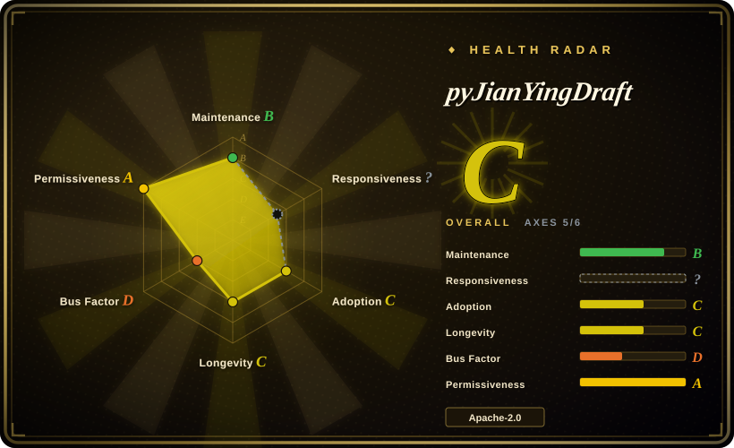
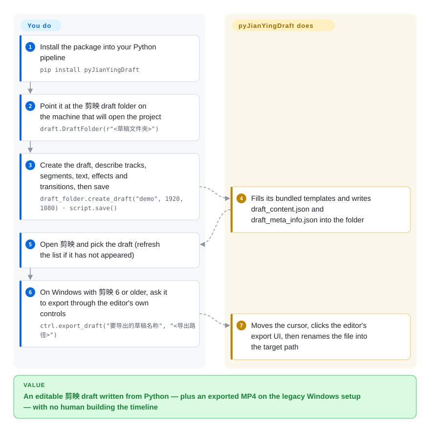

# pyJianYingDraft

A pip-installable Python library that builds 剪映 (Jianying) draft projects by writing the editor's draft files directly — cross-platform and Apache-2.0, with no native engine, no rendering of its own, and no support for newer 剪映 versions that encrypt their drafts.

## When to use

You are wiring an agent or a batch job into a pipeline whose deliverable is an **editable 剪映 project**, and the machine doing the work is not the editor machine — a Linux box in CI, a Python service, or a Windows render host. You want that in a permissively licensed library you can vendor and pin, not a bridge that must be compiled against whatever editor build happens to be installed.

You reach for pyJianYingDraft because `pip install pyJianYingDraft` plus a draft-folder path is the whole setup: you describe tracks, segments, text, effects and transitions in Python, and it writes `draft_content.json` and `draft_meta_info.json` into the draft folder from bundled templates, so the draft is waiting in 剪映 the next time someone opens it. It also works the other way — load an existing draft as a template, swap material or text, and import its tracks into a new draft. The deciding tradeoff against [Jianying Headless](jianying-headless.md): that one buys the app's own engine and current-version compatibility at the cost of macOS 26, one pinned 剪映 build and a non-commercial license; this one buys portability and a permissive license by giving up encryption-compatible drafts and any non-UI export path.

## How it works

You install the package, point a `DraftFolder` at the 剪映 draft directory, build the edit in code — tracks, then `VideoSegment` / `AudioSegment` / `TextSegment` objects with time ranges, keyframes, effects and transitions — and call `script.save()`. That is pure file writing: the library fills in bundled JSON templates (`draft_content_template.json`, `draft_meta_info.json`) and effect/font/mask metadata tables, so nothing talks to the editor and no encryption is involved. You then open 剪映 yourself and export by hand; from the library's side the edit is done the moment the files land. There is one separate mechanism worth knowing about: the optional `JianyingController` export drives the *editor's UI* with `uiautomation` — which is why it only works on Windows against 剪映 6 or older, where the export controls are still visible.

<!-- flow-steps:begin (generated from flows/pyjianyingdraft.json by tools/flow_card.py — do not edit) -->

Text version of the flow

1. **You**: Install the package into your Python pipeline — `pip install pyJianYingDraft`
2. **You**: Point it at the 剪映 draft folder on the machine that will open the project — `draft.DraftFolder(r"<草稿文件夹>")`
3. **You**: Create the draft, describe tracks, segments, text, effects and transitions, then save — `draft_folder.create_draft("demo", 1920, 1080) · script.save()`
4. **pyJianYingDraft**: Fills its bundled templates and writes draft_content.json and draft_meta_info.json into the folder
5. **You**: Open 剪映 and pick the draft (refresh the list if it has not appeared)
6. **You**: On Windows with 剪映 6 or older, ask it to export through the editor's own controls — `ctrl.export_draft("要导出的草稿名称", "<导出路径>")`
7. **pyJianYingDraft**: Moves the cursor, clicks the editor's export UI, then renames the file into the target path

**Value**: An editable 剪映 draft written from Python — plus an exported MP4 on the legacy Windows setup — with no human building the timeline

<!-- flow-steps:end -->

## When NOT to use

- **Your 剪映 is version 11.x, or you need the draft format of a current release.** Newer 剪映 drafts are not plaintext JSON, so the pure file-writing route cannot write or read them — the README itself sends template loading on new versions to a `fallback_loader`. Use [Jianying Headless](jianying-headless.md) for a pinned 11.5.0/11.4.2 build, or accept that a human exports in a matching editor.
- **You need the finished MP4 produced without a human.** The built-in export is Windows-only, requires 剪映 6 or older, moves the mouse and takes the window to the front; on macOS/Linux the library generates drafts but explicitly does not export. Render with [MoviePy](../video-audio/editing-and-cutting/moviepy.md) or FFmpeg when the deliverable is a video rather than a project, or use [Jianying Headless](jianying-headless.md) on macOS.
- **You want an editor, not an authoring library.** Use [Concat](../video-editing/concat.md) or [OpenCut](../video-editing/opencut.md); this library never renders anything, it only writes project files for someone else's editor.
- **You need masks on 剪映 10.8.** The README's own matrix marks video masks as broken there with a fix promised in 0.3.1 — verify your exact version's row before designing around a feature.
- **You need a maintained CapCut-international library.** pyCapCut exists for that variant but carries no license file and no commits since 2025-09-12 (see Comparison).
- **Your plan depends on effects, fonts or stickers that the editor has not cached.** Loading failures and the need to reopen a draft a second time for uncached fonts are known; pre-warm the cache on the render machine instead of assuming a one-shot run.

## Comparison

| Alternative | In index | Our verdict | Tradeoff |
| --- | --- | --- | --- |
| [Jianying Headless](jianying-headless.md) | ✅ | When the render must come from 剪映's own engine on a current build, pick Jianying Headless; pick pyJianYingDraft when the drafting has to run on Linux/Windows CI or inside a vendored Python service, because the bridge is macOS-26-only, pinned to one app build, and non-commercial. | pyJianYingDraft is Apache-2.0, cross-platform and dependency-light but cannot touch encrypted drafts or render; Jianying Headless gets native export and hash-pinned compatibility by driving a proprietary ABI on one machine class. |
| [MoviePy](../video-audio/editing-and-cutting/moviepy.md) | ✅ | When the deliverable is a rendered file, pick MoviePy; pick pyJianYingDraft when a person must keep editing the result in 剪映, because MoviePy composites frames itself and produces no timeline anyone can open. | MoviePy renders anywhere with FFmpeg and has no editor dependency; pyJianYingDraft produces an editable project but needs the editor to finish the job. |
| [Concat](../video-editing/concat.md) | ✅ | When the editor itself must be open source and scriptable end to end, pick Concat; pick pyJianYingDraft when the team already works in 剪映 and only the drafting step needs automating, because Concat replaces the editor while this writes into it. | Concat is AGPL with its own FFmpeg/Whisper pipeline and a GUI; pyJianYingDraft is Apache-2.0, library-only, and inherits 剪映's effect ecosystem — up to that version's draft format. |
| pyCapCut | 未收录 | When you specifically need CapCut (international) drafts, do not reach for pyCapCut as shipped: it has no license file at all (all rights reserved) and no commits since 2025-09-12, so pinning it is a legal and maintenance dead end — use pyJianYingDraft's model and add the CapCut variant yourself. | pyCapCut targets the international app; the cost is an unlicensed, year-stale codebase, whereas pyJianYingDraft is Apache-2.0 and still released. |
| 剪映专业版 / CapCut (closed app) | 未收录 | When the edit is a one-off, use 剪映 itself; pick pyJianYingDraft when the same structure must be produced repeatedly or by an agent, because the app exposes no scriptable authoring surface. | The app is free and vendor-maintained with every effect available; the library is unofficial, version-coupled, and only ever writes what its metadata tables know about. |

## Tech stack

- Pure Python (declared `>=3.8`; README recommends 3.8, 3.10 or 3.11), distributed on PyPI as `pyJianYingDraft` (0.3.0), importable as `pyJianYingDraft as draft`.
- Draft output is JSON built from bundled templates: `pyJianYingDraft/assets/draft_content_template.json` and `draft_meta_info.json`.
- Metadata tables for the effects the library knows: `metadata/` with transition, filter, mask, font, text intro/outro/loop, video intro/outro, group animation, character effect, audio scene effect, tone and speech-to-song entries.
- `DraftFolder` (draft-folder management, template mode, optional `fallback_loader` for non-plaintext drafts) and `JianyingController` (Windows UI-automation export).
- Runtime dependencies: `pymediainfo`, `imageio`; `uiautomation>=2` for the Windows export path only.
- `tests/` runs under pytest (10 modules covering track APIs, time utilities, SRT import, template loading, and effect/chroma export).

## Dependencies

- Python 3.8+ (`uiautomation` is reported to misbehave on 3.13; 3.8/3.10/3.11 are recommended), plus `pymediainfo` and `imageio`.
- A local 剪映 installation to open the generated draft, and its draft-folder path (find it in 剪映's 全局设置 → 草稿位置; typically something like `.../JianyingPro Drafts`).
- For the built-in export: a Windows machine with 剪映 6 or older and a screen it can control — the README advises running it when idle because it steals the cursor.
- No server, database, GPU or cloud account.

## Ops difficulty

**Low for the library, medium for the pipeline around it.** Installing and calling it is a `pip install` and a few lines of Python — there is nothing to run or monitor. The friction is at the edges: the draft-folder path is machine-specific and must be discovered rather than configured; export either needs the legacy Windows condition or a human; and the draft schema tracks the editor version, so a 剪映 upgrade can silently change what a given feature does until the maintainer's matrix catches up. Budget for a verification run against the exact 剪映 build your render hosts use.

## Health & viability

- **Maintenance (2026-09-20):** created 2024-07-17, last push 2026-07-08 with release v0.3.0 the same day; 9 releases total. A ~2.5-month gap at verification time is a pause, not abandonment — the history shows releases spread across two years.
- **Governance / bus factor:** one contributor (`GuanYixuan`) owns the history (211 contributions); a personal user account with no foundation or company behind it — a real single-point risk for a library other pipelines may depend on [推断].
- **Backing & Lindy:** ~2 years old and still releasing — the strongest Lindy profile of the two Jianying entries here. The 0.3.0 release was a large rework, so some surfaces are younger than the repo.
- **Adoption & ecosystem:** 4.4k stars / 663 forks and a PyPI package, which is what makes this the de-facto way people script 剪映 drafts; the author's own notes place it upstream of the CapCut variant.
- **Risk flags:** Apache-2.0, so embedding and vendoring are unencumbered. The functional risk is version coupling: the feature matrix is version-specific (5.9 full, 10.8 partial, masks broken on 10.8), and newer 剪映 releases move drafts out of reach of the plaintext route entirely.

## Caveats (unverified)

- [未验证] The version feature matrix (5.9 vs 10.8 rows, masks broken on 10.8, promised 0.3.1 fix) is author-reported; confirming it needs those exact 剪映 builds.
- [未验证] The Windows UI-automation export path (`JianyingController` + `uiautomation`, 剪映 ≤6) was not run here — it needs a Windows host and a legacy editor build.
- [未验证] PyPI downloads and dependent-project counts were not measured for this page; the adoption reading comes from stars, forks and the package's de-facto use in the ecosystem.
- [未验证] Nothing on this page was executed: the draft output, template mode and export were read from the README, `demo.py`, the source tree and the release history.
- [推断] Version coupling means a 剪映 update can change behaviour of a feature that previously worked, until the maintainer re-verifies it — the mask regression recorded in the 10.8 column is an instance of this pattern.
- [推断] pyCapCut's status (no license file at all, so all rights reserved, and no commits since 2025-09-12) is read from the GitHub API at 2026-09-20; the `未收录` decision follows this index's inclusion bar of an open-source repository.
- [未验证] Whether generated drafts open cleanly in every supported editor version, and whether uncached fonts/effects still require a second open on the current releases.
