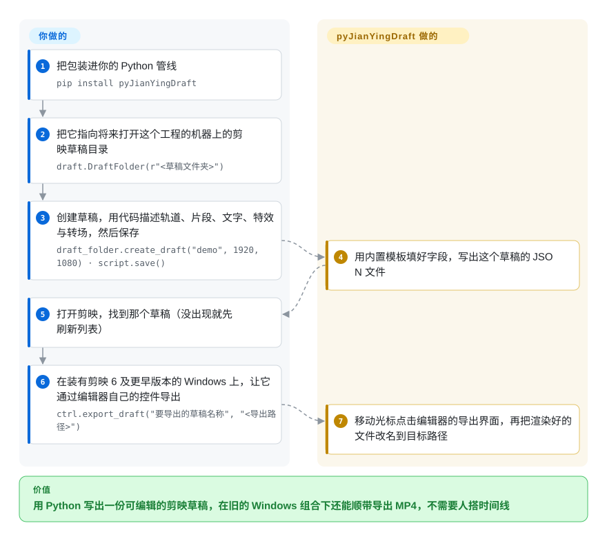

# pyJianYingDraft

一个 `pip` 可装的 Python 库：直接写剪映的草稿文件来构造草稿工程——跨平台、Apache-2.0，不自带引擎、不自己渲染，也不支持已经开始加密草稿的新版剪映。

## 何时使用

你正把 agent 或批处理任务接进一条管线，它的交付物是**可编辑的剪映工程**，而干活的机器并不是编辑器所在的那台——CI 里的 Linux、Python 服务，或一台 Windows 渲染机。你希望这件事落在一个许可宽松、可 vendored、可锁版本的库上，而不是一个必须对着本机恰好装着的编辑器版本现场编译的桥。

你选 pyJianYingDraft，是因为 `pip install pyJianYingDraft` 加一个草稿目录路径就是全部安装：你用 Python 描述轨道、片段、文字、特效与转场，它依据内置模板写出 `draft_content.json` 与 `draft_meta_info.json`，下次有人在剪映里打开时草稿已经躺在那儿。它也支持反方向——把已有草稿当模板加载，替换素材或文本，再把它的轨道导入新草稿。相对 [Jianying Headless](jianying-headless.zh.md) 的决定性取舍是：后者用 macOS 26、某一个固定剪映版本和非商用许可换来「应用自己的引擎 + 当前版本兼容」；前者用「写不了加密草稿、也没有非 UI 的导出路径」换来可移植性与宽松许可。

## 怎么用起来

你装上包，把一个 `DraftFolder` 指向剪映的草稿目录，在代码里搭出这次剪辑——先建轨道，再造 `VideoSegment`／`AudioSegment`／`TextSegment` 对象并设置时间区间、关键帧、特效和转场——最后调用 `script.save()`。这是纯粹的文件写入：库用内置的 JSON 模板（`draft_content_template.json`、`draft_meta_info.json`）加上特效／字体／蒙版元数据表把字段填好，全程不跟编辑器通信、也不涉及加密。之后你自己打开剪映并手动导出；从库的角度看，文件落盘那一刻剪辑就完成了。另有一个需要区分开的机制：可选的 `JianyingController` 导出是用 `uiautomation` 去驱动**编辑器的图形界面**，所以它只在 Windows 上、且只对剪映 6 及更早版本有效——那些版本的导出控件还没有被隐藏。

<!-- flow-steps:begin (generated from flows/pyjianyingdraft.json by tools/flow_card.py — do not edit) -->

流程文字版

1. **你**：把包装进你的 Python 管线 — `pip install pyJianYingDraft`
2. **你**：把它指向将来打开这个工程的机器上的剪映草稿目录 — `draft.DraftFolder(r"<草稿文件夹>")`
3. **你**：创建草稿，用代码描述轨道、片段、文字、特效与转场，然后保存 — `draft_folder.create_draft("demo", 1920, 1080) · script.save()`
4. **pyJianYingDraft**：用内置模板填好字段，写出这个草稿的 JSON 文件
5. **你**：打开剪映，找到那个草稿（没出现就先刷新列表）
6. **你**：在装有剪映 6 及更早版本的 Windows 上，让它通过编辑器自己的控件导出 — `ctrl.export_draft("要导出的草稿名称", "<导出路径>")`
7. **pyJianYingDraft**：移动光标点击编辑器的导出界面，再把渲染好的文件改名到目标路径

**价值**：用 Python 写出一份可编辑的剪映草稿，在旧的 Windows 组合下还能顺带导出 MP4，不需要人搭时间线

<!-- flow-steps:end -->

## 何时不用

- **你的剪映是 11.x，或你需要当前版本的草稿格式。** 新版剪映的草稿不是明文 JSON，纯写文件这条路写不了也读不了——README 自己就把新版的模板加载指向 `fallback_loader`。要覆盖 11.5.0／11.4.2 就用 [Jianying Headless](jianying-headless.zh.md)，或者接受由人在匹配版本的编辑器里导出。
- **你需要不经人手就产出成片。** 内置导出只在 Windows 上、且要求剪映 6 及更早，还要移动鼠标、把窗口置顶；在 macOS／Linux 上这个库明确只生成草稿、不导出。交付物是视频而非工程时，用 [MoviePy](../video-audio/moviepy.zh.md) 或 FFmpeg 渲染；要在 macOS 上导出则用 [Jianying Headless](jianying-headless.zh.md)。
- **你要的是编辑器，而不是写工程文件的库。** 用 [Concat](../video-editing/concat.zh.md) 或 [OpenCut](../video-editing/opencut.zh.md)；这个库自己不做任何渲染，只为别人的编辑器写工程文件。
- **你需要剪映 10.8 上的蒙版。** README 自己的功能表把该版本下的视频蒙版标为不可用、并称将在 0.3.1 修复——围绕某个功能做设计前先核对你这版对应的那一行。
- **你需要一个还在维护的 CapCut 国际版库。** pyCapCut 就是做这个变体的，但它没有任何许可证文件、自 2025-09-12 起没有提交（见横向对比）。
- **你的方案依赖编辑器尚未缓存的动效、字体或贴纸。** 加载失败、以及未缓存字体需要二次打开草稿都是已知问题；在渲染机上先把缓存预热，不要假设一次就能跑通。

## 横向对比

| 替代品 | 是否收录 | 我们的评价 | 取舍 |
| --- | --- | --- | --- |
| [Jianying Headless](jianying-headless.zh.md) | ✅ | 当成片必须由剪映自己的引擎在较新版本上渲染时选 Jianying Headless；当写草稿这一步必须跑在 Linux／Windows CI 或塞进一个 vendored 的 Python 服务里时选 pyJianYingDraft，因为那个桥只支持 macOS 26、绑定单个应用版本且非商用。 | pyJianYingDraft 是 Apache-2.0、跨平台、依赖轻，但碰不了加密草稿也不能渲染；Jianying Headless 以一整类机器上的私有 ABI 换来原生导出与哈希钉死的兼容性。 |
| [MoviePy](../video-audio/moviepy.zh.md) | ✅ | 交付物是渲染文件时选 MoviePy；当人还要在剪映里继续编辑结果时选 pyJianYingDraft，因为 MoviePy 自己合成帧、产不出任何人能打开的时间线。 | MoviePy 在任何平台靠 FFmpeg 渲染、不依赖编辑器；pyJianYingDraft 产出可编辑工程，但收尾必须靠编辑器。 |
| [Concat](../video-editing/concat.zh.md) | ✅ | 编辑器本身必须开源且能脚本化到底时选 Concat；当团队本来就在剪映里干活、只需要自动化「写草稿」这一步时选 pyJianYingDraft，因为 Concat 是替换编辑器，而这个是往编辑器里写。 | Concat 是 AGPL，自带 FFmpeg／Whisper 管线与图形界面；pyJianYingDraft 是 Apache-2.0 的纯库，继承剪映的特效生态——上限是该版本的草稿格式。 |
| pyCapCut | 未收录 | 当你明确需要 CapCut（国际版）草稿时，不要按现状用 pyCapCut：它根本没有许可证文件（等同保留所有权利），且自 2025-09-12 起没有提交，锁定它既是法律上的也是维护上的死路——改用 pyJianYingDraft 的做法、自己补上 CapCut 变体。 | pyCapCut 面向国际版应用；代价是一个无许可、停更一年的代码库，而 pyJianYingDraft 是 Apache-2.0 且仍在发版。 |
| 剪映专业版／CapCut（闭源应用） | 未收录 | 一次性剪辑就用剪映本身；当同一套结构要被反复生成或由 agent 生成时选 pyJianYingDraft，因为该应用没有可脚本化的创作接口。 | 应用免费、由厂商维护、特效齐全；这个库是非官方的、与版本耦合，而且只能写出它元数据表里已知的东西。 |

## 技术栈

- 纯 Python（声明 `>=3.8`；README 推荐 3.8、3.10 或 3.11），以 PyPI 包 `pyJianYingDraft`（0.3.0）分发，按 `import pyJianYingDraft as draft` 使用。
- 草稿输出是由内置模板拼出来的 JSON：`pyJianYingDraft/assets/draft_content_template.json` 与 `draft_meta_info.json`。
- 记录它认识的那些效果的元数据表：`metadata/` 下的转场、滤镜、蒙版、字体、文字入场／出场／循环动画、视频入场／出场、组合动画、人物特效、音频场景音、音色与声音成曲等条目。
- `DraftFolder`（草稿目录管理、模板模式、以及为非常规明文草稿准备的 `fallback_loader`）与 `JianyingController`（Windows 上的 UI 自动化导出）。
- 运行时依赖：`pymediainfo`、`imageio`；`uiautomation>=2` 只服务于 Windows 导出路径。
- `tests/` 用 pytest 跑（10 个模块，覆盖轨道 API、时间工具、SRT 导入、模板加载，以及特效／色度导出）。

## 依赖

- Python 3.8 以上（有反馈称 `uiautomation` 在 3.13 下有问题，推荐 3.8／3.10／3.11），外加 `pymediainfo` 与 `imageio`。
- 本机要有剪映来打开生成的草稿，以及它的草稿目录路径（在剪映的「全局设置 → 草稿位置」里查，形如 `.../JianyingPro Drafts`）。
- 用内置导出时：一台 Windows 机器，装有剪映 6 及更早版本，并且屏幕可以被程序控制——README 建议在闲置时段运行，因为它会抢占光标。
- 不需要服务端、数据库、GPU 或云端账号。

## 运维难度

**库本身低，围绕它的管线中等。** 安装与调用就是一次 `pip install` 加几行 Python，没有常驻进程要监控。摩擦都在边界上：草稿目录路径因机器而异、只能去应用里找；导出要么满足「Windows + 旧版剪映」这个条件，要么由人来做；而草稿 schema 跟着编辑器版本走，剪映一升级，某个功能的行为可能在你察觉之前就变了，直到维护者更新功能表。建议针对渲染机实际使用的那一版剪映跑一次验证。

## 健康度与可持续性

- **维护（2026-09-20）：** 仓库建于 2024-07-17，最后一次 push 是 2026-07-08，同日发布 v0.3.0；累计 9 个 release。核验时有约 2.5 个月的间隔，但看历史这是停顿而非弃坑——两年间发版是持续的。
- **治理／巴士系数：** 全部历史由单一贡献者（`GuanYixuan`，211 次贡献）维护；个人账号，没有基金会或公司背书——对被下游管线依赖的库来说这是实实在在的单点风险 [推断]。
- **背书与长青度：** 约两年历史且仍在发版，是本分类两个剪映条目里 Lindy 画像最好的一个。0.3.0 是一次大改版，因此部分接口比仓库本身年轻。
- **采用与生态：** 4.4k star、663 fork，加上 PyPI 包，这正是它成为「脚本化剪映草稿」事实做法的原因；作者本人也把它摆在做 CapCut 变体的上游。
- **风险标记：** Apache-2.0，嵌入与 vendoring 没有额外负担。真正的功能风险是与版本耦合：功能表按版本区分（5.9 完整、10.8 部分），且新版剪映把草稿移出了明文路线可及的范围。

## 存疑（未验证）

- [未验证] 版本功能表（5.9 与 10.8 两列、10.8 蒙版不可用、承诺在 0.3.1 修复）是作者自报；要确认需要对应的剪映版本。
- [未验证] Windows 上的 UI 自动化导出路径（`JianyingController` 加 `uiautomation`，剪映 6 及更早）没有实测——它需要 Windows 主机与旧版编辑器。
- [未验证] 本页没有测量 PyPI 下载量与依赖项目数；采用度判断来自 star、fork，以及该包在生态中的事实使用。
- [未验证] 本页没有任何一项被实际执行：草稿输出、模板模式与导出均来自 README、`demo.py`、源码树与发版历史。
- [推断] 与版本耦合意味着剪映一次更新就可能改变某个原本可用功能的行为，直到维护者重新核验——10.8 那一列的蒙版回退就是这个模式的实例。
- [推断] pyCapCut 的状态（完全没有许可证文件、等同保留所有权利；自 2025-09-12 起无提交）是 2026-09-20 从 GitHub API 读到的；`未收录` 的判定依据是本索引「开源仓库」的收录门槛。
- [未验证] 生成的草稿是否在每个受支持版本里都能干净打开，以及未缓存的字体／特效在当前版本上是否仍需二次打开。
