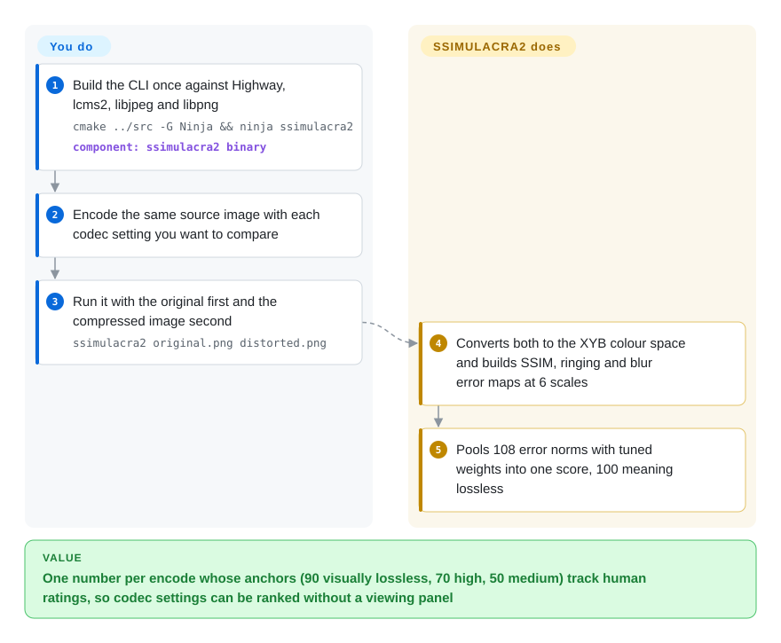

# SSIMULACRA2

You're choosing JPEG XL, AVIF or WebP settings and PSNR keeps ranking a smeared, blocky encode above one that looks fine to every person who sees it. SSIMULACRA2 compares the compressed image with its original and returns one score whose scale is tied to human viewing tests — 90 is visually lossless, 70 high quality, 50 medium — so you can rank encoder settings without running a viewing panel.

## When to use

You're a codec or image-pipeline engineer: you're picking the quality setting for a CDN's AVIF output, comparing a new JPEG XL encoder build against the last one, or checking that a re-encode of a photo library didn't visibly damage it. You need a full-reference metric (one that sees both the original and the compressed version) that agrees with human judgement on still images. You build the small CLI, run `ssimulacra2 original.png distorted.png` for each candidate, and compare scores against the README's anchor table — e.g. `cjxl -d 1` typically lands around 85 ("excellent"), libjpeg-turbo quality 70 around 70 ("high").

You pick it over PSNR/SSIM because it correlates much better with subjective scores (the README reports Spearman 0.88 on the 22k-rating CID22 set, versus 0.62 for PSNR-Y and 0.76 for SSIM), and over [VMAF](vmaf.md) for still images because VMAF is built and tuned for video sequences and scores lower than SSIMULACRA2 on every image dataset in the README's tables. The tradeoff is that you are adopting a small research tool whose upstream repo has gone quiet.

## How it works

SSIMULACRA2 starts from **MS-SSIM** (multi-scale structural similarity — a classic measure of how much local structure, contrast and brightness differ between two images, checked at several zoom levels). It computes that in **XYB**, the perceptual colour space from JPEG XL, and adds two one-directional error maps: "ringing/blockiness" (edges in the compressed image where the original was smooth) and "smoothing/blur" (smooth areas where the original had edges). Each map is computed at 6 scales for 3 colour channels, summarised two ways, and the resulting 108 numbers are combined with weights fitted to large sets of human ratings — like a judge who checks texture, crispness and colour at several viewing distances and then gives one mark. What it does for you: all of the above, deterministically, in one CLI call. What you do: build it, keep the argument order straight (original first), and interpret the score for your content and version.

<!-- flow-steps:begin (generated from flows/ssimulacra2.json by tools/flow_card.py — do not edit) -->

Text version of the flow

1. **You**: Build the CLI once against Highway, lcms2, libjpeg and libpng — `cmake ../src -G Ninja && ninja ssimulacra2` — component: `ssimulacra2 binary`
2. **You**: Encode the same source image with each codec setting you want to compare
3. **You**: Run it with the original first and the compressed image second — `ssimulacra2 original.png distorted.png`
4. **SSIMULACRA2**: Converts both to the XYB colour space and builds SSIM, ringing and blur error maps at 6 scales
5. **SSIMULACRA2**: Pools 108 error norms with tuned weights into one score, 100 meaning lossless

**Value**: One number per encode whose anchors (90 visually lossless, 70 high, 50 medium) track human ratings, so codec settings can be ranked without a viewing panel

<!-- flow-steps:end -->

## When NOT to use

- **You need an actively maintained upstream.** The `cloudinary/ssimulacra2` repo's last commit was 2025-05-05 and its last release v2.1 on 2023-04-20 — no commits in roughly 17 months. The metric is stable rather than abandoned, but bug fixes now land elsewhere: use the copy in `libjxl`'s `tools/` (not indexed; actively maintained) or the Rust port `rust-av/ssimulacra2` (not indexed) if you need a living codebase.
- **You're measuring video.** It scores one image pair; per-frame averaging ignores how artifacts behave over time. Use [VMAF](vmaf.md), which is built for frame sequences.
- **You don't have the original image.** SSIMULACRA2 is full-reference. For in-the-wild images without a pristine source, use a no-reference model such as NIQE from IQA-PyTorch (not indexed).
- **You need a symmetric distance.** Swapping the arguments changes the score, because the blur and ringing maps are directional. If you need `d(a, b) = d(b, a)` (e.g. for clustering), use PSNR or SSIM instead.
- **You need a `pip install` or package-manager binary in CI.** Building needs CMake, Ninja, Highway, lcms2 (2.13), libjpeg-turbo and libpng; there are no upstream release binaries. If that's a blocker, use the Rust crate in a Rust toolchain, or compute VMAF's bundled SSIM/MS-SSIM with a prebuilt libvmaf.
- **You compare your numbers with scores from older papers.** v2.1 retuned the weights and added a score remapping, so v2.0 and v2.1 scores differ for the same pair; record the version and don't mix them.

## Comparison

| Alternative | In index | Our verdict | Tradeoff |
| --- | --- | --- | --- |
| [VMAF](vmaf.md) | ✅ | For video sequences and encoding-ladder decisions, pick VMAF; for still-image codec tuning, pick SSIMULACRA2, which correlates better with human ratings on every image dataset in its README. | VMAF brings temporal pooling, industry-standard reporting, prebuilt binaries and an FFmpeg filter; its models are trained on video, not still images. |
| Butteraugli (in libjxl) | not indexed | When you need a per-pixel distance map to see *where* an image degrades, or you're tuning libjxl's own encoder, use Butteraugli; for a single score to rank encodes, SSIMULACRA2 matches human ratings more closely in the README's tables. | Google's psychovisual distance from the same JPEG XL ecosystem, now maintained inside libjxl (the standalone `google/butteraugli` repo is archived); lower correlation on CID22 in SSIMULACRA2's README. |
| DSSIM | not indexed | When you want an actively maintained structural-dissimilarity CLI and AGPL-3.0 is acceptable, DSSIM is a close match on correlation; pick SSIMULACRA2 when you need a permissive BSD license or its JPEG XL-ecosystem score anchors. | Rust tool by Kornel Lesiński, actively maintained, comparable correlation in the README tables; AGPL-3.0 is a blocker for many embedding scenarios. |
| PSNR / SSIM | not a repo | Keep PSNR or SSIM as cheap sanity baselines and for symmetric distances; never decide a perceptual-quality question on them alone. | Metric definitions implemented in many tools (libvmaf, FFmpeg, ImageMagick's `compare`); ubiquitous and fast, but PSNR-Y and SSIM correlate markedly worse with human scores on CID22 in the README tables. |
| rust-av/ssimulacra2 | not indexed | When you need SSIMULACRA2 inside a Rust codebase or want a maintained implementation without the C++ build chain, use this port; use the reference C++ CLI when you need the exact upstream code. | Same metric as a Rust crate (BSD-2-Clause), recently updated; a reimplementation, so check that its scores match the reference on your data. |

## Tech stack

- **Language:** C++ (`src/ssimulacra2.cc`, `ssimulacra2_main.cc`), built with CMake + Ninja.
- **Libraries:** Google **Highway** (portable SIMD), **lcms2** (colour management), libjpeg-turbo and libpng for input decoding; image decoding code is vendored from libjxl's `lib/extras`.
- **Algorithm:** MS-SSIM variant in XYB colour space; 3 error maps × 6 scales × 3 channels × 2 norms (1-norm and 4-norm) = 108 weighted terms; weights fitted with Nelder-Mead on CID22, TID2013, KADID-10k and KonFiG.
- **Interface:** single CLI, `ssimulacra2 original.png distorted.png`; scores range from negative infinity to 100.

## Dependencies

- **Build:** C++ compiler, CMake, Ninja, plus development packages for Highway (`libhwy-dev`), lcms2 2.13, libjpeg-turbo and libpng. Alternatively, `build_ssimulacra_from_libjxl_repo` fetches libjxl and compiles only the needed parts.
- **Runtime:** none beyond the shared libraries above — no models, databases or services.
- **Inputs:** two images of identical dimensions, at least 8×8 pixels; PNG and JPEG are the documented case, decoded by the vendored libjxl `extras` codecs. Images with alpha are blended onto a dark and a bright background and the worse of the two scores is printed.

## Ops difficulty

**Low.** Once compiled, it is a stateless CLI: two images in, one number out, nothing to configure. The real cost is up front — getting Highway and the right lcms2 version on your build machines, since there are no release binaries — and in discipline: fixed argument order, a recorded metric version (2.0 vs 2.1), and score thresholds validated on your own content.

## Health & viability

- **Maintenance (2026-10): dormant.** The radar grades maintenance D: last commit 2025-05-05 (a patent-grant addition), last release v2.1 in April 2023, no activity in the last 13 weeks. Treat the standalone repo as frozen.
- **Governance — single author.** Written by Jon Sneyers at Cloudinary, who made 16 of 18 commits; the radar can't attribute governance and leaves it unscored. Cloudinary owns the repo but there is no sign of a team behind it.
- **Age and longevity — young and quiet.** Created in July 2022; the radar grades longevity D because a ~4-year-old repo that stopped changing gives a weak Lindy prior.
- **Adoption — larger than the star count suggests.** The same code ships in libjxl's tools, and sharp v0.35.0 (2026-06) switched its lossy AVIF output to SSIMULACRA2-based `iq` tuning, so the metric shapes real encoder defaults even though the repo has only ~300 stars.
- **Risk flags — clean license.** BSD-3-Clause, plus a royalty-free patent grant (`PATENTS`, same as libjxl) added in 2025-05; the radar grades license risk A. The main risk is no upstream fixes: plan to use the libjxl copy or a port if you hit a bug.

## Caveats (unverified)

- [未验证] Correlation numbers (KRCC/SRCC/PCC) are the README's own evaluation; this page did not reproduce them.
- [推断] "Stable rather than abandoned" is inferred from the commit history (only small fixes after v2.1) and the libjxl copy; no maintainer statement about the repo's status was found.
- [未验证] That the libjxl `tools/ssimulacra2.cc` copy is kept in sync with, or ahead of, the standalone repo was not diffed this pass.
- [未验证] Which other input formats (GIF, PNM, EXR, JXL) the default build actually accepts depends on the vendored decoders compiled in; not tested.
- [未验证] The Rust port's score parity with the C++ reference was not tested.
- [推断] The README's anchor table (e.g. 70 ≈ "high quality") comes from BT.500-style tests on CID22-type photographs; how well it transfers to screenshots, line art or HDR content is unknown.
