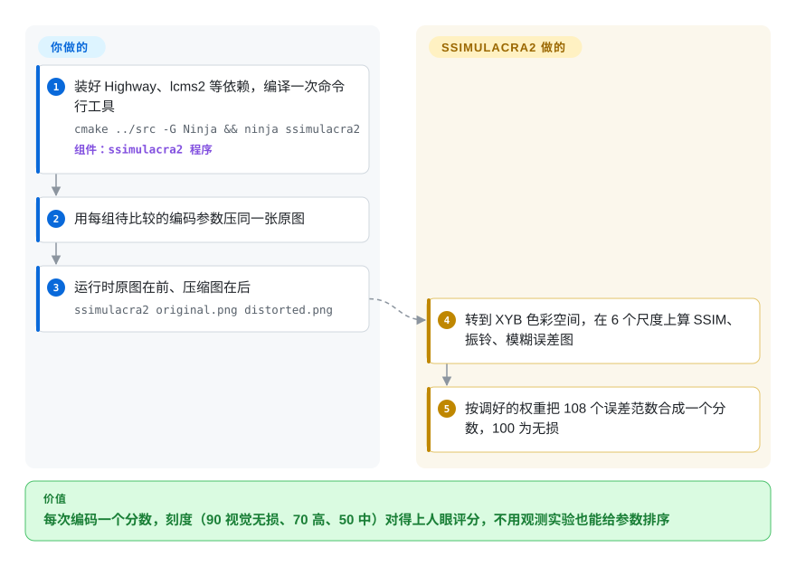

# SSIMULACRA2

你在挑 JPEG XL、AVIF 或 WebP 的压缩参数，PSNR 却总把一张糊成一片、满是色块的结果排在一张人人看着都没问题的结果前面。SSIMULACRA2 拿压缩图和原图对比，给出一个分数，刻度和人眼观测实验对齐——90 是视觉无损，70 是高质量，50 是中等——这样不用组织观测实验也能给编码参数排序。

## 何时使用

你是做编解码器或图片管线的工程师：要给 CDN 的 AVIF 输出定质量参数，要把新编出来的 JPEG XL 编码器和上一版比一比，或者要确认重新压缩一个照片库没有造成肉眼可见的损伤。你需要一个全参考指标（同时看原图和压缩图），并且在静态图上和人的判断一致。你编译好这个小命令行工具，对每个候选跑一次 `ssimulacra2 original.png distorted.png`，再对照 README 里的刻度表看分数——比如 `cjxl -d 1` 通常在 85 左右（“极好”），libjpeg-turbo 质量 70 大约 70 分（“高”）。

你选它而不是 PSNR/SSIM，是因为它和主观评分的相关性高得多（README 报告在 2.2 万条评分的 CID22 数据集上 Spearman 相关系数为 0.88，PSNR-Y 只有 0.62，SSIM 为 0.76）；在静态图上选它而不是 [VMAF](vmaf.zh.md)，是因为 VMAF 是为视频序列构建和调参的，在 README 表格的每个图片数据集上都不如 SSIMULACRA2。代价是你引入的是一个小型研究工具，而它的上游仓库已经安静下来了。

## 怎么用起来

SSIMULACRA2 的起点是 **MS-SSIM**（多尺度结构相似度——一种经典度量，在几个缩放级别上比较两张图局部的结构、对比度和亮度差多少）。它在 **XYB**（JPEG XL 用的感知色彩空间）里计算这些，再加上两张单向的误差图：“振铃/块效应”（原图平滑的地方，压缩图冒出了边缘）和“平滑/模糊”（原图有边缘的地方，压缩图被抹平了）。每张图在 6 个尺度、3 个颜色通道上分别计算，再用两种方式汇总，得到的 108 个数按照用大量人类评分拟合出来的权重加权合成——就像一位评委在几个观看距离上分别检查纹理、锐度和颜色，最后只给一个总分。它替你做的：上面这一切，确定性地、一次命令行调用完成。你要做的：把它编译出来，记住参数顺序（原图在前），并结合你的内容和所用版本去解读分数。

<!-- flow-steps:begin (generated from flows/ssimulacra2.json by tools/flow_card.py — do not edit) -->

流程文字版

1. **你**：装好 Highway、lcms2 等依赖，编译一次命令行工具 — `cmake ../src -G Ninja && ninja ssimulacra2` — 组件：`ssimulacra2 程序`
2. **你**：用每组待比较的编码参数压同一张原图
3. **你**：运行时原图在前、压缩图在后 — `ssimulacra2 original.png distorted.png`
4. **SSIMULACRA2**：转到 XYB 色彩空间，在 6 个尺度上算 SSIM、振铃、模糊误差图
5. **SSIMULACRA2**：按调好的权重把 108 个误差范数合成一个分数，100 为无损

**价值**：每次编码一个分数，刻度（90 视觉无损、70 高、50 中）对得上人眼评分，不用观测实验也能给参数排序

<!-- flow-steps:end -->

## 何时不用

- **你需要一个还在活跃维护的上游。** `cloudinary/ssimulacra2` 仓库最后一次提交是 2025-05-05，最后一个版本 v2.1 发布于 2023-04-20——大约 17 个月没有任何提交。这个指标是“定型了”而不是被抛弃，但修复已经发生在别处：需要一个还活着的代码库，就用 `libjxl` 的 `tools/` 里那份拷贝（未收录，仍在活跃维护），或者 Rust 移植版 `rust-av/ssimulacra2`（未收录）。
- **你要评估的是视频。** 它一次只给一对图片打分；逐帧平均会忽略瑕疵随时间的表现。用 [VMAF](vmaf.zh.md)，它就是为帧序列设计的。
- **你手里没有原图。** SSIMULACRA2 是全参考指标。对没有原始素材的野外图片，用无参考模型，比如 IQA-PyTorch（未收录）里的 NIQE。
- **你需要一个对称的距离。** 交换两个参数分数就会变，因为模糊图和振铃图都是有方向的。如果你需要 `d(a, b) = d(b, a)`（比如做聚类），改用 PSNR 或 SSIM。
- **你需要在 CI 里 `pip install` 或用包管理器装二进制。** 编译需要 CMake、Ninja、Highway、lcms2（2.13）、libjpeg-turbo 和 libpng；上游不提供发布二进制。如果这卡住了你，在 Rust 工具链里用那个 Rust crate，或者用预编译的 libvmaf 计算它自带的 SSIM/MS-SSIM。
- **你要拿自己的分数和旧论文里的分数比。** v2.1 重新调了权重并加了分数重映射，同一对图片在 v2.0 和 v2.1 下分数不同；记下版本，不要混用。

## 横向对比

| 替代品 | 是否收录 | 我们的评价 | 取舍 |
| --- | --- | --- | --- |
| [VMAF](vmaf.zh.md) | ✅ | 视频序列和码率阶梯决策，选 VMAF；静态图的编码调参，选 SSIMULACRA2，它在自家 README 的每个图片数据集上都和人类评分更贴合。 | VMAF 带时间维度汇总、业界标准的报告口径、预编译二进制和 FFmpeg 滤镜；但它的模型是在视频上训练的，不是静态图。 |
| Butteraugli（在 libjxl 里） | 未收录 | 想要一张逐像素的距离图、看清图片*哪里*变差了，或者在调 libjxl 自己的编码器，用 Butteraugli；要用一个分数给编码结果排序，SSIMULACRA2 在 README 表格里和人类评分更接近。 | 同属 JPEG XL 生态的 Google 心理视觉距离，现在在 libjxl 里维护（独立的 `google/butteraugli` 仓库已归档）；在 SSIMULACRA2 README 的 CID22 结果里相关性更低。 |
| DSSIM | 未收录 | 想要一个仍在活跃维护的结构差异命令行工具、并且能接受 AGPL-3.0，DSSIM 的相关性和它相当；需要宽松的 BSD 许可证或 JPEG XL 生态的分数刻度，选 SSIMULACRA2。 | Kornel Lesiński 写的 Rust 工具，活跃维护，README 表格里相关性相当；AGPL-3.0 在很多嵌入场景里是硬伤。 |
| PSNR / SSIM | 非仓库 | 把 PSNR 或 SSIM 留作便宜的基线检查和对称距离；不要只凭它们回答感知质量问题。 | 是指标定义，由很多工具实现（libvmaf、FFmpeg、ImageMagick 的 `compare`）；随处可得、速度快，但在 README 的 CID22 表格里，PSNR-Y 和 SSIM 与人类评分的相关性明显更差。 |
| rust-av/ssimulacra2 | 未收录 | 需要在 Rust 代码里用 SSIMULACRA2，或者想要一个仍在维护、又不用 C++ 构建链的实现，用这个移植版；需要和上游完全一致的代码时，用 C++ 参考命令行。 | 同一个指标的 Rust crate（BSD-2-Clause），近期仍有更新；它是重新实现，先在你的数据上核对分数和参考实现一致。 |

## 技术栈

- **语言：** C++（`src/ssimulacra2.cc`、`ssimulacra2_main.cc`），用 CMake + Ninja 构建。
- **库：** Google **Highway**（可移植 SIMD）、**lcms2**（色彩管理），以及用于解码输入的 libjpeg-turbo 和 libpng；图片解码代码从 libjxl 的 `lib/extras` 拷贝而来。
- **算法：** XYB 色彩空间里的 MS-SSIM 变体；3 张误差图 × 6 个尺度 × 3 个通道 × 2 种范数（1-范数和 4-范数）= 108 个加权项；权重用 Nelder-Mead 在 CID22、TID2013、KADID-10k 和 KonFiG 上拟合。
- **接口：** 单个命令行，`ssimulacra2 original.png distorted.png`；分数范围从负无穷到 100。

## 依赖

- **构建：** C++ 编译器、CMake、Ninja，以及 Highway（`libhwy-dev`）、lcms2 2.13、libjpeg-turbo、libpng 的开发包。也可以用 `build_ssimulacra_from_libjxl_repo` 拉取 libjxl，只编译需要的部分。
- **运行时：** 除上述共享库外什么都不需要——没有模型、数据库或服务。
- **输入：** 两张尺寸完全相同、至少 8×8 像素的图片；文档里的标准用法是 PNG 和 JPEG，由拷贝来的 libjxl `extras` 解码器读取。带透明通道的图片会分别铺到深色和浅色背景上打分，输出两者中更差的那个。

## 运维难度

**低。** 编译好之后它就是一个无状态命令行：两张图进，一个数出，没有任何配置。真正的成本在前期——在构建机上装好 Highway 和合适版本的 lcms2，因为没有发布二进制——以及使用纪律：固定参数顺序、记录指标版本（2.0 还是 2.1），并在你自己的内容上验证分数阈值。

## 健康度与可持续性

- **维护（2026-10）：休眠。** 雷达给维护打 D：最后一次提交在 2025-05-05（加了专利授权文件），最后一个版本是 2023 年 4 月的 v2.1，最近 13 周没有任何活动。把这个独立仓库当作已冻结。
- **治理——单一作者。** 由 Cloudinary 的 Jon Sneyers 编写，18 次提交里有 16 次出自其手；雷达无法归属治理信息，未打分。仓库归 Cloudinary 所有，但看不出背后有团队。
- **年龄与延续性——年轻且安静。** 2022 年 7 月创建；雷达给延续性打 D，因为一个约 4 岁、已经不再变化的仓库只能给出很弱的 Lindy 先验。
- **采用——比 star 数显示的更广。** 同一份代码随 libjxl 的工具一起发布；sharp v0.35.0（2026-06）把有损 AVIF 输出改成基于 SSIMULACRA2 的 `iq` 调优，所以尽管仓库只有约 300 个 star，这个指标已经在影响真实编码器的默认设置。
- **风险信号——许可证干净。** BSD-3-Clause，外加 2025-05 加入的免版税专利授权（`PATENTS`，与 libjxl 相同）；雷达给许可证风险打 A。主要风险是上游不再修 bug：遇到问题就准备改用 libjxl 里的拷贝或移植版。

## 存疑（未验证）

- [未验证] 相关性数字（KRCC/SRCC/PCC）来自 README 自己的评估，本页没有复现。
- [推断] “定型了而不是被抛弃”是从提交历史（v2.1 之后只有零星修补）和 libjxl 里的拷贝推出来的；没有找到维护者对仓库状态的说明。
- [未验证] libjxl 的 `tools/ssimulacra2.cc` 是否与独立仓库同步或更新，本轮没有比对。
- [未验证] 默认构建实际还接受哪些输入格式（GIF、PNM、EXR、JXL）取决于编译进去的拷贝解码器，没有实测。
- [未验证] Rust 移植版与 C++ 参考实现的分数是否一致，没有测试。
- [推断] README 的刻度表（比如 70 ≈ “高质量”）来自在 CID22 类照片上做的 BT.500 式实验；能否迁移到截图、线稿或 HDR 内容尚不清楚。
