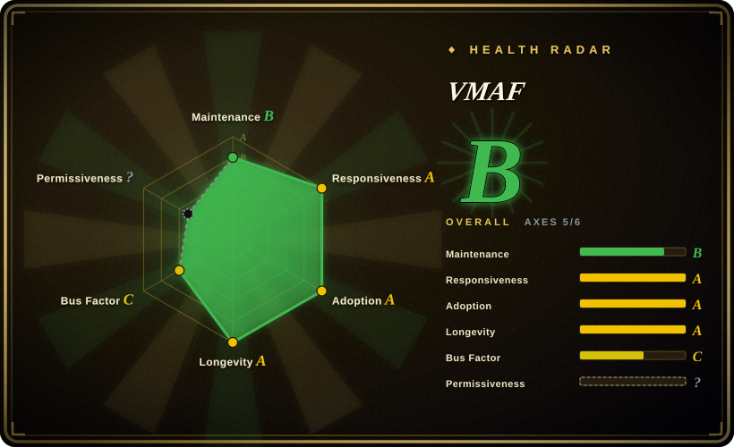
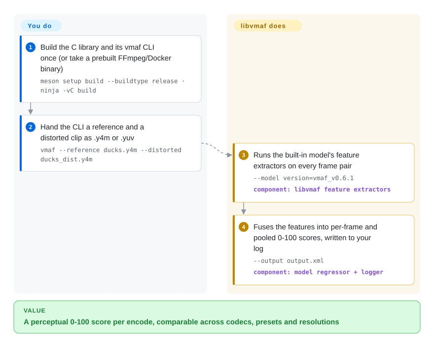

# VMAF

Your encoder ladder promised a bitrate saving, but "smaller file" is not "same picture" — and classic PSNR/SSIM diverge from what viewers actually notice, so they can't referee the tradeoff. VMAF is Netflix's Emmy-winning perceptual metric: a C library (`libvmaf`) that compares an encoded video against its reference frame by frame and outputs a 0–100 score tuned to correlate with human judgment, also bundling PSNR/SSIM/MS-SSIM/CIEDE2000 and the CAMBI banding detector, exposed as a `vmaf` CLI, an FFmpeg filter, and a Python wrapper.

## When to use

You're a video engineer tuning an encoding ladder, and "the bitrate dropped" isn't the question you actually care about — "did quality drop in a way viewers will notice" is. Raw PSNR/SSIM correlate poorly with what people see, so you reach for VMAF: you take a reference clip and an encoded clip, run the `vmaf` CLI (or wire `libvmaf` into your pipeline, or use FFmpeg's built-in `libvmaf` filter), and get a 0–100 perceptual score you can compare across codecs, presets, and resolutions to pick the operating point. It's the de-facto industry metric for codec/encoder evaluation — AOM specifies it as the standard implementation metrics tool in its common test conditions (CTC) — so reporting VMAF makes your results comparable with the broader community. Since mid-2026 there are two model generations to choose between (legacy v0 and the new v1), which matters most when your results must line up with a specific report's methodology.

You also use it when you need *more than one* metric from a single, optimized implementation: `libvmaf` bundles PSNR/PSNR-HVS/SSIM/MS-SSIM/CIEDE2000 and CAMBI (banding) behind one interface via `--feature` flags, its fixed-point SIMD build is fast enough for large sweeps, and the Python package lets you train/validate custom VMAF models on your own content.

## How it works

`libvmaf` computes a score for one *pair* of videos — the pristine reference and the encoded (distorted) version — frame by frame. Inside, several feature extractors run on each frame pair (VIF at multiple scales, the additive decomposition model ADM that captures banding/blurring/motion differences, motion, plus optional PSNR/SSIM/CIEDE2000 via `--feature`), and a trained regression **model** fuses those features into the single 0–100 number — "multi-method fusion" is the name's meaning. Models are built into the library (or supplied as `.json` model files), so the knob you must consciously set is *which* model: v0.6.1 is the CLI default, the v1 generation (vmaf_v1.0.16, 2026-06) is Netflix's current recommendation with per-target-resolution variants, and NEG mode exists for codec bake-offs where you don't want enhancement gain credited. What you do: align and feed the two clips (the `vmaf` CLI takes `.y4m`/`.yuv` pairs; FFmpeg handles decoding and scaling for you), pick the model, read the log. What you still own: interpretation — the score is only comparable within one model and preprocessing methodology.

<!-- flow-steps:begin (generated from flows/vmaf.json by tools/flow_card.py — do not edit) -->

Text version of the flow

1. **You**: Build the C library and its vmaf CLI once (or take a prebuilt FFmpeg/Docker binary) — `meson setup build --buildtype release · ninja -vC build`
2. **You**: Hand the CLI a reference and a distorted clip as .y4m or .yuv — `vmaf --reference ducks.y4m --distorted ducks_dist.y4m`
3. **VMAF**: Runs the built-in model's feature extractors on every frame pair — `--model version=vmaf_v0.6.1` — component: `libvmaf feature extractors`
4. **VMAF**: Fuses the features into per-frame and pooled 0-100 scores, written to your log — `--output output.xml` — component: `model regressor + logger`

**Value**: A perceptual 0-100 score per encode, comparable across codecs, presets and resolutions

<!-- flow-steps:end -->

## When NOT to use

- **No-reference / live quality monitoring.** VMAF is **full-reference** — it needs the pristine source alongside the distorted video, frame-aligned. For in-the-wild streams where you don't have the reference, it doesn't apply (no-reference metrics are a different family).
- **You want a single absolute "good/bad" threshold.** VMAF is a *relative* comparison tool; scores depend on the model, content, and viewing assumptions — Netflix ships multiple models (v0, and the v1 generation published 2026-06) and warns about enhancement-gain gaming (hence NEG mode). Treat it as comparative, not an absolute pass/fail. [推断]
- **You're scoring still images / audio.** It's video-quality specific (for images, SSIMULACRA2 or similar is the better fit).
- **You need a zero-build, pure-Python install.** The core is a C library built with Meson/Ninja (README pins: Meson ≥0.56.1, Ninja ≥1.7.1, NASM ≥2.13.02 for x86, Python ≥3.6); the Python wrapper's model tooling rides on top, but scoring speed lives in the compiled `libvmaf` — most users take a prebuilt binary, Homebrew's `libvmaf`, or an FFmpeg built with `--enable-libvmaf` instead of compiling.
- **You can't accept the patent-clause license terms.** It's BSD+Patent (relicensed from Apache-2.0 on 2020-02-27, per the README news section) — permissive *with an express patent grant*; fine for most, but read it if your org has specific patent-clause policies.
- **You're optimizing for a metric without validating it on your content.** VMAF was trained on particular datasets; for atypical content (screen content, HDR edge cases) validate or train a model before trusting the number, and don't compare numbers across model versions. [推断]

## Comparison

| Alternative | In index | Our verdict | Tradeoff |
|---|---|---|---|
| PSNR / SSIM (standalone) | 未收录 | When you need a cheap sanity baseline you can compute anywhere, classic PSNR/SSIM still earn their place; the moment the decision hinges on *perceived* quality (codec bake-offs, ladder points), choose VMAF — which is precisely why libvmaf bundles both so you can report them side by side. | Classic signal-fidelity metrics; cheap and ubiquitous but correlate poorly with perceived quality — VMAF exists precisely because they fall short (and libvmaf includes them anyway). |
| [FFmpeg](../video-audio/transcoding-and-pipelines/ffmpeg.md) | ✅ | Choose FFmpeg when you need to run `libvmaf` as a filter inside a media pipeline. | Integrates `libvmaf` as a filter — for most users *the* way you actually run VMAF in a pipeline; FFmpeg is the host, VMAF is the metric engine inside it. |
| [SSIMULACRA2](ssimulacra2.md) | ✅ | When the subject is still-image fidelity (cover art, thumbnails, JPEG XL re-encodes), SSIMULACRA2 is the sharper perceptual pick; for video sequences and codec-ladder decisions, VMAF has the frame-pair workflow, the industry-reporting convention, and CAMBI. | A newer open perceptual metric (from the JPEG XL ecosystem) gaining traction for image/video quality; alternative perceptual scorer, different model lineage. |
| Netflix VMAF cloud/SaaS scorers | 非仓库 | If you'd rather not run libvmaf at all, hosted quality-scoring services exist — but they're products, not repos: convenience bought with vendor dependence and per-clip billing. | Hosted quality-scoring services; not a repository — convenience over running libvmaf yourself, with vendor dependence. |
| AVQT / proprietary metrics | 非仓库 | Choose vendor perceptual metrics (e.g. Apple's AVQT) only when a specific platform's acceptance pipeline requires them; otherwise you trade the community-comparability that makes VMAF the reporting default for a closed scorer. | Vendor perceptual metrics (e.g. Apple's AVQT); comparable goal, closed implementations and ecosystems. |

## Tech stack

- **Language:** core in **C** (`libvmaf`), built with **Meson + Ninja**; x86 SIMD-optimized (AVX2/AVX-512) fixed-point implementation for speed (NASM needed for x86 builds).
- **Interfaces:** a standalone `vmaf` command-line tool (`libvmaf/tools/`), the `libvmaf` C API for embedding, and a **Python** library for training/testing/validation and dataset/plotting tooling.
- **Integrations:** shipped as an FFmpeg filter (`--enable-libvmaf`, with documented filter-graph examples); Dockerfile provided; Windows build supported.
- **Models:** built-in models compiled into the library; swappable via `--model version=…` or `--model path=….json` — legacy v0 (`vmaf_v0.6.1` is the CLI default) and the v1 generation (`vmaf_v1.0.16`, 2026-06) with resolution/HFR variants, plus NEG (No Enhancement Gain) mode to resist enhancement gaming.

## Dependencies

- **Build:** a C toolchain plus **Meson ≥0.56.1 and Ninja ≥1.7.1** (NASM ≥2.13.02 for x86 SIMD, `xxd`, Python ≥3.6 for build scripts); or use prebuilt binaries / the provided Docker image / Homebrew's `libvmaf` formula.
- **Python tooling:** the Python wrapper needs Python and its scientific deps (numpy/scipy-class) for model training/validation/plotting.
- **Runtime:** the reference + distorted video frames (`.y4m`/`.yuv`, typically decoded via FFmpeg) and a model (built-in by default); no databases or network services to run.
- **Optional host:** FFmpeg, if you run VMAF as an FFmpeg filter rather than via the standalone tool — the repo documents this path with filter-graph examples and expected `[libvmaf] VMAF score: …` output.

## Ops difficulty

**Medium.** The conceptual use is simple (feed reference + distorted, get a score), but the *engineering* has real edges: building the C library (Meson/Ninja) or sourcing the right prebuilt binary, choosing and pinning the correct **model** (v0 vs v1, NEG vs default, per-resolution variants) for your content and reporting context, ensuring frames are aligned/same-resolution (the FFmpeg docs stress frame-rate and PTS handling — filters synchronize on timestamps, not frames), and the compute cost of scoring large catalogs. Most teams sidestep the build by running it through FFmpeg or Docker. The subtle operational risk is *methodological* — picking the wrong model or comparing scores across model versions silently invalidates conclusions.

## Health & viability

- **Responsiveness** (2026-09): Grade A on the radar — median first response 7.5h across 6 qualifying issues/PRs; release engineering is still responsive (v3.1.0 → v3.2.0 → v3.2.1 across 2026, CAMBI SIMD work landing through September 2026).
- **Maintenance (2026-09) — Grade B, patchy-but-live.** Latest release `libvmaf v3.2.1` on 2026-09-14, last commit to `master` 2026-09-16 (CAMBI AVX2 work; GitHub API); the radar docked the grade from A because activity hit only 5 of the trailing 13 weeks — bursts separated by quiet stretches, the same shape as the 2023-12 → 2026-04 gap between v3.0.0 and v3.1.0. Worth pinning against, not a decay signal now. Not archived.
- **Governance / bus factor.** Netflix-backed, but contribution concentrates: the scorer measures ~15 active committers in 12 months with top-1 share ~77% — effectively the long-time libvmaf owner inside Netflix plus a wider reviewer pool. Backing is the strongest kind available for this niche (the metric Netflix itself encodes against), but roadmap ownership is one company's video team, not a foundation.
- **Age & Lindy verdict.** Created 2016-02 (~10.6 years), Emmy-winning, still actively developed, embedded in FFmpeg and every major encoder-evaluation workflow ⇒ **strong Lindy** — old, still-moving, and institutionally used.
- **Adoption.** ~5.5k stars understates it: the real reach is Homebrew installs (~193k/90d in the current scorer run), release binaries, and being the metric baked into FFmpeg — plus AOM CTC designation. Star count is a weak proxy for a library most people consume through FFmpeg builds.
- **Risk flags.** The 2020 Apache-2.0 → BSD+Patent relicense is the standing flag: permissive *with* an express patent grant, but orgs with patent-clause policies should read it (GitHub's classifier still reports NOASSERTION, so the radar's license axis is `?`). Netflix unilateral control of the models (v0/v1 transition) is a methodology risk, not a legal one: cross-model comparisons silently break.

## Caveats (unverified)

- [未验证] ~5.5k stars as of 2026-09 (GitHub API) — date-sensitive and a weak adoption proxy for an FFmpeg-embedded library.
- [推断] License is BSD-2-Clause-Patent: the README news entry (2020-02-27) and LICENSE file state BSD+Patent, but GitHub's API reports `NOASSERTION`, so the SPDX id rests on reading the repo files, not the classifier.
- [推断] "Model choice silently invalidates comparisons" and "validate on atypical content" are methodological inferences from the multi-model/NEG design and the README's own caveats, not a measured failure.
- [未验证] Python wrapper's exact dependency set (numpy/scipy-class) is from README/inference; the packaging metadata was not re-read this pass.
- [未验证] SSIMULACRA2 / AVQT characterizations in *Comparison* are from general ecosystem knowledge; the AVQT "non-repo" status reflects Apple not open-sourcing it as far as can be checked here — confirm if load-bearing.
