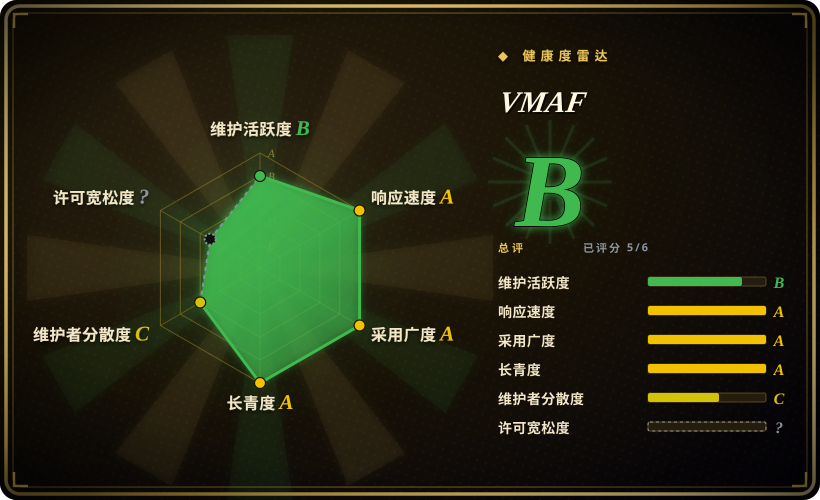
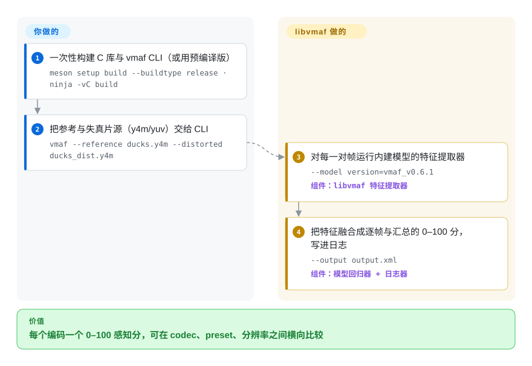

# VMAF

编码阶梯承诺省一笔码率，但“文件更小”不等于“画面没变”——而经典的 PSNR/SSIM 与观众实际察觉的东西相关性很差，没法替这个取舍当裁判。VMAF 是 Netflix 获 Emmy 奖的感知质量指标：一个 C 库（`libvmaf`）把编码后的视频与参考视频逐帧成对比较，输出与人工评判对齐的 0–100 分，同时内置 PSNR/SSIM/MS-SSIM/CIEDE2000 与 CAMBI 色带检测器，对外有 `vmaf` CLI、FFmpeg 滤镜和 Python wrapper 三张面孔。

## 何时使用

你是视频工程师，在调编码阶梯，而你真正在意的问题不是“码率掉了”，而是“画质是不是以观众会察觉的方式掉了”。裸 PSNR/SSIM 与人眼所见相关性差，于是你转向 VMAF：拿一个参考片段和一个编码后片段，跑 `vmaf` CLI（或把 `libvmaf` 接进你的管线，或用 FFmpeg 内建的 `libvmaf` 滤镜），得到一个 0–100 的感知分数，用它在不同 codec、preset、分辨率间比较以选定工作点。它是 codec/编码器评测的事实标准指标——AOM 在其通用测试条件（CTC）里指定它为标准的实现度量工具——所以报告 VMAF 能让你的结果与更广社区可比。自 2026 年年中起有两代模型可选（旧 v0 与新的 v1），当你的结果必须对齐某份报告的方法学时，这一点的分量最大。

当你想从一份单一、优化过的实现里拿到*不止一个*指标时也会用它：`libvmaf` 用 `--feature` 开关把 PSNR/PSNR-HVS/SSIM/MS-SSIM/CIEDE2000 和 CAMBI（色带）收在一个接口背后，定点 SIMD 构建的速度足以支撑大规模扫描，Python 包还能在你自己的内容上训练/验证自定义 VMAF 模型。

## 怎么用起来

`libvmaf` 为*一对*视频——原始参考与编码后的失真版本——逐帧算分。内部机制：若干特征提取器在每对帧上运行（多尺度 VIF、捕捉色带/模糊/运动差异的加法分解模型 ADM、运动特征，外加经 `--feature` 开启的 PSNR/SSIM/CIEDE2000），再由一个训练好的回归**模型**把这些特征融合成那个 0–100 的单一数字——“多方法融合”正是名字的含义。模型编译进库内（也可以用 `.json` 模型文件提供），所以你需要有意识设定的旋钮是*用哪个*模型：v0.6.1 是 CLI 默认，v1 一代（vmaf_v1.0.16，2026-06）是 Netflix 当前的推荐并有按目标分辨率的变体，codec 对决不想把增强增益算进分数时用 NEG 模式。你要做的：对齐并喂入两条片源（`vmaf` CLI 吃 `.y4m`/`.yuv` 对；FFmpeg 会替你解码与缩放），选定模型，读日志。仍归你管的：解读——分数只在同一模型与同一预处理方法学内可比。

<!-- flow-steps:begin (generated from flows/vmaf.json by tools/flow_card.py — do not edit) -->

流程文字版

1. **你**：一次性构建 C 库与 vmaf CLI（或用预编译版） — `meson setup build --buildtype release · ninja -vC build`
2. **你**：把参考与失真片源（y4m/yuv）交给 CLI — `vmaf --reference ducks.y4m --distorted ducks_dist.y4m`
3. **VMAF**：对每一对帧运行内建模型的特征提取器 — `--model version=vmaf_v0.6.1` — 组件：`libvmaf 特征提取器`
4. **VMAF**：把特征融合成逐帧与汇总的 0–100 分，写进日志 — `--output output.xml` — 组件：`模型回归器 + 日志器`

**价值**：每个编码一个 0–100 感知分，可在 codec、preset、分辨率之间横向比较

<!-- flow-steps:end -->

## 何时不用

- **无参考 / 在线质量监控。** VMAF 是**全参考**的——它需要原始无损源与失真视频逐帧对齐地并排。对于你拿不到参考的实际线上流，它不适用（无参考指标是另一族）。
- **你想要一个绝对的“好/坏”阈值。** VMAF 是个*相对*比较工具；分数取决于模型、内容和观看假设——Netflix 自己就发多个模型（v0，以及 2026-06 发布的 v1 一代）并警告 enhancement-gain 作弊（故有 NEG 模式）。当作比较用，而非绝对的通过/不通过。[推断]
- **你在给静态图像 / 音频打分。** 它专门针对视频质量（图像请优先考虑 SSIMULACRA2 一类）。
- **你需要零编译、纯 Python 的安装。** 核心是用 Meson/Ninja 构建的 C 库（README 钉版：Meson ≥0.56.1、Ninja ≥1.7.1、x86 需 NASM ≥2.13.02、Python ≥3.6）；Python wrapper 的模型工具在其上，但打分速度活在编译产物 `libvmaf` 里——多数用户取预编译二进制、Homebrew 的 `libvmaf` 或带 `--enable-libvmaf` 的 FFmpeg，而不是自己构建。
- **你无法接受带专利条款的许可。** 它是 BSD+Patent（README 新闻区记录：2020-02-27 从 Apache-2.0 重新授权）——宽松且*带明确专利授予*；对多数人没问题，但若你所在组织对专利条款有特定政策请通读。
- **你在不对自己内容做验证的情况下优化某个指标。** VMAF 在特定数据集上训练；对非典型内容（屏幕内容、HDR 边角情况）请先验证或训练一个模型再信那个数字，且别跨模型版本比分数。[推断]

## 横向对比

| 替代品 | 是否收录 | 我们的评价 | 取舍 |
|---|---|---|---|
| PSNR / SSIM（独立） | 未收录 | 需要一个随处可算的廉价健全性基线时，经典 PSNR/SSIM 仍有一席之地；当决策取决于*感知*质量（codec 对决、阶梯选点）时，选 VMAF——而 libvmaf 把两者都内置，正是为了让你能并排报告。 | 经典的信号保真指标；便宜、无处不在，但与感知质量相关性差——VMAF 正因它们不够用而存在（而 libvmaf 也照样内含它们）。 |
| [FFmpeg](../video-audio/transcoding-and-pipelines/ffmpeg.zh.md) | ✅ | 需要在媒体管线里把 `libvmaf` 作为滤镜运行时，选 FFmpeg。 | 把 `libvmaf` 作为滤镜集成——对多数用户而言这才是你在管线里真正跑 VMAF 的方式；FFmpeg 是宿主，VMAF 是其中的指标引擎。 |
| [SSIMULACRA2](ssimulacra2.zh.md) | ✅ | 对象是静帧保真（封面、缩略图、JPEG XL 重编码）时，SSIMULACRA2 是更利的感知选择；对视频序列与 codec 阶梯决策，VMAF 有帧对工作流、行业报告惯例和 CAMBI。 | 一个更新的开源感知指标（出自 JPEG XL 生态），在图像/视频质量上渐获关注；另一种感知打分器，模型谱系不同。 |
| Netflix VMAF 云/SaaS 打分 | 非仓库 | 干脆不想自己跑 libvmaf 时，存在托管的质量打分服务——但它们是产品不是仓库：省事换来厂商依赖与按条计费。 | 托管的质量打分服务；不是仓库——比自跑 libvmaf 省事，但有厂商依赖。 |
| AVQT / 专有指标 | 非仓库 | 只有当某个平台的准入流水线点名要求厂商感知指标（如 Apple 的 AVQT）时才选它们；否则你就是在用社区可比性（VMAF 成为报告默认的原因）换一个封闭打分器。 | 厂商感知指标（如 Apple 的 AVQT）；目标相近，实现与生态封闭。 |

## 技术栈

- **语言：** 核心是 **C**（`libvmaf`），用 **Meson + Ninja** 构建；x86 SIMD 优化（AVX2/AVX-512）的定点实现以提速（x86 构建需 NASM）。
- **接口：** 独立的 `vmaf` 命令行工具（`libvmaf/tools/`）、用于嵌入的 `libvmaf` C API，以及一个用于训练/测试/验证及数据集/绘图工具的 **Python** 库。
- **集成：** 作为 FFmpeg 滤镜随发（`--enable-libvmaf`，文档给出滤镜图示例）；提供 Dockerfile；支持 Windows 构建。
- **模型：** 内建模型编译入库；经 `--model version=…` 或 `--model path=….json` 替换——旧 v0（CLI 默认 `vmaf_v0.6.1`）与 v1 一代（`vmaf_v1.0.16`，2026-06，含分辨率/HFR 变体），外加 NEG（No Enhancement Gain）模式以抵抗增强作弊。

## 依赖

- **构建：** 一套 C 工具链加 **Meson ≥0.56.1 与 Ninja ≥1.7.1**（x86 SIMD 需 NASM ≥2.13.02、`xxd`，构建脚本需 Python ≥3.6）；或用预编译二进制 / 提供的 Docker 镜像 / Homebrew 的 `libvmaf` 公式。
- **Python 工具：** Python wrapper 需要 Python 及其科学计算依赖（numpy/scipy 一类）来做模型训练/验证/绘图。
- **运行时：** 参考与失真的视频帧（`.y4m`/`.yuv`，通常经 FFmpeg 解码）和一个模型（默认用内建的）；没有要跑的数据库或网络服务。
- **可选宿主：** FFmpeg，若你把 VMAF 当 FFmpeg 滤镜跑而非用独立工具——仓库文档给了滤镜图示例与预期的 `[libvmaf] VMAF score: …` 输出。

## 运维难度

**中。** 概念上的用法很简单（喂参考 + 失真，拿分数），但*工程*有真实的棱角：构建 C 库（Meson/Ninja）或找对预编译二进制、为你的内容与报告语境选定并锁住正确的**模型**（v0 vs v1、NEG vs 默认、按分辨率的变体）、确保帧对齐/同分辨率（FFmpeg 文档强调帧率与 PTS 处理——滤镜按时间戳而非帧序号对齐），以及给大目录打分的算力成本。多数团队靠经 FFmpeg 或 Docker 跑来绕开构建。微妙的运维风险是*方法论上的*——选错模型或跨模型版本比较分数，会悄无声息地让结论失效。

## 健康度与可持续性

- **响应速度**（2026-09）：雷达 Grade A——6 个 qualifying issue/PR 的中位首次响应 7.5 小时；发布工程仍在跟进（2026 年内 v3.1.0 → v3.2.0 → v3.2.1，CAMBI 的 SIMD 工作 9 月仍在落地）。
- **维护（2026-09）——Grade B，沉寂相间但仍活着。** 最新发布 `libvmaf v3.2.1` 于 2026-09-14，`master` 最后提交 2026-09-16（CAMBI AVX2 工作；GitHub API）；雷达把该轴从 A 降为 B，因为最近 13 周里只有 5 周有活动——一阵一阵的节奏，与 v3.0.0 和 v3.1.0 之间 2023-12 到 2026-04 的空档同形。值得锁版本防范，但此刻不是衰退信号。未归档。
- **治理 / bus factor。** Netflix 背书，但贡献高度集中：评分器测得 12 个月内约 15 位活跃提交者、top-1 占比约 77%——实质是 Netflix 内部长期主导 libvmaf 的那个人加一圈评审。在这个小生境里这是最强的一类背书（Netflix 自己就用这个指标做编码），但路线图的归属是一家公司的视频团队，不是基金会。
- **年龄与 Lindy 判断。** 2016-02 创建（约 10.6 年）、获 Emmy、仍在积极开发、被嵌进 FFmpeg 和各大编码器评测工作流 ⇒ **强 Lindy**——够老、还在动、且被机构性地使用。
- **采用度。** 约 5.5k star 低估了它：真实的触达是 Homebrew 安装量（本轮评分器读数约 19.3 万/90 天）、release 二进制、被烤进 FFmpeg，再加上 AOM CTC 指定。对一个多数人经由 FFmpeg 构建来消费的库，star 数是弱代理。
- **风险标记。** 2020 年 Apache-2.0 → BSD+Patent 的重新授权是常立旗号：宽松且*带*明确专利授予，但对专利条款有政策的组织应通读（GitHub 分类器至今报 NOASSERTION，故雷达的许可轴记 `?`）。Netflix 对模型的单方面控制（v0/v1 换代）是方法学风险而非法律风险：跨模型比较会悄悄失效。

## 存疑（未验证）

- [未验证] 截至 2026-09 约 5.5k star（GitHub API）——对时间敏感，且对被嵌入 FFmpeg 的库是弱采用代理。
- [推断] 许可为 BSD-2-Clause-Patent：README 新闻条目（2020-02-27）与 LICENSE 文件写明 BSD+Patent，但 GitHub API 报 `NOASSERTION`，故 SPDX id 立于读仓库文件而非分类器。
- [推断] “选错模型会悄悄让比较失效”和“非典型内容要先验证”是从多模型/NEG 设计与 README 自身告诫做出的方法论推断，而非测得的失败。
- [未验证] Python wrapper 的确切依赖集合（numpy/scipy 一类）取自 README/推断，本轮未重读打包元数据。
- [未验证] 横向对比里对 SSIMULACRA2 / AVQT 的刻画取自对生态的一般认知；AVQT 的“非仓库”状态反映的是据本节查能确认 Apple 未将其开源——若该点关键请再核实。
