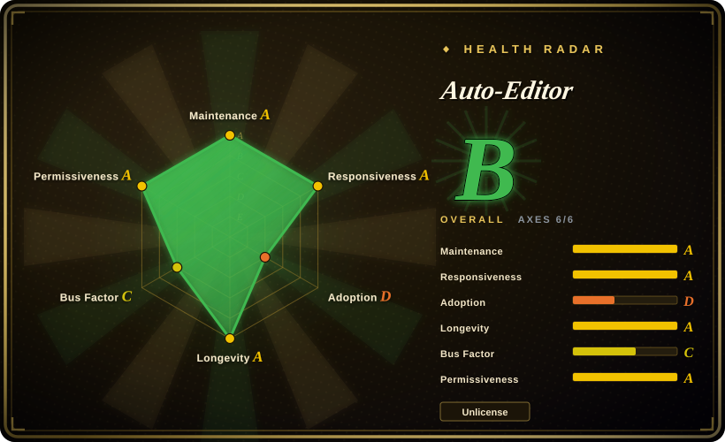
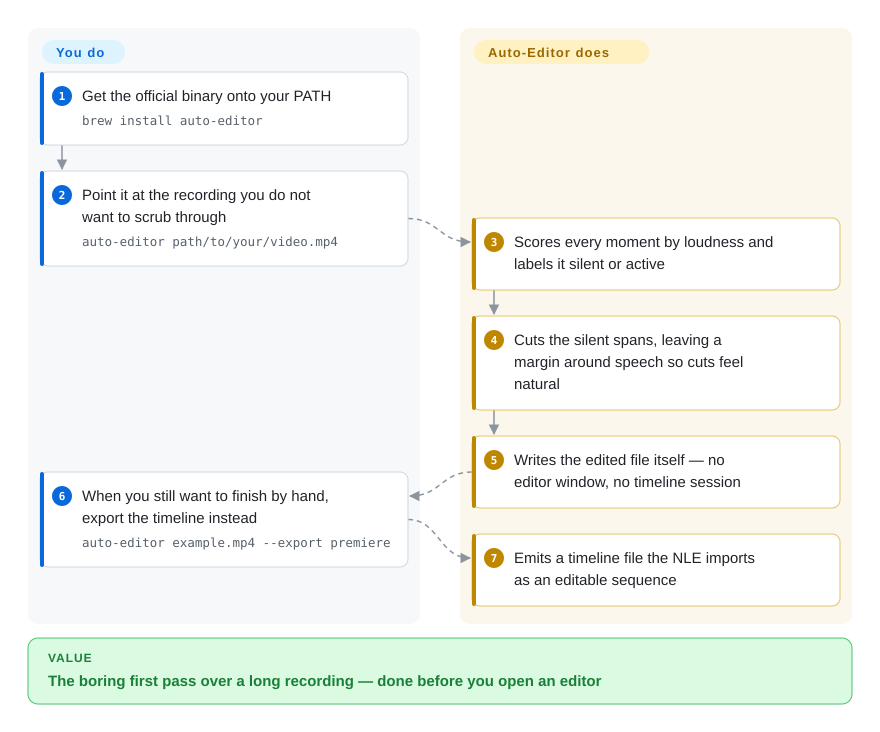

# Auto-Editor

A command-line first-pass editor: point it at footage and it cuts the dead air by measuring loudness (or motion, or your own subtitle text), then writes a trimmed file or an importable timeline for Premiere / Resolve / Final Cut / Shotcut / Kdenlive.

## When to use

You record long-form talking material — interviews, tutorials, podcasts, screen recordings with voice-over — and the first hour of work is always the same: scrub through it and delete the silence. You want that pass done before you open an NLE, and you want the machine to make the *decision* (where the cuts go) rather than just execute cuts you already mapped out.

Reach for auto-editor because one command with no project file turns an hour of raw footage into a rough cut, and because it hands the result back in either form you might need: a rendered `video_ALTERED.mp4`, or a timeline export that opens in your editor with the cuts already placed and the original media un-re-encoded. The deciding tradeoff against its nearest substitutes: [MoviePy](moviepy.md) and FFmpeg hand you the *mechanism* but leave the keep/cut rule to you, [Descript](https://descript.com) hosts a better editing UI but is closed, account-bound and priced per seat — auto-editor is the local, scriptable version of "just cut the silence". It also covers the transcript route: `auto-editor whisper` writes an SRT, and `--edit word:<value>` then cuts on what was *said* rather than on loudness.

## How it works

Auto-Editor reads the media's audio stream (the default method is `--edit audio:threshold=0.04`), measures loudness over time, and gives every moment an integer **label** — `0` for silent, `1` for active — then applies an action per label (cut, keep, speed). You control the rule, not the individual cuts: thresholds in percent or dB, `motion` instead of audio for silent screen recordings, extra label classes up to 255 with `--edit:N` / `--when:N`, and `--margin` padding so cuts don't clip consonants. The output side is deliberately two-headed: it either writes a new media file through its own FFmpeg-backed encoder, or emits a project file that references the source media — which is why handing off to a human editor costs no re-encode and loses nothing. What stays your job: choosing the threshold that matches your room tone, and deciding whether the deliverable is a file or a timeline.

<!-- flow-steps:begin (generated from flows/auto-editor.json by tools/flow_card.py — do not edit) -->

Text version of the flow

1. **You**: Install the CLI — Homebrew, the AUR, or an official binary — `brew install auto-editor`
2. **You**: Point it at the footage; there is no project file to create — `auto-editor video.mp4`
3. **Auto-Editor**: Measures loudness over time and labels each moment silent (0) or active (1)
4. **Auto-Editor**: Cuts the silent stretches, keeps 0.2 s of margin, writes video_ALTERED.mp4
5. **You**: When a human should finish the cut, export a timeline instead of a file — `auto-editor video.mp4 --export resolve`
6. **Auto-Editor**: Writes an editor project referencing the original media, so nothing is re-encoded

**Value**: A dead-air-free cut without listening through the footage — or a timeline a professional editor picks up

<!-- flow-steps:end -->

## When NOT to use

- **The cut is creative, not mechanical.** auto-editor has no timeline UI, no preview playback, no multicam, no colour — it decides keep/cut by a numeric rule. Use [Concat](../../video-editing/concat.md) or [OpenCut](../../video-editing/opencut.md) for a GUI, or a commercial NLE (未收录) when a human must judge every frame.
- **The edit is one step inside a Python pipeline you already own.** Reach for [MoviePy](moviepy.md) or [FFmpeg](../transcoding-and-pipelines/ffmpeg.md) directly: auto-editor is a binary with a CLI, not a library, so embedding it means shelling out and parsing output. If you need frame-level access, use [PyAV](../transcoding-and-pipelines/pyav.md).
- **You want hosted, collaborative text-based editing.** That is [Descript](https://descript.com) (未收录) or similar SaaS, at the cost of the footage leaving your machine; auto-editor runs offline and has no web UI or review workflow.
- **`pip install auto-editor` is part of your deployment.** The author has **stopped publishing the CLI on PyPI** — the installing page says so explicitly — so pin the Homebrew formula, the AUR package or a release binary instead.
- **You need transcription quality guarantees or speaker diarization.** The `whisper` subcommand bundles whisper.cpp targets only (Whisper GGML models, NVIDIA Parakeet GGUF, or Apple's on-device transcriber on macOS 26+); for word-level diarization, translation-heavy workflows or a managed API, use [OpenAI Whisper](../speech-and-subtitles/whisper.md) yourself or a cloud ASR.
- **The footage is huge and the disk is not.** The default path writes a *new* file rather than trimming in place; run `--preview` first when you only need to know what would be cut.

## Comparison

| Alternative | In index | Our verdict | Tradeoff |
| --- | --- | --- | --- |
| [FFmpeg](../transcoding-and-pipelines/ffmpeg.md) | ✅ | When you are already building a filter graph and only need silence *detection*, pick FFmpeg's `silencedetect`; pick auto-editor when you want the cut decision plus the output written for you, because `silencedetect` prints timestamps that you then have to turn into segments and an encode yourself. | FFmpeg is the universal engine with no opinion about your edit; auto-editor is an opinionated wrapper that also emits Premiere/Resolve/FCP/FCPXML-class projects. |
| [MoviePy](moviepy.md) | ✅ | When the edit is programmatic and you know the timeline you want, pick MoviePy; pick auto-editor when the timeline itself is the unknown (where are the silences?), because MoviePy executes your decision while auto-editor derives it from the media. | MoviePy: Python API, in-process, renders anywhere; auto-editor: binary CLI with its own label/action model and NLE hand-off. |
| [OpenAI Whisper](../speech-and-subtitles/whisper.md) | ✅ | When you need transcription alone, pick Whisper (or a cloud ASR); pick auto-editor when the transcript is an *input to cutting* — `auto-editor whisper … --format srt` plus `--edit word:question` cuts on spoken content, which Whisper cannot do on its own. | Whisper: best-in-class ASR, no editing model, you script everything; auto-editor: one bundled GGML/Parakeet path plus the edit model, but no diarization and no quality knobs beyond the bundled models. |
| [Concat](../../video-editing/concat.md) | ✅ | When a person must see and adjust the cut, pick Concat or a commercial NLE; pick auto-editor when the first pass is mechanical and only the finishing should be manual, because Concat is a full AGPL editor you operate while auto-editor is a pre-pass you script. | Concat: interactive, renders everywhere, immature beta; auto-editor: one-shot, no UI, and it feeds the editor you already use. |
| Descript (closed SaaS) | 未收录 | When editing by transcript in a browser with team review matters more than locality, pick Descript; pick auto-editor when the footage cannot leave the machine or must run in CI, because Descript is account-bound, per-seat priced and closed. | Descript: polished text-based editing and collaboration; auto-editor: offline, free, scriptable, no transcription UI or review workflow. |

## Tech stack

- Written in **Nim** (71 `.nim` files in `src/`), shipped as a single CLI binary plus a docs site generated from `docs/`.
- Cutting/encoding is driven by an FFmpeg-backed writer; transcription uses whisper.cpp / GGML models (Whisper, NVIDIA Parakeet GGUF) or Apple's on-device transcriber on macOS 26+.
- Label/action model: integer labels (`0` silent, `1` active, up to 255 via `--edit:N` / `--when:N`) with per-label actions such as `cut`, `nil`, `speed:8`.
- Editor hand-off is a documented timeline format (v1/v2/v3 docs on the site) plus exporters for Premiere, Resolve, Final Cut Pro, Shotcut, Kdenlive and `clip-sequence`.
- Ships four first-party agent skills under `skills/` (`auto-editor`, `-effects`, `-export`, `-transcribe`), installable with `npx skills add WyattBlue/auto-editor`.
- CI: `.github/workflows/build.yml` plus `smoke.yml`.

## Dependencies

- **Binary install (recommended):** an official unsigned release binary; Homebrew (`brew install auto-editor`, whose deps pull `ffmpeg`, `ggml`, `whisper.cpp`); Arch AUR (`yay -S auto-editor`).
- **Source build:** Nim + nimble, plus cmake, meson, ninja; `nimble makeff && nimble make` for a static build.
- **Transcription (optional):** a GGML model file you fetch yourself (e.g. `ggml-medium.en.bin`) or Apple's built-in transcriber; microphone capture via `:mic` needs only an input device.
- **URL inputs (optional):** a `yt-dlp` binary on `PATH`.
- No server, database, GPU, account or network dependency; the pip channel is discontinued.

## Ops difficulty

**Low to run, low-medium to keep current.** There is nothing to deploy or monitor — one binary, no daemon, no state. The friction is packaging rather than operation: release binaries are unsigned (macOS "unknown developer" warnings and Gatekeeper friction), the PyPI channel is dead so any `pip install auto-editor` line in an old runbook installs a stale build, and source builds need a Nim toolchain plus FFmpeg dev libs. Transcription adds local model files to provision. Budget one verification run against the exact build and threshold you will use in production, because the threshold that works is a property of your recordings, not of the tool.

## Health & viability

- **Maintenance (radar A, 2026-09-21):** unusually steady. Created 2020-04-30, 2,531 commits, last push 2026-09-19, releases 31.4.2 → 31.5.0 → 31.6.0 on 2026-07-31 / 08-13 / 09-06; **zero open issues**, with Issues and Discussions both enabled, median first-response on the four recent qualifying issues of ~2.5 h (radar A), and CI on `build.yml` + `smoke.yml`.
- **Governance / bus factor (radar C):** one author (`WyattBlue`) holds 99.1% of commits across 15 contributors — a textbook single-point-of-failure, mitigated by six and a half years of continuous release discipline. No foundation, no company, no commercial entity behind the repo. [推断] A Nim codebase narrows the pool of drive-by contributors, so the bus factor is unlikely to fix itself.
- **Backing & Lindy (radar A):** the strongest Lindy profile in this batch — 2,335 days old *and* still shipping, which is exactly the prior this index rewards; the timeline-format docs (v1→v3) show the core has been formalized rather than accreted.
- **Adoption & ecosystem (radar D):** ~5.3k stars / 655 forks, packaged in Homebrew and the AUR, plus a hosted online/app offering and four agent skills in-repo — attention has converted into distribution, not just stars. The low axis score is a registry artifact: the retired PyPI package still logs 18,055 downloads a month while resolving to the stale 29.3.1 build, so package-metric adoption understates real use.
- **Risk flags (radar A):** repo is **Unlicense** (public domain) but the README warns that release *binaries* may carry other OSS licenses, and that the hosted app's own assets are under a separate proprietary license — do not assume the whole stack is public domain. The discontinued pip channel is the practical risk: old automation keeps installing a build roughly a year behind the releases.

## Caveats (unverified)

- [未验证] Nothing on this page was executed: every command comes from the README, `https://auto-editor.com/docs/cookbook` and `https://auto-editor.com/installing` as read on 2026-09-21.
- [未验证] Star / fork / commit / issue counts are point-in-time GitHub API values (2026-09-21) and move quickly on a repo this active.
- [未验证] The retired-pip claim was read from the installing page, while the registry still serves `auto-editor` 29.3.1 with ~18k downloads in the last month — that combination is a snapshot of metrics, and whether `pip install auto-editor` still succeeds was not attempted.
- [未验证] The transcription claim ("Parakeet is the most accurate") and the backend behaviours (Apple model downloads, language auto-detection limits) are the bundled skill document's own statements, not benchmarks run here.
- [未验证] The four bundled skills' activation fidelity per harness (Claude Code / Codex / Cursor / Kimi) was not tested; only their presence in `skills/` was verified.
- [推断] Zero open issues is read as fast triage rather than zero defects — the issue tracker is enabled, so the queue is genuinely empty at this snapshot.
- [未验证] The release-binary license divergence and the hosted app's proprietary-asset carve-out are README statements; no licence audit was performed.
- [未验证] Media beyond the documented supported-media list, and behaviour when the chosen threshold mislabels a recording, were not exercised; the threshold's correctness is a property of your room tone, not of the tool.
