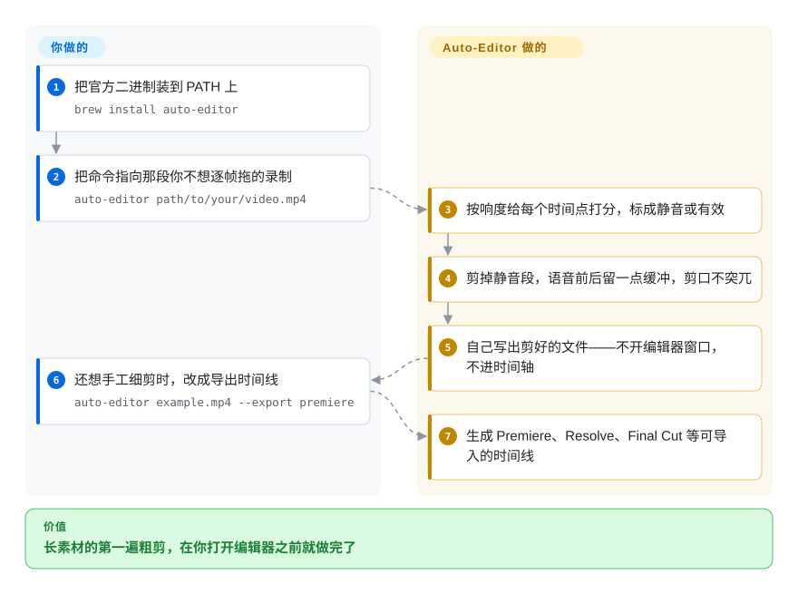

# Auto-Editor

一个命令行粗剪工具：分析录像的响度（或画面运动量），替你剪掉静音段，还能把结果交回成 Premiere、Resolve、Final Cut、ShotCut、Kdenlive 可导入的可编辑时间线。

## 何时使用

你手上有几个小时的说话类素材——直播录屏、教程系列、播客、屏幕演示——而第一遍剪辑恰恰是没人愿意干的那部分：找出并删掉所有冷场。这时你要的不是创意剪辑，而是先拿到一个紧凑的文件，让后面的创作从「已经能看」的东西起步。

你运行 `auto-editor recording.mp4`，拿回一个剪好的文件：没有工程、没有时间轴、不用开编辑器。相对裸用 [FFmpeg](../transcoding-and-pipelines/ffmpeg.zh.md) 的决定性取舍是：FFmpeg 当然能做这些剪切，但滤镜图和判断逻辑得你自己写（先 `silencedetect`，再把时间点映射成 `select` 表达式）；Auto-Editor 把这一层判断做成了现成的——响度标注、语音前后的缓冲边距、「这一类剪掉、那一类保留」的模型——并且还会为你本来就在用的 NLE 写时间线 XML。相对 [MoviePy](moviepy.zh.md)，它给的是能直接用的命令行而不是要你编程的库；相对 [HandBrake](../transcoding-and-pipelines/handbrake.zh.md)，它给的是剪辑决策而不是转码预设。

## 怎么用起来

Auto-Editor 自己解码文件（官方二进制自带媒体栈，不需要另装 FFmpeg），然后把媒体切成很小的时间片，逐片算出一个响度值。每个时间片拿到一个整数标签——`0` 表示静音、`1` 表示有效——默认规则（`--edit audio:threshold=0.04,stream=all`）只保留有效的那部分。剪切并不粗暴：`--margin` 选项默认 `0.2s`，会在每个保留片段的前后补回一点静音，免得语音从半个字开始或戛然而止。你也可以把判断依据换成画面运动（`--edit motion:threshold=0.02`）、把多种方法组合起来（`--edit "(or audio:0.03 motion:0.06)"`），或者用 `--edit:2` / `--when:2` 增加标签类别，让某些段落不是被剪掉而是加速播放。它的另一半能力是出口：`--export premiere`（以及 `resolve`、`final-cut-pro`、`shotcut`、`kdenlive`、`clip-sequence`）输出的是可导入的时间线而不是渲染好的文件，于是你可以从它剪好的版本接着手工细剪。你负责的是策略——用哪种判据、阈值多少、产出什么；它负责的是找出静音并落刀。

<!-- flow-steps:begin (generated from flows/auto-editor.json by tools/flow_card.py — do not edit) -->

流程文字版

1. **你**：把官方二进制装到 PATH 上 — `brew install auto-editor`
2. **你**：把命令指向那段你不想逐帧拖的录制 — `auto-editor path/to/your/video.mp4`
3. **Auto-Editor**：按响度给每个时间点打分，标成静音或有效
4. **Auto-Editor**：剪掉静音段，语音前后留一点缓冲，剪口不突兀
5. **Auto-Editor**：自己写出剪好的文件——不开编辑器窗口，不进时间轴
6. **你**：还想手工细剪时，改成导出时间线 — `auto-editor example.mp4 --export premiere`
7. **Auto-Editor**：生成 Premiere、Resolve、Final Cut 等可导入的时间线

**价值**：长素材的第一遍粗剪，在你打开编辑器之前就做完了

<!-- flow-steps:end -->

## 何时不用

- **你需要帧级精确的创作剪辑、多轨道或合成。** 它只对一个输入做一种判断（静音还是有效）。真正的剪辑交给 NLE——[Concat](../../video-editing/concat.zh.md) 或 [OpenCut](../../video-editing/opencut.zh.md)——剪辑逻辑要留在 Python 里就用 [MoviePy](moviepy.zh.md)。
- **你的音频里本来就没有静音可删——音乐视频、环境声素材、铺满底噪的密集对话。** 响度标注没有可用的落差，改用 `--edit motion`，或者用 [FFmpeg](../transcoding-and-pipelines/ffmpeg.zh.md) 手工剪。
- **你需要把它当库嵌进服务里。** Auto-Editor 是自带二进制的命令行工具；嵌入请用 [MoviePy](moviepy.zh.md)、[PyAV](../transcoding-and-pipelines/pyav.zh.md) 或 [ffmpeg-python](../transcoding-and-pipelines/ffmpeg-python.zh.md)。
- **你真正的任务是格式转换或压小体积，而不是剪辑。** 用 [HandBrake](../transcoding-and-pipelines/handbrake.zh.md)（预设、硬件编码器）或 [FFmpeg](../transcoding-and-pipelines/ffmpeg.zh.md)。
- **你想让语音内容或画面语义来决定剪法，而不是音量。** 这是另一类工具——[Whisper](../speech-and-subtitles/whisper.zh.md) 给你转写文本，但剪切逻辑仍要你自己写。
- **你的分发渠道不接受未签名二进制。** 官方 release 是未签名的，文档自己的建议是忽略 macOS／Windows 的「未知开发者」警告；最干净的路径是 `brew install auto-editor`。
- **你正照着旧教程执行 `pip install auto-editor`。** 项目已声明 CLI 不再发布到 pip，PyPI 上那份是旧的，这条路径会让你在不知情的情况下装到老版本。请从 Releases 页或 Homebrew 安装。
- **你需要那个线上的「online」版或桌面应用版。** 那些产品复用了本仓库的素材，但各自另有专有许可——仓库的公共领域授权不覆盖它们。

## 横向对比

| 替代品 | 是否收录 | 我们的评价 | 取舍 |
| --- | --- | --- | --- |
| [FFmpeg](../transcoding-and-pipelines/ffmpeg.zh.md) | ✅ | 一次性剪辑、而且你本来就以滤镜图思考时选 FFmpeg；当整个任务就是反复执行「去掉冷场、给我一份时间线」时选 Auto-Editor，因为 FFmpeg 给的是原始原语，没有静音策略这个概念、也没有交给 NLE 的出口。 | Auto-Editor 是一个二进制、决策已经做好且内置 XML 导出；FFmpeg 通用且可脚本化，但标注、边距和时间线拼装逻辑都得你写。 |
| [MoviePy](moviepy.zh.md) | ✅ | 你已经在一个负责合成与重编码的 Python 管线里时选 MoviePy；当交付物是长素材的剪切版、且你不想自己写音频分析代码时选 Auto-Editor，因为 MoviePy 是通用剪辑 API，本身不带静音检测。 | Auto-Editor 的命令行只做一件事，用标签化片段模型，不用写代码；MoviePy 能表达任何剪辑，但不提供任何内置策略。 |
| [HandBrake](../transcoding-and-pipelines/handbrake.zh.md) | ✅ | 要把成片转成发行格式时选 HandBrake；要决定文件里到底留下什么内容时选 Auto-Editor，因为 HandBrake 的预设既检测不了也删不掉静音。 | HandBrake 有硬件编码器和久经验证的预设；Auto-Editor 决定的是内容而不是格式，两者不在编码选项上竞争。 |
| Descript | 未收录 | 当剪辑是文本驱动（改文字稿、视频跟着变）、且能接受订阅加云端上传时选 Descript；当素材必须留在本地、管线必须可脚本化时选 Auto-Editor，因为 Descript 是闭源 SaaS，没有能接进批处理的命令行。 | Descript 给的是打磨过的交互式文本剪辑体验；Auto-Editor 给的是一条本地、免费、无人值守的处理，并在你自己的 NLE 里留下可编辑时间线。 |
| 剪映专业版／CapCut（闭源应用） | 未收录 | 第一遍剪辑只是一次性、又想要厂商级的顺手体验，就在应用里做；当同一套修剪要在你产出的每份录像上无人值守地跑时选 Auto-Editor，因为该应用没有受支持的批处理入口。 | 应用免费且可视化；Auto-Editor 无人值守、可脚本化，但除了响度和运动量之外什么都看不见。 |

## 技术栈

- 用 **Nim** 编写；仓库是通过 `nimble` 构建的 Nim 工程（`nimble makeff` 拉取并构建依赖、`nimble make` 出静态二进制、`nimble brewmake` 出依赖系统 FFmpeg 库的动态版本）。
- `src/` 是分析与剪切引擎（时间线模型、编辑方法、导出后端）；`scripts/` 与 `resources/` 是构建和打包资源。
- `skills/` 目录里有四个 agent skill（`auto-editor`、`auto-editor-effects`、`auto-editor-export`、`auto-editor-transcribe`），通过 `npx skills add WyattBlue/auto-editor` 安装。
- 导出后端覆盖 Premiere XML、DaVinci Resolve、Final Cut Pro、ShotCut、Kdenlive，另有原始片段序列输出。
- 可选接入 `yt-dlp`，于是 URL 也能直接作为输入。

## 依赖

- **运行时依赖：无。** 官方 release 二进制是静态构建且未签名的；把下载文件改名为 `auto-editor`（Windows 上是 `auto-editor.exe`），在 macOS／Linux 上 `chmod +x`，放进 `PATH` 即可。
- macOS 上可以用 `brew install auto-editor` 安装；Arch 用户有 AUR 包（`yay -S auto-editor`）。文档提醒 `apt` 里的包版本非常旧。
- **从源码构建**是重的那条路：需要 `nim`、`nimble`、`cmake`、`meson`、`ninja`，再走静态路线（`nimble makeff` / `nimble make`），或为动态版本准备系统 FFmpeg 库。Windows 构建要经 WSL。
- **`yt-dlp` 是可选的**——用任何包管理器装上，Auto-Editor 就会接受 URL 作为输入。
- 不需要 Python、Node、服务端、GPU 或云端账号。

## 运维难度

**低。** 它就是一个跑完即忘的二进制：没有常驻进程、没有要同步的配置文件、没有数据库、没有要监控的服务。摩擦在分发而不在运维——未签名的二进制会触发 macOS 的 Gatekeeper 和 Windows 的 SmartScreen（解压、`chmod +x`、清掉警告即可），而 pip 包已经停更，导致文档里的两条安装路径给出的版本并不一致；因此请锁定管线验证过的版本、按计划升级，而不是让 `pip` 决定你装到哪一版。

## 健康度与可持续性

- **维护（2026-09-21）：** 仓库建于 2020-04-30，最后 push 是 2026-09-19，发版大致按月（31.6.0 于 2026-09-06；7、8 月间是 31.5.0、31.4.2、31.4.0）。六年多持续开发且仍在活跃。
- **治理／巴士系数：** 实际上是一个人——`WyattBlue` 约 2,506 次提交，第二位贡献者只有 8 次。对任何长期依赖它的东西来说，巴士系数为 1 是主要结构性风险 [推断]。
- **背书与长青度：** 没有基金会或公司，是带官网、博客和 Discord 的个人项目。这里最强的信号是「年龄 × 仍活跃」：六年历史且仍按月发版，按本索引的先验是很好的 Lindy 画像。
- **采用与生态：** 5,296 star、656 fork，文档（选项参考、cookbook、action 文档）比多数单人维护的工具更完整。雷达仍给出采用度 D，测量值也说明了原因：唯一还存在的注册表信号是那份已经过时的 PyPI 包（上月 18,055 次下载、4 个依赖仓库、graph tier D），而已经转向二进制、Homebrew 与 AUR 的安装基数对注册表指标不可见——因此「实际有多少人在用」应视为未测量，而不是由 star 数定论 [推断]。记录的 open issue 数为 0，这更像维护得很勤的追踪器，而不是人气的度量 [推断]。
- **风险标记：** pip 分发已停止，但旧副本仍留在 PyPI（静默装到旧版本的陷阱）；release 二进制未签名；发布产物「可能适用各种开源许可」，而仓库本身是 Unlicense，所以别假定二进制享有同样的公共领域授权；商业化的 online／桌面应用版另有独立许可。

## 存疑（未验证）

- [未验证] 本页没有任何一项被实际执行：命令行、剪切质量与导出的时间线均读自 README、安装文档与仓库目录树，没有在真实素材上跑过。
- [未验证] 各 `--export` 后端在 Premiere／Resolve／Final Cut／ShotCut／Kdenlive 里还原剪切的忠实程度没有实测；需要把生成的时间线逐个导入对应 NLE 验证。
- [未验证] 关于响度或运动判据的剪辑质量（语音与底噪的分辨、`--margin` 的手感）都是作者描述，未经测量。
- [未验证] 「官方二进制自带解码所需的一切」读自安装文档（静态构建 vs「需要 ffmpeg 库」两列），没有在一台未装 FFmpeg 的机器上实际运行二进制来验证。
- [未验证] `skills/` 下那四个条目确认存在于仓库目录中；`npx skills add WyattBlue/auto-editor` 是否能装、装上是否可用没有测试。
- [推断] 巴士系数为 1（单一作者约 2,506 次提交 vs 第二名 8 次）就是弃坑风险；按月发版的节奏说明它短期内不会实现。
- [推断] 「0 个 open issue」被推断为活跃清理的结果，而不是没有用户；没有抽样 issue 历史。
- [未验证] 依据文档「已停止 pip 发布」的说明，推断 PyPI 包（最新 29.3.1）相对 GitHub release（31.6.0）已陈旧；两个版本之间的行为差异没有对比。
- [未验证] 健康度小节引用的注册表数字（上月 PyPI 18,055 次下载、4 个依赖仓库、graph tier D，计算于 2026-09-21）是评分工具给出的时点快照，不是趋势；它们会过期，后续应重新用 `tools/health.py` 读取，而不是继续引用本页数字。
