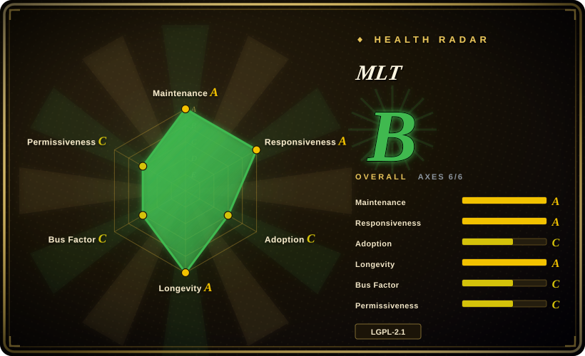
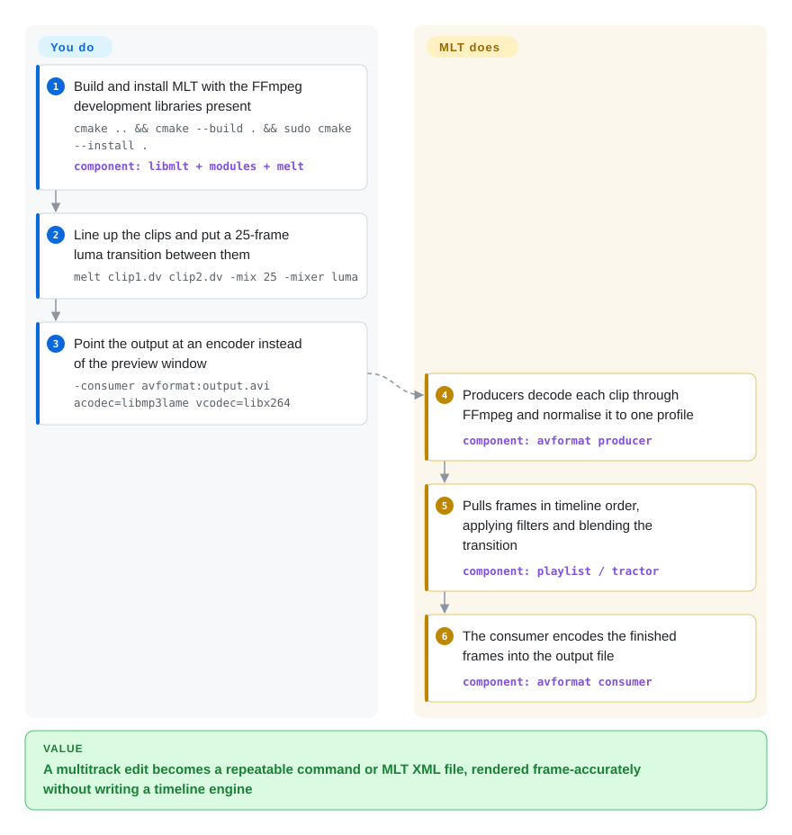

# MLT

Your app needs a real editing timeline — clips trimmed to the frame, a crossfade between them, a title over the top, audio mixed under it — and calling FFmpeg once per cut leaves you hand-computing offsets and re-encoding everything on every change. MLT is the open-source engine under the Shotcut and Kdenlive editors: you describe tracks, clips, filters and transitions, and it pulls frames through them in order and plays or renders the result, using FFmpeg for the actual decoding and encoding.

## When to use

You're building a video application that needs a timeline: a custom editor for a niche workflow, an automated pipeline that assembles clips by rules (highlight reels, templated promos), or a headless server that stitches and renders sequences, possibly out to broadcast hardware. You don't want to write a timeline model, a transition engine or a filter graph from scratch. With MLT you describe the edit — on the `melt` command line, as an MLT XML document, or through the C / C++ API — and it handles the frame-accurate plumbing: decoding via FFmpeg, normalising every clip to one frame rate and resolution, applying filters, blending transitions and encoding the output.

You pick it over driving [FFmpeg](../transcoding-and-pipelines/ffmpeg.md) directly when the job is **editorial** (many clips, in/out points, overlapping transitions, keyframed filters) rather than a single transcode, and over Python libraries like [MoviePy](moviepy.md) when you need the engine that two production NLEs trust, real-time preview and playback, and a project format (MLT XML) that Shotcut and Kdenlive projects are built on. If you just need an editor to use, take Shotcut or Kdenlive themselves.

## How it works

MLT models media as **services** connected in a chain: **producers** generate frames (a video file decoded by FFmpeg, a colour card, a title), **filters** modify frames (greyscale, a watermark, audio gain), **transitions** combine two tracks (a luma wipe, a dissolve), and a **consumer** pulls the finished frames and does something with them (shows an SDL2 preview window, encodes a file through FFmpeg, writes MLT XML, or outputs to a DeckLink SDI card). A **playlist** strings clips one after another; a **tractor** stacks several tracks and pulls them in sync. Frames are *pulled* by the consumer rather than pushed by the source — like a printing press that requests the next page only when it is ready — so playback and rendering run on the same graph. You describe the edit; MLT does the decoding, scaling, resampling, compositing, mixing and encoding. Besides the `melt` CLI shown below, you can build the same graph from C (`mlt_factory_producer`, `mlt_consumer_start`), from C++ (mlt++), or through SWIG bindings for Python and other languages.

<!-- flow-steps:begin (generated from flows/mlt.json by tools/flow_card.py — do not edit) -->

Text version of the flow

1. **You**: Build and install MLT with the FFmpeg development libraries present — `cmake .. && cmake --build . && sudo cmake --install .` — component: `libmlt + modules + melt`
2. **You**: Line up the clips and put a 25-frame luma transition between them — `melt clip1.dv clip2.dv -mix 25 -mixer luma`
3. **You**: Point the output at an encoder instead of the preview window — `-consumer avformat:output.avi acodec=libmp3lame vcodec=libx264`
4. **MLT**: Producers decode each clip through FFmpeg and normalise it to one profile — component: `avformat producer`
5. **MLT**: Pulls frames in timeline order, applying filters and blending the transition — component: `playlist / tractor`
6. **MLT**: The consumer encodes the finished frames into the output file — component: `avformat consumer`

**Value**: A multitrack edit becomes a repeatable command or MLT XML file, rendered frame-accurately without writing a timeline engine

<!-- flow-steps:end -->

## When NOT to use

- **You need a ready-to-use video editor.** MLT is a framework, not an application. Use Shotcut (not indexed) or Kdenlive (not indexed), both built on MLT, instead of MLT directly.
- **You only need batch transcoding or format conversion.** MLT adds timeline machinery you don't need; use [FFmpeg](../transcoding-and-pipelines/ffmpeg.md) directly, or [HandBrake](../transcoding-and-pipelines/handbrake.md) for preset-driven transcodes.
- **You need a general-purpose live media pipeline (ingest RTSP/WebRTC, mix, restream).** MLT plays timelines in real time and can feed broadcast output cards, but it is organised around editorial compositions, not arbitrary live element graphs; use [GStreamer](../transcoding-and-pipelines/gstreamer.md).
- **You want a Python-first editing API.** MLT's native interfaces are C, C++ and XML; Python comes through SWIG bindings that are off by default in the build. For scripted edits in Python, use [MoviePy](moviepy.md); for frame-level codec control, [PyAV](../transcoding-and-pipelines/pyav.md).
- **You ship a closed-source product and assume "it's LGPL".** Only the core is LGPL-2.1-or-later. The default CMake configuration turns on `GPL` and `GPL3` components (Qt6, plusgpl, resample, rubberband, vid.stab, xine, OpenFX, LADSPA/LV2/VST2 support…), so a stock or distro build pulls GPL code into your process. Build with `-DGPL=OFF -DGPL3=OFF` and check the FFmpeg build's own license flags, or choose [GStreamer](../transcoding-and-pipelines/gstreamer.md), whose core is LGPL.
- **You embed the C API and can't absorb behaviour changes in minor releases.** v7.42.0 (2026-10) made `mlt_frame_s::convert_image` read-only behind a new dispatcher — an announced API behaviour change in a minor version. Pin a version and read the release notes before upgrading.

## Comparison

| Alternative | In index | Our verdict | Tradeoff |
|---|---|---|---|
| [FFmpeg](../transcoding-and-pipelines/ffmpeg.md) | ✅ | For single-pass decode/encode/transcode/filter jobs, call FFmpeg; when the job is a multi-clip edit with in/out points, overlapping transitions and keyframed filters, put MLT on top of it. | FFmpeg is the universal codec engine with a huge community, but its filter graphs have no notion of an editorial timeline; MLT adds that model at the cost of another framework to build and learn. |
| [GStreamer](../transcoding-and-pipelines/gstreamer.md) | ✅ | For live, long-running, app-embedded pipelines (capture, streaming, playback in a device), pick GStreamer; for timeline editing and rendering of compositions, pick MLT. | GStreamer's element graph is more general and its core is LGPL; its editing layer (GES) lives outside GitHub and has a smaller editing ecosystem than MLT's Shotcut/Kdenlive base. |
| [MoviePy](moviepy.md) | ✅ | For quick scripted edits in Python, pick MoviePy; pick MLT when you need real-time preview, broadcast output, or an engine proven by two production editors. | MoviePy is far easier to start with but renders through Python and has no live playback; MLT is faster and richer but C/XML-first. |
| [PyAV](../transcoding-and-pipelines/pyav.md) | ✅ | For frame- and packet-level FFmpeg control from Python, pick PyAV; for a timeline model and editorial semantics, pick MLT. | PyAV exposes libav* directly with no timeline or NLE abstractions; you would be writing the timeline engine MLT already has. |
| Shotcut | not indexed | When a person needs to edit by hand, give them Shotcut; use MLT directly when you need to embed or automate the engine. | GPL-3.0 Qt desktop editor from the same maintainers (Meltytech) as MLT; an app, not a library. |
| Kdenlive | not indexed | When you want a KDE-integrated editor with more advanced editing tools, pick Kdenlive; use MLT directly for embedding. | GPL-3.0 KDE/Qt NLE built on MLT; an app with its own release cycle, not an embeddable API. |
| OpenTimelineIO | not indexed | When the problem is exchanging edit decisions between tools (Resolve, Premiere, Avid, your own app), use OpenTimelineIO; when you need to actually render or play the timeline, use MLT. | Academy Software Foundation project (Apache-2.0) for timeline interchange; it does not decode or render media. |
| DaVinci Resolve | not a repo | When you need professional colour grading and finishing done by people, use Resolve; it cannot be embedded or automated like MLT. | Commercial NLE with a free tier; closed source, scripting API only, no library to link. |

## Tech stack

- **Language:** C core (`libmlt`, the framework in `src/framework`), C++ wrapper (`mlt++`, built as C++20), with the `melt` CLI in C.
- **Codec engine:** FFmpeg's libavformat/libavcodec/libavfilter/libswscale/libswresample via the `avformat` module (required when that module is enabled, which is the default).
- **Modules:** plugins grouped by backend — avformat, core, xml, sdl2, qt (Qt6), movit (OpenGL), placebo (libplacebo GPU, new in 7.42), frei0r, rubberband, vid.stab, decklink, NDI, OpenFX, and more — each providing producers, filters, transitions or consumers.
- **Project format:** MLT XML, a serialisation of the service graph; also what Shotcut saves.
- **Build:** CMake (>= 3.14) with Ninja or Make; Linux, macOS and Windows.

## Dependencies

- **Required:** a C/C++20 toolchain, CMake, and FFmpeg development libraries for the default avformat module.
- **Optional, per module:** SDL2 (preview window and audio), Qt6 (titles and image loading), movit/OpenGL and libplacebo (GPU compositing), frei0r, LADSPA/LV2, rubberband, vid.stab, sox, JACK/RtAudio, the DeckLink SDK.
- **Language bindings:** SWIG bindings for Python, Java, C#, Lua, Node.js, Perl, PHP, Ruby and Tcl — all `OFF` by default, so you must enable them at build time or rely on a distro package that did.
- **No services:** it is a library and CLI; nothing needs to run in the background.

## Ops difficulty

**Medium.** MLT is a library, not a deployable service, so the work is in building and integrating it: (1) **FFmpeg pairing** — MLT's format and codec support is whatever the linked FFmpeg was built with, and version mismatches show up as missing codecs or build failures; (2) **module availability** — a filter or transition only exists if its module and optional dependency were compiled in (`melt -query filters` tells you what this build has); (3) **license configuration** — decide `GPL`/`GPL3` on or off deliberately, since the default is on; (4) **render resources** — rendering is CPU/GPU- and memory-heavy, so a server pipeline needs its own job queue and concurrency limits. For headless servers, the SDL2 preview consumer is irrelevant; render through the `avformat` consumer.

## Health & viability

- **Maintenance — very active.** Commits land most weeks and releases ship roughly every two to four months (v7.38.0 2026-04, v7.40.0 2026-06, v7.42.0 2026-10-03); the radar grades maintenance and responsiveness A.
- **Governance — one lead, real contributors.** Dan Dennedy (ddennedy) leads with 60.5% of recent commits, with bmatherly and Kdenlive developers (e.g. j-b-m) contributing regularly; the radar counts 27 active contributors in 12 months and grades governance C. Copyright is held by Meltytech, LLC, the small company that also builds Shotcut.
- **Backing and longevity — strong Lindy.** First release in May 2004, continuously maintained for over 22 years, and the engine of two widely used editors whose survival depends on it; the radar grades longevity A.
- **Adoption — radar C, real use higher.** The adoption axis dropped from B to C this pass: it only sees 461 Homebrew installs in 90 days and 586,909 GitHub release downloads, while most users get MLT bundled inside Shotcut or Kdenlive or from Linux distro packages, which the scorer cannot count.
- **Risk flags — license configuration, not relicensing.** LGPL-2.1-or-later core with GPL modules enabled by default (radar license-risk C); no relicensing history, no CLA, no open-core split.

## Caveats (unverified)

- [推断] "Real use higher than the adoption grade" rests on MLT being bundled in Shotcut and Kdenlive and packaged by Linux distros; there is no download figure for those channels.
- [未验证] Which GPL modules a given distro's MLT package enables was not checked; it varies by distribution.
- [未验证] Maturity of the SWIG Python bindings (API coverage, packaging on non-Linux platforms) was not tested this pass.
- [推断] Kdenlive's "more advanced editing tools" relative to Shotcut is a general characterisation, not a feature-by-feature comparison.
- [未验证] GStreamer Editing Services' size and activity relative to MLT were not measured this pass.
