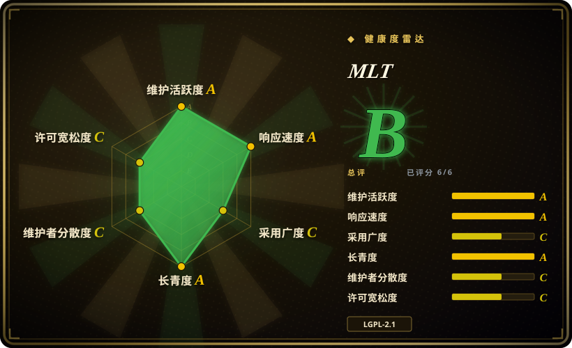
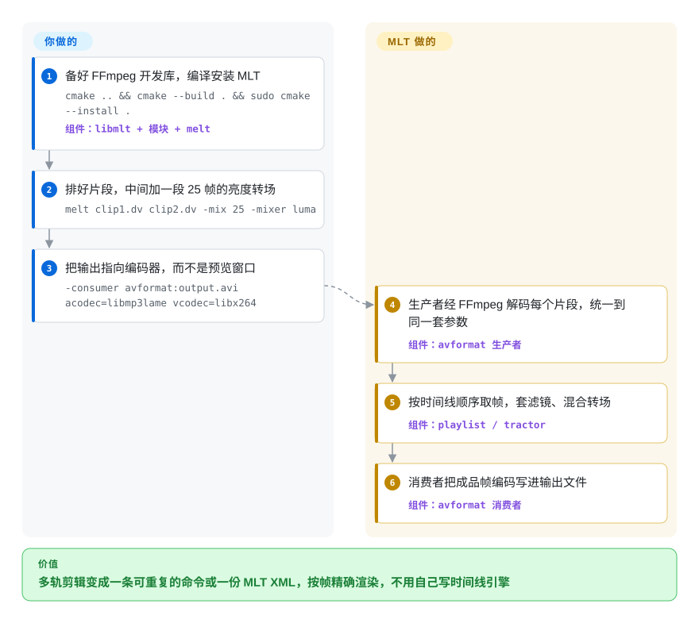

# MLT

你的应用需要一条真正的剪辑时间线——片段精确裁到某一帧、两段之间交叉淡化、上面压一层标题、底下混一轨音乐——而每剪一刀调一次 FFmpeg，你就得手算偏移量，改一处就整个重新编码。MLT 是 Shotcut 和 Kdenlive 两款剪辑软件底下的开源引擎：你描述轨道、片段、滤镜和转场，它按顺序把帧从中拉过去，再播放或渲染出结果，真正的解码和编码交给 FFmpeg。

## 何时使用

你在做一个需要时间线的视频应用：给某个小众工作流定制的剪辑器，按规则自动拼片段的管线（集锦、模板化宣传片），或者一台在后台拼接、渲染序列的无头服务器，可能还要输出到广播硬件。你不想从零写时间线模型、转场引擎或滤镜图。用 MLT，你描述这次剪辑——用 `melt` 命令行、写一份 MLT XML，或者调 C / C++ API——它负责逐帧精确的底层活：经 FFmpeg 解码，把每个片段统一到同一帧率和分辨率，套滤镜，混合转场，编码输出。

当任务是**剪辑性质**的（很多片段、入点出点、重叠的转场、带关键帧的滤镜）而不是一次转码时，你选它而不是直接驱动 [FFmpeg](../transcoding-and-pipelines/ffmpeg.zh.md)；当你需要一个被两款生产级剪辑软件信任的引擎、实时预览和播放，以及 Shotcut、Kdenlive 工程赖以构建的工程格式（MLT XML）时，你选它而不是 [MoviePy](moviepy.zh.md) 这类 Python 库。如果你只是需要一个能用的剪辑软件，直接用 Shotcut 或 Kdenlive。

## 怎么用起来

MLT 把媒体建模成串在一起的**服务**：**生产者**（producer）产出帧（一个经 FFmpeg 解码的视频文件、一张色卡、一段标题），**滤镜**（filter）修改帧（变灰、加水印、调音量），**转场**（transition）把两条轨合在一起（亮度擦除、叠化），**消费者**（consumer）把成品帧拉走并处理（弹出 SDL2 预览窗口、经 FFmpeg 编码成文件、写成 MLT XML，或输出到 DeckLink SDI 采集卡）。**播放列表**（playlist）把片段首尾相接；**tractor** 把几条轨叠起来同步拉取。帧是消费者*拉*出来的，而不是源头推过去的——就像一台印刷机，准备好了才要下一页——所以播放和渲染跑在同一张图上。你描述剪辑；解码、缩放、重采样、合成、混音、编码都由 MLT 完成。除了下面展示的 `melt` 命令行，你也可以用 C（`mlt_factory_producer`、`mlt_consumer_start`）、C++（mlt++）或面向 Python 等语言的 SWIG 绑定搭出同一张图。

<!-- flow-steps:begin (generated from flows/mlt.json by tools/flow_card.py — do not edit) -->

流程文字版

1. **你**：备好 FFmpeg 开发库，编译安装 MLT — `cmake .. && cmake --build . && sudo cmake --install .` — 组件：`libmlt + 模块 + melt`
2. **你**：排好片段，中间加一段 25 帧的亮度转场 — `melt clip1.dv clip2.dv -mix 25 -mixer luma`
3. **你**：把输出指向编码器，而不是预览窗口 — `-consumer avformat:output.avi acodec=libmp3lame vcodec=libx264`
4. **MLT**：生产者经 FFmpeg 解码每个片段，统一到同一套参数 — 组件：`avformat 生产者`
5. **MLT**：按时间线顺序取帧，套滤镜、混合转场 — 组件：`playlist / tractor`
6. **MLT**：消费者把成品帧编码写进输出文件 — 组件：`avformat 消费者`

**价值**：多轨剪辑变成一条可重复的命令或一份 MLT XML，按帧精确渲染，不用自己写时间线引擎

<!-- flow-steps:end -->

## 何时不用

- **你要的是一个开箱即用的剪辑软件。** MLT 是框架，不是应用。用基于 MLT 的 Shotcut（未收录）或 Kdenlive（未收录），别直接用 MLT。
- **你只需要批量转码或格式转换。** MLT 带来的时间线机制你用不上；直接用 [FFmpeg](../transcoding-and-pipelines/ffmpeg.zh.md)，或者用 [HandBrake](../transcoding-and-pipelines/handbrake.zh.md) 做预设驱动的转码。
- **你需要一条通用的直播媒体管线（接入 RTSP/WebRTC、混流、转推）。** MLT 能实时播放时间线、也能输出到广播采集卡，但它是围绕剪辑作品组织的，不是任意的直播元件图；用 [GStreamer](../transcoding-and-pipelines/gstreamer.zh.md)。
- **你想要 Python 优先的剪辑 API。** MLT 的原生接口是 C、C++ 和 XML；Python 走 SWIG 绑定，而构建时默认是关的。用 Python 写剪辑脚本，选 [MoviePy](moviepy.zh.md)；要帧级的编解码控制，选 [PyAV](../transcoding-and-pipelines/pyav.zh.md)。
- **你在发布闭源产品，并且以为“它是 LGPL”。** 只有核心是 LGPL-2.1-or-later。默认的 CMake 配置会打开 `GPL` 和 `GPL3` 组件（Qt6、plusgpl、resample、rubberband、vid.stab、xine、OpenFX，以及 LADSPA/LV2/VST2 支持等），所以原样构建或发行版的包会把 GPL 代码带进你的进程。构建时用 `-DGPL=OFF -DGPL3=OFF`，并检查 FFmpeg 构建本身的许可证选项；或者改选核心为 LGPL 的 [GStreamer](../transcoding-and-pipelines/gstreamer.zh.md)。
- **你嵌入了 C API，承受不了小版本里的行为变化。** v7.42.0（2026-10）把 `mlt_frame_s::convert_image` 改成只读、由新的分发器接管——这是在小版本里公告的 API 行为变更。锁定版本，升级前读发布说明。

## 横向对比

| 替代品 | 是否收录 | 我们的评价 | 取舍 |
|---|---|---|---|
| [FFmpeg](../transcoding-and-pipelines/ffmpeg.zh.md) | ✅ | 单次的解码、编码、转码、滤镜任务，直接调 FFmpeg；任务是带入出点、重叠转场和关键帧滤镜的多片段剪辑时，在它之上加一层 MLT。 | FFmpeg 是通用编解码引擎，社区巨大，但它的滤镜图没有剪辑时间线的概念；MLT 补上这个模型，代价是多一个要构建、要学的框架。 |
| [GStreamer](../transcoding-and-pipelines/gstreamer.zh.md) | ✅ | 直播、长期运行、嵌入应用的管线（采集、推流、设备内播放），选 GStreamer；剪辑作品的时间线编辑与渲染，选 MLT。 | GStreamer 的元件图更通用，核心是 LGPL；它的剪辑层（GES）不在 GitHub 上，剪辑生态也比不上以 Shotcut/Kdenlive 为基础的 MLT。 |
| [MoviePy](moviepy.zh.md) | ✅ | 用 Python 快速写剪辑脚本，选 MoviePy；需要实时预览、广播输出，或一个经两款生产级剪辑软件验证过的引擎，选 MLT。 | MoviePy 上手容易得多，但渲染走 Python，也没有实时播放；MLT 更快、功能更全，但以 C 和 XML 为先。 |
| [PyAV](../transcoding-and-pipelines/pyav.zh.md) | ✅ | 要在 Python 里控制到 FFmpeg 的帧和数据包级别，选 PyAV；要时间线模型和剪辑语义，选 MLT。 | PyAV 直接暴露 libav*，没有时间线或 NLE 抽象；用它等于自己再写一遍 MLT 已有的时间线引擎。 |
| Shotcut | 未收录 | 有人要手动剪片，就用 Shotcut；需要嵌入或自动化这个引擎时，直接用 MLT。 | 与 MLT 同一维护方（Meltytech）出品的 GPL-3.0 Qt 桌面剪辑软件；是应用，不是库。 |
| Kdenlive | 未收录 | 想要和 KDE 集成、剪辑工具更进阶的软件，选 Kdenlive；要嵌入时直接用 MLT。 | 基于 MLT 的 GPL-3.0 KDE/Qt 剪辑软件；有自己的发布节奏，不是可嵌入的 API。 |
| OpenTimelineIO | 未收录 | 问题是在工具之间交换剪辑决策（Resolve、Premiere、Avid、你自己的应用）时，用 OpenTimelineIO；需要真正渲染或播放时间线时，用 MLT。 | 学院软件基金会（ASWF）的时间线交换项目（Apache-2.0）；它不解码也不渲染媒体。 |
| DaVinci Resolve | 非仓库 | 需要专业调色和成片由人来做时，用 Resolve；它没法像 MLT 那样被嵌入或自动化。 | 有免费版的商业剪辑软件；闭源，只有脚本 API，没有可链接的库。 |

## 技术栈

- **语言：** C 核心（`libmlt`，即 `src/framework` 下的框架），C++ 封装（`mlt++`，按 C++20 构建），`melt` 命令行用 C 写成。
- **编解码引擎：** 通过 `avformat` 模块调用 FFmpeg 的 libavformat/libavcodec/libavfilter/libswscale/libswresample（启用该模块时必需，默认启用）。
- **模块：** 按后端分组的插件——avformat、core、xml、sdl2、qt（Qt6）、movit（OpenGL）、placebo（libplacebo GPU，7.42 新增）、frei0r、rubberband、vid.stab、decklink、NDI、OpenFX 等——各自提供生产者、滤镜、转场或消费者。
- **工程格式：** MLT XML，即服务图的序列化形式；Shotcut 保存的也是它。
- **构建：** CMake（>= 3.14）配 Ninja 或 Make；支持 Linux、macOS 和 Windows。

## 依赖

- **必需：** 支持 C/C++20 的工具链、CMake，以及默认 avformat 模块所需的 FFmpeg 开发库。
- **按模块可选：** SDL2（预览窗口与音频）、Qt6（标题与图片加载）、movit/OpenGL 和 libplacebo（GPU 合成）、frei0r、LADSPA/LV2、rubberband、vid.stab、sox、JACK/RtAudio、DeckLink SDK。
- **语言绑定：** SWIG 绑定覆盖 Python、Java、C#、Lua、Node.js、Perl、PHP、Ruby 和 Tcl——默认全部 `OFF`，你得在构建时打开，或依赖打开了它们的发行版包。
- **没有服务：** 它是库加命令行，不需要任何后台进程。

## 运维难度

**中等。** MLT 是库，不是可部署的服务，所以功夫在构建和集成上：（1）**FFmpeg 配对**——MLT 支持哪些格式和编解码器，取决于链接的 FFmpeg 怎么编的，版本不匹配会表现为缺编解码器或构建失败；（2）**模块可用性**——某个滤镜或转场只有在对应模块及其可选依赖被编进来时才存在（`melt -query filters` 能列出当前构建有哪些）；（3）**许可证配置**——`GPL`/`GPL3` 开还是关要有意识地决定，默认是开；（4）**渲染资源**——渲染吃 CPU/GPU 和内存，服务端管线需要自己的任务队列和并发上限。无头服务器上用不到 SDL2 预览消费者，直接用 `avformat` 消费者渲染。

## 健康度与可持续性

- **维护——非常活跃。** 大多数周都有提交，大约每两到四个月发一个版本（v7.38.0 于 2026-04，v7.40.0 于 2026-06，v7.42.0 于 2026-10-03）；雷达给维护和响应速度都打 A。
- **治理——一位主导者，加上真实的贡献者。** Dan Dennedy（ddennedy）主导，贡献了近期 60.5% 的提交，bmatherly 和 Kdenlive 开发者（如 j-b-m）持续参与；雷达统计 12 个月内有 27 位活跃贡献者，治理打 C。版权归 Meltytech, LLC，也就是同时开发 Shotcut 的那家小公司。
- **背书与延续性——Lindy 很强。** 2004 年 5 月首次发布，持续维护超过 22 年，并且是两款广泛使用的剪辑软件赖以生存的引擎；雷达给延续性打 A。
- **采用——雷达 C，实际使用更广。** 本轮采用度从 B 降到 C：评分器只能看到 90 天内 461 次 Homebrew 安装和 586,909 次 GitHub 发布下载，而大多数用户是随 Shotcut、Kdenlive 捆绑或从 Linux 发行版包里拿到 MLT 的，这些渠道评分器统计不到。
- **风险信号——在于许可证配置，而不是改许可证。** 核心为 LGPL-2.1-or-later，GPL 模块默认开启（雷达许可证风险打 C）；没有改许可证的历史，没有 CLA，也没有开源核心加闭源增值的拆分。

## 存疑（未验证）

- [推断] “实际使用比采用度评分更广”依据的是 MLT 被 Shotcut、Kdenlive 捆绑以及被 Linux 发行版打包；这些渠道没有下载数据。
- [未验证] 各发行版的 MLT 包具体开了哪些 GPL 模块，本轮没有检查，因发行版而异。
- [未验证] SWIG Python 绑定的成熟度（API 覆盖、非 Linux 平台上的打包）本轮没有测试。
- [推断] Kdenlive 比 Shotcut “剪辑工具更进阶”是笼统的概括，不是逐项功能对比。
- [未验证] GStreamer Editing Services 相对 MLT 的规模和活跃度本轮没有测量。
