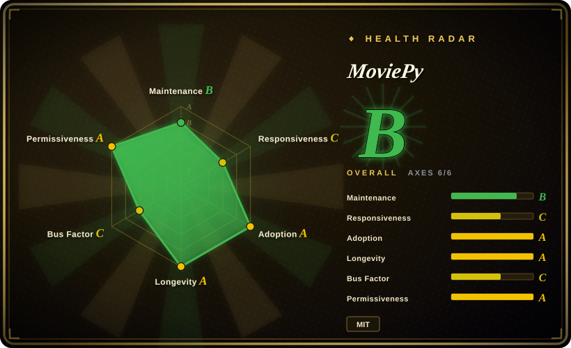
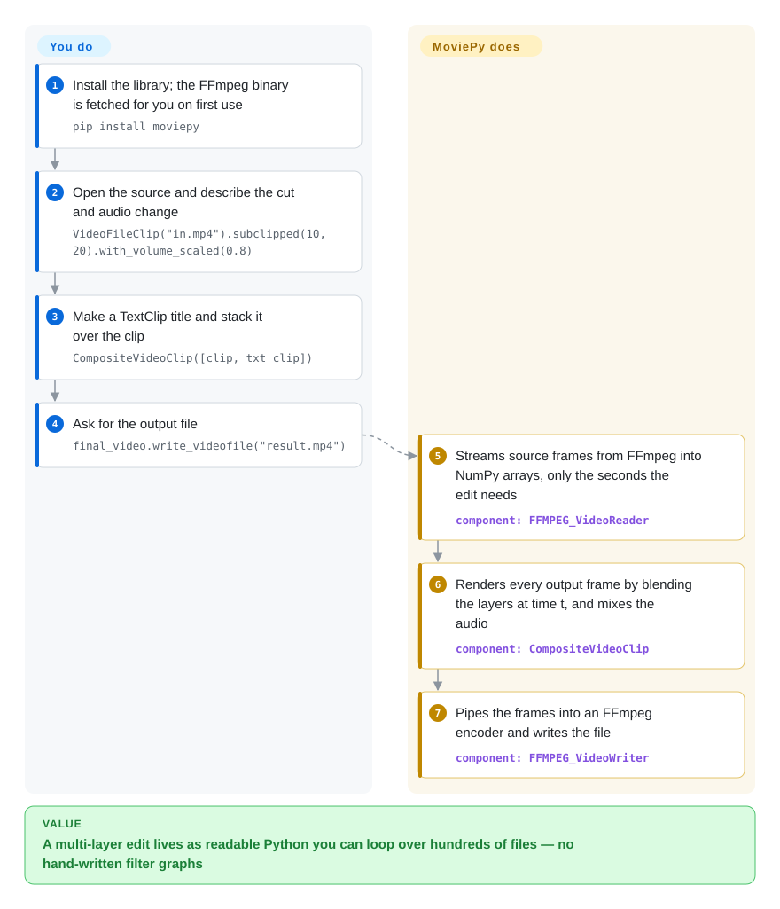

# MoviePy

You have to cut 200 clips, stamp a title on each and stitch them into variants, and FFmpeg's `-filter_complex` strings have become unreadable after the third overlay. MoviePy lets you write that edit as ordinary Python objects — clip, cut, overlay, write — and drives FFmpeg for the reading and encoding.

## When to use

You're a data scientist or content-automation engineer with a folder of recordings and a spreadsheet of what to make from them: "keep 00:10–00:20 of each, lower the volume to 80%, put the speaker's name in the middle, write `result.mp4`". With raw FFmpeg that becomes `-ss 10 -t 10 -i … -filter_complex "[0:v]drawtext=…[v];[0:a]volume=0.8[a]" -map "[v]" -map "[a]"` per file, and the second time you add a crossfade nobody on the team can read the command any more. You `pip install moviepy`, write `VideoFileClip("in.mp4").subclipped(10, 20).with_volume_scaled(0.8)`, overlay a `TextClip` with `CompositeVideoClip`, and call `write_videofile` in a loop. Every frame is a NumPy array, so a custom effect is a few lines of Python rather than a filter you have to find in FFmpeg's manual.

Pick it over ffmpeg-python or PyAV when what you are writing is an *edit* (clips, layers, timing, transitions) rather than a filter graph or per-packet decode loop, and over Remotion when the pipeline already lives in Python. You trade speed for that readability: MoviePy decodes every frame into Python and re-encodes the result, so it is the wrong tool once throughput, not authoring time, is the bottleneck.

## How it works

MoviePy turns media into Python objects. Opening a file starts an FFmpeg process that streams raw frames — uncompressed pixel grids — through a pipe into NumPy arrays, so every pixel is reachable from your code. A clip is a lazy recipe: `subclipped`, `with_volume_scaled`, `with_position` and `with_effects` return a new clip that says *how* to produce frame *t*, without computing anything yet. When you call `write_videofile`, MoviePy walks the timeline frame by frame, asks each layer of a `CompositeVideoClip` for its pixels, blends them, and pipes the result into a second FFmpeg process that encodes the file — think of it as a tracing table where every frame is redrawn by hand. You decide the edit (which clips, which seconds, which layers and effects); MoviePy does the frame timing, compositing, audio mixing and the FFmpeg plumbing. FFmpeg itself is fetched by `imageio-ffmpeg` on first use, so there is nothing else to install for the common path.

<!-- flow-steps:begin (generated from flows/moviepy.json by tools/flow_card.py — do not edit) -->

Text version of the flow

1. **You**: Install the library; the FFmpeg binary is fetched for you on first use — `pip install moviepy`
2. **You**: Open the source and describe the cut and audio change — `VideoFileClip("in.mp4").subclipped(10, 20).with_volume_scaled(0.8)`
3. **You**: Make a TextClip title and stack it over the clip — `CompositeVideoClip([clip, txt_clip])`
4. **You**: Ask for the output file — `final_video.write_videofile("result.mp4")`
5. **MoviePy**: Streams source frames from FFmpeg into NumPy arrays, only the seconds the edit needs — component: `FFMPEG_VideoReader`
6. **MoviePy**: Renders every output frame by blending the layers at time t, and mixes the audio — component: `CompositeVideoClip`
7. **MoviePy**: Pipes the frames into an FFmpeg encoder and writes the file — component: `FFMPEG_VideoWriter`

**Value**: A multi-layer edit lives as readable Python you can loop over hundreds of files — no hand-written filter graphs

<!-- flow-steps:end -->

## When NOT to use

- **⚠ Maintenance is coasting (as of 2026-10).** The last release is v2.2.1 from 2025-05-21; since September 2025 the default branch has received only documentation fixes, and the README itself carries a "Maintainers wanted!" notice. Not abandoned — issues still arrive and get occasional answers — but if you need bugs fixed on a schedule, build on [PyAV](../transcoding-and-pipelines/pyav.md) or [ffmpeg-python](../transcoding-and-pipelines/ffmpeg-python.md), which sit closer to FFmpeg and carry less of their own code.
- **You only need cuts or joins without re-encoding.** MoviePy always decodes and re-encodes, which is slow and lossy for a plain trim. Use [FFmpeg](../transcoding-and-pipelines/ffmpeg.md) with stream copy (`-c copy`) instead.
- **Throughput matters more than authoring time.** Pushing every frame through Python is, in the README's own words, slower than using FFmpeg directly. For batch transcoding of long or high-resolution footage use FFmpeg or [HandBrake](../transcoding-and-pipelines/handbrake.md).
- **Live or low-latency media.** MoviePy is file-in, file-out. For camera feeds, RTSP/WebRTC or anything that must run continuously, use [GStreamer](../transcoding-and-pipelines/gstreamer.md).
- **Your code, tutorials or LLM snippets are MoviePy 1.x.** v2.0 broke the API: `moviepy.editor` is gone, `subclip` became `subclipped`, `clip.fx(...)` became `with_effects([...])`, and v1 is no longer maintained. Budget a migration with the upstream "updating to v2" guide rather than pinning `moviepy<2`.
- **You want a timeline editor or a GUI.** MoviePy has no project file, no preview-driven editing and no undo. Use [MLT](mlt.md) / Shotcut for a real non-linear editor.
- **Your stack is web/React and the video is a templated UI.** Use [Remotion](../../../video-production/remotion.md), which renders React components to video, instead of rebuilding layouts in Python.

## Comparison

| Alternative | In index | Our verdict | Tradeoff |
|---|---|---|---|
| [FFmpeg](../transcoding-and-pipelines/ffmpeg.md) | ✅ | For trims, joins and transcodes that FFmpeg can express in one command, use FFmpeg; reach for MoviePy only when the edit has layers and timing you need to read back later. | Fastest path and stream copy without quality loss; the cost is filter-graph syntax that stops being maintainable past a few overlays. |
| [ffmpeg-python](../transcoding-and-pipelines/ffmpeg-python.md) | ✅ | When you want FFmpeg's speed but generated from Python, pick ffmpeg-python; pick MoviePy when you need per-frame Python effects or a clip/layer model. | Frames never enter Python, so it stays fast; you still think in FFmpeg filters, not in clips. |
| [PyAV](../transcoding-and-pipelines/pyav.md) | ✅ | For custom decode/encode loops or packet-level control inside one process, pick PyAV; pick MoviePy when you want compositing and text without writing the loop yourself. | In-process libav bindings with no subprocess; lower-level, and you build the editing concepts yourself. |
| [Remotion](../../../video-production/remotion.md) | ✅ | When the video is a designed layout (charts, captions, branded templates) and the team writes React, pick Remotion; stay with MoviePy when the pipeline and data are in Python and the input is existing footage. | Web-grade layout and preview tooling; adds Node, a headless browser and its own license terms for companies. |
| [MLT](mlt.md) / Shotcut | 部分已收录 | For a human editing a multitrack timeline, pick MLT/Shotcut; pick MoviePy when no human should touch each video. | A real NLE engine with project files; heavier and not built for writing edits as Python code. |
| OpenCV | 未收录 | Use OpenCV when the frames are input to computer vision; use MoviePy when the output is an edited video. | Excellent per-frame image processing; no notion of clips, audio, layers or transitions. |

## Tech stack

- **Language:** Python ≥ 3.9 (per `pyproject.toml`).
- **Core idea:** clips are lazy objects (`VideoFileClip`, `ImageClip`, `TextClip`, `CompositeVideoClip`, `AudioFileClip`) whose frames are NumPy arrays; v2 replaced v1's function-style effects with effect objects applied through `with_effects`.
- **I/O:** FFmpeg subprocesses read frames as raw video over a pipe and encode the output the same way; `ffplay` is used only for previews.
- **Imaging:** Pillow for text rendering and image work in the v2.2.1 release; the default branch re-added `opencv-python-headless` (merged 2025-08) to speed up resize/rotate, not yet in a tagged release.

## Dependencies

- **Python packages (v2.2.1):** `numpy`, `pillow` (`<12.0`), `imageio`, `imageio_ffmpeg`, `decorator`, `proglog`, `python-dotenv`. The default branch adds `opencv-python-headless`.
- **FFmpeg:** downloaded automatically by `imageio-ffmpeg` on first use; set `FFMPEG_BINARY` (env var or `.env`) to use your own build. ImageMagick is no longer used since v2.0.
- **Fonts:** `TextClip` takes a font file path (e.g. `font="Arial.ttf"`), so the font must exist on the machine that renders.
- **No services or database.** A client-side library; CPU and disk for the output are the only resources.

## Ops difficulty

**Low.** `pip install moviepy` is usually the whole install, because the FFmpeg binary comes with it. What bites in practice: render time (every frame passes through Python, so long videos are CPU-bound), memory when many layers are composited at high resolution, fonts that exist on a developer laptop but not in the container, and the v1→v2 API break when copying older examples. No server, daemon or state to run.

## Health & viability

- **Maintenance (2026-10).** Coasting. v2.2.1 (2025-05-21) is the latest release; recent default-branch commits are documentation fixes (2026-07, 2026-08), with only two pull requests merged since October 2025. The radar's maintenance B and responsiveness C (median first response 228.3 hours, about 9.5 days) match that picture.
- **Governance / bus factor.** Owned by the original author Zulko's personal account; the README lists four active maintainers and openly asks for more help. The radar counts 2 active maintainers in the last 12 months (governance C), so the project depends on a very small volunteer group.
- **Age & Lindy.** Created 2013, about 13 years old, with a large v2 rewrite landed in 2024 — longevity A. Age plus still-alive gives a moderate Lindy prior; the thin maintainer bench is what keeps it from being strong.
- **Adoption.** Very high: 4,336,274 PyPI downloads last month and 5,431 dependent repositories (adoption A), plus a long tail of tutorials. Heavy adoption makes outright disappearance unlikely, but it does not buy faster fixes.
- **Risk flags.** MIT, no relicense history (risk/license A). The real risks are the v1→v2 break that splits examples on the web, and slow upstream response if you hit a bug.

## Caveats (unverified)

- [未验证] ~15k stars and ~2.1k forks as of 2026-10-08; volatile and date-sensitive.
- [推断] "Coasting" is read from commit history, release dates and the README's maintainers-wanted notice, not from a maintainer statement about the project's future.
- [未验证] The size of the OpenCV speed-up ("up to a factor 10" for resize/rotate) is the pull request author's claim; not benchmarked here, and it is not in a tagged release yet.
- [推断] The always-re-encode claim follows from the architecture (frames pass through NumPy and are piped into an encoder); no lossless passthrough mode was found in the docs read for this page.
