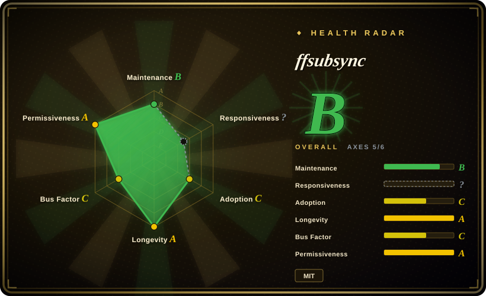
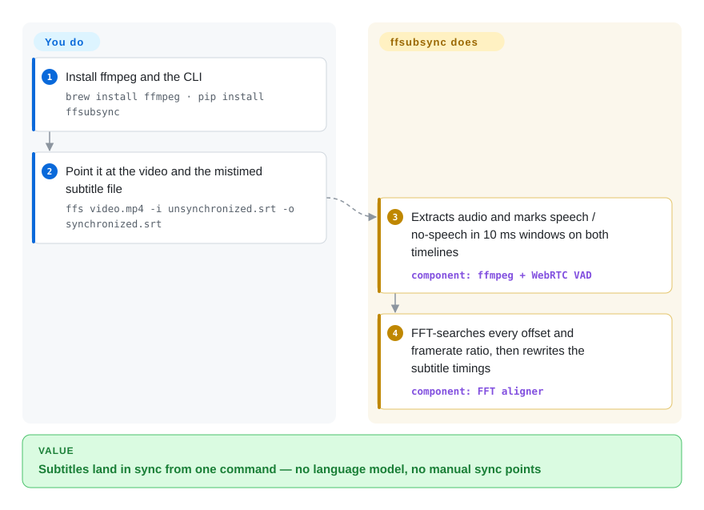

# ffsubsync

You downloaded a subtitle file and its whole timeline is off by seconds — every line lands early or late, and nudging the offset by hand in the player is miserable. ffsubsync re-times an existing subtitle against the video (or a correctly-synced reference subtitle) in one command: it works out *when people are speaking* in both, then slides the two timelines to their best overlap with an FFT.

## When to use

You're sitting down to watch a film with a subtitle file you pulled off the internet, and the timing is off by a few seconds — every line lands too early or too late, and manually nudging the offset in your player is a chore that breaks immersion. You don't speak the subtitle's language well enough to eyeball the alignment, and the mismatch is a constant global shift rather than per-line drift. You run `ffs movie.mkv -i subs.srt -o synced.srt`: ffsubsync uses ffmpeg to extract the audio track, runs voice-activity detection to mark where speech happens, discretizes both the audio and the subtitle timeline into 10 ms speech/no-speech windows, and slides them against each other with an FFT to find the offset that maximizes overlap — then writes a corrected SRT. The whole thing is one command, no language model, no manual sync points.

You also reach for it in a batch/automation context — a media server or an ingestion script that auto-corrects freshly-downloaded subtitles before filing them (a Docker image ships since 0.5.0: `ghcr.io/smacke/ffsubsync:latest`). When you have a known-good reference subtitle in the same or another language, you sync against that instead of decoding audio, which runs in under a second and skips the ffmpeg audio pass. References can be remote URLs, and subtitle files in messy legacy encodings (Windows-1251 Cyrillic, GBK/Big5 Chinese, UTF-16 with BOM) are auto-detected — the README calls out encoding robustness as the thing it does better than sibling tools. For a one-off interactive case there is even a no-install in-browser version (ffmpeg.wasm, nothing uploaded); `--skip-sync-on-low-quality` keeps a bulk run from shipping a worse-than-nothing sync.

## How it works

ffsubsync turns alignment into a search over two binary strings. You hand it a reference (video/audio file, a correct subtitle, or a URL) and the mistimed subtitle file; it discretizes both into 10 ms windows and marks where speech happens on each — trivial for subtitles (a cue is on or off), done with a voice-activity detector (VAD — an "is anybody talking right now" classifier, WebRTC's by default, `auditok` or a fused silero/neural mode via `--vad`) for audio. Sliding one binary string against the other at every offset — and at plausible framerate ratios, so a 23.976-vs-25 fps stretch is fixed too — is a convolution, so an FFT scores all alignments in O(n log n) instead of O(n²); the best-scoring offset becomes the new timestamps. What stays yours: which reference to trust, and the knobs when the default search fails — `--max-offset-seconds` (>60 s drift), `--gss` (exhaustive framerate-ratio search), `--split-penalty` (experimental piecewise alignment when offsets change mid-file), `--encoding` (force a guessed-wrong text encoding). The text itself is never rewritten — only times move.

<!-- flow-steps:begin (generated from flows/ffsubsync.json by tools/flow_card.py — do not edit) -->

Text version of the flow

1. **You**: Install ffmpeg and the CLI — `brew install ffmpeg · pip install ffsubsync`
2. **You**: Point it at the video and the mistimed subtitle file — `ffs video.mp4 -i unsynchronized.srt -o synchronized.srt`
3. **ffsubsync**: Extracts audio and marks speech / no-speech in 10 ms windows on both timelines — component: `ffmpeg + WebRTC VAD`
4. **ffsubsync**: FFT-searches every offset and framerate ratio, then rewrites the subtitle timings — component: `FFT aligner`

**Value**: Subtitles land in sync from one command — no language model, no manual sync points

<!-- flow-steps:end -->

## When NOT to use

- **Mid-file breaks and splits — only partly.** ffsubsync's sweet spot is a constant global shift (plus a linear framerate-mismatch stretch). Commercial breaks cut out of the middle, inserted/removed scenes, or two-disc concatenations mean no single offset fixes both sides; the experimental `--split-penalty` flag (alass-style piecewise alignment) covers many of these since 0.5.x, but the README itself still lists hardening it as open future work — if piecewise sync must simply work, alass is the mature choice.
- **No ffmpeg available.** Audio-based sync requires ffmpeg on the PATH; in a locked-down environment where you can't install it, fall back to the project's own no-install browser UI for one-offs, or to reference-subtitle mode (which needs a correct subtitle to begin with).
- **Style-sensitive ASS/SSA pipelines.** Parsing has gone beyond SRT — ASS/SSA and WebVTT inputs are read via `pysubs2`, and 0.5.x even recognizes CJK brackets and music symbols when building the speech signal. But the documented output examples stay SRT-centric, and whether full style/positioning metadata survives a round-trip is untested here. [未验证]
- **You need transcription or translation.** It does not turn audio into subtitle text on its own and does not translate — it only re-times existing cues. For generating subtitles from speech, use Whisper-class tools; ffsubsync 0.5.x can at least *borrow* a whisper.cpp transcript as its reference (`--whisper-weights`, needs an ffmpeg ≥ 8.0 built with `--enable-whisper`).
- **Silent / music-only or speech-sparse content.** VAD-based alignment leans on speech presence; long stretches with little dialogue give the FFT little signal to lock onto. [推断]

## Comparison

| Alternative | In index | Our verdict | Tradeoff |
|---|---|---|---|
| alass | 未收录 | Choose alass when mid-file split synchronization must be a dependable feature rather than an experiment; pick ffsubsync when a global offset plus framerate stretch covers your case — its encoding auto-detection of messy legacy subtitle files is the stronger one. | Rust subtitle aligner with a mature dynamic-programming algorithm for *split* synchronization (variable offsets across the file); ffsubsync now has experimental `--split-penalty` covering many such cases, but the README lists hardening it as open work. |
| Bazarr | 未收录 | Choose Bazarr when you need a subtitle management service around Sonarr/Radarr, not just alignment. | A subtitle *management* service for Sonarr/Radarr that finds and downloads subs (and can call ffsubsync to sync) — orchestration layer, not the alignment algorithm itself. |
| Subtitle Edit (sync features) | 未收录 | Choose Subtitle Edit when you need a full GUI subtitle editor with manual and automatic sync. | Full GUI subtitle editor with manual + automatic sync, OCR, and format conversion; far broader, but interactive and Windows-centric rather than a scriptable one-shot CLI. |
| OpenAI Whisper | 未收录 | Choose OpenAI Whisper when you need to generate subtitles from audio, not retime an existing subtitle file. | Generates subtitles from audio (transcription), a different job — useful when you have *no* subtitle file; overkill and lossy when you already have correct text that's merely mistimed. |

## Tech stack

- **Language:** Python (README: compatible with 3.6+; 3.13/3.14 support added in 0.4.28/0.4.31).
- **Audio extraction:** ffmpeg (external binary), wrapped via `ffmpeg-python`.
- **Core algorithm:** voice-activity detection — WebRTC VAD by default (via the `webrtcvad-wheels` build), `auditok` or a fused WebRTC+silero mode as alternatives — producing a speech/no-speech binary signal, then FFT-based cross-correlation (`numpy`) to find the offset in O(n log n).
- **Subtitle parsing:** `srt` plus `pysubs2` (ASS/SSA, WebVTT); text-encoding auto-detection via `faust-cchardet`, `charset_normalizer`, `chardet` (three detectors tried in order).
- **CLI/UX:** `argparse`, `rich`, `tqdm`; a separate in-browser build decodes audio with ffmpeg.wasm.

## Dependencies

- **Runtime:** Python (3.6+ per README; 3.13/3.14 tested in recent releases) and an **ffmpeg** binary on PATH (the one hard external dependency for audio-based sync).
- **Python packages:** numpy, ffmpeg-python, webrtcvad-wheels, srt, pysubs2, auditok, faust-cchardet / charset_normalizer / chardet, rich, tqdm (pulled in by `pip install ffsubsync`; faust-cchardet became a required dependency in 0.5.1).
- **Optional:** `pip install ffsubsync[torch]` adds PyTorch for the silero/fused VAD path — heavyweight, only if you need it.
- **No services / no database** — it's a one-shot local CLI; a prebuilt Docker image (`ghcr.io/smacke/ffsubsync:latest`) covers containerized use. A sync typically finishes in 20–30 s; reference-subtitle mode runs in under a second.

## Ops difficulty

**Low.** It's a `pip install` + an ffmpeg dependency, invoked as a single command per file; there's nothing to run as a service, no state, no datastore. A Docker image removes even the ffmpeg PATH friction for batch use. The only real operational decisions are batch-policy ones: wrap the CLI in a loop (or let a host like Bazarr drive it), and pass `--skip-sync-on-low-quality` so a bulk pass never files a confident-looking bad sync. The `[torch]` extra is the only place install weight balloons. No upgrade burden beyond keeping the pip package current.

## Health & viability

- **Maintenance**: Grade B — 4/13 active weeks in trailing 13; last commit 66 days ago.
- **Responsiveness**: Cannot be scored — no_window_signal (GitHub issue traffic in the measured window produced no gradeable signal).
- **Adoption**: Grade C — 28,965 monthly downloads via pypi.org (package: ffsubsync).
- **Longevity**: Grade A — 2773 days old.
- **Governance**: Grade C — top-3 contributor share 95.7% (6 active maintainers in the trailing 12 months).
- **Risk / License**: Grade A — MIT license.

## Caveats (unverified)

- [未验证] Whether ASS/SSA style/positioning metadata survives a full round-trip is untested — pysubs2-based parsing of SSA events is confirmed in source (`ffsubsync/generic_subtitles.py`), but no style-preservation run was done.
- [推断] Speech-sparse content weakening VAD alignment is an inference from how FFT-on-speech alignment works, not a measured failure mode.
- [推断] Single-maintainer bus-factor risk is inferred from the contributor distribution, not a statement about the maintainer's commitment.
