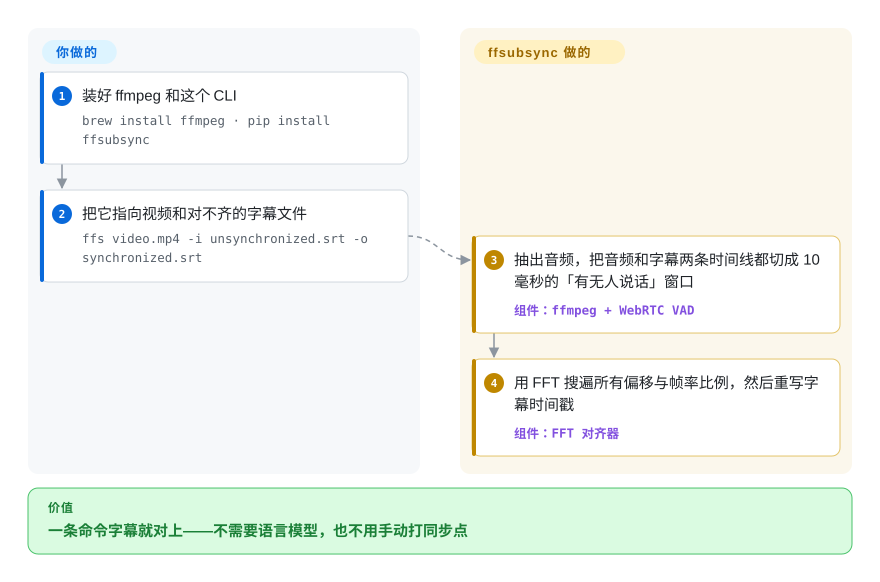

# ffsubsync

你从网上扒来一份字幕，整条时间轴偏了好几秒——每一行不是早出就是晚出，在播放器里手动挪偏移量既累又毁心情。ffsubsync 一条命令把现有字幕重新对齐到视频（或一份同步良好的参考字幕）上：它算出两边「什么时候有人在说话」，再用 FFT 把两条时间轴滑到重叠最好的位置。

## 何时使用

你坐下来准备看一部电影，手里这份从网上扒来的字幕时间轴整体偏了几秒——每一行不是早出来就是晚出来，在播放器里手动挪偏移量既麻烦又破坏观影沉浸感。你对字幕那门语言又没熟到能凭眼睛对齐，而这次错位是一个恒定的全局平移，而非逐行漂移。你跑 `ffs movie.mkv -i subs.srt -o synced.srt`：ffsubsync 用 ffmpeg 抽出音轨，跑语音活动检测（VAD）标出哪里有人说话，把音频和字幕时间线都离散成 10 毫秒的「有语音/无语音」窗口，再用 FFT 把两者相互滑动，找出让重叠最大化的那个偏移量——然后写出一份校正后的 SRT。整件事就一条命令，不需要语言模型，也不用手动打同步点。

你也会在批处理/自动化场景里用它——媒体服务器，或一个吃进刚下载字幕、归档前自动校正时间轴的脚本（0.5.0 起有 Docker 镜像：`ghcr.io/smacke/ffsubsync:latest`）。手头有一份同语言或他语言的已知良好参考字幕时，改成对它同步，一秒内跑完，还省掉解码音频那一步。参考源可以是远程 URL；乱码编码的字幕（西里尔 Windows-1251、中文 GBK/Big5、带 BOM 的 UTF-16）能自动识别——README 特别把编码鲁棒性列为它比同类工具做得更好的地方。单次手动使用甚至有免安装的浏览器版（ffmpeg.wasm，文件不上传）；批量时用 `--skip-sync-on-low-quality` 兜底，宁可不同步也不留下更糟的结果。

## 怎么用起来

ffsubsync 把对齐化成两个二值字符串之间的滑动搜索。你交给它一个参考（视频/音频文件、一份正确字幕，或一个 URL）和那份对不齐的字幕；它把两边都切成 10 毫秒的窗口，标出每个窗口里有没有语音——字幕侧很平凡（一条 cue 要么在要么不在），音频侧用语音活动检测器（VAD，即「此刻有没有人说话」的分类器，默认 WebRTC 的，可换 `auditok`，或用 `--vad` 开 WebRTC+silero 的融合模式）。把一条二值串对另一条在每个偏移、以及每个合理帧率比例上滑一遍（所以 23.976 对 25 fps 的拉伸也能修好）本质是卷积，用 FFT 就能以 O(n log n) 给所有对齐打分，而不是 O(n²)；得分最高的偏移就是新的时间戳。仍归你决定的：信哪个参考，以及默认搜索失灵时的旋钮——`--max-offset-seconds`（偏移超过 60 秒）、`--gss`（穷举帧率比例）、`--split-penalty`（实验性的分段对齐，应对中途偏移变化）、`--encoding`（猜错文本编码时强制指定）。文本本身从不改写——动的只有时间。

<!-- flow-steps:begin (generated from flows/ffsubsync.json by tools/flow_card.py — do not edit) -->

流程文字版

1. **你**：装好 ffmpeg 和这个 CLI — `brew install ffmpeg · pip install ffsubsync`
2. **你**：把它指向视频和对不齐的字幕文件 — `ffs video.mp4 -i unsynchronized.srt -o synchronized.srt`
3. **ffsubsync**：抽出音频，把音频和字幕两条时间线都切成 10 毫秒的「有无人说话」窗口 — 组件：`ffmpeg + WebRTC VAD`
4. **ffsubsync**：用 FFT 搜遍所有偏移与帧率比例，然后重写字幕时间戳 — 组件：`FFT 对齐器`

**价值**：一条命令字幕就对上——不需要语言模型，也不用手动打同步点

<!-- flow-steps:end -->

## 何时不用

- **内容中间的断裂与切分——只能部分解决。** ffsubsync 的主场是恒定全局偏移（外加线性的帧率失配拉伸）。中间被剪掉的广告、插入或删除的场次、两张碟拼成一个文件——任何单一偏移都救不了两头；实验性的 `--split-penalty` 参数（alass 式的分段对齐）自 0.5.x 起能覆盖其中不少场景，但 README 自己仍把加固它列为未完成的后续工作——要分段同步开箱即用，alass 才是成熟选择。
- **没有 ffmpeg 可用。** 基于音频的同步要求 PATH 上有 ffmpeg；在装不了它的受限环境里，单次使用可退回本项目自带的免安装浏览器界面，或改用参考字幕模式（而那需要先有一份正确字幕）。
- **在意样式的 ASS/SSA 流程。** 解析早已不限于 SRT——ASS/SSA 与 WebVTT 输入经 `pysubs2` 读取，0.5.x 甚至能识别 CJK 括号与音乐符号来构建语音信号。但文档示例的输出仍以 SRT 为主，样式/定位元数据能否完整往返，此处未实测。[未验证]
- **你要转写或翻译。** 它不能独自把音频变成字幕文本，也不翻译——只重定时已有的 cue。从语音生成字幕请用 Whisper 一类工具；ffsubsync 0.5.x 至少能「借用」whisper.cpp 的转写做参考（`--whisper-weights`，需要带 `--enable-whisper` 构建的 ffmpeg ≥ 8.0）。
- **静默 / 纯音乐或语音稀疏的内容。** 基于 VAD 的对齐依赖语音存在；大段几乎没有对白的内容，给 FFT 的信号太少，锁不住。[推断]

## 横向对比

| 替代品 | 是否收录 | 我们的评价 | 取舍 |
|---|---|---|---|
| alass | 未收录 | 需要「内容中部分段对齐」是可依赖的成熟功能而非实验时，选 alass；一个全局偏移加帧率拉伸能覆盖你的场景时，选 ffsubsync——它对乱码遗留字幕的编码自动识别更强。 | Rust 写的字幕对齐器，用成熟的动态规划算法处理*切分式*同步（文件内多段不同偏移）；ffsubsync 现在有实验性的 `--split-penalty` 覆盖了不少同类场景，但 README 仍把加固它列为未完成任务。 |
| Bazarr | 未收录 | 需要围绕 Sonarr/Radarr 的字幕管理服务，而不只是对齐算法时，选 Bazarr。 | 面向 Sonarr/Radarr 的字幕*管理*服务，负责查找和下载字幕（并能调用 ffsubsync 来同步）——是编排层，不是对齐算法本身。 |
| Subtitle Edit（同步功能） | 未收录 | 需要带手动和自动同步的完整 GUI 字幕编辑器时，选 Subtitle Edit。 | 完整的图形界面字幕编辑器，带手动 + 自动同步、OCR、格式转换；面广得多，但偏交互、偏 Windows，而非可脚本化的一次性 CLI。 |
| OpenAI Whisper | 未收录 | 需要从音频生成字幕，而不是重定时已有字幕文件时，选 OpenAI Whisper。 | 从音频*生成*字幕（转写），是另一种活——当你*没有*字幕文件时有用；当你已经有正确文本、只是时间错了时，它既杀鸡用牛刀又有损。 |

## 技术栈

- **语言：** Python（README 称兼容 3.6+；0.4.28/0.4.31 加入了 3.13/3.14 支持）。
- **音频抽取：** ffmpeg（外部二进制），经 `ffmpeg-python` 包装。
- **核心算法：** 语音活动检测——默认 WebRTC VAD（走 `webrtcvad-wheels` 发行），可换 `auditok` 或 WebRTC+silero 融合模式——产出「有语音/无语音」二值信号，再用基于 FFT 的互相关（`numpy`）以 O(n log n) 求偏移。
- **字幕解析：** `srt` 加 `pysubs2`（ASS/SSA、WebVTT）；文本编码自动识别经 `faust-cchardet`、`charset_normalizer`、`chardet` 三个检测器按序尝试。
- **CLI/交互：** `argparse`、`rich`、`tqdm`；另有一个浏览器版用 ffmpeg.wasm 解码音频。

## 依赖

- **运行时：** Python（README 称 3.6+；近几个版本加入了 3.13/3.14 支持）以及 PATH 上的一个 **ffmpeg** 二进制（基于音频同步时唯一的硬外部依赖）。
- **Python 包：** numpy、ffmpeg-python、webrtcvad-wheels、srt、pysubs2、auditok、faust-cchardet / charset_normalizer / chardet、rich、tqdm（`pip install ffsubsync` 会一并拉入；faust-cchardet 自 0.5.1 起为必装依赖）。
- **可选：** `pip install ffsubsync[torch]` 加入 PyTorch 用于 silero/融合 VAD——很重，仅在需要时装。
- **无服务 / 无数据库**——它是一次性的本地 CLI；预构建 Docker 镜像（`ghcr.io/smacke/ffsubsync:latest`）覆盖容器化用法。一次同步通常 20–30 秒跑完；参考字幕模式一秒内。

## 运维难度

**低。** 就是 `pip install` 加一个 ffmpeg 依赖，按文件逐个以单条命令调用；没有服务要跑、没有状态、没有数据存储。Docker 镜像把容器化用法连 ffmpeg PATH 的摩擦也抹掉了。真正要操心的只剩批处理策略：用循环包住 CLI（或让 Bazarr 这类宿主来驱动它），并传 `--skip-sync-on-low-quality`，让批量一趟宁可不写也不留下看着自信的坏同步。`[torch]` extra 是安装体积唯一会膨胀的地方。除了保持 pip 包更新外，没有额外的升级/运维负担。

## 健康度与可持续性

- **维护活跃度**：Grade B——最近 13 周中 4 周有提交；最后提交距今 66 天。
- **响应速度**：无法计算——no_window_signal（测量窗口内的 GitHub issue 流量不足以出分）。
- **采用广度**：Grade C——pypi.org 上月下载量 28,965（包名：ffsubsync）。
- **长青度**：Grade A——仓库已创建 2773 天。
- **治理集中度**：Grade C——前三贡献者占比 95.7%（过去 12 个月内 6 位活跃维护者）。
- **许可风险**：Grade A——MIT 许可证。

## 存疑（未验证）

- [未验证] ASS/SSA 样式/定位元数据能否完整往返未实测——基于 pysubs2 解析 SSA 事件在源码（`ffsubsync/generic_subtitles.py`）已确认，但没有跑过样式保留测试。
- [推断] 语音稀疏内容会削弱 VAD 对齐，是从「基于语音的 FFT 对齐」原理推断，而非实测失败模式。
- [推断] 单一维护者的 bus-factor 风险，是从贡献者分布推断，并非对维护者投入程度的判断。
