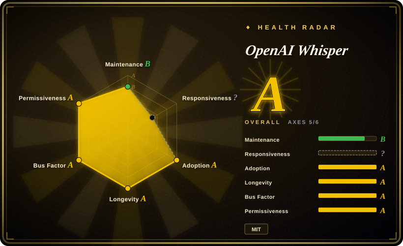
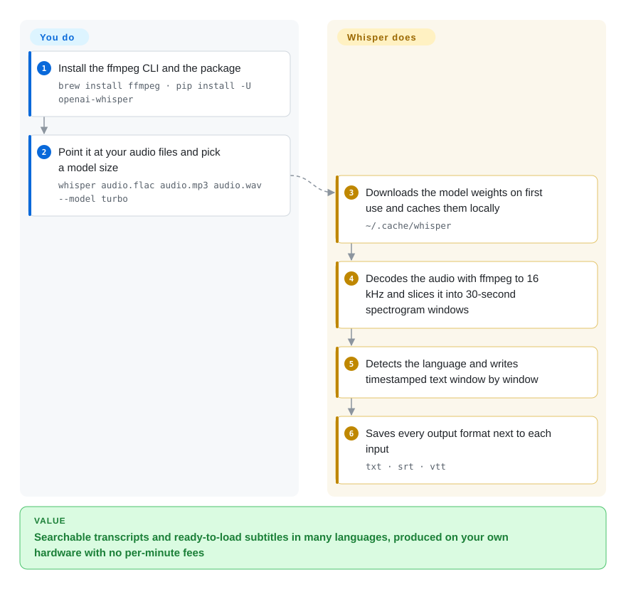

# OpenAI Whisper

You have hours of interviews, meetings or videos in several languages and need text you can search and subtitle, but paying per minute to a cloud API — or sending the audio out at all — is not an option. Whisper is the open-weights speech-to-text model you run on your own machine: point it at audio files and it writes timestamped transcripts and subtitles.

## When to use

You're an archivist, researcher or content producer with a folder of recordings — podcasts, oral-history interviews, conference talks — partly in Spanish and Japanese, and the brief is "searchable transcripts and `.srt` subtitles for all of it". The cloud quotes are per minute, legal does not want the audio leaving your servers, and the older open models you tried handle only English. You `pip install -U openai-whisper`, make sure `ffmpeg` is on the machine, and run `whisper *.mp3 --model turbo`: each file comes back as `.txt`, `.srt`, `.vtt`, `.tsv` and `.json`, with the language detected for you. For a French recording your team must read in English, you switch to a multilingual model and add `--task translate`.

It is the right first pick when you want the **reference** implementation — the code and weights OpenAI published, MIT-licensed, the thing every faster port is measured against — and accuracy across languages matters more than speed. If you already know that throughput, CPU-only hardware or a phone is the constraint, start from a port such as faster-whisper or whisper.cpp instead; they load the same weights.

## How it works

Whisper is one neural network that listens and writes. `ffmpeg` decodes your file to 16 kHz mono audio; the code cuts it into 30-second windows and turns each into a log-Mel spectrogram — a picture of which pitches are loud at each moment. An encoder reads that picture, and a decoder writes the transcript one token (a word piece) at a time, also emitting special tokens that mark the language, the task (transcribe or translate to English) and timestamps; `transcribe()` slides the window forward and stitches the segments together. What it does for you: download the chosen model weights on first use (to `~/.cache/whisper`), detect the language, timestamp the segments and write every output format. What you do: pick a model size that fits your GPU memory and speed budget, choose transcribe vs translate, and handle what the model does not — splitting speakers, skipping long silences, scaling to a fleet.

<!-- flow-steps:begin (generated from flows/whisper.json by tools/flow_card.py — do not edit) -->

Text version of the flow

1. **You**: Install the ffmpeg CLI and the package — `brew install ffmpeg · pip install -U openai-whisper`
2. **You**: Point it at your audio files and pick a model size — `whisper audio.flac audio.mp3 audio.wav --model turbo`
3. **OpenAI Whisper**: Downloads the model weights on first use and caches them locally — `~/.cache/whisper`
4. **OpenAI Whisper**: Decodes the audio with ffmpeg to 16 kHz and slices it into 30-second spectrogram windows
5. **OpenAI Whisper**: Detects the language and writes timestamped text window by window
6. **OpenAI Whisper**: Saves every output format next to each input — `txt · srt · vtt`

**Value**: Searchable transcripts and ready-to-load subtitles in many languages, produced on your own hardware with no per-minute fees

<!-- flow-steps:end -->

## When NOT to use

- **Live captions or low-latency streaming.** The reference code processes whole files in 30-second windows; there is no streaming API. For near-real-time on modest hardware use whisper.cpp or faster-whisper (not indexed) with voice-activity chunking, or a hosted streaming API.
- **Throughput on a budget, or CPU-only machines.** The reference PyTorch code is the slow path: `large` needs ~10 GB of VRAM, and CPU runs of the bigger models crawl. Use faster-whisper (CTranslate2, int8 quantization) or whisper.cpp (C/C++, no Python) with the same weights.
- **You need to know who spoke.** Whisper writes what was said, not who said it. Add pyannote.audio for diarization, or use WhisperX (not indexed), which packages Whisper + alignment + diarization.
- **Silence, music or noise-heavy recordings.** The decoder can hallucinate fluent text over non-speech and sometimes loops on a phrase. Gate the audio with a voice-activity detector first (faster-whisper and WhisperX ship one); the reference package does not.
- **Translation into anything but English, or translation with `turbo`.** `--task translate` only targets English, and the default `turbo` model ignores it and returns the source language. Use `medium`/`large` for English translation, and a separate MT model for other targets.
- **You want a model that keeps improving.** No new open Whisper checkpoint has shipped since `turbo` (2024-09), and the repo gets a handful of fixes a year (latest release v20250625). Treat it as a stable, finished model; for state-of-the-art accuracy compare newer open ASR models before committing.
- **You need fine-tuning recipes or a broader speech toolkit.** The repo is inference-only. For training, adaptation and other speech tasks use [SpeechBrain](../../../speech/speechbrain.md).

## Comparison

| Alternative | In index | Our verdict | Tradeoff |
|---|---|---|---|
| faster-whisper | 未收录 | For batch or server transcription where cost per hour of audio matters, pick faster-whisper; keep the reference Whisper when you need exactly OpenAI's decoding behaviour or are debugging against it. | Same weights, much faster and lighter via CTranslate2 with int8 and built-in VAD; one more downstream project whose model support follows OpenAI's releases. |
| whisper.cpp | 未收录 | For laptops, phones, edge boxes or any deployment that must not carry Python and PyTorch, pick whisper.cpp; stay with Whisper for Python scripting and research. | Single native binary/library with Metal, CUDA and quantization support; you leave the PyTorch ecosystem and its tooling. |
| WhisperX | 未收录 | When subtitles need word-accurate timing and speaker labels, pick WhisperX; plain Whisper is enough for a transcript per file. | Bundles faster-whisper, forced alignment and pyannote diarization; more models to download and some need a Hugging Face token. |
| [SpeechBrain](../../../speech/speechbrain.md) | ✅ | When you need to train or fine-tune ASR, or combine it with speaker ID and enhancement, pick SpeechBrain; for off-the-shelf multilingual transcription pick Whisper. | A full PyTorch speech toolkit with recipes; more assembly required before you get a transcript. |
| pyannote.audio | 未收录 | Use alongside Whisper, not instead of it: pyannote answers who spoke when, Whisper answers what was said. | Diarization only; aligning its speaker turns with Whisper's segments is your glue code (or WhisperX's). |
| Azure / Google Cloud speech APIs | 非仓库 | When you need streaming, SLAs and no GPUs to run, use a hosted API; use Whisper when audio must stay on your machines or per-minute fees do not scale. | Managed and real-time capable; paid per minute, audio leaves your premises, and the model is a black box. |
| DeepSpeech (Mozilla) | 未收录 | Archived; do not start new work on it — Whisper or its ports replace it. | English-centric older ASR whose repository is now archived, so fixes and new models will not come. |
| [ffsubsync](ffsubsync.md) | ✅ | If you already have correct subtitle text with bad timing, use ffsubsync; if you have no text at all, generate it with Whisper. | Aligns existing subtitles to audio quickly and without a GPU; it cannot produce text. |

## Tech stack

- **Language:** Python (`requires-python >= 3.8`; classifiers list 3.8–3.13).
- **ML framework:** PyTorch; optional Triton kernels on Linux x86_64 speed up word-timestamp alignment.
- **Model:** encoder-decoder Transformer in six sizes — `tiny` (39M), `base`, `small`, `medium`, `large` (1550M) and `turbo` (809M, an optimized `large-v3` that is fast but not trained for translation); four sizes have English-only `.en` variants. The tokenizer lists 100 languages.
- **Audio front end:** `ffmpeg` subprocess → 16 kHz mono → 30-second log-Mel windows.
- **Output formats:** `txt`, `vtt`, `srt`, `tsv`, `json`, plus `jsonl` on the default branch (not yet in a release); word-level timestamps via `--word_timestamps True` (marked experimental).

## Dependencies

- **System:** the `ffmpeg` command-line tool must be installed (`apt install ffmpeg`, `brew install ffmpeg`, `choco install ffmpeg` …). A Rust toolchain is needed only if `tiktoken` has no prebuilt wheel for your platform.
- **Python packages:** `torch`, `numpy`, `numba`, `tiktoken`, `tqdm`, `more-itertools`, and `triton` on Linux x86_64. Install with `pip install -U openai-whisper`.
- **Hardware:** CPU works for small models; the README's VRAM guide is ~1 GB (`tiny`/`base`) up to ~10 GB (`large`), ~6 GB for `turbo`.
- **Network:** model weights are downloaded once from OpenAI's public blob storage into `~/.cache/whisper`; pre-seed that directory (or pass `download_root`) for air-gapped machines. No API key and no service at inference time.

## Ops difficulty

**Low to medium.** Install is one `pip` command plus `ffmpeg`; there is no daemon, database or state beyond the weight cache. The work is around it: matching the PyTorch/CUDA build to your GPU, fitting the model size into VRAM, pre-downloading weights where egress is blocked, and building the batch loop, retry and VAD/diarization glue yourself. Serving it as a shared service means choosing a faster backend and a queue — the reference package gives you neither.

## Health & viability

- **Maintenance (2026-10).** Low cadence but alive: the latest release is v20250625, and the default branch got a few small fixes in 2026 (a new JSONL writer, a beam-search attention fix, number-normalizer fixes; last commit 2026-08-31). The radar's maintenance B reflects that. Treat it as a stable released model, not an evolving product.
- **Governance.** OpenAI owns the roadmap; jongwook is by far the largest historical contributor, but recent changes come from several people — the radar counts 6 active maintainers in the last 12 months with a top-1 share of 0.167 (governance A). There is no community governance beyond OpenAI's review.
- **Backing & longevity.** Published September 2022, about four years old (longevity A for a model). OpenAI's newer speech-to-text models have, to our knowledge, been API-only, so further open checkpoints are not guaranteed [推断].
- **Adoption.** Very high: 4,986,176 PyPI downloads last month and 2,067 dependent repositories (adoption A), plus an ecosystem of ports (faster-whisper, whisper.cpp, WhisperX) that keeps the weights useful even if the reference repo goes quiet.
- **Risk flags.** Code and weights are MIT, with no relicense history (risk/license A). The risks are hallucination on non-speech audio and model stagnation rather than licensing.

## Caveats (unverified)

- [未验证] ~110k stars and ~13.3k forks as of 2026-10-08; volatile.
- [推断] "OpenAI's newer speech models are API-only" is based on general knowledge of OpenAI's product line, not on a statement in this repository.
- [未验证] Hallucination and phrase-looping behaviour on silence/music is widely reported in issues and ports' documentation; not re-tested for this page.
- [未验证] Relative speed and VRAM figures are the README's A100 measurements; real numbers vary with hardware, language and batch size.
- [推断] The radar's responsiveness axis is unscored for this page, so issue-response speed was not assessed.
