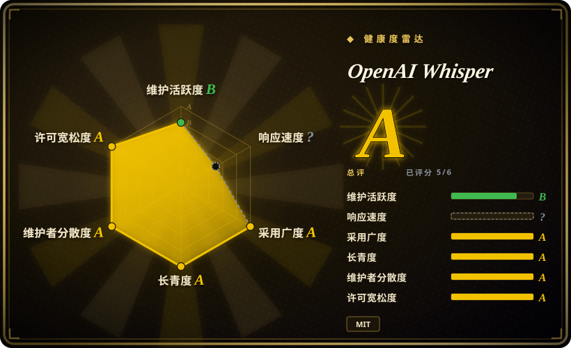
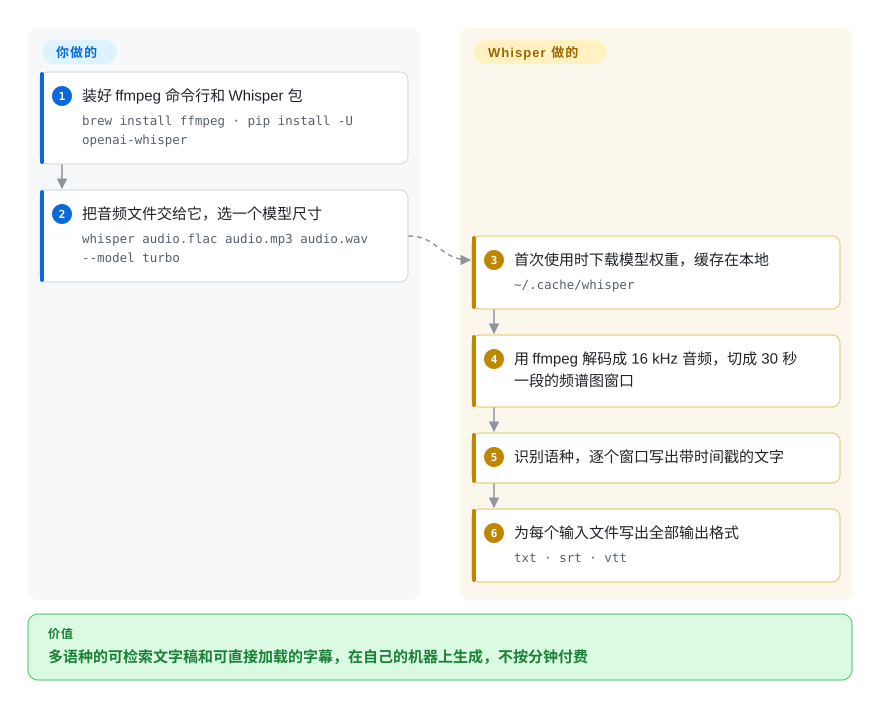

# OpenAI Whisper

你手里有几百小时、好几种语言的访谈、会议或视频，需要能检索、能做字幕的文字，可云端 API 按分钟收费，甚至音频根本不许外传。Whisper 是一个公开权重、能在自己机器上跑的语音转文字模型：把音频文件交给它，它写出带时间戳的文字稿和字幕。

## 何时使用

你是档案管理员、研究者或内容制作者，手里一文件夹录音——播客、口述史访谈、会议演讲——其中一部分是西班牙语和日语，任务是“全部做成可检索的文字稿和 `.srt` 字幕”。云服务按分钟报价，法务不希望音频离开自家服务器，以前试过的开源模型又只认英语。你 `pip install -U openai-whisper`，确认机器上有 `ffmpeg`，跑 `whisper *.mp3 --model turbo`：每个文件都会产出 `.txt`、`.srt`、`.vtt`、`.tsv` 和 `.json`，语种它自己识别。遇到一段团队只能读英文的法语录音，就换成多语种模型，再加 `--task translate`。

当你想要的是**参考实现**——OpenAI 发布的代码和权重，MIT 许可，所有加速移植版都拿它当基准——并且多语种准确度比速度更重要时，它是第一选择。如果你已经知道瓶颈是吞吐量、只有 CPU 或者要跑在手机上，就直接从 faster-whisper 或 whisper.cpp 这类移植版入手；它们加载的是同一套权重。

## 怎么用起来

Whisper 是一个“边听边写”的神经网络。`ffmpeg` 先把文件解码成 16 kHz 单声道音频；代码把它切成 30 秒一段，每段转成对数梅尔频谱图——一张“每一刻哪些音高响”的图。编码器读这张图，解码器一次写一个 token（词片段），同时输出标记语种、任务（转写或译成英文）和时间戳的特殊 token；`transcribe()` 把窗口往前滑，再把各段拼起来。它替你做的：首次使用时下载所选模型权重（存到 `~/.cache/whisper`）、识别语种、给每段打时间戳、写出所有输出格式。你要做的：按显存和速度预算选模型尺寸，决定转写还是翻译，并处理模型不管的事——区分说话人、跳过长段静音、扩展到多台机器。

<!-- flow-steps:begin (generated from flows/whisper.json by tools/flow_card.py — do not edit) -->

流程文字版

1. **你**：装好 ffmpeg 命令行和 Whisper 包 — `brew install ffmpeg · pip install -U openai-whisper`
2. **你**：把音频文件交给它，选一个模型尺寸 — `whisper audio.flac audio.mp3 audio.wav --model turbo`
3. **OpenAI Whisper**：首次使用时下载模型权重，缓存在本地 — `~/.cache/whisper`
4. **OpenAI Whisper**：用 ffmpeg 解码成 16 kHz 音频，切成 30 秒一段的频谱图窗口
5. **OpenAI Whisper**：识别语种，逐个窗口写出带时间戳的文字
6. **OpenAI Whisper**：为每个输入文件写出全部输出格式 — `txt · srt · vtt`

**价值**：多语种的可检索文字稿和可直接加载的字幕，在自己的机器上生成，不按分钟付费

<!-- flow-steps:end -->

## 何时不用

- **实时字幕或低延迟流式识别。** 参考代码按 30 秒窗口处理整个文件，没有流式接口。要在普通硬件上做准实时，用 whisper.cpp 或 faster-whisper（未收录）配合语音活动检测分段，或者用托管的流式 API。
- **预算有限还要吞吐量，或只有 CPU。** 参考的 PyTorch 实现是慢路径：`large` 要约 10 GB 显存，大模型在 CPU 上慢得难以忍受。改用同一套权重的 faster-whisper（CTranslate2、int8 量化）或 whisper.cpp（C/C++，不需要 Python）。
- **你需要知道是谁在说话。** Whisper 只写说了什么，不写谁说的。加 pyannote.audio 做说话人分离，或用把 Whisper、对齐和说话人分离打包在一起的 WhisperX（未收录）。
- **静音、音乐或噪声很多的录音。** 解码器会在非语音段上“编”出通顺的文字，有时还会反复重复一句。先用语音活动检测器过滤（faster-whisper 和 WhisperX 自带一个）；参考包里没有。
- **要翻译成英语以外的语言，或用 `turbo` 翻译。** `--task translate` 只能译成英文，而默认的 `turbo` 模型会忽略它、照原语种输出。英译用 `medium`/`large`，译成其他语言另找机器翻译模型。
- **你想要一个持续变强的模型。** 自 `turbo`（2024-09）之后没有再发布新的开放 Whisper 权重，仓库一年只有零星几次修复（最新发布 v20250625）。把它当作已经定型的稳定模型；追求最新准确度的话，先比较更新的开源语音识别模型再定。
- **你要微调配方或更完整的语音工具箱。** 这个仓库只做推理。训练、领域适配和其他语音任务用 [SpeechBrain](../../../speech/speechbrain.zh.md)。

## 横向对比

| 替代品 | 是否收录 | 我们的评价 | 取舍 |
|---|---|---|---|
| faster-whisper | 未收录 | 批量或服务端转写、在乎每小时音频成本时选 faster-whisper；需要和 OpenAI 解码行为完全一致、或要对照排查时留在参考版 Whisper。 | 同一套权重，借 CTranslate2 加 int8 和内置 VAD 快得多也省得多；多了一个下游项目，模型支持跟着 OpenAI 的发布走。 |
| whisper.cpp | 未收录 | 笔记本、手机、边缘盒子，或任何不能带 Python 和 PyTorch 的部署，选 whisper.cpp；Python 脚本和研究场景留在 Whisper。 | 单个原生二进制/库，支持 Metal、CUDA 和量化；代价是离开 PyTorch 生态和它的工具链。 |
| WhisperX | 未收录 | 字幕要求逐词精准的时间和说话人标签时选 WhisperX；每个文件一份文字稿的话，普通 Whisper 就够。 | 打包了 faster-whisper、强制对齐和 pyannote 说话人分离；要下载更多模型，部分还需要 Hugging Face token。 |
| [SpeechBrain](../../../speech/speechbrain.zh.md) | ✅ | 要训练或微调语音识别，或者要把它和说话人识别、语音增强组合起来，选 SpeechBrain；开箱即用的多语种转写选 Whisper。 | 完整的 PyTorch 语音工具箱，带训练配方；拿到第一份文字稿之前要自己组装更多东西。 |
| pyannote.audio | 未收录 | 和 Whisper 搭配用，而不是替代它：pyannote 回答“谁在什么时候说”，Whisper 回答“说了什么”。 | 只做说话人分离；把它的说话人片段和 Whisper 的段落对齐，是你的胶水代码（或交给 WhisperX）。 |
| Azure / Google Cloud 语音 API | 非仓库 | 需要流式、SLA、又不想自己养 GPU 时用托管 API；音频必须留在自家机器、或按分钟计费撑不住时用 Whisper。 | 托管、能做实时；按分钟付费，音频要出门，模型是黑盒。 |
| DeepSpeech（Mozilla） | 未收录 | 已归档，别在上面开新项目——Whisper 或它的移植版就是替代品。 | 偏英语的老一代语音识别，仓库已归档，不会再有修复和新模型。 |
| [ffsubsync](ffsubsync.zh.md) | ✅ | 已有正确的字幕文字、只是时间轴不对，用 ffsubsync；完全没有文字，用 Whisper 生成。 | 不用 GPU 就能快速把现成字幕对齐到音频；但它产不出文字。 |

## 技术栈

- **语言：** Python（`requires-python >= 3.8`；classifiers 列到 3.8–3.13）。
- **机器学习框架：** PyTorch；在 Linux x86_64 上可选的 Triton 内核用于加速逐词时间戳对齐。
- **模型：** 编码器-解码器 Transformer，六种尺寸——`tiny`（39M）、`base`、`small`、`medium`、`large`（1550M）和 `turbo`（809M，`large-v3` 的优化版，快但没训练过翻译）；其中四种有只认英语的 `.en` 版本。分词器列出了 100 种语言。
- **音频前端：** `ffmpeg` 子进程 → 16 kHz 单声道 → 30 秒对数梅尔窗口。
- **输出格式：** `txt`、`vtt`、`srt`、`tsv`、`json`，默认分支另有 `jsonl`（尚未进入发布版）；逐词时间戳用 `--word_timestamps True`（标注为实验性）。

## 依赖

- **系统：** 必须装好 `ffmpeg` 命令行工具（`apt install ffmpeg`、`brew install ffmpeg`、`choco install ffmpeg` 等）。只有当 `tiktoken` 没有你平台的预编译 wheel 时，才需要 Rust 工具链。
- **Python 包：** `torch`、`numpy`、`numba`、`tiktoken`、`tqdm`、`more-itertools`，Linux x86_64 上还有 `triton`。用 `pip install -U openai-whisper` 安装。
- **硬件：** 小模型 CPU 就能跑；README 给的显存参考从约 1 GB（`tiny`/`base`）到约 10 GB（`large`），`turbo` 约 6 GB。
- **网络：** 模型权重从 OpenAI 的公共存储下载一次，存进 `~/.cache/whisper`；离线机器提前放好这个目录（或传 `download_root`）。推理时不需要 API key，也不连任何服务。

## 运维难度

**低到中。** 安装就是一条 `pip` 命令加 `ffmpeg`；除了权重缓存，没有守护进程、数据库或状态。工作量在周边：让 PyTorch/CUDA 版本和显卡对上、把模型尺寸塞进显存、在出网受限的地方预先下载权重，以及自己搭批处理循环、重试和 VAD/说话人分离的胶水代码。要做成共享服务，就得另选更快的后端和任务队列——参考包两样都不提供。

## 健康度与可持续性

- **维护（2026-10）。** 节奏低但还活着：最新发布 v20250625，默认分支在 2026 年进了几处小修复（新增 JSONL 输出、束搜索注意力修复、数字规范化修复；最后一次提交 2026-08-31）。雷达上维护 B 与此一致。把它当作已发布的稳定模型，而不是还在演进的产品。
- **治理。** 路线图由 OpenAI 掌握；jongwook 是历史上贡献最多的人，但近期改动来自多人——雷达统计过去 12 个月有 6 位活跃维护者，top-1 占比 0.167（治理 A）。除了 OpenAI 自己的审查，没有社区治理。
- **背书与长寿。** 2022 年 9 月发布，约四岁（按模型类算长寿 A）。据我们所知，OpenAI 之后的新语音识别模型都只通过 API 提供，所以后续开放权重没有保证 [推断]。
- **采用。** 非常高：PyPI 上月下载量 4,986,176、依赖仓库 2,067 个（采用 A），外加一圈移植版（faster-whisper、whisper.cpp、WhisperX），即便参考仓库沉寂，这套权重也会继续有用。
- **风险标记。** 代码和权重都是 MIT，无改许可历史（风险/许可 A）。风险在于对非语音音频的幻觉和模型停滞，而不是许可。

## 存疑（未验证）

- [未验证] 截至 2026-10-08 约 110k star、约 13.3k fork；数字易变。
- [推断] “OpenAI 新的语音模型只走 API”来自对 OpenAI 产品线的一般了解，不是本仓库里的声明。
- [未验证] 在静音/音乐上产生幻觉、重复短语，是 issue 和各移植版文档里广泛提到的现象；本页没有重新测试。
- [未验证] 相对速度和显存数字是 README 在 A100 上的测量；实际数字随硬件、语种和批大小变化。
- [推断] 本页雷达的响应速度轴未打分，因此没有评估 issue 响应快慢。
