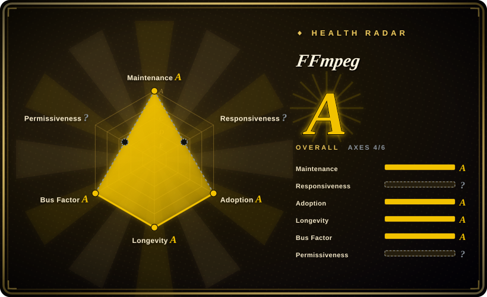
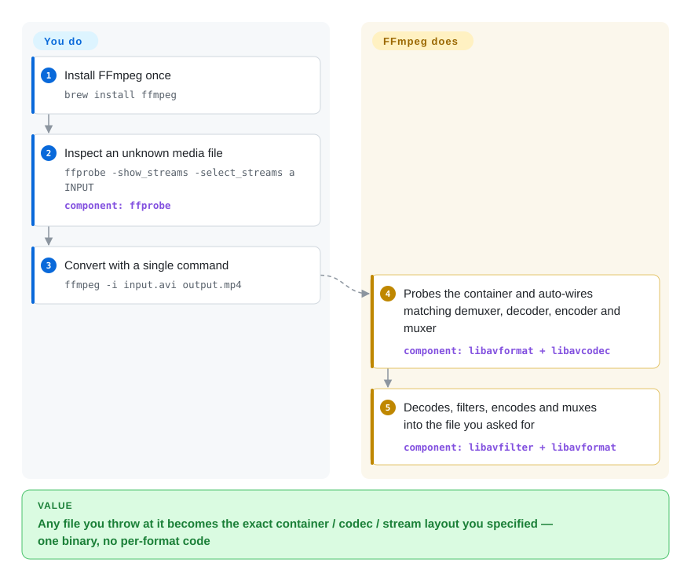

# FFmpeg

A media file lands in a format nothing in your stack plays — weird container, exotic codec, 10-bit HEVC. FFmpeg is the one tool that recognizes nearly everything in existence: `ffmpeg -i input.avi output.mp4` probes it, decodes it, converts it, and rewraps it, or you embed the same engine through its `libav*` libraries.

## When to use

You're a backend engineer wiring up a media pipeline: users upload arbitrary video (phone H.264, a ProRes master, some ancient AVI, a 10-bit HEVC file), and you need a predictable web-ready output — H.264/AAC in an MP4, plus a couple of HLS renditions and a thumbnail. You don't want to know the internals of every container and codec, you just want one tool that ingests whatever comes in and emits exactly what you specify. You shell out to `ffmpeg -i input.mov -c:v libx264 -crf 22 -c:a aac -movflags +faststart out.mp4`, probe the source first with `ffprobe -show_streams -of json` to branch on resolution/codec/duration, and add `-vf scale=1280:-2,fps=30` when you need to normalize. For a transmux (rewrap without re-encoding) you use `-c copy` and pay almost nothing in CPU; for thumbnails you seek with `-ss` and grab one frame. The same binary covers extracting audio, burning subtitles, concatenating segments, generating HLS/DASH, and piping raw frames into another process.

You also reach for FFmpeg as a library, not just a CLI, when you're embedding media handling inside an application — `libavformat`/`libavcodec`/`libavfilter`/`libswscale` give you programmatic demux/decode/filter/encode so you're not spawning subprocesses per request. It's the de-facto engine under most of the media stack you already use (browsers, players, NLEs, cloud transcoders all sit on or beside it), so building on it means building on the format coverage the rest of the industry depends on.

## How it works

FFmpeg is a single binary running one pipeline for all media. When you type `ffmpeg -i input.avi output.mp4`, `libavformat` probes the input (magic bytes + extension) and picks a demuxer; `libavcodec` decodes each stream with native or linked codecs; decoded frames optionally pass through a filtergraph (`-vf scale=1280:-2`); on the output side FFmpeg chooses an encoder and muxer from your target format and writes it — `ffprobe` exposes the same discovery layer as parseable text/JSON, and the `libav*` libraries are exactly what you embed if you call the engine from C/C++ (or a binding like PyAV) instead of spawning a subprocess. What stays yours: build-time flags — which codecs you link changes the binary's license (see below); resource caps and sandboxing for untrusted input; and the CLI's flag grammar (stream specifiers, `-map`, filtergraph syntax) whenever defaults aren't what you meant.

<!-- flow-steps:begin (generated from flows/ffmpeg.json by tools/flow_card.py — do not edit) -->

Text version of the flow

1. **You**: Install FFmpeg once — `brew install ffmpeg`
2. **You**: Inspect an unknown media file — `ffprobe -show_streams -select_streams a INPUT` — component: `ffprobe`
3. **You**: Convert with a single command — `ffmpeg -i input.avi output.mp4`
4. **FFmpeg**: Probes the container and auto-wires matching demuxer, decoder, encoder and muxer — component: `libavformat + libavcodec`
5. **FFmpeg**: Decodes, filters, encodes and muxes into the file you asked for — component: `libavfilter + libavformat`

**Value**: Any file you throw at it becomes the exact container / codec / stream layout you specified — one binary, no per-format code

<!-- flow-steps:end -->

## When NOT to use

- **You need to download from a streaming site.** FFmpeg is not a downloader. It can read an HTTP/HLS URL, but extracting video from YouTube/etc. is the job of `youtube-dl` / `yt-dlp` (URL resolution, format selection, throttling). Don't reimplement that with FFmpeg.
- **You ship a proprietary, closed-source binary — read the license trap first.** The core is LGPL-2.1+, but the moment you build with GPL-licensed encoders (x264, x265) or pass `--enable-gpl`, the resulting binary is **GPL**, and `--enable-nonfree` (for incompatible libs like FDK-AAC) makes it legally **unredistributable** — both spelled out in the repo's `LICENSE.md` (checked 2026-09-28). For commercial/closed distribution you must control your build flags and codec set (or license codecs separately). This is the single most common way teams get FFmpeg licensing wrong.
- **You want a thin, stable API and a gentle learning curve.** The CLI's flag grammar (stream specifiers, filtergraphs, per-stream `-c:v:0`) is famously steep, and the C libraries are low-level with a moving API across major versions. Budget real time, or wrap it.
- **You're parsing untrusted input at scale without a sandbox.** FFmpeg's demuxers/decoders are a large, historically CVE-heavy attack surface in C; feeding it adversarial files unsandboxed is risky. Isolate (seccomp/container/separate process), pin a version, and patch.
- **You just want a few transcodes from Python.** Don't hand-build argv strings — wrap it via [ffmpeg-python](https://github.com/kkroening/ffmpeg-python) or `PyAV` for a saner interface over the same engine.
- **You need a video editor / NLE.** FFmpeg is a transform engine, not a timeline editor. For cutting, multitrack editing, and effects authoring, use an NLE or a framework like MLT/Shotcut on top.

## Comparison

| Alternative | In index | Our verdict | Tradeoff |
|---|---|---|---|
| [GStreamer](gstreamer.md) | ✅ | Choose GStreamer when you need pipeline/element graph framework for live/streaming and app-embedded media. | Pipeline/element graph framework for live/streaming and app-embedded media; more composable for real-time apps and device pipelines, but a heavier programming model than shelling out to one CLI — and it often uses FFmpeg/libav under the hood anyway. |
| libav (avconv) | 未收录 | Only choose libav when you are maintaining legacy systems that still ship `avconv`. | Historical 2011 fork of FFmpeg; merged back into irrelevance and effectively dead. Old distros shipped `avconv`; for any new work use FFmpeg, not libav. |
| [HandBrake](handbrake.md) | ✅ | Choose HandBrake when you need an end-user transcoding app with GUI and `HandBrakeCLI`. | End-user transcoding app (GUI + `HandBrakeCLI`) built on top of FFmpeg/x264/x265; great preset-driven "rip this to MP4/MKV" UX, far narrower than raw FFmpeg's format/filter surface and not a library. |
| [MLT](../editing-and-cutting/mlt.md) / Shotcut | 部分已收录 | Choose MLT/Shotcut when you need multimedia editing/compositing with a timeline model. | Multimedia *framework* for editing/compositing with a timeline model; sits above FFmpeg for the actual codec work — reach for it when you need an editor/NLE, not a transcoder. |
| AWS Elemental MediaConvert / cloud transcoders | 未收录 | Choose managed cloud transcoders when zero-ops elastic scale matters more than self-hosting. | Managed, pay-per-minute transcoding services (often FFmpeg-derived internally); zero ops and elastic scale, but vendor lock-in, per-minute cost, and a SaaS — not a repository you self-host. |

## Tech stack

- **Language:** C (≈89%) with hand-written Assembly (≈8%) for SIMD-optimized codec/scaling hot paths (x86/ARM/etc.).
- **CLIs:** `ffmpeg` (transcode/mux/filter), `ffprobe` (inspect streams/format as text/JSON), `ffplay` (SDL-based test player).
- **Libraries:** `libavformat` (mux/demux + protocols), `libavcodec` (encode/decode), `libavfilter` (filtergraphs), `libavutil`, `libswscale` (scale/pixel-format), `libswresample` (audio resample), `libavdevice`.
- **Build:** a custom `configure` script (not autoconf) + `make`; the codec/feature set is selected at build time via `--enable-*` / `--disable-*` flags.

## Dependencies

- **Core build:** a C toolchain, `make`, and an assembler (`nasm`/`yasm` for x86 SIMD). FFmpeg's own codecs (its native decoders, plus built-in encoders) need no external libraries.
- **Optional external encoders/libs (you choose at build):** `libx264` / `libx265` (H.264/HEVC — **GPL**, pull the build into GPL), `libvpx` (VP8/VP9), `libaom`/`SVT-AV1` (AV1), `libfdk-aac` / native AAC, `libopus`, `libvorbis`, `libdav1d`, `libass` (subtitles), `zlib`/`openssl` (protocols/TLS). License of the final binary depends on which of these you link.
- **Hardware acceleration (optional):** NVENC/NVDEC (NVIDIA), QSV (Intel Quick Sync), VA-API, AMF, VideoToolbox (macOS), V4L2 M2M — each needs the vendor driver/SDK present and is enabled via configure flags.
- **Install paths:** distro packages (often a reduced/LGPL build), official static builds, Docker images, and source. The packaged build's enabled codecs vary by distro/license policy. [未验证]

## Ops difficulty

**Medium.** As a CLI invoked from a service it's operationally simple — a static binary, no daemon, no datastore. The real burden is elsewhere: (1) **build composition** — getting the right `--enable-*` set, codecs, and hardware backends compiled in, and keeping that build's license clean for your distribution; (2) **resource control** — transcoding is CPU/GPU- and memory-hungry, so you need concurrency limits, timeouts, and per-job caps or it will saturate a box; (3) **input hardening** — untrusted media should run sandboxed with a pinned, patched version because of the demuxer CVE surface; (4) **correctness debugging** — A/V sync, pixel formats, color/HDR metadata, and filtergraph ordering are subtle, and the same command can behave differently across FFmpeg major versions. Self-hosting the binary is easy; running a *safe, predictable, license-clean* transcode fleet is the medium-hard part.

## Health & viability

- **Responsiveness**: Cannot be scored — issues_disabled.
- **Maintenance — active and continuous (last push 2026-09).** Decades of uninterrupted development with regular releases; 9.0 shipped 2026-08-03, patched to 9.0.1/9.0.2 by 2026-09-17, and master is already 9.1-dev (GitHub tags, 2026-09-28). The ~3 open issues on the GitHub mirror reflect that upstream tracking happens on its own mailing-list/bug-tracker, not that the project is idle — GitHub PRs are explicitly ignored in favor of `git send-email` to ffmpeg-devel (README).
- **Governance & bus factor — broad, mature community.** `Org`-owned (`FFmpeg/`) — a long-standing multi-contributor project, not a single maintainer or a single vendor's roadmap; about as low a bus-factor risk as open source offers [推断]. (Note the historical 2011 libav fork, which merged back into irrelevance — FFmpeg is the surviving line.)
- **Age & Lindy verdict — old and still active ⇒ as strong a Lindy bet as it gets.** Created 2011 on GitHub (roots to ~2000), still shipping in 2026 (~64.6k stars, GitHub API 2026-09-28), and the de-facto engine under most browsers, players, NLEs and cloud transcoders. This is the safest longevity bet in the media category — building on it is building on what the rest of the industry depends on.
- **Risk flags — licensing is the trap, not viability.** LGPL-2.1+ core, but `--enable-gpl` (x264/x265) makes the build GPL and `--enable-nonfree` makes it **unredistributable** — both confirmed against `LICENSE.md` (2026-09-28): a load-bearing flag for closed-source distribution you must control at build time. Plus a large, historically CVE-heavy C parser attack surface — sandbox and patch untrusted-input pipelines.

## Caveats (unverified)

- [未验证] **License component list:** `LICENSE.md` (read 2026-09-28) confirms LGPL v2.1+ core, `--enable-gpl` → GPL v2+, `--enable-version3` → (L)GPL v3, and `--enable-nonfree` → unredistributable binary, and enumerates the GPL-part files; we did not audit the list item-by-item against every build configuration you might ship.
- [推断] Language percentages (C ≈89%, Assembly ≈8%) are GitHub's linguist breakdown and shift over time; treated as approximate.
- [推断] The CVE/security framing reflects FFmpeg's history as a large C parser of untrusted binary formats; it is an inference about attack surface, not a claim about any specific current vulnerability.
- [推断] Which codecs a *packaged* (distro/static) build enables — and therefore that build's effective license — varies by source; verify the specific build you ship, don't assume the upstream default.
