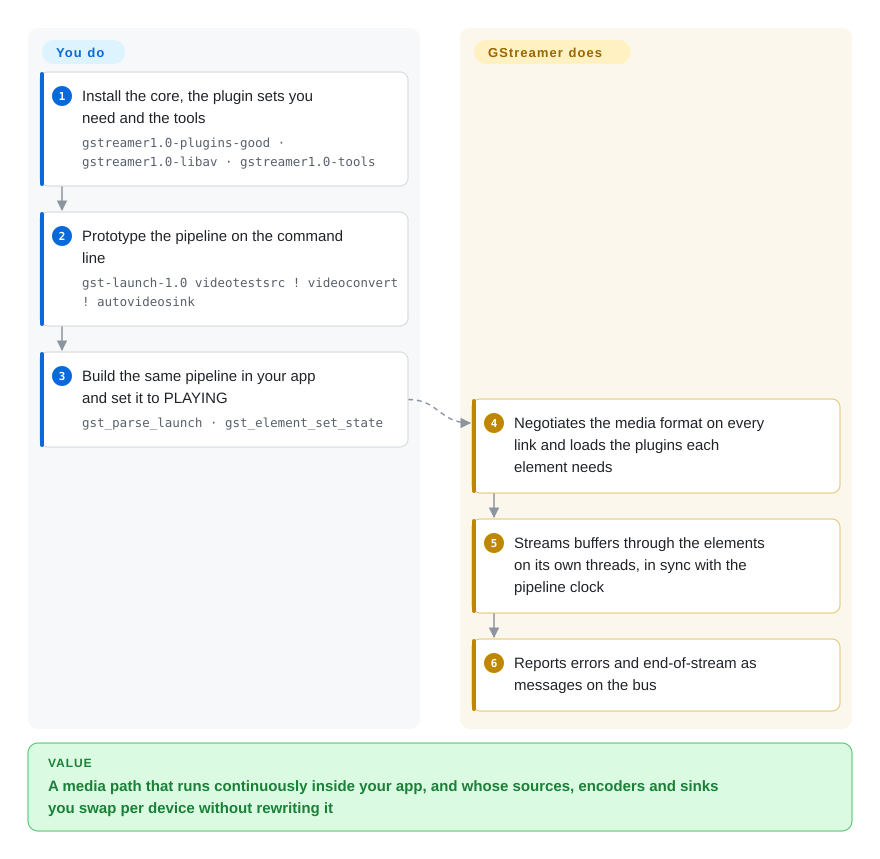

# GStreamer

Your product has to keep a camera or network stream running for hours — decode it, draw on it, encode it, send it somewhere — and calling `ffmpeg` once per file does not fit a process that never ends. GStreamer is the C framework you embed for that: you connect ready-made processing blocks into a pipeline, and it moves the media through them continuously, in sync, inside your own application.

## When to use

You're an embedded Linux engineer on a camera product, an in-car display or a video-analytics box. The device must capture from `/dev/video0`, overlay a timestamp, hardware-encode to H.264 and push to an RTSP or WebRTC endpoint — around the clock, at a fixed latency, on a CPU budget where a stray copy of each frame shows up in the power bill. You try `ffmpeg` in a `subprocess` loop and hit the wall: no way to change the bitrate without restarting, no clean signal when the camera drops, and switching to the SoC's hardware encoder means rewriting the command per board. With GStreamer you prototype the chain as `gst-launch-1.0 v4l2src ! videoconvert ! … ! autovideosink`, then build the same pipeline inside your C, Rust or Python program, change element properties while it runs, and react to errors and end-of-stream messages on its bus.

Pick it over FFmpeg when the media path is a long-running part of your application rather than a batch job, and when you need to swap sources, encoders or sinks per platform (V4L2, VA-API, NVIDIA, Apple VideoToolbox, Direct3D 12) without changing the pipeline's shape. It is also the native choice for GTK/GNOME players (`playbin` builds the whole playback chain for you) and for WebRTC or analytics pipelines where the 1.28 release added ready-made elements.

## How it works

GStreamer is a plumbing kit. Every capability — a camera source, a decoder, a text overlay, an encoder, a network sink — is an **element** shipped in a plugin; you connect elements through their **pads** (input/output sockets) into a **pipeline**, either from a text description (`gst_parse_launch`) or element by element in code. When you set the pipeline to `PLAYING`, GStreamer negotiates **caps** — the media format each link will carry, such as "raw video, NV12, 1920×1080" — so that adjacent elements agree, loads the plugins it needs, and starts streaming threads that push buffers through the chain against a shared clock. Problems and milestones come back to you as messages on the pipeline's **bus**. What GStreamer does for you: format negotiation, threading, timing and A/V sync, and the codec/device plugins themselves. What you do: choose the elements, set their properties, handle bus messages, and make sure the right plugin packages are installed on the target — like plumbing, the pipes are provided, but you decide the layout and check the fittings exist on site.

<!-- flow-steps:begin (generated from flows/gstreamer.json by tools/flow_card.py — do not edit) -->

Text version of the flow

1. **You**: Install the core, the plugin sets you need and the tools — `gstreamer1.0-plugins-good · gstreamer1.0-libav · gstreamer1.0-tools`
2. **You**: Prototype the pipeline on the command line — `gst-launch-1.0 videotestsrc ! videoconvert ! autovideosink`
3. **You**: Build the same pipeline in your app and set it to PLAYING — `gst_parse_launch · gst_element_set_state`
4. **GStreamer**: Negotiates the media format on every link and loads the plugins each element needs
5. **GStreamer**: Streams buffers through the elements on its own threads, in sync with the pipeline clock
6. **GStreamer**: Reports errors and end-of-stream as messages on the bus

**Value**: A media path that runs continuously inside your app, and whose sources, encoders and sinks you swap per device without rewriting it

<!-- flow-steps:end -->

## When NOT to use

- **You just need to transcode or trim files.** For `in.mkv` → `out.mp4` in a script, use [FFmpeg](ffmpeg.md); writing a GStreamer program for a one-shot conversion is far more code and more failure modes.
- **End users need presets and a GUI for batch conversion.** Use [HandBrake](handbrake.md); GStreamer is a developer framework with no end-user transcoder UI.
- **You want quick Python video edits.** Cuts, titles and composites written as a script are easier in [MoviePy](../editing-and-cutting/moviepy.md) (or [PyAV](pyav.md) for frame access); GStreamer's Python bindings still require you to understand elements, pads, caps and states.
- **You're building a timeline editor.** GStreamer has an editing library (GES), but for a multitrack NLE engine with project files [MLT](../editing-and-cutting/mlt.md) is the more direct fit.
- **You can't afford the learning curve or the plugin packaging.** Debugging caps negotiation failures, "no element" errors from a missing plugin package, and state-change deadlocks takes real time. If a fixed set of formats is all you need, linking FFmpeg's libraries directly via [PyAV](pyav.md) or the C API is simpler.
- **Your binary must stay closed-source and you have not audited plugins.** The core is LGPL-2.1+, but some plugin sets carry GPL or patent-encumbered codecs (notably `-ugly`, and x264 via GPL). Ship only an audited plugin list, or use OS codecs (VideoToolbox, Media Foundation) through the corresponding GStreamer elements.
- **Your app is Windows-only and should use OS media APIs.** Media Foundation is the native path and avoids shipping a GStreamer runtime; GStreamer's Windows support (Direct3D 11/12, MSVC builds) is strong, so choose it there only when you also need Linux/macOS or its plugin catalog.

## Comparison

| Alternative | In index | Our verdict | Tradeoff |
|---|---|---|---|
| [FFmpeg](ffmpeg.md) | ✅ | For batch conversion and one-shot processing, pick FFmpeg; pick GStreamer when the media pipeline lives inside a long-running application and must be reconfigured while it runs. | FFmpeg is simpler to start and has the widest codec coverage; GStreamer adds runtime graph control, clocking and a plugin model, at the cost of a steeper API (it can even use FFmpeg's codecs via `gst-libav`). |
| [PyAV](pyav.md) | ✅ | For Python code that needs frame-level decode/encode in one process, pick PyAV; pick GStreamer when you need live sources, sinks and hardware elements wired into a continuous pipeline. | PyAV is a thin binding over FFmpeg's libraries; you write the loop, threading and timing yourself. |
| [HandBrake](handbrake.md) | ✅ | For people converting files with presets, pick HandBrake; GStreamer is for developers building media features. | Polished GUI + CLI on top of FFmpeg/x264/x265; not embeddable and file-to-file only. |
| [MLT](../editing-and-cutting/mlt.md) / Shotcut | 部分已收录 | For timeline editing and rendering projects, pick MLT/Shotcut; for capture, streaming and playback pipelines, pick GStreamer. | MLT models tracks and transitions; GStreamer models live data flow and leaves editing semantics to GES or to you. |
| VLC | 未收录 | For a ready-made player (or libVLC when you just need to play anything), pick VLC; pick GStreamer when you must build custom processing between source and sink. | libVLC gives playback with little code; its pipeline is far less open to inserting your own processing elements. |
| PipeWire / JACK | 未收录 | For routing audio between apps and devices on a Linux desktop or studio, use PipeWire or JACK; use GStreamer to process the media that flows through them. | They are audio/video servers, not processing frameworks; GStreamer talks to them through source/sink elements. |
| AWS Elemental MediaConvert and other cloud transcoders | 非仓库 | For elastic, managed file transcoding without running infrastructure, use a cloud service; use GStreamer when processing has to run on your device or servers. | No ops and pay per minute; vendor lock-in and no on-device or real-time control. |

## Tech stack

- **Core:** C on GLib/GObject (type system, properties, signals); built with Meson. All official modules live in one monorepo (`subprojects/`: `gstreamer`, `gst-plugins-base`, `-good`, `-bad`, `-ugly`, `gst-libav`, `gst-editing-services`, `gst-python`, …).
- **Rust:** a growing share of new plugins is written in Rust (`gst-plugins-rs`, a separate repository), including WebRTC sinks, GIF decoding and inference elements highlighted in 1.28.
- **Bindings:** Python (`gst-python`/PyGObject), Rust (`gstreamer-rs`), C++ (new "Peel" bindings in 1.28), plus others via GObject Introspection.
- **Hardware paths:** VA-API, V4L2 stateful/stateless codecs, NVIDIA (NVCODEC), AMD (AMF, new HIP plugin), Apple VideoToolbox, Direct3D 11/12, Vulkan Video, OpenGL.
- **Tooling:** `gst-launch-1.0` (prototype pipelines), `gst-inspect-1.0` (list elements and caps), `GST_DEBUG` logging and `.dot` graph dumps.

## Dependencies

- **Mandatory:** GLib, plus libintl, zlib and libffi — all fetched as Meson subprojects if the system lacks them.
- **Optional, per plugin:** FFmpeg (via `gst-libav`), x264, openh264, libvpx, dav1d, Opus, Qt, GTK, etc. Plugins whose dependency is missing are simply not built, which is why packaging matters.
- **Build:** Meson ≥ 1.4, Ninja, Python 3.8+ (from source); or distro packages (`gstreamer1.0-plugins-*`), official macOS/Windows/Android/iOS binaries, and Cerbero for cross-platform SDK builds.
- **Platform:** V4L2/ALSA/PulseAudio/PipeWire on Linux, Core Audio/VideoToolbox on macOS, WASAPI/Direct3D on Windows.
- **Licensing note:** the final license obligations depend on which plugins you ship; the core and most of `-base`/`-good` are LGPL.

## Ops difficulty

**Medium-high.** It runs inside your application, so "ops" is packaging and debugging. (1) **Plugin set** — a pipeline fails at runtime with "no element" if the target lacks a plugin package; pin and ship an explicit plugin list. (2) **Version matching** — core and plugin modules are released together and should stay on the same 1.x version. (3) **Debugging** — caps negotiation, pad linking and state changes are opaque until you learn `GST_DEBUG`, `gst-inspect-1.0` and pipeline graph dumps. (4) **Latency and memory tuning** — queue sizes, buffer pools and thread placement need tuning for real-time targets. The framework itself is very stable; the expertise is the cost.

## Health & viability

- **Maintenance (2026-10).** Very active. Stable series 1.28 (1.28.0 on 2026-01-27, bug-fix 1.28.7 on 2026-09-07) alongside a 1.29 development series; the main branch receives commits almost daily (at least 300 since 2026-07-01). The health radar on this page is still the 2026-07-03 value — the scorer does not support GitLab-hosted repositories, so it was not recomputed this pass.
- **Governance & bus factor.** Community project hosted on freedesktop.org GitLab, with work funded by several consultancies rather than one vendor: in the 300 most recent main-branch commits, Centricular, Igalia and Collabora authors dominate, alongside independents and product companies (e.g. Netflix, Amazon). No single company can kill it.
- **Age & Lindy.** Around 25 years old and still shipping a new stable series roughly once a year (1.24 in 2024, 1.26 in 2025, 1.28 in 2026) — an extremely strong Lindy signal; it has survived the move from desktop to embedded, mobile, WebRTC and now ML inference pipelines.
- **Adoption & ecosystem.** Default media framework of GNOME and many embedded Linux stacks (automotive, set-top boxes, cameras); NVIDIA DeepStream and other vendor SDKs build on it. Large plugin catalog, annual conference, active Discourse forum.
- **Risk flags.** No relicense history. The trap is plugin licensing and patents, not the core license — audit what you ship.

## Caveats (unverified)

- [未验证] The health radar (frontmatter `health:` block and card) still holds the 2026-07-03 values; `tools/health.py` and `tools/upstream_snapshot.py` only support GitHub, so the radar was not re-scored and the `upstream` block was updated by hand from the GitLab API.
- [推断] The multi-vendor funding picture is read from author e-mail domains in a sample of 300 recent commits, not from a governance document.
- [推断] "Default in many embedded Linux stacks" and the DeepStream dependency are based on vendor documentation and general knowledge, not a market survey.
- [未验证] Exact plugin license per element varies by version and distribution packaging; check `gst-inspect-1.0` output on your target.
