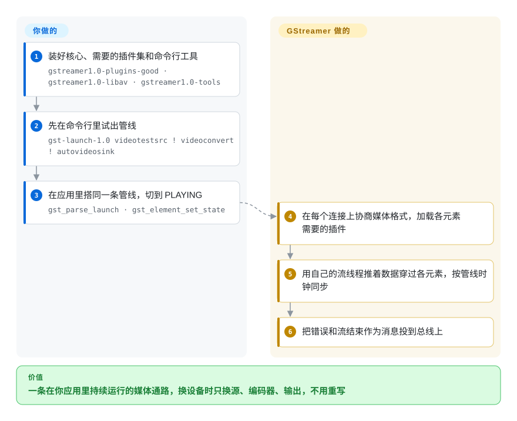

# GStreamer

你的产品要让一路摄像头或网络流连续跑上几个小时——解码、叠画面、编码、发出去——而“每个文件调一次 `ffmpeg`”放不进一个永不退出的进程。GStreamer 就是为此嵌进应用的 C 框架：你把现成的处理模块连成一条管线，它在你自己的程序里持续、同步地把媒体数据推过去。

## 何时使用

你是做摄像头产品、车载屏或视频分析盒子的嵌入式 Linux 工程师。设备要从 `/dev/video0` 采集，叠上时间戳，用硬件编码成 H.264，再推到 RTSP 或 WebRTC 端点——全天候运行、延迟固定，CPU 预算紧到每帧多拷一次都会体现在功耗上。你在 `subprocess` 循环里试 `ffmpeg`，很快撞墙：改码率只能重启，摄像头掉线时没有干净的信号，换成芯片自带的硬件编码器还得每块板子重写一遍命令。用 GStreamer，你先用 `gst-launch-1.0 v4l2src ! videoconvert ! … ! autovideosink` 试出这条链，再在 C、Rust 或 Python 程序里搭同一条管线，运行中随时改元素属性，并在它的总线上处理错误和流结束消息。

当媒体通路是应用里长期运行的一部分、而不是批处理任务，并且你需要按平台换源、换编码器、换输出（V4L2、VA-API、NVIDIA、Apple VideoToolbox、Direct3D 12）而不改管线结构时，选它而不是 FFmpeg。它也是 GTK/GNOME 播放器的原生选择（`playbin` 会替你搭好整条播放链），以及 WebRTC 或视频分析管线的现成选择——1.28 版为这两类加了不少现成元素。

## 怎么用起来

GStreamer 是一套管道零件。每种能力——摄像头源、解码器、文字叠加、编码器、网络输出——都是插件里的一个**元素**；你通过元素的 **pad**（输入/输出接口）把它们连成一条**管线**，可以用一行文字描述（`gst_parse_launch`），也可以在代码里逐个连。当你把管线切到 `PLAYING`，GStreamer 会协商 **caps**——每条连接上走的媒体格式，比如“原始视频、NV12、1920×1080”——让相邻元素对得上，加载需要的插件，再启动流线程，按共享时钟把数据块推过整条链。出了问题或到了节点，它把消息投到管线的**总线**上通知你。GStreamer 替你做的：格式协商、线程、计时和音画同步，以及编解码器和设备插件本身。你要做的：选元素、设属性、处理总线消息，并确保目标机器上装了对的插件包——像水管工程，管子和接头都现成，但走向由你定，现场有没有那个接头也得你自己确认。

<!-- flow-steps:begin (generated from flows/gstreamer.json by tools/flow_card.py — do not edit) -->

流程文字版

1. **你**：装好核心、需要的插件集和命令行工具 — `gstreamer1.0-plugins-good · gstreamer1.0-libav · gstreamer1.0-tools`
2. **你**：先在命令行里试出管线 — `gst-launch-1.0 videotestsrc ! videoconvert ! autovideosink`
3. **你**：在应用里搭同一条管线，切到 PLAYING — `gst_parse_launch · gst_element_set_state`
4. **GStreamer**：在每个连接上协商媒体格式，加载各元素需要的插件
5. **GStreamer**：用自己的流线程推着数据穿过各元素，按管线时钟同步
6. **GStreamer**：把错误和流结束作为消息投到总线上

**价值**：一条在你应用里持续运行的媒体通路，换设备时只换源、编码器、输出，不用重写

<!-- flow-steps:end -->

## 何时不用

- **只是转码或裁剪文件。** 脚本里把 `in.mkv` 转成 `out.mp4`，用 [FFmpeg](ffmpeg.zh.md)；为一次性转换写 GStreamer 程序，代码多得多，出错点也多得多。
- **最终用户要用预设和图形界面批量转换。** 用 [HandBrake](handbrake.zh.md)；GStreamer 是开发者框架，没有面向终端用户的转码界面。
- **想用 Python 快速剪视频。** 截取、加标题、合成这类脚本，用 [MoviePy](../editing-and-cutting/moviepy.zh.md) 更省事（要逐帧访问用 [PyAV](pyav.zh.md)）；GStreamer 的 Python 绑定仍要求你理解元素、pad、caps 和状态。
- **你在做时间线剪辑器。** GStreamer 有剪辑库（GES），但要带工程文件的多轨非线性剪辑引擎，[MLT](../editing-and-cutting/mlt.zh.md) 更直接。
- **承担不起学习曲线和插件打包。** 排查 caps 协商失败、因缺插件包报出的“no element”、状态切换死锁，都很费时间。如果只需要固定几种格式，直接通过 [PyAV](pyav.zh.md) 或 C API 链接 FFmpeg 的库更简单。
- **二进制必须闭源，而你还没审过插件。** 核心是 LGPL-2.1+，但部分插件集带 GPL 或有专利负担的编解码器（尤其是 `-ugly`，以及走 GPL 的 x264）。只发布审过的插件清单，或者通过对应的 GStreamer 元素调用系统编解码器（VideoToolbox、Media Foundation）。
- **应用只跑在 Windows 上，应该用系统媒体 API。** Media Foundation 是原生路径，也省得附带一套 GStreamer 运行时；GStreamer 在 Windows 上的支持（Direct3D 11/12、MSVC 构建）其实很强，所以只有同时要支持 Linux/macOS、或需要它的插件目录时才选它。

## 横向对比

| 替代品 | 是否收录 | 我们的评价 | 取舍 |
|---|---|---|---|
| [FFmpeg](ffmpeg.zh.md) | ✅ | 批量转换和一次性处理选 FFmpeg；媒体管线活在长期运行的应用里、还要边跑边改配置时选 GStreamer。 | FFmpeg 上手简单、编解码覆盖最广；GStreamer 多了运行时图控制、时钟和插件模型，代价是 API 更陡（它甚至能通过 `gst-libav` 用 FFmpeg 的编解码器）。 |
| [PyAV](pyav.zh.md) | ✅ | Python 代码要在单进程里逐帧解码/编码，选 PyAV；要把实时源、输出和硬件元素接成一条持续运行的管线，选 GStreamer。 | PyAV 是 FFmpeg 库的薄绑定；循环、线程和计时都得自己写。 |
| [HandBrake](handbrake.zh.md) | ✅ | 给人用预设转文件，选 HandBrake；GStreamer 是给开发者做媒体功能的。 | 基于 FFmpeg/x264/x265 的成熟 GUI + CLI；不能嵌入，只做文件到文件。 |
| [MLT](../editing-and-cutting/mlt.zh.md) / Shotcut | 部分已收录 | 时间线剪辑和工程渲染选 MLT/Shotcut；采集、推流、播放管线选 GStreamer。 | MLT 建模的是轨道和转场；GStreamer 建模的是实时数据流，剪辑语义交给 GES 或你自己。 |
| VLC | 未收录 | 要现成播放器（或只想“什么都能播”的 libVLC），选 VLC；需要在源和输出之间插自定义处理时，选 GStreamer。 | libVLC 用很少代码就能播放；但它的管线很难插入你自己的处理元素。 |
| PipeWire / JACK | 未收录 | 在 Linux 桌面或录音棚里在应用和设备之间路由音频，用 PipeWire 或 JACK；处理流经它们的媒体，用 GStreamer。 | 它们是音视频服务器，不是处理框架；GStreamer 通过源/输出元素和它们对接。 |
| AWS Elemental MediaConvert 等云转码 | 非仓库 | 要弹性、托管、无需自建基础设施的文件转码，用云服务；处理必须在你的设备或服务器上跑时，用 GStreamer。 | 免运维、按分钟付费；代价是厂商锁定，也没有设备端或实时控制。 |

## 技术栈

- **核心：** 基于 GLib/GObject（类型系统、属性、信号）的 C；用 Meson 构建。所有官方模块都在一个单仓库里（`subprojects/`：`gstreamer`、`gst-plugins-base`、`-good`、`-bad`、`-ugly`、`gst-libav`、`gst-editing-services`、`gst-python` 等）。
- **Rust：** 越来越多的新插件用 Rust 写（在单独的 `gst-plugins-rs` 仓库），1.28 重点介绍的 WebRTC 输出、GIF 解码和推理元素都在其中。
- **绑定：** Python（`gst-python`/PyGObject）、Rust（`gstreamer-rs`）、C++（1.28 新增的 “Peel” 绑定），其余语言经 GObject Introspection。
- **硬件路径：** VA-API、V4L2 有状态/无状态编解码、NVIDIA（NVCODEC）、AMD（AMF、新增的 HIP 插件）、Apple VideoToolbox、Direct3D 11/12、Vulkan Video、OpenGL。
- **工具：** `gst-launch-1.0`（试管线）、`gst-inspect-1.0`（列元素和 caps）、`GST_DEBUG` 日志和 `.dot` 管线图导出。

## 依赖

- **必需：** GLib，以及 libintl、zlib、libffi——系统里没有时会作为 Meson 子项目自动拉取。
- **可选，按插件：** FFmpeg（经 `gst-libav`）、x264、openh264、libvpx、dav1d、Opus、Qt、GTK 等。缺了依赖的插件直接不编译，这正是打包要上心的原因。
- **构建：** 从源码构建需要 Meson ≥ 1.4、Ninja、Python 3.8+；或者用发行版包（`gstreamer1.0-plugins-*`）、官方 macOS/Windows/Android/iOS 二进制，跨平台 SDK 构建用 Cerbero。
- **平台：** Linux 上的 V4L2/ALSA/PulseAudio/PipeWire，macOS 上的 Core Audio/VideoToolbox，Windows 上的 WASAPI/Direct3D。
- **许可提示：** 最终的许可义务取决于你发布了哪些插件；核心和 `-base`/`-good` 的大部分是 LGPL。

## 运维难度

**中高。** 它跑在你的应用里，所以“运维”指的是打包和排障。（1）**插件集**——目标机器缺某个插件包，管线就会在运行时报 “no element”；要锁定并随应用发布一份明确的插件清单。（2）**版本匹配**——核心和各插件模块一起发布，应保持在同一个 1.x 版本。（3）**排障**——caps 协商、pad 连接和状态切换在学会 `GST_DEBUG`、`gst-inspect-1.0` 和管线图导出之前都是黑盒。（4）**延迟和内存调优**——队列长度、缓冲池和线程分布都要针对实时目标调。框架本身非常稳定；成本在于需要的专业经验。

## 健康度与可持续性

- **维护（2026-10）。** 非常活跃。稳定系列 1.28（1.28.0 于 2026-01-27，修复版 1.28.7 于 2026-09-07），同时有 1.29 开发系列；主分支几乎每天都有提交（2026-07-01 以来至少 300 次）。本页健康雷达仍是 2026-07-03 的旧值——打分器不支持 GitLab 托管的仓库，这次没能重算。
- **治理与 bus factor。** 托管在 freedesktop.org GitLab 上的社区项目，开发由多家咨询公司出资而非单一厂商：最近 300 次主分支提交里，Centricular、Igalia、Collabora 的作者占大头，另有独立开发者和产品公司（如 Netflix、Amazon）。没有哪一家公司能单方面让它停摆。
- **年龄与 Lindy。** 约 25 岁，仍大约每年发布一个新稳定系列（2024 年 1.24、2025 年 1.26、2026 年 1.28）——极强的 Lindy 信号；它挺过了从桌面到嵌入式、移动、WebRTC，再到如今机器学习推理管线的转变。
- **采用与生态。** GNOME 和许多嵌入式 Linux 栈（车载、机顶盒、摄像头）的默认媒体框架；NVIDIA DeepStream 等厂商 SDK 建在它之上。插件目录庞大，有年度大会和活跃的 Discourse 论坛。
- **风险标记。** 无改许可历史。陷阱在插件许可和专利，不在核心许可——发布前审一遍你带出去的东西。

## 存疑（未验证）

- [未验证] 健康雷达（frontmatter 的 `health:` 块和雷达图）仍是 2026-07-03 的旧值；`tools/health.py` 和 `tools/upstream_snapshot.py` 只支持 GitHub，所以雷达没有重算，`upstream` 块是按 GitLab API 手工更新的。
- [推断] 多厂商出资的判断来自最近 300 次提交的作者邮箱域名抽样，不是来自治理文档。
- [推断] “许多嵌入式 Linux 栈的默认选择”和 DeepStream 依赖它，依据是厂商文档和一般认知，不是市场调查。
- [未验证] 每个元素的具体插件许可随版本和发行版打包而不同；以目标机器上 `gst-inspect-1.0` 的输出为准。
