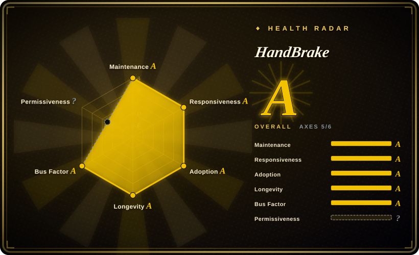
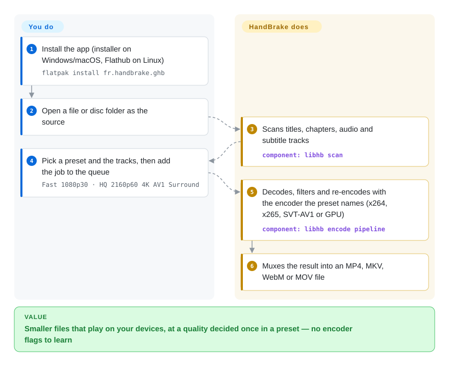

# HandBrake

A shelf of camera footage, screen recordings or old DVDs is eating terabytes, plays on half your devices, and every attempt to shrink it ends in an FFmpeg command you have to look up again. HandBrake is a desktop app (plus a command-line twin) where you pick a source and a named preset — "Fast 1080p30", "HQ 2160p60 4K AV1 Surround" — and it re-encodes the whole thing into a smaller, widely playable file.

## When to use

You look after a family or small-studio media library: phone videos in HEVC that the old TV can't play, 40 GB screen recordings, a box of unencrypted DVDs and home-made Blu-rays. You want everything as MP4 or MKV that plays everywhere, at a quality you choose once, without learning `-crf`, `-preset` and audio-mapping flags. You open HandBrake, drop in a file or disc folder, pick the title and the audio/subtitle tracks, choose a preset such as "Fast 1080p30" (H.264 + stereo AAC) or an AV1/H.265 one for archiving, preview a few seconds, and add the job to the queue. For a whole directory you save that preset and run the same thing headless with `HandBrakeCLI -i <source> -o <destination> -Z "Fast 1080p30"` on a NAS or in a cron job.

Pick it over FFmpeg when the job is "turn these sources into good-looking, compatible files" and the person doing it should not have to own a command line; pick it over cloud transcoders when the files are private or large and the hardware is already yours. Since 1.11 it also writes editing-friendly intermediates (ProRes, DNxHR in MOV), so it doubles as a proxy-file generator for editors.

## How it works

HandBrake is a front end and a queue around one engine, `libhb`. When you open a source, `libhb` scans it — for a disc, every title, chapter, audio and subtitle track — using FFmpeg's decoders and libdvdnav/libbluray for disc structure. A **preset** is a saved bundle of every encode decision (container, video encoder and quality, frame rate, filters such as deinterlace or denoise, which audio tracks and how to encode them, subtitles); the GUI or `HandBrakeCLI` turns your source + preset into a job. The engine then decodes, filters and re-encodes the video with the encoder the preset names — x264, x265, SVT-AV1, libvpx, or a GPU encoder (Intel QSV, NVIDIA NVENC, AMD VCN, Apple VideoToolbox) — and muxes the result into MP4, MKV, WebM or MOV. Think of it as a photocopier with good default settings: you pick the original and the button, it does the copying. You decide sources, presets and tracks; HandBrake does the scan, the encoder settings, the filters and the muxing, and always re-encodes the video.

<!-- flow-steps:begin (generated from flows/handbrake.json by tools/flow_card.py — do not edit) -->

Text version of the flow

1. **You**: Install the app (installer on Windows/macOS, Flathub on Linux) — `flatpak install fr.handbrake.ghb`
2. **You**: Open a file or disc folder as the source
3. **HandBrake**: Scans titles, chapters, audio and subtitle tracks — component: `libhb scan`
4. **You**: Pick a preset and the tracks, then add the job to the queue — `Fast 1080p30 · HQ 2160p60 4K AV1 Surround`
5. **HandBrake**: Decodes, filters and re-encodes with the encoder the preset names (x264, x265, SVT-AV1 or GPU) — component: `libhb encode pipeline`
6. **HandBrake**: Muxes the result into an MP4, MKV, WebM or MOV file

**Value**: Smaller files that play on your devices, at a quality decided once in a preset — no encoder flags to learn

<!-- flow-steps:end -->

## When NOT to use

- **You want to change the container or cut without re-encoding.** HandBrake always re-encodes video, which costs time and some quality. For a remux or lossless trim use [FFmpeg](ffmpeg.md) with `-c copy` (or MKVToolNix, not indexed).
- **The disc is copy-protected or the file has DRM.** HandBrake explicitly does not circumvent copy protection, so most commercial DVDs/Blu-rays and store downloads will not open. Ripping first with MakeMKV (not a repo — closed-source freeware) is the usual route; check your local law.
- **You need to combine clips or edit.** HandBrake does not concatenate files and has no timeline. Use FFmpeg's concat demuxer for joins, [MoviePy](../editing-and-cutting/moviepy.md) for scripted edits, or [MLT](../editing-and-cutting/mlt.md) / Shotcut for real editing.
- **You need a library to embed in your app.** `libhb` is not published as a stable, documented public API for third-party apps. Use FFmpeg's libraries, [PyAV](pyav.md) or [GStreamer](gstreamer.md) instead.
- **Live streaming or adaptive-bitrate packaging.** HandBrake is file-to-file: no RTMP/SRT output, no HLS/DASH ladders. Use FFmpeg or GStreamer for streaming, and a packager for ABR.
- **Custom filter graphs.** The filter set is fixed (deinterlace, denoise, sharpen, crop/scale, rotate, subtitle burn-in and a few more). For anything else — overlays, speed changes, complex audio mixing — use FFmpeg's `-vf`/`-af` graphs.
- **You plan to ship a modified closed-source build.** Compiled HandBrake is GPLv2, and the build cannot legally redistribute with fdk-aac (the LICENSE says such binaries are "neither free nor redistributable"). Use FFmpeg's LGPL build path for proprietary products.

## Comparison

| Alternative | In index | Our verdict | Tradeoff |
|---|---|---|---|
| [FFmpeg](ffmpeg.md) | ✅ | For automation that needs remuxing, stream copy, joins, filters or streaming, pick FFmpeg; pick HandBrake when a person (or a simple script) just needs good presets for whole-file re-encodes. | FFmpeg can do everything HandBrake does and much more, at the price of flags you must learn and get right; HandBrake trades flexibility for curated presets, disc scanning and a GUI. |
| [GStreamer](gstreamer.md) | ✅ | For media features inside your own application or live pipelines, pick GStreamer; HandBrake is the finished tool for converting files. | A developer framework with runtime control; no end-user UI, presets or queue. |
| [MLT](../editing-and-cutting/mlt.md) / Shotcut | 部分已收录 | When you need to cut, arrange and add transitions, pick Shotcut (MLT); use HandBrake afterwards or instead when the only job is re-encoding. | A timeline editor that also exports; slower and heavier than HandBrake for batch conversion. |
| Unmanic | 未收录 | For a media server whose whole library should be watched and transcoded automatically by rules, pick Unmanic; HandBrake fits a person-driven queue or a simple scheduled script. | Library-wide automation with workers and a web UI, built on FFmpeg; more moving parts (a service, its state, plugins) and GPL-3.0. |
| AWS Elemental MediaConvert / cloud transcoders | 非仓库 | For elastic, API-driven transcoding of other people's uploads, pick a cloud service; pick HandBrake for your own files on your own hardware. | No hardware to manage and ABR packaging built in; per-minute fees, uploads and vendor lock-in. |
| VLC | 未收录 | For an occasional one-off conversion on a machine that already has VLC, it is enough; pick HandBrake for anything repeated or quality-sensitive. | A player first; its convert dialog exposes few quality controls and no proper queue or presets. |

## Tech stack

- **Engine:** C (`libhb`), driving FFmpeg 8.0.1 for decoding and filters (per the 1.11.0 notes), libdvdread/libdvdnav (DVD) and libbluray (Blu-ray) for disc structure, dav1d for AV1 decoding.
- **Encoders:** software x264, x265, SVT-AV1, libvpx (VP8/VP9), FFmpeg's MPEG-2/MPEG-4/FFV1, and since 1.11 ProRes and DNxHR; hardware Intel QSV (oneVPL), NVIDIA NVENC, AMD VCN (AMF), Apple VideoToolbox, Media Foundation on Windows ARM.
- **Containers:** MP4, MKV, WebM, and MOV (added in 1.11).
- **GUIs:** GTK 4 on Linux (since 1.8), Cocoa on macOS, WPF on .NET 10 on Windows; `HandBrakeCLI` shares the same engine and preset JSON format.

## Dependencies

- **End users:** none beyond the installer. Windows needs the Microsoft .NET Desktop Runtime 10.0; Linux users are pointed to the official Flathub Flatpak.
- **Bundled third-party libraries:** FFmpeg, x264, x265, SVT-AV1, libvpx, libopus, libdav1d, libdvdread/libdvdnav, libbluray, oneVPL, AMF, HarfBuzz and others, built and shipped by the project.
- **Building from source:** a Python-driven `./configure` that downloads and builds the contrib libraries, then `make` (e.g. `./configure --launch-jobs=$(nproc) --launch`).
- **Optional:** libdvdcss is never bundled; fdk-aac only in private, non-redistributable builds (`--enable-fdk-aac`).

## Ops difficulty

**Low.** It is a desktop app: install, pick a preset, queue. Headless use is one `HandBrakeCLI` binary plus a preset file exported from the GUI. The practical costs are CPU/GPU time (software AV1 and x265 at high quality are slow), checking that a GPU encoder's quality is acceptable before switching a whole library to it, and backing up custom presets before upgrades — the release notes warn they may not carry over. No server, database or network service.

## Health & viability

- **Maintenance (2026-10).** Very active: 1.11.0 (2026-03-08), 1.11.1 and 1.11.2 (2026-06-07), with commits landing days apart (last on 2026-10-08) — maintenance A.
- **Governance.** Volunteer core team with clear owners per platform (Windows GUI, macOS GUI, engine), no company or foundation behind it. The radar counts 26 active maintainers in the last 12 months, with a top-3 share of 0.705 — a handful of long-time maintainers carry most commits, so there is concentration but not a single point of failure (governance A).
- **Responsiveness.** The radar measures a median first response of 12 hours on 50 recent issues (responsiveness A).
- **Age & Lindy.** Started in 2003 and maintained ever since; the GitHub repository dates from 2015. Two decades of active releases make it a very strong Lindy bet.
- **Adoption.** 59,941,627 downloads of release assets on GitHub and 4,248 Homebrew installs in 90 days (adoption A), plus the official Flathub package.
- **Risk flags.** GPLv2 for compiled builds, with no relicense history; the radar's license axis is unscored because GitHub reports the license as `NOASSERTION` (the LICENSE file mixes per-file terms but states that a compiled build is GPLv2).

## Caveats (unverified)

- [未验证] ~24.6k stars as of 2026-10-08; volatile.
- [推断] The SPDX value `GPL-2.0-only` is our reading of the LICENSE text ("a compiled HandBrake build is licensed under GPLv2"); individual source files may carry GPLv2+, LGPL or BSD terms.
- [推断] "Clear owners per platform" is inferred from the top contributors' commit areas (Windows GUI, engine, macOS), not from a governance document.
- [推断] "No stable public `libhb` API" is based on the docs only describing the GUIs and `HandBrakeCLI`; the GUIs do talk to `libhb` through a JSON interface that a determined integrator could use.
- [未验证] Quality and speed differences between hardware encoders vary by GPU generation and driver; not tested for this page.
