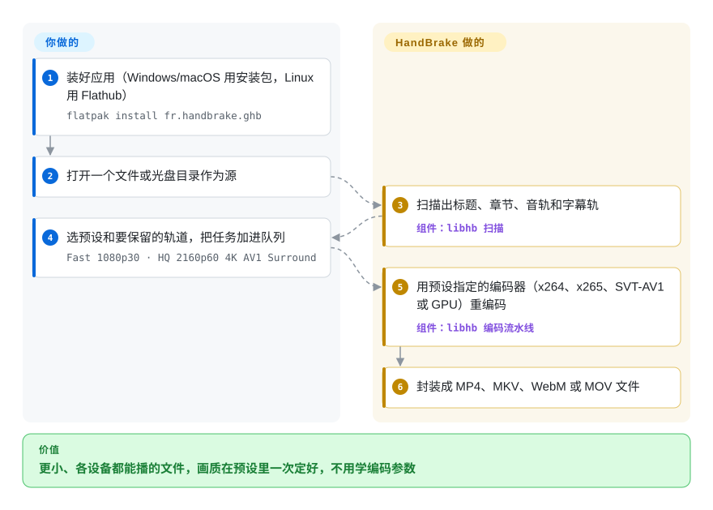

# HandBrake

一架子相机素材、录屏和旧 DVD 吃掉好几 TB，一半设备还放不了，每次想压小一点都得重新去查那条 FFmpeg 命令。HandBrake 是一个桌面应用（外加一个命令行版本）：选好源和一个有名字的预设——“Fast 1080p30”“HQ 2160p60 4K AV1 Surround”——它就把整段视频重新编码成更小、到处都能播的文件。

## 何时使用

你管着一个家庭或小工作室的媒体库：老电视放不了的 HEVC 手机视频、40 GB 一个的录屏、一箱没加密的 DVD 和自己刻的蓝光。你希望全部变成到处能播的 MP4 或 MKV，画质只定一次，不用去学 `-crf`、`-preset` 和音轨映射参数。你打开 HandBrake，拖进一个文件或光盘目录，选标题和要保留的音轨/字幕，挑一个预设——比如 “Fast 1080p30”（H.264 + 立体声 AAC），归档就选 AV1/H.265 的——预览几秒，然后加进队列。整个目录要处理时，把这个预设存下来，在 NAS 上或定时任务里用 `HandBrakeCLI -i <source> -o <destination> -Z "Fast 1080p30"` 无界面地跑同样的事。

当任务是“把这些源变成好看又兼容的文件”，而操作的人不该被迫掌握命令行时，选它而不是 FFmpeg；当文件私密或很大、硬件本来就是你自己的时，选它而不是云转码。从 1.11 起它还能输出便于剪辑的中间格式（MOV 封装的 ProRes、DNxHR），所以也能当剪辑代理文件生成器用。

## 怎么用起来

HandBrake 是围绕同一个引擎 `libhb` 的前端加队列。你打开一个源时，`libhb` 会扫描它——如果是光盘，就扫出每个标题、章节、音轨和字幕轨——解码靠 FFmpeg，光盘结构靠 libdvdnav/libbluray。**预设**是一整包编码决定的存档（封装格式、视频编码器和质量、帧率、反交错或降噪等滤镜、保留哪些音轨以及怎么编码、字幕）；GUI 或 `HandBrakeCLI` 把“源 + 预设”变成一个任务。随后引擎解码、过滤，并用预设指定的编码器重新编码视频——x264、x265、SVT-AV1、libvpx，或 GPU 编码器（Intel QSV、NVIDIA NVENC、AMD VCN、Apple VideoToolbox）——再封装成 MP4、MKV、WebM 或 MOV。可以把它想成一台默认设置调得很好的复印机：你放原件、按按钮，它负责复印。你决定源、预设和轨道；HandBrake 负责扫描、编码参数、滤镜和封装，而且视频永远会被重新编码。

<!-- flow-steps:begin (generated from flows/handbrake.json by tools/flow_card.py — do not edit) -->

流程文字版

1. **你**：装好应用（Windows/macOS 用安装包，Linux 用 Flathub） — `flatpak install fr.handbrake.ghb`
2. **你**：打开一个文件或光盘目录作为源
3. **HandBrake**：扫描出标题、章节、音轨和字幕轨 — 组件：`libhb 扫描`
4. **你**：选预设和要保留的轨道，把任务加进队列 — `Fast 1080p30 · HQ 2160p60 4K AV1 Surround`
5. **HandBrake**：用预设指定的编码器（x264、x265、SVT-AV1 或 GPU）重编码 — 组件：`libhb 编码流水线`
6. **HandBrake**：封装成 MP4、MKV、WebM 或 MOV 文件

**价值**：更小、各设备都能播的文件，画质在预设里一次定好，不用学编码参数

<!-- flow-steps:end -->

## 何时不用

- **只想换封装或截一段，不想重编码。** HandBrake 永远重编码视频，既费时间又损一点画质。换封装或无损裁剪，用 [FFmpeg](ffmpeg.zh.md) 加 `-c copy`（或未收录的 MKVToolNix）。
- **光盘有拷贝保护或文件带 DRM。** HandBrake 明确不破解任何拷贝保护，所以大多数商业 DVD/蓝光和应用商店下载的视频都打不开。通常做法是先用 MakeMKV（非仓库，闭源免费软件）抓取；注意当地法律。
- **要拼接片段或剪辑。** HandBrake 不能合并文件，也没有时间线。拼接用 FFmpeg 的 concat 解复用器，脚本化剪辑用 [MoviePy](../editing-and-cutting/moviepy.zh.md)，真正剪辑用 [MLT](../editing-and-cutting/mlt.zh.md) / Shotcut。
- **要一个能嵌进自己应用的库。** `libhb` 没有作为稳定、有文档的公共 API 提供给第三方应用。改用 FFmpeg 的库、[PyAV](pyav.zh.md) 或 [GStreamer](gstreamer.zh.md)。
- **直播推流或自适应码率打包。** HandBrake 只做文件到文件：没有 RTMP/SRT 输出，也不出 HLS/DASH 码率阶梯。推流用 FFmpeg 或 GStreamer，ABR 用专门的打包器。
- **需要自定义滤镜图。** 滤镜是固定的一组（反交错、降噪、锐化、裁剪/缩放、旋转、字幕烧录等少数几种）。叠加图层、变速、复杂混音之类，用 FFmpeg 的 `-vf`/`-af` 滤镜图。
- **打算发布修改过的闭源构建。** 编译出来的 HandBrake 是 GPLv2，和 fdk-aac 合在一起的构建也不能合法再分发（LICENSE 原话是这类二进制“既不自由也不可再分发”）。专有产品走 FFmpeg 的 LGPL 构建路线。

## 横向对比

| 替代品 | 是否收录 | 我们的评价 | 取舍 |
|---|---|---|---|
| [FFmpeg](ffmpeg.zh.md) | ✅ | 自动化里要换封装、流复制、拼接、滤镜或推流，选 FFmpeg；只是让人（或简单脚本）用好预设整段重编码，选 HandBrake。 | HandBrake 能做的 FFmpeg 都能做，还多得多，代价是要学对一堆参数；HandBrake 用精选预设、光盘扫描和图形界面换掉了这份灵活性。 |
| [GStreamer](gstreamer.zh.md) | ✅ | 在自己应用里做媒体功能或实时管线，选 GStreamer；HandBrake 是转换文件的成品工具。 | 带运行时控制的开发者框架；没有终端用户界面、预设和队列。 |
| [MLT](../editing-and-cutting/mlt.zh.md) / Shotcut | 部分已收录 | 需要剪、排、加转场时选 Shotcut（MLT）；唯一的活是重编码时，之后或直接用 HandBrake。 | 也能导出的时间线剪辑器；做批量转换比 HandBrake 慢、也更重。 |
| Unmanic | 未收录 | 媒体服务器上整库都要按规则自动监视和转码时，选 Unmanic；有人盯着的队列或简单的定时脚本，HandBrake 就够。 | 整库自动化、带工作进程和 Web 界面，底层是 FFmpeg；组件更多（一个服务、它的状态、插件），许可是 GPL-3.0。 |
| AWS Elemental MediaConvert / 云转码 | 非仓库 | 要用 API 弹性转码别人上传的视频，选云服务；在自己硬件上处理自己的文件，选 HandBrake。 | 不用管硬件，自带 ABR 打包；按分钟收费、要上传、被厂商锁定。 |
| VLC | 未收录 | 机器上已经有 VLC、只偶尔转一次，用它就够；要反复做或在意画质，选 HandBrake。 | 首先是播放器；转换对话框里质量参数很少，也没有像样的队列和预设。 |

## 技术栈

- **引擎：** C（`libhb`），解码和滤镜用 FFmpeg 8.0.1（据 1.11.0 发布说明），光盘结构用 libdvdread/libdvdnav（DVD）和 libbluray（蓝光），AV1 解码用 dav1d。
- **编码器：** 软件编码有 x264、x265、SVT-AV1、libvpx（VP8/VP9）、FFmpeg 的 MPEG-2/MPEG-4/FFV1，1.11 起加了 ProRes 和 DNxHR；硬件编码有 Intel QSV（oneVPL）、NVIDIA NVENC、AMD VCN（AMF）、Apple VideoToolbox，以及 Windows ARM 上的 Media Foundation。
- **封装：** MP4、MKV、WebM，以及 1.11 新增的 MOV。
- **图形界面：** Linux 上是 GTK 4（1.8 起），macOS 上是 Cocoa，Windows 上是基于 .NET 10 的 WPF；`HandBrakeCLI` 共用同一个引擎和预设 JSON 格式。

## 依赖

- **终端用户：** 安装包之外什么都不用。Windows 需要 Microsoft .NET 桌面运行时 10.0；Linux 用户被引导去装官方的 Flathub Flatpak。
- **随附的第三方库：** FFmpeg、x264、x265、SVT-AV1、libvpx、libopus、libdav1d、libdvdread/libdvdnav、libbluray、oneVPL、AMF、HarfBuzz 等，由项目自己构建并打包。
- **从源码构建：** 用 Python 驱动的 `./configure` 下载并构建这些第三方库，再 `make`（例如 `./configure --launch-jobs=$(nproc) --launch`）。
- **可选：** 从不随附 libdvdcss；fdk-aac 只能用于私人、不可再分发的构建（`--enable-fdk-aac`）。

## 运维难度

**低。** 它是桌面应用：安装、选预设、排队。无界面使用就是一个 `HandBrakeCLI` 二进制，加上一份从 GUI 导出的预设文件。实际成本在于 CPU/GPU 时间（高质量的软件 AV1 和 x265 很慢）、把整库切到 GPU 编码器之前先确认它的画质能接受，以及升级前备份自定义预设——发布说明提醒它们可能不兼容。没有服务器、数据库或网络服务。

## 健康度与可持续性

- **维护（2026-10）。** 非常活跃：1.11.0（2026-03-08）、1.11.1、1.11.2（2026-06-07），提交间隔以天计（最近一次在 2026-10-08）——维护 A。
- **治理。** 志愿者核心团队，各平台有明确负责人（Windows 界面、macOS 界面、引擎），背后没有公司或基金会。雷达统计过去 12 个月有 26 位活跃维护者，前三占比 0.705——几位老维护者贡献了大部分提交，有集中但没有单点故障（治理 A）。
- **响应。** 雷达测得最近 50 个 issue 的首次响应中位数为 12 小时（响应 A）。
- **年龄与 Lindy。** 2003 年开始，此后一直维护；GitHub 仓库建于 2015 年。二十多年持续发布，是非常强的 Lindy 押注。
- **采用。** GitHub 发布资产下载 59,941,627 次，Homebrew 90 天安装 4,248 次（采用 A），另有官方 Flathub 包。
- **风险标记。** 编译构建为 GPLv2，无改许可历史；雷达的许可轴未打分，因为 GitHub 把许可报成 `NOASSERTION`（LICENSE 文件里各文件条款混合，但写明编译构建是 GPLv2）。

## 存疑（未验证）

- [未验证] 截至 2026-10-08 约 24.6k star；数字易变。
- [推断] SPDX 值 `GPL-2.0-only` 是我们对 LICENSE 原文（“a compiled HandBrake build is licensed under GPLv2”）的解读；个别源文件可能是 GPLv2+、LGPL 或 BSD 条款。
- [推断] “各平台有明确负责人”是从主要贡献者的提交范围（Windows 界面、引擎、macOS）推断的，不是来自治理文档。
- [推断] “没有稳定的公共 `libhb` API”依据是文档只介绍了 GUI 和 `HandBrakeCLI`；GUI 确实通过一套 JSON 接口和 `libhb` 通信，执意集成的人也能用它。
- [未验证] 不同硬件编码器的画质和速度差异随 GPU 代次和驱动而变；本页没有测试。
