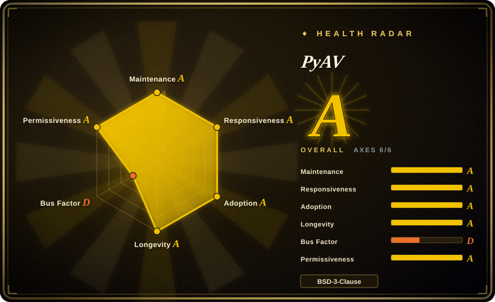
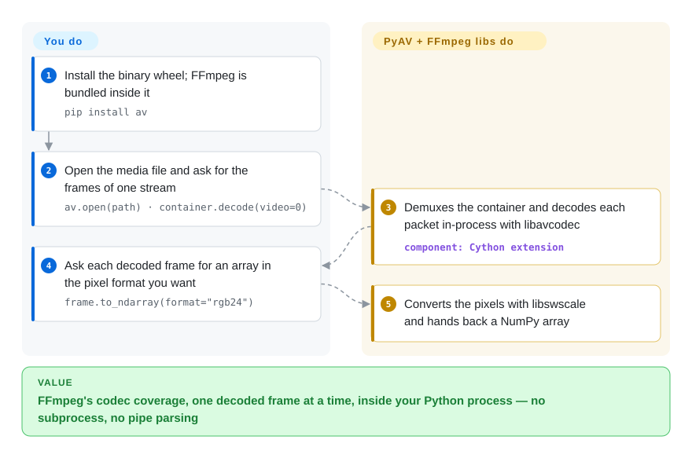

# PyAV

Shelling out to `ffmpeg` gives you a finished file, not the frames: to get each decoded picture into NumPy you end up reading raw bytes off a pipe and guessing where one frame ends. PyAV loads FFmpeg's own libraries into your Python process and hands you every decoded frame as an object you can turn into an array.

## When to use

You're a Python ML engineer preprocessing video for a training pipeline: you need to read frames from a high-resolution MP4, optionally resize or convert color spaces, and feed them as NumPy arrays into PyTorch. Your first version runs `ffmpeg -i in.mp4 -f rawvideo -pix_fmt rgb24 -` in a subprocess and slices the byte stream into `width*height*3` chunks — it works until a file has a rotation flag or a variable frame rate and your slices silently drift. You need programmatic access to each decoded frame, with its timestamp, inside the same Python process. You `pip install av`, open the video with `av.open('input.mp4')`, iterate over `container.decode(video=0)`, and each frame gives you `.to_ndarray(format='rgb24')` plus its `pts` and `time_base`. You also use it to encode: create an output container, add a video stream with a codec such as `libx264`, and write frames built from arrays back into a file.

Pick it over [ffmpeg-python](ffmpeg-python.md) when you need the frames themselves (ffmpeg-python only builds a CLI command line), and over OpenCV's `VideoCapture` when you need FFmpeg's full container/codec coverage plus packet-level control (timestamps, side data, remuxing without re-encoding).

## How it works

PyAV is a set of compiled Cython modules (Cython turns Python-like source into a C extension) that call FFmpeg's C libraries directly: `libavformat` opens containers — the MP4/MKV "box" that interleaves audio and video packets — and `libavcodec` turns compressed packets into raw pictures and sound. **PyAV does the plumbing for you**: demuxing (pulling one stream's packets out of the box), decoding, pixel-format conversion through `libswscale`, and memory management of FFmpeg objects. **You decide everything that carries meaning**: which stream, what to do with each frame, threading (`stream.thread_type = "AUTO"`), and when writing, the codec, size, pixel format, plus calling `stream.encode()` and `container.mux()` yourself, including the final flush. The API mirrors FFmpeg's container → stream → packet → frame model rather than hiding it; the README itself says that if the `ffmpeg` command does the job, PyAV is likely more hindrance than help. Think of the `ffmpeg` CLI as ordering a finished dish, and PyAV as being handed the kitchen with every ingredient laid out.

<!-- flow-steps:begin (generated from flows/pyav.json by tools/flow_card.py — do not edit) -->

Text version of the flow

1. **You**: Install the binary wheel; FFmpeg is bundled inside it — `pip install av`
2. **You**: Open the media file and ask for the frames of one stream — `av.open(path) · container.decode(video=0)`
3. **PyAV**: Demuxes the container and decodes each packet in-process with libavcodec — component: `Cython extension`
4. **You**: Ask each decoded frame for an array in the pixel format you want — `frame.to_ndarray(format="rgb24")`
5. **PyAV**: Converts the pixels with libswscale and hands back a NumPy array

**Value**: FFmpeg's codec coverage, one decoded frame at a time, inside your Python process — no subprocess, no pipe parsing

<!-- flow-steps:end -->

## When NOT to use

- **The `ffmpeg` command already does the job.** For plain transcoding, trimming or a filter graph, run FFmpeg (or build the command with [ffmpeg-python](ffmpeg-python.md)) — PyAV makes you drive encode/mux/flush yourself, and its own README says it is a hindrance in that case.
- **You are on Python 3.11 or older.** PyAV 19.x (2026-09) requires Python 3.12+; v18 dropped 3.10 and v19 dropped 3.11. On an older interpreter, pin an older major (`av<19` for 3.11) and accept that fixes land only on the current line — or call the FFmpeg CLI instead.
- **You need a stable API across upgrades.** Majors arrive every one to three months (v17.1 June, v18.0 July, v19.0 September 2026) and each breaks something: v19 changed rational attributes from `fractions.Fraction` to `av.AVRational` and removed `av.open` arguments. Pin the major version and read the release notes before bumping; if you cannot budget that, a subprocess call to the FFmpeg CLI is the more stable contract.
- **You need a high-level video editor.** PyAV is a thin libav wrapper, not a timeline editor — no cuts, compositing, text overlays or effects out of the box. Use [MoviePy](../editing-and-cutting/moviepy.md).
- **GPU decode/encode is the whole point.** PyAV has a `HWAccel` decode path and, since v18, a `hwaccel=` option on `add_stream` (e.g. `h264_nvenc`, `h264_vaapi`, `h264_videotoolbox`), but whether a given wheel was built with your GPU backend is not documented per platform [未验证]. If throughput on a specific GPU path decides the project, prototype with the [FFmpeg](ffmpeg.md) CLI first, or build PyAV from source against your own FFmpeg.
- **Your platform has no wheel and you can't build.** Wheels with bundled FFmpeg exist for Linux, macOS and Windows; anything else needs FFmpeg's development files, `pkg-config` and a C toolchain (`pip install av --no-binary av`). In locked-down build environments, prefer [ffmpeg-python](ffmpeg-python.md) plus a system `ffmpeg` binary.
- **You're not in Python.** These are Python-only bindings; from other languages use FFmpeg's C API or [GStreamer](gstreamer.md) bindings.

## Comparison

| Alternative | In index | Our verdict | Tradeoff |
|---|---|---|---|
| [FFmpeg](ffmpeg.md) | ✅ | When a command line can express the whole job, run the FFmpeg CLI; pick PyAV only when your Python code must see or produce individual frames. | The CLI is the most stable and complete interface, but frame access from Python means parsing a raw pipe yourself. |
| [ffmpeg-python](ffmpeg-python.md) | ✅ | When you want readable Python that builds an FFmpeg filter graph and runs it, pick ffmpeg-python; pick PyAV when you need decoded frames in memory. | No compiled extension and no Python-version floor, but it only generates a command line — no in-process frames, timestamps or packets. |
| [MoviePy](../editing-and-cutting/moviepy.md) | ✅ | When the task is editing — cuts, compositing, titles — pick MoviePy; pick PyAV for packet- and frame-accurate pipelines. | A friendlier clip/effect API, but less control over codecs, timestamps and remuxing. |
| [GStreamer](gstreamer.md) | ✅ | When you need a long-running, real-time media pipeline embedded in an application, pick GStreamer; pick PyAV for batch frame processing in a Python script. | Strong in live streaming and hardware pipelines, but a much steeper element/pipeline model to learn. |
| [HandBrake](handbrake.md) | ✅ | When a human needs preset-driven transcoding, pick HandBrake; PyAV is for code that processes frames. | GUI and CLI presets with no programming, but no library API and no frame access. |
| OpenCV | not indexed | When you only need simple capture and frame reads for a computer-vision loop, OpenCV's `VideoCapture` is enough; pick PyAV when container, codec or timestamp control matters. | One dependency for CV and video I/O, but narrower format control and no packet-level access. |
| imageio-ffmpeg | not indexed | When you just want frames from a file with the fewest moving parts, pick imageio-ffmpeg; pick PyAV for encoding control, audio, or timestamps. | Ships an FFmpeg binary and reads via a subprocess pipe — simple, but with the same pipe limits PyAV avoids. |

## Tech stack

- **Language:** Cython in "pure Python mode" — the `av/*.py` modules plus `.pxd` declarations are compiled by `cythonize` into C extensions (GitHub counts them as Python); `.pyi` stubs ship for type checkers.
- **Binding model:** direct calls into FFmpeg's C API, in-process; no subprocess.
- **Wrapped libraries:** `libavformat` (mux/demux), `libavcodec` (encode/decode), `libavfilter` (filter graphs), `libswscale` (pixel-format conversion), `libswresample` (audio resampling), `libavutil`, `libavdevice`.
- **Interop:** NumPy arrays (`to_ndarray` / `from_ndarray`), Pillow images (`to_image`), and DLPack/CUDA frames for GPU hand-off.
- **Build:** `setuptools` + `cython>=3.3,<4`; wheels bundle a project-built FFmpeg (8.1.x as of v18).

## Dependencies

- **Runtime:** Python 3.12+ and FFmpeg's shared libraries — bundled inside the PyPI wheels for Linux, macOS and Windows, or supplied by conda-forge (`conda install av -c conda-forge`).
- **Python deps:** none required; `numpy` for array access and `Pillow` for image conversion are optional.
- **Source builds:** FFmpeg development files, `pkg-config` and a C compiler; on Windows the project documents a Conda environment plus its own FFmpeg vendor script.
- **No services/DB:** an in-process library; you bring the media files.

## Ops difficulty

**Low with a wheel, medium without one.** On a supported platform, `pip install av` gives you a self-contained install with FFmpeg included — nothing else to deploy. The burden comes from two places. First, builds: when no wheel fits (unusual architectures, or you need FFmpeg built with a specific GPU or licensed codec), you build against your own FFmpeg and must match the FFmpeg major the PyAV release supports. Second, upgrades: frequent majors with breaking changes and a rising Python floor mean pinning `av` and treating each bump as a small migration. Once installed, it's a library call — no daemon, no datastore.

## Health & viability

- **Maintenance (2026-10) — very active.** Commits land in 12 of the last 13 weeks; v19.0.1 shipped 2026-10-03 after v19.0.0 (2026-09-29) and v18.1.0 (2026-08-12). Issues get a first response in about 13 hours (median). The flip side of this pace is API churn — see When NOT to use.
- **Governance / bus factor — concentrated (grade D).** 27 people committed in the last 12 months, but one account wrote ~82% of those commits and the top three ~90%. The original author (mikeboers) leads the all-time count; the current lead is WyattBlue, who wrote most recent commits and is listed first in `pyproject.toml`, with Jeremy Lainé (jlaine). The `PyAV-Org` organization holds the repo, but the roadmap effectively rests on one or two people.
- **Backing & longevity.** Started in November 2012 (~14 years) and still shipping majors — a strong Lindy prior. No company or foundation stands behind it; its long-term value is tied to FFmpeg's, which is not going anywhere.
- **Adoption & ecosystem.** The `av` package drew 29,089,795 PyPI downloads in the last month and has 2,332 dependent repos — it sits underneath much of the Python video/ML tooling — and is also on conda-forge.
- **Risk flags.** BSD-3-Clause for PyAV itself, no relicense history. The bundled FFmpeg carries its own LGPL/GPL obligations, depending on how the wheel's FFmpeg was configured. Main risks are the maintainer concentration and the breaking-change cadence.

## Caveats (unverified)

- [未验证] ~3.3k stars / ~450 forks / 6 open issues as of 2026-10-08 — volatile.
- [未验证] Which FFmpeg configure flags (and therefore which licenses and GPU backends) the PyPI wheels use is not documented in the README; check the wheel's FFmpeg build before shipping proprietary software or relying on NVENC/VAAPI.
- [未验证] README is inconsistent on the supported FFmpeg major for source builds ("supports FFmpeg 9.x" vs "skip this step if ffmpeg 8.x is already installed"); v18 release notes say the wheels use FFmpeg 8.1.2.
- [推断] Identifying the ~82% 12-month committer as WyattBlue is inferred from the recent commit log (21 of the last 30 commits) and `pyproject.toml` authorship, not from the contributor-stats window itself.
- [推断] The "Python version floor rises roughly every major" pattern is inferred from v18 and v19 release notes; future cadence may differ.
