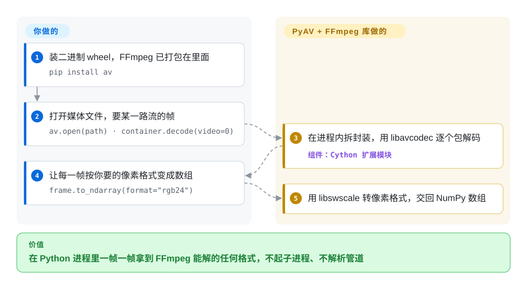

# PyAV

调 `ffmpeg` 命令只能拿到一个处理完的文件，拿不到中间的帧：想把每一帧画面变成 NumPy 数组，你只能从管道里读裸字节，自己猜一帧在哪里结束。PyAV 把 FFmpeg 自己的库加载进你的 Python 进程，把解出来的每一帧作为对象交给你，一行就能转成数组。

## 何时使用

你是一名 Python 机器学习工程师，正在为训练管线预处理视频：要从高分辨率 MP4 里读帧，可能还要缩放或转色彩空间，再作为 NumPy 数组喂给 PyTorch。第一版你在子进程里跑 `ffmpeg -i in.mp4 -f rawvideo -pix_fmt rgb24 -`，再把字节流按 `width*height*3` 切块——直到某个文件带旋转标记或可变帧率，切出来的帧悄悄错位。你需要在同一个 Python 进程里以编程方式拿到每一帧，连同它的时间戳。你执行 `pip install av`，用 `av.open('input.mp4')` 打开视频，在 `container.decode(video=0)` 上迭代，每一帧都能用 `.to_ndarray(format='rgb24')` 拿到数组，还带着 `pts` 和 `time_base`。编码也一样：创建输出容器，加一路 `libx264` 之类编码器的视频流，把数组构造的帧写回文件。

跟 [ffmpeg-python](ffmpeg-python.zh.md) 比，你需要的是帧本身（ffmpeg-python 只负责拼命令行）；跟 OpenCV 的 `VideoCapture` 比，你需要 FFmpeg 完整的容器/编解码器覆盖，以及包级别的控制（时间戳、side data、不重编码直接换封装）。

## 怎么用起来

PyAV 是一组编译好的 Cython 模块（Cython 把类 Python 源码编译成 C 扩展），直接调用 FFmpeg 的 C 库：`libavformat` 负责打开容器——MP4、MKV 这种把音频包和视频包交错装在一起的“盒子”——`libavcodec` 负责把压缩包还原成原始画面和声音。**脏活由 PyAV 替你做**：拆封装（从盒子里只取出某一路流的包）、解码、经 `libswscale` 转像素格式，以及 FFmpeg 对象的内存管理。**有含义的决定都归你**：读哪一路流、每帧拿来干什么、开不开多线程（`stream.thread_type = "AUTO"`）；写文件时还要自己定编码器、尺寸、像素格式，自己调 `stream.encode()` 和 `container.mux()`，最后自己 flush。它的 API 照着 FFmpeg 的“容器 → 流 → 包 → 帧”模型来，不替你藏起来；README 自己就说，如果 `ffmpeg` 命令能干完，PyAV 多半是添乱。打个比方：`ffmpeg` 命令行是点一份做好的菜，PyAV 是把厨房和每样食材都摆到你面前。

<!-- flow-steps:begin (generated from flows/pyav.json by tools/flow_card.py — do not edit) -->

流程文字版

1. **你**：装二进制 wheel，FFmpeg 已打包在里面 — `pip install av`
2. **你**：打开媒体文件，要某一路流的帧 — `av.open(path) · container.decode(video=0)`
3. **PyAV**：在进程内拆封装，用 libavcodec 逐个包解码 — 组件：`Cython 扩展模块`
4. **你**：让每一帧按你要的像素格式变成数组 — `frame.to_ndarray(format="rgb24")`
5. **PyAV**：用 libswscale 转像素格式，交回 NumPy 数组

**价值**：在 Python 进程里一帧一帧拿到 FFmpeg 能解的任何格式，不起子进程、不解析管道

<!-- flow-steps:end -->

## 何时不用

- **`ffmpeg` 命令已经能干完。** 单纯转码、裁剪或跑滤镜图，直接用 FFmpeg（或用 [ffmpeg-python](ffmpeg-python.zh.md) 拼命令）——PyAV 要你自己驱动编码、封装和 flush，它的 README 也说这种场景它是添乱。
- **你还在 Python 3.11 或更老版本上。** PyAV 19.x（2026-09）要求 Python 3.12+；v18 去掉了 3.10，v19 去掉了 3.11。老解释器只能锁一个旧大版本（3.11 用 `av<19`），并接受修复只进新版本——或者改调 FFmpeg 命令行。
- **你需要升级时 API 稳定。** 大版本每一到三个月一次（2026 年 6 月 v17.1、7 月 v18.0、9 月 v19.0），每次都有破坏性改动：v19 把有理数属性从 `fractions.Fraction` 换成 `av.AVRational`，还删了 `av.open` 的几个参数。锁定大版本、升级前读 release notes；预算不允许的话，子进程调 FFmpeg 命令行是更稳定的契约。
- **你要的是高级视频编辑器。** PyAV 是薄薄一层 libav 包装，不是时间线编辑器——没有现成的剪辑、合成、字幕叠加或特效。用 [MoviePy](../editing-and-cutting/moviepy.zh.md)。
- **GPU 编解码就是全部重点。** PyAV 有 `HWAccel` 硬件解码路径，v18 起 `add_stream` 也支持 `hwaccel=`（如 `h264_nvenc`、`h264_vaapi`、`h264_videotoolbox`），但各平台 wheel 编进了哪些 GPU 后端没有文档说明 [未验证]。如果某条 GPU 路径的吞吐决定项目成败，先用 [FFmpeg](ffmpeg.zh.md) 命令行验证，或者针对你自己的 FFmpeg 从源码编译 PyAV。
- **你的平台没有 wheel，又不能编译。** 打包了 FFmpeg 的 wheel 覆盖 Linux、macOS、Windows；其他平台需要 FFmpeg 开发文件、`pkg-config` 和 C 工具链（`pip install av --no-binary av`）。构建环境受限时，选 [ffmpeg-python](ffmpeg-python.zh.md) 加系统自带的 `ffmpeg`。
- **你不在 Python 里工作。** 这是 Python 专用绑定；其他语言用 FFmpeg 的 C API 或 [GStreamer](gstreamer.zh.md) 的绑定。

## 横向对比

| 替代品 | 是否收录 | 我们的评价 | 取舍 |
|---|---|---|---|
| [FFmpeg](ffmpeg.zh.md) | ✅ | 一条命令能表达整个任务时，直接跑 FFmpeg 命令行；只有 Python 代码必须看到或产出单帧时，才选 PyAV。 | 命令行是最稳定、最完整的接口，但想在 Python 里拿帧就得自己解析裸管道。 |
| [ffmpeg-python](ffmpeg-python.zh.md) | ✅ | 想用可读的 Python 拼 FFmpeg 滤镜图再执行，选 ffmpeg-python；需要把解码后的帧放进内存，选 PyAV。 | 没有编译扩展，也没有 Python 版本门槛，但它只生成命令行——拿不到进程内的帧、时间戳和包。 |
| [MoviePy](../editing-and-cutting/moviepy.zh.md) | ✅ | 任务是剪辑——切片、合成、加字幕——选 MoviePy；要包级、帧级精确的处理管线，选 PyAV。 | 片段/特效 API 更友好，但对编解码器、时间戳和换封装的控制更弱。 |
| [GStreamer](gstreamer.zh.md) | ✅ | 需要嵌在应用里长期运行的实时媒体管线，选 GStreamer；在 Python 脚本里批量处理帧，选 PyAV。 | 直播流和硬件管线更强，但 element/pipeline 模型学习曲线陡得多。 |
| [HandBrake](handbrake.zh.md) | ✅ | 给人用的预设式转码选 HandBrake；PyAV 是给要处理帧的代码用的。 | 有 GUI 和命令行预设，不用写代码，但没有库 API，也拿不到帧。 |
| OpenCV | 未收录 | 只需要给计算机视觉循环做简单采集和读帧，OpenCV 的 `VideoCapture` 就够；容器、编解码器或时间戳控制要紧时，选 PyAV。 | 一个依赖同时管 CV 和视频读写，但格式控制更窄，也没有包级访问。 |
| imageio-ffmpeg | 未收录 | 只想用最少的部件从文件里读帧，选 imageio-ffmpeg；要编码控制、音频或时间戳，选 PyAV。 | 自带 FFmpeg 二进制，经子进程管道读帧——简单，但有 PyAV 所避免的那些管道局限。 |

## 技术栈

- **语言：** Cython 的“纯 Python 模式”——`av/*.py` 模块加 `.pxd` 声明，由 `cythonize` 编译成 C 扩展（GitHub 把它们算作 Python）；附带 `.pyi` 类型存根。
- **绑定方式：** 进程内直接调用 FFmpeg 的 C API，不起子进程。
- **包装的库：** `libavformat`（封装/解封装）、`libavcodec`（编解码）、`libavfilter`（滤镜图）、`libswscale`（像素格式转换）、`libswresample`（音频重采样）、`libavutil`、`libavdevice`。
- **互操作：** NumPy 数组（`to_ndarray` / `from_ndarray`）、Pillow 图像（`to_image`），以及用于 GPU 交接的 DLPack/CUDA 帧。
- **构建：** `setuptools` + `cython>=3.3,<4`；wheel 内打包项目自己编译的 FFmpeg（v18 时为 8.1.x）。

## 依赖

- **运行时：** Python 3.12+ 和 FFmpeg 共享库——PyPI 上 Linux、macOS、Windows 的 wheel 已经打包在内，也可以走 conda-forge（`conda install av -c conda-forge`）。
- **Python 依赖：** 没有必需项；`numpy`（数组访问）和 `Pillow`（图像转换）都是可选。
- **源码构建：** FFmpeg 开发文件、`pkg-config` 和 C 编译器；Windows 上项目文档给的是 Conda 环境加它自己的 FFmpeg 拉取脚本。
- **无服务、无数据库：** 进程内库，媒体文件你自己提供。

## 运维难度

**有 wheel 时低，没有 wheel 时中等。** 在受支持的平台上，`pip install av` 就是自带 FFmpeg 的完整安装，不用再部署任何东西。负担来自两处。一是构建：没有合适的 wheel（少见的架构，或者你需要带特定 GPU、特定授权编解码器的 FFmpeg）时，要针对自己的 FFmpeg 编译，并且 FFmpeg 大版本要和当前 PyAV 支持的一致。二是升级：大版本频繁、带破坏性改动、Python 版本门槛持续上升，意味着要锁定 `av`，把每次升级当成一次小迁移。装好之后就是库调用——没有守护进程，没有数据存储。

## 健康度与可持续性

- **维护（2026-10）——非常活跃。** 最近 13 周有 12 周有提交；v19.0.1 于 2026-10-03 发布，之前是 v19.0.0（2026-09-29）和 v18.1.0（2026-08-12）。issue 首次响应中位数约 13 小时。节奏快的另一面是 API 变动频繁——见“何时不用”。
- **治理与 bus factor——高度集中（D 级）。** 过去 12 个月有 27 人提交，但一个账号贡献了约 82% 的提交，前三名约 90%。原作者 mikeboers 在历史总提交数上居首；当前主力是 WyattBlue（近期提交大多出自他，也是 `pyproject.toml` 列出的第一作者），另有 Jeremy Lainé（jlaine）。仓库挂在 `PyAV-Org` 组织下，但路线图实际系于一两个人。
- **背书与长期性。** 2012 年 11 月启动（约 14 年），至今仍在发大版本——Lindy 先验很强。背后没有公司或基金会；它的长期价值和 FFmpeg 绑定，而 FFmpeg 不会消失。
- **采用与生态。** `av` 包上月在 PyPI 下载 29,089,795 次，有 2,332 个依赖仓库——大量 Python 视频与 ML 工具链都压在它上面；conda-forge 上也有。
- **风险标记。** PyAV 本身是 BSD-3-Clause，没有改许可证的历史。wheel 里打包的 FFmpeg 另有 LGPL/GPL 义务，取决于这份 FFmpeg 的编译配置。主要风险是维护者集中和破坏性改动的节奏。

## 存疑（未验证）

- [未验证] 截至 2026-10-08 约 3.3k star、约 450 fork、6 个 open issue——易变。
- [未验证] PyPI wheel 里的 FFmpeg 用了哪些 configure 选项（因而带哪些许可证、哪些 GPU 后端），README 没写；要发布闭源软件或依赖 NVENC/VAAPI 前，先查 wheel 里的 FFmpeg 构建配置。
- [未验证] README 对源码构建支持的 FFmpeg 大版本前后不一（“supports FFmpeg 9.x” 与 “ffmpeg 8.x 已装可跳过”）；v18 release notes 说 wheel 用的是 FFmpeg 8.1.2。
- [推断] 把 12 个月内约 82% 的提交者认定为 WyattBlue，依据是近期提交记录（最近 30 次提交中 21 次）和 `pyproject.toml` 的作者列表，而不是贡献统计窗口本身。
- [推断] “Python 版本门槛几乎每个大版本都上升”是从 v18、v19 的 release notes 推出来的，未来节奏可能不同。
