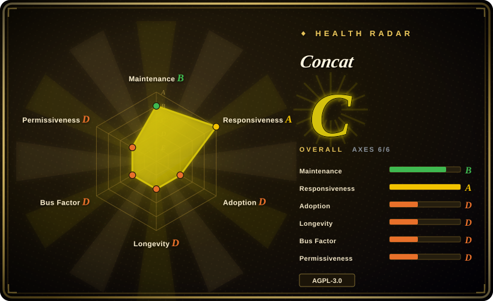

# Concat

A native cross-platform non-linear video editor written in Rust with a Slint UI — an offline, account-free "CapCut replacement" that bundles its own FFmpeg, runs Whisper captions and text-to-speech on device, and exposes an API/CLI/server beside the GUI.

## When to use

You're a solo creator or a two-person team cutting short-form video on a laptop, and two constraints rule out the usual answers: the raw footage should not leave the machine or require a subscription, and you want a script or an agent to drive the same project you have open in the GUI. CapCut (未收录) fails the first, and batch libraries like MoviePy fail the second — you would hand-cut in one tool and re-express the edit as a script in another.

You reach for Concat because it is one of the few editors that is both a native application and programmable on its own model. The repository splits into ~15 crates (`concat-core`, `concat-render`, `concat-media`, `concat-effects`, `concat-speech`, `concat-vision`, `concat-project`, …), with `concat-api`, `concat-cli`, and `concat-server` (JSON-RPC lines over TCP or a Unix socket, optional gRPC behind a feature) as the external surface, so the same command model serves the UI and a script. The deciding tradeoff against [OpenCut](opencut.md): Concat is a downloaded native binary that works fully offline on desktop and mobile and ships a beta you can run today, while OpenCut's current repository is a browser/WASM rewrite with contributions closed and no release since 2026-04. Pick Concat for a native editor with an automation surface now; pick OpenCut when community size and browser reach matter more than running code today.

## When NOT to use

- **You need stability for paid client work.** Concat is a 25-day-old 0.2.x beta, and its public tracker already carries reports of a laggy, near-unusable Linux/rpm build and Android media-import failures. Use DaVinci Resolve (未收录) or wait for a tagged stable cycle, because a crash mid-project costs more than the subscription you were avoiding.
- **You need the professional effect stack now — tracked masks, a keyframe curve editor, adjustment layers, speed curves.** Every one of those is unchecked on Concat's own roadmap. For masks and a curve editor that actually shipped, look at OpenCut's v0.3.0 feature set or a commercial NLE (未收录).
- **You only need scripted, repeatable renders with no interactive editing.** A GUI editor is the wrong shape — use [MoviePy](../video-audio/editing-and-cutting/moviepy.md) for a Python batch pipeline, or [Remotion](../../video-production/remotion.md) when the video must be deterministic components rendered in CI.
- **You are building your own editor or a headless editing service.** Do not fork a young beta for its timeline model; use [MLT](../video-audio/editing-and-cutting/mlt.md), the LGPL engine beneath Shotcut and Kdenlive, because it gives you timeline semantics without inheriting an AGPL application.
- **Your organisation cannot take AGPL-3.0 obligations, or cannot accept the licence mix inside the shipped binaries.** Concat is AGPL-3.0-or-later with a plugin exception, and the distributed bundles also carry FFmpeg (GPL, with x264), sherpa-onnx with espeak-ng (GPL-3.0), and Slint under its GPL-3.0 option. If AGPL is a hard no, use an MIT editor such as [OpenCut](opencut.md) instead.
- **The edit is one commodity step inside a larger pipeline.** Concat documents no headless render mode; drive [FFmpeg](../video-audio/transcoding-and-pipelines/ffmpeg.md) directly instead, because a desktop application cannot be scheduled as a batch job.

## Comparison

| Alternative | In index | Our verdict | Tradeoff |
|---|---|---|---|
| [OpenCut](opencut.md) | ✅ | When you want the largest open-source community, an MIT licence, and a roadmapped plugin/MCP architecture, pick OpenCut; pick Concat when you need a native binary you can install and run offline today, because OpenCut's repository is mid-rewrite, takes no external contributions, and has shipped no release since 2026-04. | Concat: runnable native beta with an automation surface, one maintainer, AGPL. OpenCut: bigger community and permissive licence, no currently shipped build. |
| [MLT](../video-audio/editing-and-cutting/mlt.md) | ✅ | When you are building an editor rather than editing, pick MLT; pick Concat when you want a finished application whose timeline you script through an API instead of implementing, because MLT is a framework with no UI that delegates all codec work to FFmpeg. | MLT: LGPL engine you embed and extend, and you build the app. Concat: complete AGPL app you only script. |
| [MoviePy](../video-audio/editing-and-cutting/moviepy.md) | ✅ | When the edit is a repeatable batch job in Python, pick MoviePy; pick Concat when a human must see the timeline and iterate interactively, because MoviePy has no GUI and no preview and its maintenance has slowed from its peak. | MoviePy: scriptable and headless, no interactive preview. Concat: interactive GUI plus an API, and a heavier desktop dependency. |
| CapCut (ByteDance) | 未收录 | When you want a polished free editor with cloud AI effects and do not mind an account, pick CapCut; pick Concat when footage must not leave the machine and the editor must be open source, because CapCut is closed, account-bound, and gates 4K and AI behind Pro. | CapCut: mature effects and templates, no self-hosting, cloud terms. Concat: offline and open, far fewer effects. |
| DaVinci Resolve / Premiere Pro | 未收录 | When a professional editor needs tracked masks, colour grading, and a mature keyframe editor for a deliverable, pick a commercial NLE; pick Concat when you need offline, scriptable, licence-free editing of short-form footage, because the commercial tools are closed and their free tiers are feature-gated. | Commercial NLEs: depth and stability. Concat: native, offline, automatable, and immature. |

## Tech stack

- **Language / UI:** Rust workspace of ~15 crates plus a Slint UI — `concat`, `concat-core`, `concat-render`, `concat-media`, `concat-effects`, `concat-export`, `concat-project`, `concat-speech`, `concat-vision`, `concat-text`, `concat-host`, `concat-api`, `concat-cli`, `concat-server`, `concat-android`.
- **Media engine:** FFmpeg libraries for decode/encode/mux/filter, bundled inside the release artifacts; export is H.264 MP4 only (README).
- **On-device models:** whisper.cpp for auto-captions; sherpa-onnx with espeak-ng for text-to-speech and voice filters; a segmentation model compiled into the app for automatic background removal.
- **Automation surface:** `concat-api` (shared command types), `concat-cli`, and `concat-server` — JSON-RPC lines over TCP or a Unix socket with a random per-run token, plus gRPC (tonic/prost) behind an off-by-default feature. The repository description advertises MCP support [未验证]: no MCP module appears in the default-branch tree as of 2026-09-19.
- **CI / release:** GitHub Actions workflows `ci.yml`, `build-app.yml`, `mobile.yml`, `models.yml`, `nightly.yml`, `nix.yml`, `release.yml`; a `nightly` release is rebuilt on every push across all platforms.

## Dependencies

- **Targets:** Windows (x86_64, arm64), macOS (Intel, Apple Silicon), Linux (x86_64, arm64; tar.gz / AppImage / deb / rpm), Android arm64. iOS/iPadOS is sideload-only and the README marks it untested.
- **System floors (README):** any 64-bit CPU from 2013 or later, 4 GB RAM, 500 MB for the app plus the smallest caption model; 6 cores and 16 GB recommended for 4K timelines.
- **GPU is optional** — Metal (macOS), DirectX 12 (Windows) or Vulkan (Linux); without a usable GPU the window and monitor fall back to the CPU.
- **Optional models download on first use** and need no network afterwards: captions 78–488 MB depending on Whisper size, text-to-speech 132 MB or 349 MB, person cutout 15 MB, object cutout 179 MB, cutout brush 40 MB.
- No account, no server, no database. macOS builds are unsigned and need `xattr -dr com.apple.quarantine` once.

## Ops difficulty

**Low to run, medium to distribute.** For a user it is an ordinary desktop/mobile application: download an archive, run the binary, let it pull models once. A `portable` folder beside the executable keeps settings, recents, and models on removable media, and nothing is written to the user profile. There is no service, key, or database to operate. The burden sits with whoever ships or manages it: unsigned macOS/Windows artifacts trip OS warnings, the installed bundle mixes AGPL and GPL components so a modified redistribution needs licence review, and a source build pulls in a Rust toolchain plus native FFmpeg/whisper/sherpa dependencies. On managed machines the per-machine model downloads are state you must provision or pre-seed.

## Health & viability

- **Maintenance (2026-09):** high for its age. Created 2026-08-25; GitHub's weekly commit stats show 142, 106, 89 and 111 commits across its first four weeks, a nightly build on every push, and hour-scale merge turnaround on the PRs inspected (#140 opened 15:15, merged 15:43 the same day).
- **Governance / bus factor — one person.** `jub0t` holds 427 of ~490 commits; the second contributor has 46 and everyone else 4 or fewer, against 22 watchers. No foundation or vendor owns the roadmap.
- **Backing & Lindy — too young for a Lindy prior.** 2.8k stars and 253 forks in ~25 days is attention, not a track record; by this index's prior a young hyped repository is a risk flag, and there is no age × still-active history to weigh yet.
- **Adoption & ecosystem — early.** Downloads and stars dominate; the API/CLI/server crates and the licence exception describe a planned automation ecosystem rather than an established one, and documentation is the README / ROADMAP / TODO set plus per-crate READMEs.
- **Risk flags:** copyright held centrally under a CLA with an advertised commercial-licence channel (open-core shaped); AGPL-3.0-or-later with a plugin exception, over bundles that also contain GPL components; a `TRADEMARK.md` restricting name and logo; distribution is largely nightly, with v0.2.2 the newest tagged release.

## Caveats (unverified)

- [未验证] The "MCP supported" claim in the repository description and the plugin exception is not backed by an MCP module in the default-branch tree (756 paths, checked 2026-09-19); the scriptable surface found is JSON-RPC/gRPC. Verify before depending on it.
- [未验证] The README platform matrix (Android "supported", iOS/iPadOS "to be tested") is author-stated; no binary was run for this page.
- [推断] Merge-turnaround figures come from four PRs (#140, #141, #142, #144) and say little about review depth or consistency.
- [未验证] Star, fork, issue and commit counts (2,854 / 253 / 44 open / ~490) are point-in-time GitHub values from 2026-09-19 and are volatile.
- [未验证] Redistribution compatibility of the bundled FFmpeg (GPL, with x264), sherpa-onnx/espeak-ng (GPL-3.0) and Slint's GPL-3.0 option was not legally reviewed here; `THIRD_PARTY_NOTICES.md` and `LICENSE-EXCEPTIONS.md` are author-provided.
- [推断] Crate responsibilities are inferred from crate names in the repository tree, not from build documentation.
