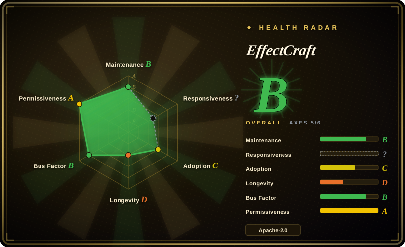
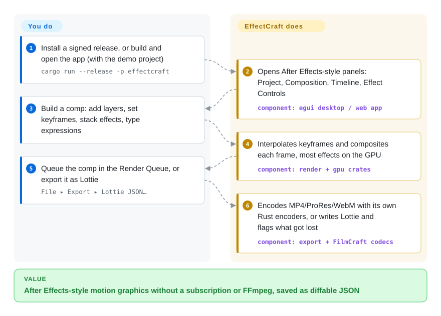

# EffectCraft

Animated titles, lower thirds and motion-graphics shots normally mean an After Effects subscription, and the project file is a binary only that app can open. EffectCraft is a free desktop and browser app that copies After Effects' panels, keyframes and effects, saves projects as readable JSON, and renders to video or Lottie (the JSON animation format that web and mobile apps play) without FFmpeg.

## When to use

You make short motion-graphics pieces — an animated logo sting, kinetic captions for a product video, a looping Lottie for an app's empty state — and you learned the craft in After Effects. You no longer want to pay for Creative Cloud for this, or you work on Linux, or you want an agent to build and tweak the animation for you. The free options you know each fail one way: Blender's compositor does not speak After Effects' layer-and-keyframe vocabulary, Natron is a node compositor for VFX plates rather than titles, and code-first tools like [Remotion](../../video-production/remotion.md) make you re-express a two-second ease as React code. What you actually hit is the expression you have typed for years — `wiggle(2,30)` on a position, `loopOut()` on a rotation — and the F9 Easy Ease, which only one paid app understands.

You reach for EffectCraft because it reproduces that vocabulary — Project, Composition, Timeline and Effect Controls panels, the property shortcuts (P, S, R, T, U…), the Graph Editor, JavaScript expressions with the After Effects object model, and 306 effects named after After Effects' own — in a Rust app that runs on macOS, Windows, Linux, FreeBSD and in the browser. The deciding tradeoff against the alternatives: EffectCraft gives you After Effects' working model plus built-in Lottie export and an MCP/CLI surface for agents, and the price is that it is eight days old, cannot open `.aep` files, and nobody has yet measured how closely its output matches After Effects'. Pick it to try motion-graphics work without a subscription or to let an agent drive a compositor; keep After Effects for client deliveries that must match an existing `.aep` pixel for pixel.

## How it works

EffectCraft is a compositor: a program that stacks layers (solids, shapes, text, footage, nested compositions) and, frame by frame, combines them after applying each layer's keyframed properties and effects. Everything you can do in the app — every menu item, timeline drag and property edit — is a registered "command" with an id and JSON parameters, so the GUI, a command-line tool (`effectcraft-cli`), a JSON control channel and an MCP server (Model Context Protocol, the standard way an AI agent discovers and calls tools) all go through the same code path. What the app does for you: the timeline model, keyframe interpolation, the effects (280 of 306 run on the GPU via wgpu), the render queue and the encoders — H.264, ProRes, HEVC, AV1, VP9/WebM, Opus and image sequences, written in Rust rather than borrowed from FFmpeg — plus the Lottie writer, which tells you what Lottie cannot express. What you do: build the composition (or ask an agent to over MCP), judge the motion, and queue the render. Think of it as After Effects' cockpit rebuilt on a new airframe: the controls are where your hands expect, but the flight characteristics have not been certified against the original.

<!-- flow-steps:begin (generated from flows/effectcraft.json by tools/flow_card.py — do not edit) -->

Text version of the flow

1. **You**: Install a signed release, or build and open the app (with the demo project) — `cargo run --release -p effectcraft`
2. **EffectCraft**: Opens After Effects-style panels: Project, Composition, Timeline, Effect Controls — component: `egui desktop / web app`
3. **You**: Build a comp: add layers, set keyframes, stack effects, type expressions
4. **EffectCraft**: Interpolates keyframes and composites each frame, most effects on the GPU — component: `render + gpu crates`
5. **You**: Queue the comp in the Render Queue, or export it as Lottie — `File ▸ Export ▸ Lottie JSON…`
6. **EffectCraft**: Encodes MP4/ProRes/WebM with its own Rust encoders, or writes Lottie and flags what got lost — component: `export + FilmCraft codecs`

**Value**: After Effects-style motion graphics without a subscription or FFmpeg, saved as diffable JSON

<!-- flow-steps:end -->

## When NOT to use

- **You must open or deliver After Effects projects.** EffectCraft cannot read `.aep` / `.aepx` (an open roadmap item, issue #190, pending a clean-room decision) and third-party After Effects plug-ins do not run. Stay on After Effects (not a repo) when a client hands you an `.aep` or expects one back.
- **Your output must match After Effects frame for frame.** The project's own `docs/gaps.md` (assessed 2026-10-05) says fidelity is "largely unmeasured", estimates real-use parity at 30–50%, and says the 99% feature checklist was "graded by the same agents that built the features". For broadcast or client work where a look must be reproduced exactly, use After Effects; for frame-exact automated renders you control, use [Remotion](../../video-production/remotion.md), whose output is defined by your code rather than by parity with another app.
- **You need node-based VFX compositing on film plates (keying, roto, multi-pass CG).** EffectCraft is a layer-stack motion-graphics tool modelled on After Effects; use Natron (not indexed — not added in this tab batch; GPL-2.0, OpenFX plug-ins) or Blender's compositor (not indexed), whose node graphs and OpenEXR multi-pass workflows are built for that job.
- **You are on Linux or Windows and need a stable daily driver.** The README says macOS is the most tested platform and Linux/Windows users have hit basic interaction bugs; Wayland file drops do not work (a winit limitation); new user crash reports keep arriving (e.g. #426, a timeline crash while scrubbing, filed 2026-10-09). If you need something that has survived years of real use on Linux, use Friction (not indexed — not added in this tab batch; GPL-3.0, created 2023) or Blender.
- **You want a script-first video pipeline, not an app.** EffectCraft's CLI can set properties and render, but the source of truth is an `.ecproj` you edit in a GUI or through commands. When the video should be generated from data in CI, use [Remotion](../../video-production/remotion.md) or [MoviePy](../video-audio/editing-and-cutting/moviepy.md).
- **You need a release you can freeze for months.** Five releases shipped in four days (v0.2.0 on 2026-10-05 → v0.6.0 on 2026-10-08) and `main` takes dozens of commits a day; behaviour and file format details move fast. Pin a version and keep exported masters, or wait for a slower cadence.
- **You will open the clone in a coding agent and let it run on its own.** The repo ships a root `.mcp.json` that runs `cargo run … effectcraft-cli mcp` (it compiles and runs the repo's code) and a `CLAUDE.md` that tells agents to follow an "autonomous operation protocol… Don't stop to ask" and to drive a local After Effects via `osascript`. That is meant for the maintainers' own agents; when you only want to use the app, install a signed release instead of opening the source tree in an agent.

## Comparison

| Alternative | In index | Our verdict | Tradeoff |
|---|---|---|---|
| Adobe After Effects | not a repo | When you need `.aep` compatibility, the third-party plug-in ecosystem, or output a client will compare with After Effects, pick After Effects; pick EffectCraft only when the same workflow without a subscription or with agent control matters more than proven fidelity. | Closed, subscription-only commercial app (not a repository): thirty years of edge cases and plug-ins, but no Linux build, no readable project file and no built-in MCP surface. |
| Natron | not indexed | For node-based VFX compositing of film plates with OpenFX plug-ins, choose Natron; choose EffectCraft for After Effects-style layer animation, text and Lottie. | Not added in this tab batch. Mature node compositor (repo since 2018) with a GPL-2.0 licence; its last push was 2026-07, so updates are slow, and it has no title/shape/Lottie toolset. |
| Friction | not indexed | For a GPL motion-graphics app with three years of history on Linux, choose Friction; choose EffectCraft when you want After Effects' panels, expressions and effect names and can accept a week-old codebase. | Not added in this tab batch. Friction is a smaller, older, still-active project (created 2023, pushed 2026-10) with its own UI model and GPL-3.0; EffectCraft trades that track record for far broader After Effects parity on paper. |
| Blender | not indexed | When the job is 3D animation or node compositing with a huge, stable community, pick Blender; pick EffectCraft for 2D After Effects-style motion design and Lottie export. | Not added in this tab batch. Decades of Lindy and GPL licensing, but its compositor and Grease Pencil are not After Effects' layer/keyframe/expression model, so motion designers relearn the tool. |
| [Remotion](../../video-production/remotion.md) | ✅ | When the video should come from React code and data in CI, choose Remotion; choose EffectCraft when a person (or an agent through MCP) should shape motion interactively on a timeline. | Remotion gives deterministic, reviewable code and server rendering but is source-available and needs a company licence above 3 employees; EffectCraft gives a GUI and permissive MIT/Apache licensing but unmeasured fidelity and a week of history. |

## Tech stack

- **Language / layout:** Rust (edition 2024, toolchain 1.95+), a Cargo workspace of ~32 crates (`time`, `keyframe`, `effects`, `render`, `gpu`, `expr`, `lottie`, `engine`, `ui-egui`, `automation`, and per-codec encoder crates `vp9enc`, `hevcenc`, `av1enc`, `opusenc`) plus three apps (`effectcraft`, `effectcraft-cli`, `effectcraft-web`). `unsafe_code = "forbid"` workspace-wide.
- **UI and GPU:** egui/eframe 0.36 for the interface, wgpu 30 for GPU compositing (WGSL shaders), winit/rfd/cpal for windows, dialogs and audio.
- **Engine libraries:** kurbo and tiny-skia (geometry and CPU raster), skrifa + harfrust (font loading and text shaping), boa_engine (JavaScript expressions and scripting), wasmi (sandboxed WebAssembly effect plug-ins), `exr`/`image`/`gif`.
- **Media:** decoders and the H.264/ProRes/AAC encoders come from the sibling FilmCraft repository as git dependencies pinned to one revision; VP9, AV1, HEVC and Opus encoders are EffectCraft's own crates. No FFmpeg is linked.
- **Optional models:** MobileSAM (Roto Brush, ~40 MB) and MediaPipe Face Landmarker (~3.8 MB) downloaded on demand from Settings.
- **Web build:** WebAssembly + WebGPU via `cargo xtask web`, with storage in the browser's Origin Private File System.

## Dependencies

- **To run:** a signed installer from Releases — macOS universal DMG (notarized), Windows MSI/portable (x64, x86, ARM64), Linux AppImage/Flatpak/deb/rpm/tar.gz (x86_64, aarch64), FreeBSD tarball, or the static web build in a WebGPU-capable browser. No account, server or database; the README states no telemetry and no network access unless asked.
- **GPU:** used for compositing and most effects; the MCP server renders on the CPU unless `--gpu` is passed, and an older GPU may fail to start the window (issue #198, fix unverified on that hardware per `docs/gaps.md`).
- **To build:** Rust 1.95+ and network access to fetch the pinned FilmCraft git dependencies; `cargo xtask ci` runs format, clippy, tests, layering, asset-attribution and the wasm build.
- **For agents:** `effectcraft-cli mcp` over stdio (headless, or `--bridge 9877` to a running app started with `--control 9877`).

## Ops difficulty

**Low to run, high to depend on.** For a user it is a desktop app: download, install, open; the web build is a static zip you can host on any static server. There is nothing to operate. The cost is elsewhere: releases arrive every day or two, `.ecproj` is the only project format you can round-trip, and behaviour differences from After Effects are expected and must be found by you (the maintainers ask for bug reports). Building from source is a large Rust workspace (≈285k lines per the project's own estimate) plus git dependencies on a second young repository, so a corporate fork inherits two moving codebases.

## Health & viability

- **Maintenance (2026-10-09): extremely active, too new to call stable.** ~970 commits since the first on 2026-10-01, five tagged releases in four days, and 178 merged PRs; user issues from Linux, Windows and macOS are being fixed with regression tests the same or next day, as logged in `docs/gaps.md`.
- **Governance / bus factor:** an organization account (`storytold`, the ArtCraft team, on GitHub since 2021 with an older open AI-studio repo `artcraft` from 2022) owns the roadmap. Two maintainers (`echelon`, `bflatastic`) hold ~890 of the top-20 contributors' commits; outside contributors add translations and fixes. Commit messages and `docs/gaps.md` show most code is written by AI agents (about half of sampled non-merge commits carry a `Co-Authored-By: Claude` trailer, and the project describes its ≈285k lines as "almost entirely agent-written") — throughput depends on that pipeline continuing to be funded.
- **Backing & Lindy:** no Lindy prior at all — eight days old. It is one of a family of "Crafting Apps" (siblings recreate Photoshop, Illustrator, Premiere, Lightroom, Acrobat and InDesign, all created 2026-09-30 to 10-07), so it shares the family's fate; its media codecs live in the FilmCraft sibling. The vendor's commercial motive (driving users to the ArtCraft site and community) is plausible but not documented [推断].
- **Adoption:** ~3.5k stars and ~1.5k forks in eight days, ~60k downloads of the v0.6.0 release assets within a day of publishing, and about 200 issues from many distinct reporters. A 43% fork-to-star ratio is unusual; whether the star curve is organic launch attention or inflated could not be checked [未验证：护栏拦截].
- **Risk flags:** "clean-room" provenance is a self-declared process (After Effects' public docs and observed behaviour only, no GPL code, codecs from public specs) that cannot be audited from outside; Adobe trademark use is disclaimed in the README; the ArtCraft brand marks are not open and must be removed by forks. Licence is permissive (MIT OR Apache-2.0, holder "ArtCraft Team and the EffectCraft contributors"), with no CLA found.

## Caveats (unverified)

- [未验证：护栏拦截] Whether the star velocity (≈3.5k stars, ≈1.5k forks in 8 days) is organic: the stargazer timeline query (`gh api … stargazers` with timestamps, and the GraphQL `starredAt` query) was blocked by the worktree guard, so no time distribution was examined.
- [未验证] The clean-room claim (no Adobe code or assets, no GPL code, codecs written from specifications without reading libvpx/libaom/dav1d) is the maintainers' stated process in `AGENTS.md`; an outside party cannot verify how AI agents produced ≈285k lines.
- [未验证] "306 effects, all 298 of After Effects'", "280 on the GPU" and the 99% breadth figure come from the project's own `parity.md`/ROADMAP, graded by the agents that built the features; this page did not build or run the app.
- [未验证] README claims of no telemetry and no network access unless requested were not checked against the source or by running the binary.
- [推断] The ≈50% share of Claude-co-authored commits is from three sampled pages of 100 commits each (51, 52 and 77 trailers, including merges in the denominator), not the full history.
- [未验证] Release download count (~60.7k across 23 v0.6.0 assets) is a GitHub counter on 2026-10-09 and includes automated fetches; it is not a count of users.
- [推断] The vendor's commercial motive and the family's long-term funding are inferred from the README's links to getartcraft.com and the sibling repos; no funding or governance document was found.
- [未验证] Platform reliability statements (macOS best tested; Linux/Windows basic bugs; Windows ARM64 not run interactively in CI) are the project's own README and `docs/gaps.md` wording.
