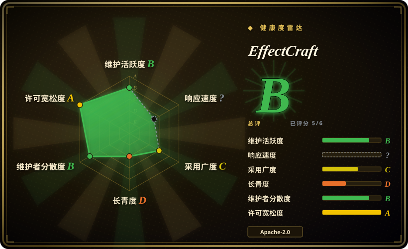
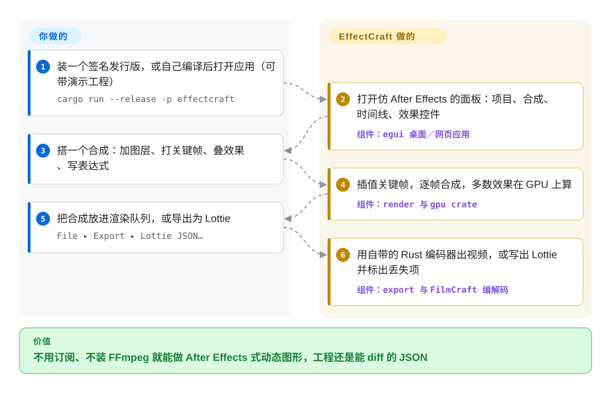

# EffectCraft

做个片头动画、字幕条或者一段动态图形，通常就得续费 After Effects，而且做出来的工程文件只有它自己打得开。EffectCraft 是一个免费的桌面／网页应用，照搬 After Effects 的面板、关键帧和效果，工程存成能直接读的 JSON，不依赖 FFmpeg 就能渲染成视频或 Lottie（网页和 App 里播放的 JSON 动画格式）。

## 何时使用

你平时做短小的动态图形——一段 Logo 动画、产品视频里的动态字幕、App 空状态里循环播放的 Lottie——手艺是在 After Effects 里练出来的。现在你不想再为这点活付 Creative Cloud 的钱，或者你用的是 Linux，又或者你想让 agent 帮你搭动画、调参数。你知道的免费方案各卡在一处：Blender 的合成器不讲 After Effects 那套“图层＋关键帧”的语言，Natron 是给影视素材做节点合成的、不是做字幕动画的，[Remotion](../../video-production/remotion.zh.md) 这类代码优先的工具则要你把一个两秒的缓动重新写成 React 代码。你真正卡住的是这种东西：用了好几年的表达式——位置上的 `wiggle(2,30)`、旋转上的 `loopOut()`——还有按 F9 的缓入缓出，全世界只有一个付费软件认。

你会想到 EffectCraft，是因为它把这套语言原样搬了过来——项目、合成、时间线、效果控件这些面板，P、S、R、T、U 等属性快捷键，图表编辑器，带 After Effects 对象模型的 JavaScript 表达式，以及按 After Effects 原名实现的 306 个效果——做成一个 Rust 应用，跑在 macOS、Windows、Linux、FreeBSD 和浏览器里。和替代品相比，决定性的取舍是：EffectCraft 给你 After Effects 的工作方式，外加内置的 Lottie 导出和给 agent 用的 MCP／命令行接口；代价是它只有八天历史、打不开 `.aep`，而且还没人量过它的输出和 After Effects 差多少。想不订阅就试做动态图形、或者想让 agent 操作一个合成软件时选它；客户交付必须和现有 `.aep` 逐像素一致时，继续用 After Effects。

## 怎么用起来

EffectCraft 是一个合成器：把一层层素材（纯色、形状、文字、视频、嵌套合成）叠起来，每一帧先按各层打好的关键帧属性和效果处理，再合到一起。你在应用里做的每件事——每个菜单项、每次在时间线上拖动、每次改属性——都是一条带 id 和 JSON 参数的“命令”，所以图形界面、命令行工具 `effectcraft-cli`、JSON 控制通道和 MCP 服务（Model Context Protocol，AI agent 发现并调用工具的标准方式）走的是同一套代码。它替你做的：时间线模型、关键帧插值、效果（306 个里有 280 个经 wgpu 在 GPU 上跑）、渲染队列和编码器——H.264、ProRes、HEVC、AV1、VP9／WebM、Opus 和图片序列，全用 Rust 写，不借 FFmpeg——还有 Lottie 导出，并告诉你哪些东西 Lottie 表达不了。你要做的：搭合成（或者让 agent 通过 MCP 来搭）、判断动作好不好看、把它放进渲染队列。可以把它想成在一架新机身上重造了 After Effects 的驾驶舱：手伸过去开关都在老地方，但飞行特性还没对照原机做过适航认证。

<!-- flow-steps:begin (generated from flows/effectcraft.json by tools/flow_card.py — do not edit) -->

流程文字版

1. **你**：装一个签名发行版，或自己编译后打开应用（可带演示工程） — `cargo run --release -p effectcraft`
2. **EffectCraft**：打开仿 After Effects 的面板：项目、合成、时间线、效果控件 — 组件：`egui 桌面／网页应用`
3. **你**：搭一个合成：加图层、打关键帧、叠效果、写表达式
4. **EffectCraft**：插值关键帧，逐帧合成，多数效果在 GPU 上算 — 组件：`render 与 gpu crate`
5. **你**：把合成放进渲染队列，或导出为 Lottie — `File ▸ Export ▸ Lottie JSON…`
6. **EffectCraft**：用自带的 Rust 编码器出视频，或写出 Lottie 并标出丢失项 — 组件：`export 与 FilmCraft 编解码`

**价值**：不用订阅、不装 FFmpeg 就能做 After Effects 式动态图形，工程还是能 diff 的 JSON

<!-- flow-steps:end -->

## 何时不用

- **你必须打开或交付 After Effects 工程。** EffectCraft 读不了 `.aep`／`.aepx`（路线图上的未决项，issue #190，等维护者就净室范围拍板），第三方 After Effects 插件也跑不了。客户给你一个 `.aep`、或者要你交回一个 `.aep` 时，继续用 After Effects（非仓库）。
- **你的输出必须和 After Effects 逐帧一致。** 项目自己的 `docs/gaps.md`（2026-10-05 评估）写明保真度“基本没测”，估计实际可用程度只有 30–50%，还说那个 99% 的功能清单是“由构建这些功能的同一批 agent 打的分”。广电或客户项目要求严格复现某个效果时，用 After Effects；如果是你自己掌控的、要求逐帧确定的自动化渲染，用 [Remotion](../../video-production/remotion.zh.md)，它的输出由你的代码定义，而不是靠和另一个软件对齐。
- **你要做影视素材上的节点式特效合成（抠像、Roto、多通道 CG）。** EffectCraft 是仿 After Effects 的图层堆叠式动态图形工具；这类活用 Natron（未收录，本批未添加；GPL-2.0，支持 OpenFX 插件）或 Blender 的合成器（未收录），它们的节点图和 OpenEXR 多通道流程就是为此设计的。
- **你在 Linux 或 Windows 上、需要一个稳定的日常主力工具。** README 说 macOS 测得最多，Linux／Windows 用户碰到过基础交互 bug；Wayland 下拖放文件不可用（winit 的限制）；新的崩溃报告还在不断进来（例如 2026-10-09 提交的 #426：拖动时间线时崩溃）。需要一个在 Linux 上经过多年实际使用的工具，选 Friction（未收录，本批未添加；GPL-3.0，2023 年创建）或 Blender。
- **你要的是脚本优先的视频流水线，而不是一个应用。** EffectCraft 的命令行能改属性、能渲染，但真正的数据源是一个要在界面里或通过命令编辑的 `.ecproj`。视频要在 CI 里由数据生成时，用 [Remotion](../../video-production/remotion.zh.md) 或 [MoviePy](../video-audio/editing-and-cutting/moviepy.zh.md)。
- **你需要一个能冻结几个月不动的版本。** 四天里发了五个版本（2026-10-05 的 v0.2.0 → 2026-10-08 的 v0.6.0），`main` 每天进几十个提交，行为和文件格式细节变得很快。要么锁定版本并保留导出的成片，要么等节奏慢下来。
- **你打算把源码目录交给编码 agent 自己跑。** 仓库根目录带一个 `.mcp.json`，会执行 `cargo run … effectcraft-cli mcp`（编译并运行仓库里的代码），还有一个 `CLAUDE.md`，要求 agent 遵守“自主运行协议……不要停下来问”，并通过 `osascript` 操作本机的 After Effects。这是给维护者自己的 agent 用的；只想用这个软件，就装签名发行版，别在 agent 里打开源码树。

## 横向对比

| 替代品 | 是否收录 | 我们的评价 | 取舍 |
|---|---|---|---|
| Adobe After Effects | 非仓库 | 需要 `.aep` 兼容、第三方插件生态，或者成片要被客户拿去和 After Effects 对比时，选 After Effects；只有当“免订阅”或“让 agent 操作”比经过验证的保真度更重要时，才选 EffectCraft。 | 闭源、只能订阅的商业软件（不是仓库）：三十年的边界情况和插件积累，但没有 Linux 版、工程文件不可读，也没有内置 MCP 接口。 |
| Natron | 未收录 | 要用 OpenFX 插件给影视素材做节点式特效合成，选 Natron；要做 After Effects 式的图层动画、文字和 Lottie，选 EffectCraft。 | 本批未添加。成熟的节点合成器（仓库始于 2018 年），GPL-2.0；最近一次推送在 2026-07，更新较慢，也没有字幕／形状／Lottie 工具。 |
| Friction | 未收录 | 想要一个在 Linux 上有三年历史的 GPL 动态图形软件，选 Friction；想要 After Effects 的面板、表达式和效果名称、并接受一周大的代码库时，选 EffectCraft。 | 本批未添加。Friction 更小、更老、仍在维护（2023 年创建，2026-10 仍有推送），界面模型是自己的，许可证 GPL-3.0；EffectCraft 用这份历史换来纸面上广得多的 After Effects 对齐度。 |
| Blender | 未收录 | 做 3D 动画或节点合成、需要庞大稳定的社区时，选 Blender；做 After Effects 式的 2D 动态设计和 Lottie 导出，选 EffectCraft。 | 本批未添加。几十年的 Lindy 加 GPL 许可，但它的合成器和蜡笔工具不是 After Effects 的“图层／关键帧／表达式”模型，动态设计师得重新学。 |
| [Remotion](../../video-production/remotion.zh.md) | ✅ | 视频应当由 React 代码和数据在 CI 里生成时，选 Remotion；需要人（或经 MCP 的 agent）在时间线上交互式调动作时，选 EffectCraft。 | Remotion 换来确定、可审查的代码和服务端渲染，但它是源码可见许可、员工超过 3 人的公司要买授权；EffectCraft 换来图形界面和宽松的 MIT／Apache 许可，代价是保真度没测、只有一周历史。 |

## 技术栈

- **语言／结构：** Rust（edition 2024，工具链 1.95+），一个约 32 个 crate 的 Cargo 工作区（`time`、`keyframe`、`effects`、`render`、`gpu`、`expr`、`lottie`、`engine`、`ui-egui`、`automation`，以及各编码器 crate `vp9enc`、`hevcenc`、`av1enc`、`opusenc`），外加三个应用（`effectcraft`、`effectcraft-cli`、`effectcraft-web`）。整个工作区 `unsafe_code = "forbid"`。
- **界面与 GPU：** egui／eframe 0.36 做界面，wgpu 30 做 GPU 合成（WGSL 着色器），winit／rfd／cpal 负责窗口、对话框和音频。
- **引擎库：** kurbo 和 tiny-skia（几何与 CPU 光栅化），skrifa＋harfrust（字体加载与文字排版），boa_engine（JavaScript 表达式与脚本），wasmi（沙箱化的 WebAssembly 效果插件），`exr`／`image`／`gif`。
- **媒体：** 解码器以及 H.264／ProRes／AAC 编码器来自兄弟仓库 FilmCraft，以 git 依赖锁定到某个提交；VP9、AV1、HEVC 和 Opus 编码器是 EffectCraft 自己的 crate。不链接 FFmpeg。
- **可选模型：** MobileSAM（Roto 笔刷，约 40 MB）和 MediaPipe Face Landmarker（约 3.8 MB），在设置里按需下载。
- **网页版：** WebAssembly＋WebGPU，用 `cargo xtask web` 构建，数据存放在浏览器的 Origin Private File System 里。

## 依赖

- **运行：** 从 Releases 下载签名安装包——macOS 通用 DMG（已公证）、Windows MSI／便携版（x64、x86、ARM64）、Linux AppImage／Flatpak／deb／rpm／tar.gz（x86_64、aarch64）、FreeBSD 压缩包，或在支持 WebGPU 的浏览器里跑静态网页版。不需要账号、服务器或数据库；README 声明无遥测，除非你主动要求否则不联网。
- **GPU：** 用于合成和大部分效果；MCP 服务默认在 CPU 上渲染，加 `--gpu` 才用 GPU；较老的显卡可能起不来窗口（issue #198，按 `docs/gaps.md` 的说法，修复还没在那块显卡上验证）。
- **编译：** Rust 1.95+，并要能联网拉取锁定版本的 FilmCraft git 依赖；`cargo xtask ci` 会跑格式化、clippy、测试、分层检查、素材署名检查和 wasm 构建。
- **给 agent 用：** `effectcraft-cli mcp` 走 stdio（无界面模式，或用 `--bridge 9877` 桥接到一个以 `--control 9877` 启动的应用）。

## 运维难度

**运行门槛低，依赖它的风险高。** 对用户来说它就是个桌面软件：下载、安装、打开；网页版是一个静态 zip，放到任何静态服务器上就行，没有需要运维的东西。成本在别处：一两天就发一个版本，`.ecproj` 是唯一能来回读写的工程格式，和 After Effects 的行为差异是预料之中的、得你自己去发现（维护者明确希望你报 bug）。从源码构建是一个很大的 Rust 工作区（项目自己估计约 28.5 万行），还依赖另一个同样年轻的仓库，所以公司要 fork 就得同时跟两个快速变动的代码库。

## 健康度与可持续性

- **维护（2026-10-09）：极其活跃，但新到谈不上稳定。** 自 2026-10-01 首次提交以来约 970 个提交，四天发了五个版本，合并了 178 个 PR；`docs/gaps.md` 记录了 Linux、Windows、macOS 用户报的问题大多在当天或次日修掉，并带回归测试。
- **治理／bus factor：** 由组织账号 `storytold`（ArtCraft 团队，2021 年起在 GitHub 上，2022 年起有一个开源的 AI 创作工作室仓库 `artcraft`）掌握路线图。两位维护者（`echelon`、`bflatastic`）占了前 20 名贡献者提交中的约 890 个；外部贡献者主要补翻译和修 bug。提交信息和 `docs/gaps.md` 都显示大部分代码由 AI agent 编写（抽样的提交里大约一半带 `Co-Authored-By: Claude` 署名，项目自己说约 28.5 万行“几乎全由 agent 编写”）——进度取决于这条流水线能否持续获得投入。
- **背书与 Lindy：** 完全没有 Lindy 先验——才八天。它是“Crafting Apps”系列之一（兄弟项目分别复刻 Photoshop、Illustrator、Premiere、Lightroom、Acrobat 和 InDesign，都创建于 2026-09-30 到 10-07 之间），命运和整个系列绑在一起；媒体编解码也放在兄弟仓库 FilmCraft 里。厂商的商业动机（把用户引到 ArtCraft 网站和社区）说得通，但没有文档写明[推断]。
- **采用度：** 八天里约 3.5k 星、约 1.5k fork，v0.6.0 发布后一天内各安装包累计下载约 6 万次，还有约 200 个来自许多不同用户的 issue。fork 与星标之比约 43%，偏高；星标曲线是正常的发布热度还是被刷出来的，没能核查[未验证：护栏拦截]。
- **风险信号：** “净室实现”是自我声明的流程（只依据 After Effects 公开文档和观察到的行为，不用 GPL 代码，编解码器按公开规范实现），外部无法审计；README 对 Adobe 商标做了免责声明；ArtCraft 的品牌标识不开源，fork 必须移除。许可证宽松（MIT OR Apache-2.0，版权人为“ArtCraft Team and the EffectCraft contributors”），没找到 CLA。

## 存疑（未验证）

- [未验证：护栏拦截]星标增速（8 天约 3.5k 星、约 1.5k fork）是否自然：带时间戳的 stargazer 查询（`gh api … stargazers` 及 GraphQL 的 `starredAt` 查询）被 worktree 护栏拦下，没有看到时间分布。
- [未验证]净室声明（不含 Adobe 代码或素材、不含 GPL 代码、编解码器按规范实现且没读 libvpx／libaom／dav1d）是维护者在 `AGENTS.md` 里写明的流程；AI agent 如何产出约 28.5 万行代码，外部无法核实。
- [未验证]“306 个效果，涵盖 After Effects 全部 298 个”“280 个在 GPU 上跑”和 99% 的功能覆盖率，都来自项目自己的 `parity.md`／ROADMAP，由构建这些功能的 agent 自评；本页没有编译或运行该应用。
- [未验证]README 说无遥测、除非用户要求否则不联网，没有对照源码或实际运行二进制检查。
- [推断]约一半提交带 Claude 共同署名，来自三页、每页 100 个提交的抽样（分别 51、52、77 个，分母含合并提交），不是全部历史。
- [未验证]发行版下载数（v0.6.0 的 23 个附件共约 6.07 万次）是 2026-10-09 的 GitHub 计数，包含自动化下载，不等于用户数。
- [推断]厂商的商业动机与整个系列的长期资金来源，是从 README 指向 getartcraft.com 的链接和兄弟仓库推断的；没找到资金或治理文档。
- [未验证]平台可靠性的说法（macOS 测得最多；Linux／Windows 有基础 bug；Windows ARM64 在 CI 里没做交互运行）出自项目自己的 README 和 `docs/gaps.md`。
