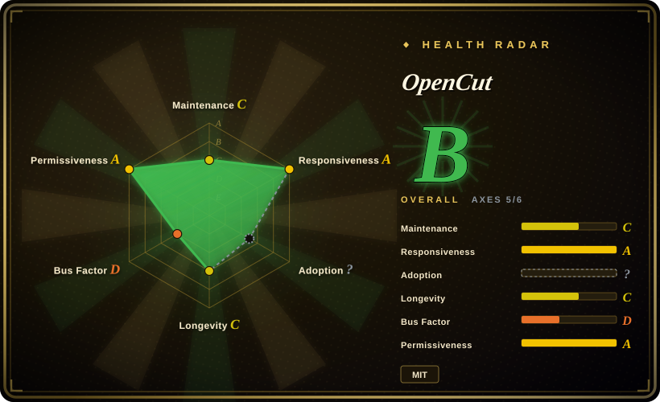

# OpenCut

An MIT-licensed video editor for web, desktop, and mobile with the largest community in the open-source CapCut-alternative space — currently being rewritten from the ground up, with the version its own README tells you to use living in a separate, archived `opencut-classic` repository.

## When to use

You're evaluating open-source CapCut alternatives and OpenCut is the first hit: 89.8k stars, an MIT licence, a browser editor you can self-host, and a Discord. The question the star count does not answer is whether it is something you can adopt this quarter.

OpenCut is a TypeScript editor for web, desktop, and mobile. As of 2026-09-19 its README states plainly that the project "is being rewritten from the ground up", lists an Editor API, first-class third-party plugins, a Rust core, an MCP server, headless mode, and an in-editor scripting tab as things that are coming, and says the project is not set up to take outside contributions while the architecture is designed. The version the README points at for real use today is the separate, archived `OpenCut-app/opencut-classic` repository. Reach for the OpenCut repository when you want to track or build against the next-generation architecture — the Rust/wgpu compositor compiled to WASM, the 120,000-ticks-per-second `MediaTime` arithmetic, the GPUI desktop shell described in v0.3.0 — and reach for [Concat](concat.md) when you need a native, offline editor whose main branch you can install and run now.

## When NOT to use

- **You need an editor to adopt today for actual work.** This repository ships nothing usable while the rewrite is in progress and the newest tagged release is v0.3.0 (2026-04-15). Use [Concat](concat.md) for a runnable native beta, or the archived `opencut-classic` if you specifically want the browser version and accept that it is frozen.
- **You want to send a pull request.** The README states the project is not set up to take outside contributions yet; contribute to a project with an open review process, or wait until the architecture is declared stable.
- **You need a dependable release cadence or a stable extension API.** The Editor API, plugin system, MCP server, and headless mode are all "coming" in the README, and GitHub's commit-activity stats record no default-branch commits in the 13 weeks to 2026-09-13 [推断].
- **Your editor must run fully offline on modest hardware.** OpenCut renders in the browser through a WASM compositor and deploys its web app through OpenNext; if you need a native binary with bundled codecs and no browser, use [Concat](concat.md).
- **You only need programmatic, deterministic video from code.** A timeline editor is the wrong layer — use [Remotion](../../video-production/remotion.md) for React compositions rendered in CI, or [MLT](../video-audio/editing-and-cutting/mlt.md) if you are building the editor yourself.

## Comparison

| Alternative | In index | Our verdict | Tradeoff |
|---|---|---|---|
| [Concat](concat.md) | ✅ | When you want to install a native editor and cut today — offline, with bundled FFmpeg/Whisper and an API/CLI/server — pick Concat; pick OpenCut when community size, an MIT licence, and the roadmapped plugin/MCP architecture matter more than a runnable build, because OpenCut's repository is mid-rewrite with contributions closed. | Concat: runnable now, native, AGPL, one maintainer. OpenCut: permissive licence and a large community, nothing shipped from this repository at present. |
| [MLT](../video-audio/editing-and-cutting/mlt.md) | ✅ | When you are building an editor rather than using one, pick MLT; pick OpenCut only to follow its architecture, because MLT is the mature LGPL engine that already powers shipped editors while OpenCut's rewrite has no announced date. | MLT: proven engine, no GUI, LGPL. OpenCut: full application and browser reach, unshipped. |
| [Remotion](../../video-production/remotion.md) | ✅ | When video is generated by code at volume and must be deterministic, pick Remotion; pick OpenCut when a human edits interactively on a timeline, because Remotion has no timeline GUI and OpenCut is not a rendering framework. | Remotion: code-defined video with a mature renderer. OpenCut: interactive timeline editing for people. |
| CapCut (ByteDance) | 未收录 | When you want a polished free editor with cloud AI and do not mind the account, pick CapCut; pick OpenCut when the licence and self-hosting matter more than shipped polish, because CapCut is closed and gates 4K and AI behind Pro. | CapCut: mature effects, cloud-bound, closed. OpenCut: MIT and self-hostable, not currently shipping. |
| DaVinci Resolve / Premiere Pro | 未收录 | When a professional editor needs tracked masks, colour, and a mature keyframe editor for a deliverable, pick a commercial NLE; pick OpenCut when you are building or self-hosting an open editor rather than finishing a film, because the commercial tools are closed and not embeddable. | Commercial NLEs: depth and stability. OpenCut: open licence and browser reach, with an in-progress architecture. |

## Tech stack

- **Languages:** TypeScript for the web application, Rust compiled to WebAssembly for the timeline/compositing core (`rust/crates/compositor`, `effects`, `masks`, `gpu`, `time`); `apps/desktop` is a separate GPUI + Rust shell that v0.3.0 describes as early.
- **Rendering:** v0.3.0 replaced the WebGL renderer with a Rust/wgpu compositor compiled to WASM; time is an integer tick count (`MediaTime`, 120,000 ticks per second) with a rational `FrameRate` type.
- **Tooling:** `proto` pins the toolchain and `moon` runs tasks (`moon run web:dev`, `api:dev`, `desktop:dev`); the web app can deploy to Cloudflare Workers through OpenNext (`wrangler.jsonc`, `open-next.config.ts`).
- **Project model:** `SceneTracks` with explicit `overlay`, `main`, and `audio` fields; storage migrations ran through v25 as of v0.3.0.

## Dependencies

- **To use the hosted editor:** a modern browser with GPU acceleration; OpenCut shows a notice when GPU rendering is unavailable.
- **To build or self-host:** a Node.js toolchain managed by `proto` (`.prototools`) plus Moon for tasks, a Rust-to-WASM toolchain for the compositor, and optionally a Cloudflare Workers account for the OpenNext deployment.
- **For the desktop shell:** a Rust toolchain with GPUI; `apps/desktop` is described as having a build setup but no features yet.
- No database or server-side component is required to run the browser editor; the classic build kept projects in the browser.

## Ops difficulty

**Medium.** Using the hosted product requires no install, but the artifact you adopt from this repository is a monorepo you build: `proto use`, then `moon run web:dev` / `api:dev` / `desktop:dev`, with a Rust-to-WASM toolchain for the compositor and a separate desktop build path. Self-hosting on Cloudflare Workers is documented but young. The larger operational risk is not setup effort but project state: there is no release train to follow, contributions are closed, and the README redirects users to an archived classic build for anything real.

## Health & viability

- **Maintenance (2026-09):** stalled on the default branch. GitHub's commit-activity stats record no commits in the 13 weeks to 2026-09-13, the last push is 2026-08-10, and the newest tagged release is v0.3.0 of 2026-04-15.
- **Governance / bus factor:** organisation-owned (`OpenCut-app`) with sponsors including fal.ai, but heavily concentrated — the top contributor (`mazeincoding`) holds 1,058 commits against 71 for the next; outside contributions are intentionally disabled during the rewrite.
- **Backing & Lindy — large attention, no current output.** Created 2025-06-22, so ~15 months old with 89.8k stars and 8.9k forks; the adoption is real, but the "still active" half of the age × still-active prior does not hold right now.
- **Adoption & ecosystem:** the largest community in this niche — Discord, 378 open issues, a hosted service. Note that the deployed service runs the archived classic build, not this repository's work.
- **Risk flags:** MIT with no CLA or relicense history found, so the licence is not the risk; the risk is the rewrite trap — `opencut-classic` was split out and archived (last push 2026-05-17) while the rewrite has no announced date, so a very popular repository can spend a long stretch as a place where nothing is downloadable.

## Caveats (unverified)

- [未验证] Whether development resumed after the recorded last push (2026-08-10); repository state checked 2026-09-19.
- [未验证] v0.3.0's release notes describe a Rust/wgpu WASM compositor, `MediaTime`, and a GPUI desktop shell; no build was performed to confirm them.
- [推断] The 89.8k stars are legacy of the pre-split project: the split-out `opencut-classic` repository holds only 251 stars, which suggests this repository retained the original history and audience.
- [未验证] That opencut.app still serves the classic version is taken from this repository's README, not from inspecting the deployment.
- [未验证] Star, fork and issue counts (89,808 / 8,871 / 378 open) are point-in-time GitHub figures from 2026-09-19.
- [推断] "No commits in 13 weeks" is read from GitHub's commit-activity endpoint, which can lag or exclude non-default-branch work; `pushed_at` is 2026-08-10.
