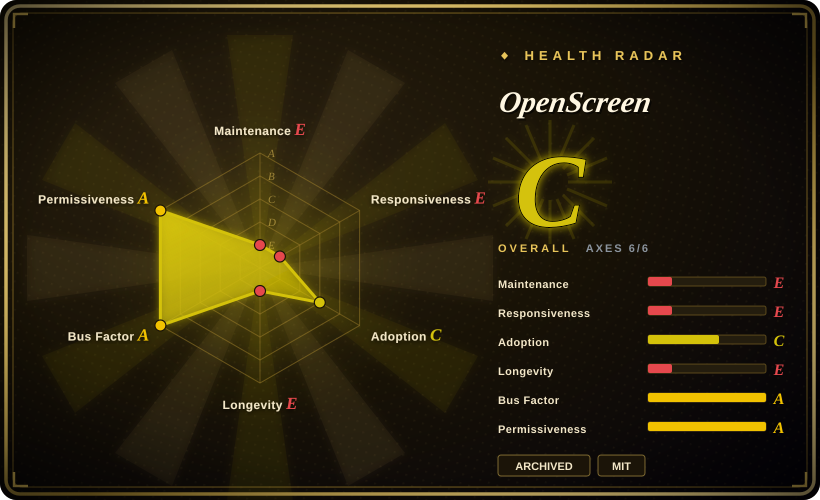
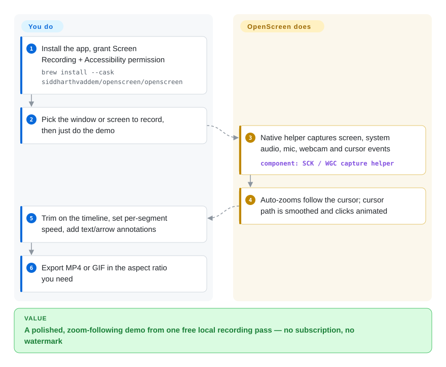

# OpenScreen

You recorded a five-minute product walkthrough with a plain screen recorder and nobody finishes watching it: the cursor is tiny, nothing zooms in on where you clicked, and the raw footage needs an editing pass before it can go on X or YouTube. OpenScreen records the screen and applies that "edited" look by itself — cursor-following zooms, a smoothed cursor, backgrounds, on-device captions — locally and free.

## When to use

You're an indie developer or a two-person team shipping a product, and the marketing checklist keeps saying "post a demo video": walkthroughs for X/Reddit, a tutorial for the docs, a GIF for the changelog. The tool that produces exactly that look, Screen Studio, is a subscription product (OpenScreen's README cites $29/month; screen.studio confirms monthly/yearly tiers, fetched 2026-09-28), and OBS gives you honest raw footage that then costs an afternoon of manual editing. You reach for OpenScreen when you want the capture and the polish in one free MIT-licensed local app: hit record, demo as usual, and the app generates the zooms that follow your cursor, smooths the cursor path, swaps in cursor themes and click effects, offers backgrounds and motion blur, transcribes your voiceover on-device, and exports MP4 or GIF in the aspect ratio each platform wants — with no account, no upload, and no watermark.

The honest version of this choice includes its maintenance reality: the upstream repo was archived in 2026-06 and its README says plainly that it is "not production grade and you'll hit bugs." You pick OpenScreen when free + local + full-feature-set beats maintained — a one-off demo where you can rerun a buggy export is fine — and you accept that fixes now come from the community fork (getopenscreen/openscreen) or from building it yourself, not from the original author.

## How it works

OpenScreen is an Electron desktop app whose heavy lifting is deliberately not in Electron. **You do three things: install and grant the OS permissions (Screen Recording + Accessibility on macOS), pick a window or the whole screen and record, then trim/annotate and export.** It does everything between: a per-OS native helper does the capturing — a Swift ScreenCaptureKit helper on macOS and a C++ Windows Graphics Capture (+ WASAPI loopback audio, DirectShow webcam) helper on Windows, while Linux records through the browser pipeline — so screen, system audio, microphone, webcam picture-in-picture, and real cursor events (shape and clicks) are captured natively. When you stop recording, the editor auto-generates zoom sequences from your cursor trail, smooths the cursor path, and renders the polish (zooms, motion blur, backgrounds) through PixiJS, a WebGL engine; captions run through transformers.js, an on-device speech model runtime, so nothing is uploaded. Export re-encodes to MP4 or GIF via the bundled media libraries. Think of it as a recorder with the editor pre-loaded: not proofreading your footage afterwards — the "camera" itself zooms and dollies as you work.

<!-- flow-steps:begin (generated from flows/openscreen.json by tools/flow_card.py — do not edit) -->

Text version of the flow

1. **You**: Install the app, grant Screen Recording + Accessibility permission — `brew install --cask siddharthvaddem/openscreen/openscreen`
2. **You**: Pick the window or screen to record, then just do the demo
3. **OpenScreen**: Native helper captures screen, system audio, mic, webcam and cursor events — component: `SCK / WGC capture helper`
4. **OpenScreen**: Auto-zooms follow the cursor; cursor path is smoothed and clicks animated
5. **You**: Trim on the timeline, set per-segment speed, add text/arrow annotations
6. **You**: Export MP4 or GIF in the aspect ratio you need

**Value**: A polished, zoom-following demo from one free local recording pass — no subscription, no watermark

<!-- flow-steps:end -->

## When NOT to use

- **You need a maintained tool for recurring production work.** The repo is archived (2026-06) and the README itself warns it is "not production grade and you'll hit bugs." For continued fixes use the community fork getopenscreen/openscreen (未收录), or Cap (未收录) for an actively developed open-source recorder, or pay for Screen Studio (非仓库 — closed, subscription-priced commercial product).
- **You want live streaming, scenes, or a source compositor.** OpenScreen records and edits a demo file; there is no RTMP output and no scene system. Use OBS Studio (未收录), which is built for exactly that — and does not auto-edit.
- **You're on Linux and need the full feature set.** Linux capture goes through the browser pipeline: only cursor *position* is captured (no cursor themes or click effects), and system audio needs PipeWire. If the deliverable is a polished Linux-native demo, record on macOS/Windows or accept the reduced capture surface. [推断]
- **The job is multi-clip NLE editing, not screen demos.** No color grading, tracked masks, or multi-track timeline for music footage — cut long-form material in [Concat](concat.md) for a scriptable open-source editor, or a commercial NLE (DaVinci Resolve, 未收录) for professional depth.
- **You need to record an iPhone/iPad through your Mac.** Screen Studio (非仓库) has first-class iOS device capture with device-frame overlays; OpenScreen's feature list does not include it.
- **You want shareable links and a team video library.** OpenScreen exports files, full stop. Cap (未收录) builds its whole workflow around instant shareable links; that is a product-shape difference, not a settings toggle.

## Comparison

| Alternative | In index | Our verdict | Tradeoff |
|---|---|---|---|
| Screen Studio | 非仓库 | When you want the most polished, supported result on macOS and a subscription is acceptable, buy Screen Studio; pick OpenScreen when free, MIT, and fully local are hard constraints, because Screen Studio is closed-source and subscription-priced (OpenScreen's README cites $29/month; screen.studio shows monthly/yearly tiers, 2026-09-28). | Closed commercial product (screen.studio), macOS-first with a Windows beta in progress; adds iOS-device recording, 4K/60fps export, and shareable links. OpenScreen is free and local but archived — you are the support channel. |
| Cap (CapSoftware/Cap) | 未收录 | When you want an actively maintained open-source recorder built around instant shareable links (a Loom-style workflow), pick Cap; pick OpenScreen when the deliverable is a file you finish yourself with auto-zooms, backgrounds, and on-device captions, because Cap's built-in editing is lighter and its flow routes through Cap's cloud. | Not added in this tab-intake batch. Cap: Rust, ~22.9k stars, pushed 2026-09-28; license shows NOASSERTION in the GitHub API — read it before adopting. OpenScreen: richer timeline, fully local, archived upstream. |
| OBS Studio | 未收录 | When you need live streaming, scenes, and a compositor over sources, pick OBS; pick OpenScreen when the deliverable is an auto-polished demo file, because OBS records but never edits — the zooms and cursor smoothing would be manual work elsewhere. | Not added in this tab-intake batch. OBS: GPL-2.0, ~76.7k stars, cross-platform, huge plugin ecosystem, zero auto-polish. OpenScreen: capture-to-polished-export in one app, no streaming. |
| ShareX | 未收录 | When you are on Windows and want a featherweight, deeply configurable capture tool with a fast GIF/short-clip workflow, pick ShareX; pick OpenScreen when cursor-following zoom polish and cross-platform parity matter, because ShareX is Windows-only and does not auto-edit. | Not added in this tab-intake batch. ShareX: GPL-3.0, ~39.8k stars, active; capture-region and hotkey depth instead of an editor. OpenScreen: the editor is the point. |
| Kap | 未收录 | When you want a minimal macOS open-source recorder for quick clip exports, Kap's shape fits — but its default branch has had no commit since 2024-02, so pick OpenScreen (or its community fork) when you need the auto-polish pipeline and a project that still builds today. | Not added in this tab-intake batch. Kap: MIT, ~19.4k stars, dormant (last default-branch commit 2024-02-14; `pushed_at` 2024-11-12 is a later non-default push; API read 2026-10-09); plugin-friendly but no auto-zoom/cursor treatment. |

## Tech stack

- **Core:** Electron + TypeScript; React 18 UI on Radix UI + Tailwind CSS; Vite build; Biome for lint/format.
- **Capture:** per-OS native helpers outside the Electron renderer — Swift **ScreenCaptureKit** helper (`electron/native/screencapturekit`) on macOS; C++ **Windows Graphics Capture** + WASAPI loopback audio + DirectShow webcam (`electron/native/wgc-capture`) on Windows; Linux records through the browser (`getDisplayMedia`) pipeline.
- **Preview/effects:** PixiJS 8 (WebGL) with pixi-filters for zooms, motion blur, and backgrounds; GSAP + Motion for animation.
- **Media pipeline:** mediabunny + mp4box + web-demuxer for demux/mux, gif.js for GIF export, fix-webm-duration for raw webm recordings.
- **Captions:** @xenova/transformers (transformers.js) — on-device speech-to-text; README states "no upload (works offline)".
- **Tests/packaging:** Vitest + Playwright + Testing Library + fast-check in devDependencies; electron-builder artifacts; Nix flake with NixOS and Home Manager modules.

## Dependencies

- **A desktop OS:** macOS (system audio needs macOS 13+; on 14.2+ you are prompted for audio-capture permission; macOS 12 and below get mic only), Windows (WGC, works out of the box), Linux (.deb / .pacman / .AppImage; AppImage may need `--no-sandbox`).
- **macOS permissions:** Screen Recording + Accessibility granted on first launch; manual `.dmg` installs may additionally need `xattr -rd com.apple.quarantine /Applications/Openscreen.app`.
- **Linux audio:** PipeWire for system-audio capture (default on Ubuntu 22.04+ / Fedora 34+); PulseAudio-only setups record mic only.
- **Nothing else:** no account, no server, no database, no API key; recordings and caption generation stay on the machine.
- **Install surfaces:** Homebrew cask (`brew install --cask siddharthvaddem/openscreen/openscreen`), winget (`winget install SiddharthVaddem.OpenScreen`), GitHub Releases installers, Nix (`nix run github:siddharthvaddem/openscreen`).

## Ops difficulty

**Low to run, real lifecycle risk to own.** For the person recording it is an ordinary desktop app: install, grant two macOS permissions, record, export — no services, keys, or databases, and packaging reaches brew/winget/Nix. The actual burden is that the upstream is archived: bugs you hit will not be fixed upstream, so pin the last working installer, expect to build from source (Electron + native Swift/C++ toolchains) for any change, and watch the community fork (getopenscreen/openscreen) if you want someone else's fixes.

## Health & viability

- **Maintenance — archived (2026-06).** GitHub API shows `archived: true`; the README banner states "now archived and no longer maintained"; the release line ran monthly from v1.1.2 (2026-02-07) to v1.5.0 (2026-06-06), then stopped. No upstream fixes after that date.
- **Continuation path:** a community-driven spin-off led by the #2 contributor (EtienneLescot, 78 commits) — README links `EtienneLescot/openscreen`, which now resolves to `getopenscreen/openscreen` — was active as of 2026-09-27 with ~3.3k stars under MIT. [推断] whether it consolidates the 3.1k-fork diaspora is unknown.
- **Governance / bus factor:** a personal side project throughout — owner is a `User`, and siddharthvaddem holds 505 of the ~740 top-10 commits (~68%); the README itself frames it as "a side project that blew up; not production grade and you'll hit bugs."
- **Age & Lindy:** created 2025-10-10, archived ~8 months later; ~40k stars in that window is attention, not a track record — young + hyped + archived fails the Lindy prior. Treat the code as a working snapshot and a pattern source, not a platform.
- **Adoption:** unusually wide reach for the age — 39.9k stars, 3.1k forks, brew/winget/Nix packaging, and a UI translated into 13 languages including Simplified/Traditional Chinese.
- **Risk flags:** the archive itself is the headline risk; fork fragmentation (which fork wins may shift); the macOS `xattr` quarantine workaround normalizes bypassing Gatekeeper for manual installs; no SECURITY.md or CVE process appears in the repo tree.

## Caveats (unverified)

- [未验证] Screen Studio's exact price — "$29/month" is OpenScreen's README figure; screen.studio (fetched 2026-09-28) confirms subscription monthly/yearly tiers, but the scraped amounts were garbled, so the number itself was not confirmed.
- [未验证] "Automatic captions … generated on-device with no upload (works offline)" is README-stated, corroborated only by the `@xenova/transformers` dependency; not executed here, and whether the caption model bundles into the installer or downloads on first use was not checked.
- [推断] The community fork's long-term stewardship — activity observed via the GitHub API through 2026-09-27; no governance docs or release discipline were reviewed for it.
- [未验证] Comparison verdicts for Cap / OBS Studio / ShareX / Kap rest on repo metadata fetched 2026-09-28 (push times, stars, license fields), not on installing any of them; Cap's license shows NOASSERTION in the API and was not read.
- [未验证] macOS notarization ("brew … verifies the download against a notarized signature") and the `xattr` Gatekeeper workaround are README claims; not tested here.
- [未验证] Star, fork, and issue counts (39,961 / 3,154 / 49 open) are point-in-time GitHub values from 2026-09-28 and are volatile.
