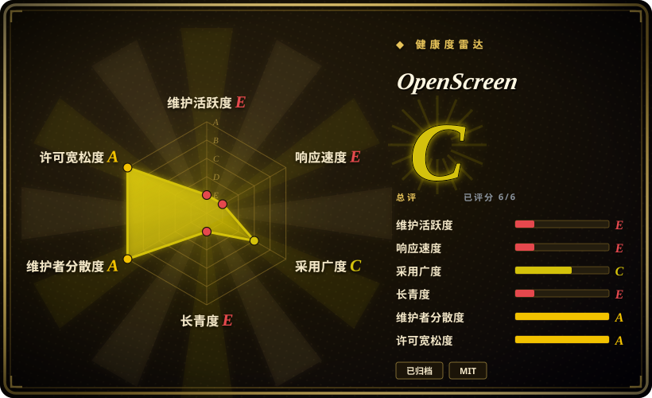
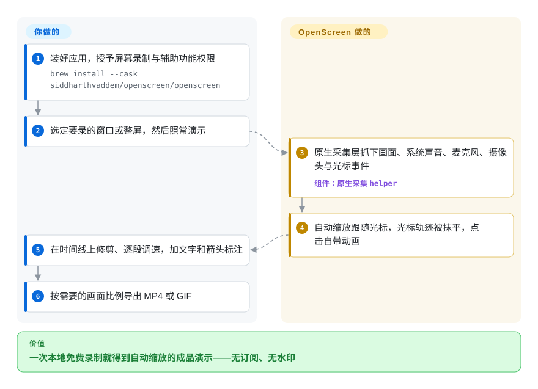

# OpenScreen

你用普通录屏工具录了五分钟产品演示，发出去没人看得下去：光标小得看不见、点了哪里毫无强调，原始素材不剪一遍根本没法发到 X 或 YouTube。OpenScreen 录屏时顺手把这种「剪辑感」自动做掉——跟随光标的自动缩放、抹平的光标轨迹、背景和本地字幕——全程本地、免费、无水印。

## 何时使用

你是独立开发者或两人小团队，产品正在发布，营销清单上反复出现「发一条演示视频」：X／Reddit 的功能演示、文档里的操作教程、changelog 里的 GIF。做出这种成片质感的工具 Screen Studio 是订阅制（OpenScreen 的 README 写的是每月 29 美元；screen.studio 官网确有按月／按年两档，2026-09-28 抓取），而 OBS 给你的只是诚实的原始素材，后续要花一个下午手动剪。当你想要「采集＋自动加工」合在一个免费、MIT、纯本地的应用里完成时，就选 OpenScreen：按下录制、照常演示，应用自动生成跟随光标的缩放、抹平光标轨迹、替换光标主题和点击效果、提供背景与动态模糊、在设备上转录配音生成字幕，并按各平台需要的画面比例导出 MP4 或 GIF——没有账号、没有上传、没有水印。

这个选择的诚实版本包含它的维护现状：上游仓库已于 2026 年 6 月归档，README 直说「不是生产级，你会遇到 bug」。适合选它的场景是「免费＋本地＋功能全」压过「有人维护」——一次性的演示视频，导出出错重录一遍就能接受；同时你要接受修 bug 现在只能靠社区分支（getopenscreen/openscreen）或自己改代码，原作者不再出面。

## 怎么用起来

OpenScreen 是一个 Electron 桌面应用，但重活刻意不放在 Electron 里。**你只做三件事：装好并授予系统权限（macOS 是屏幕录制＋辅助功能）、选定窗口或整屏开录、修剪加标注后导出。** 中间的事全归它：采集交给每平台一个的原生 helper——macOS 是 Swift 写的 ScreenCaptureKit helper，Windows 是 C++ 写的 Windows Graphics Capture（外加 WASAPI 环回音频、DirectShow 摄像头），Linux 走浏览器管线——屏幕、系统声音、麦克风、画中画摄像头以及真实光标事件（形状和点击）都原生抓取。停止录制后，编辑器根据你的光标轨迹自动生成缩放序列、抹平光标路径，缩放、动态模糊、背景这些效果经 PixiJS（一个 WebGL 渲染引擎）呈现；字幕走 transformers.js——一个在本地跑语音模型的运行时——不上传任何东西。导出时由内置媒体库重编码成 MP4 或 GIF。可以把它想成一台自带剪辑师的摄像机：不是事后替你修片，而是镜头本身在你操作时就在推拉摇移。

<!-- flow-steps:begin (generated from flows/openscreen.json by tools/flow_card.py — do not edit) -->

流程文字版

1. **你**：装好应用，授予屏幕录制与辅助功能权限 — `brew install --cask siddharthvaddem/openscreen/openscreen`
2. **你**：选定要录的窗口或整屏，然后照常演示
3. **OpenScreen**：原生采集层抓下画面、系统声音、麦克风、摄像头与光标事件 — 组件：`原生采集 helper`
4. **OpenScreen**：自动缩放跟随光标，光标轨迹被抹平，点击自带动画
5. **你**：在时间线上修剪、逐段调速，加文字和箭头标注
6. **你**：按需要的画面比例导出 MP4 或 GIF

**价值**：一次本地免费录制就得到自动缩放的成品演示——无订阅、无水印

<!-- flow-steps:end -->

## 何时不用

- **你需要有人维护的工具来承担长期生产工作。** 仓库 2026 年 6 月已归档，README 自己都警告「不是生产级，你会遇到 bug」。要持续修 bug，用社区分支 getopenscreen/openscreen（未收录），或 Cap（未收录，仍在活跃开发的开源录屏），或付费用 Screen Studio（非仓库——闭源、订阅制的商业产品）。
- **你要直播、多场景或合成多路画面源。** OpenScreen 只录制并编辑成一个成片文件，没有 RTMP 输出也没有场景系统。用 OBS Studio（未收录）——它就是为此而生的，代价是它不会自动剪辑。
- **你在 Linux 上且需要完整功能。** Linux 采集走浏览器管线：只抓光标*位置*（没有光标主题和点击效果），系统声音还需要 PipeWire。如果交付物必须是 Linux 原录制的高完成度演示，要么在 macOS／Windows 上录，要么接受功能缩水。[推断]
- **活儿是多素材 NLE 剪辑而不是屏幕演示。** 没有调色、跟踪遮罩，也没有给音乐素材用的多轨时间线——长片去 [Concat](concat.zh.md)（可脚本化的开源编辑器）剪，专业深度上商业 NLE（DaVinci Resolve，未收录）。
- **你需要透过 Mac 录 iPhone／iPad。** Screen Studio（非仓库）有带设备边框的一流 iOS 设备录制；OpenScreen 的功能清单里没有。
- **你要可分享链接和团队视频库。** OpenScreen 只导出文件，到此为止。Cap（未收录）整个工作流就围绕即时分享链接构建——这是产品形态差异，不是设置开关。

## 横向对比

| 替代品 | 是否收录 | 我们的评价 | 取舍 |
|---|---|---|---|
| Screen Studio | 非仓库 | 想在 macOS 上拿到最打磨、有人兜底的结果且接受订阅，就买 Screen Studio；「免费、MIT、纯本地」是硬约束时选 OpenScreen——因为 Screen Studio 闭源且按订阅收费（OpenScreen 的 README 称每月 29 美元；screen.studio 官网可见按月／按年档位，2026-09-28）。 | 闭源商业产品（screen.studio），macOS 优先、Windows 版在 beta；多出 iOS 设备录制、4K/60fps 导出和分享链接。OpenScreen 免费且本地，但已归档——客服就是你自己。 |
| Cap (CapSoftware/Cap) | 未收录 | 想要一个仍在活跃维护、围绕即时分享链接（Loom 式工作流）构建的开源录屏，选 Cap；交付物是一个要自己收尾的文件、还要自动缩放、背景和本地字幕时，选 OpenScreen——因为 Cap 的内置剪辑更轻，且流程要经过 Cap 的云。 | 本批次 tab-intake 未收录。Cap：Rust 写的，约 22.9k 星，2026-09-28 仍在推送；license 在 GitHub API 显示 NOASSERTION，采用前先读。OpenScreen：时间线更全、纯本地、上游已归档。 |
| OBS Studio | 未收录 | 要直播、场景和画面源合成，选 OBS；交付物是一个自动加工好的演示文件时，选 OpenScreen——因为 OBS 只录不剪，缩放和光标美化得在别处手动做。 | 本批次 tab-intake 未收录。OBS：GPL-2.0、约 76.7k 星、跨平台、插件生态庞大、零自动美化。OpenScreen：一个应用里从采集到成品导出，但没有直播。 |
| ShareX | 未收录 | 你在 Windows 上想要一个轻巧、可深度定制的抓屏工具，GIF／短片段工作流快，选 ShareX；当跟随光标的缩放美化和跨平台一致性更重要时，选 OpenScreen——因为 ShareX 只有 Windows，且不自动剪辑。 | 本批次 tab-intake 未收录。ShareX：GPL-3.0、约 39.8k 星、活跃；强在截屏区域和热键深度而非编辑器。OpenScreen：编辑器才是重点。 |
| Kap | 未收录 | 想要极简的 macOS 开源录屏、快速导出小片段，Kap 的形态对口——但它的仓库自 2024 年 11 月起就没动静了，所以需要自动美化流水线、需要项目今天还能构建时，选 OpenScreen（或其社区分支）。 | 本批次 tab-intake 未收录。Kap：MIT、约 19.4k 星、休眠中（API 读到 pushed_at 为 2024-11-12，2026-09-28）；插件友好但没有自动缩放／光标处理。 |

## 技术栈

- **主体：** Electron ＋ TypeScript；React 18 界面（Radix UI ＋ Tailwind CSS）；Vite 构建；Biome 负责 lint／格式。
- **采集：** Electron 渲染层之外、每平台一个的原生 helper——macOS 是 Swift 的 **ScreenCaptureKit** helper（`electron/native/screencapturekit`）；Windows 是 C++ 的 **Windows Graphics Capture** ＋ WASAPI 环回音频 ＋ DirectShow 摄像头（`electron/native/wgc-capture`）；Linux 走浏览器（`getDisplayMedia`）管线。
- **预览与特效：** PixiJS 8（WebGL）配 pixi-filters 做缩放、动态模糊和背景；GSAP ＋ Motion 做动画。
- **媒体管线：** mediabunny ＋ mp4box ＋ web-demuxer 做解复用／封装，gif.js 导出 GIF，fix-webm-duration 处理原始 webm 录像。
- **字幕：** @xenova/transformers（transformers.js）——设备端语音转文字；README 称「无上传（可离线）」。
- **测试与打包：** devDependencies 里有 Vitest ＋ Playwright ＋ Testing Library ＋ fast-check；electron-builder 出安装包；Nix flake 附 NixOS 与 Home Manager 模块。

## 依赖

- **一台桌面系统：** macOS（系统声音要 macOS 13＋；14.2＋ 首次会弹音频采集授权；macOS 12 及以下只有麦克风）；Windows（WGC，开箱即用）；Linux（.deb／.pacman／.AppImage；AppImage 可能要 `--no-sandbox`）。
- **macOS 权限：** 首次启动授予屏幕录制＋辅助功能；手动装 `.dmg` 的可能还要执行 `xattr -rd com.apple.quarantine /Applications/Openscreen.app`。
- **Linux 音频：** 系统声音采集需要 PipeWire（Ubuntu 22.04＋／Fedora 34＋ 默认自带）；只有 PulseAudio 的环境只能录麦克风。
- **其他一概不需要：** 无账号、无服务端、无数据库、无 API key；录像和字幕生成都留在本机。
- **安装渠道：** Homebrew cask（`brew install --cask siddharthvaddem/openscreen/openscreen`）、winget（`winget install SiddharthVaddem.OpenScreen`）、GitHub Releases 安装包、Nix（`nix run github:siddharthvaddem/openscreen`）。

## 运维难度

**用起来低，持有风险真实存在。** 对录的人来说就是普通桌面应用：安装、授两个 macOS 权限、录制、导出——没有服务、密钥或数据库，打包还覆盖了 brew／winget／Nix。真正的负担在上游已归档：你撞到的 bug 不会有上游修复，所以要把最后一个能用的安装包钉住，任何改动都得自己从源码构建（Electron 加原生 Swift／C++ 工具链），想要别人修的修复就盯社区分支（getopenscreen/openscreen）。

## 健康度与可持续性

- **维护——已归档（2026-06）。** GitHub API 显示 `archived: true`；README 横幅写明「现已归档、不再维护」；发版节奏从 v1.1.2（2026-02-07）到 v1.5.0（2026-06-06）大约每月一版，之后停止。此后上游零修复。
- **续命路径：** 二号贡献者（EtienneLescot，78 次提交）领导的社区分支——README 链接的 `EtienneLescot/openscreen` 现已解析到 `getopenscreen/openscreen`——截至 2026-09-27 仍活跃，约 3.3k 星，MIT。[推断] 它能否收拢 3.1k 个 fork 的散落社区，未知。
- **治理／bus factor：** 始终是个人副业——owner 是 `User` 类型，siddharthvaddem 占前 10 贡献者约 740 次提交中的 505 次（约 68%）；README 自述「一个做大了的副项目；不是生产级，你会遇到 bug」。
- **年龄与 Lindy：** 2025-10-10 创建，约 8 个月后归档；这段时间攒下约 4 万星是热度不是资历——年轻＋高热度＋已归档不满足 Lindy 先验。把代码当作能用的快照和模式来源，不是可依赖的平台。
- **采用面：** 就年龄而言触达罕见地广——39.9k 星、3.1k fork、brew／winget／Nix 打包，界面翻译成含简繁中文在内的 13 种语言。
- **风险项：** 归档本身就是头号风险；fork 碎片化（哪个分支胜出可能变化）；macOS 手动安装的 `xattr` 隔离绕过等于把「过 Gatekeeper」常规化；仓库树里没有 SECURITY.md 或 CVE 流程。

## 存疑（未验证）

- [未验证] Screen Studio 的确切价格——「每月 29 美元」出自 OpenScreen 的 README；screen.studio（2026-09-28 抓取）确认有按月／按年订阅档位，但抓到的金额乱码，数字本身未获确认。
- [未验证] 「自动字幕在设备上生成、无上传（可离线）」是 README 的说法，仅由 package.json 里的 `@xenova/transformers` 依赖佐证；未实际运行，字幕模型是打进安装包还是首次使用时下载也未查。
- [推断] 社区分支的长期治理——活跃度经 GitHub API 观察至 2026-09-27；未审阅其治理文档或发版纪律。
- [未验证] 对 Cap／OBS Studio／ShareX／Kap 的对比结论基于 2026-09-28 抓取的仓库元数据（推送时间、星数、license 字段），未实际安装任何一个；Cap 的 license 在 API 里显示 NOASSERTION，未读原文。
- [未验证] macOS 公证（「brew……会校验带公证签名的下载」）与 `xattr` 绕过 Gatekeeper 的做法是 README 声明；未实测。
- [未验证] 星数、fork 数与 open issue 数（39,961／3,154／49）是 2026-09-28 的 GitHub 瞬时值，易变。
