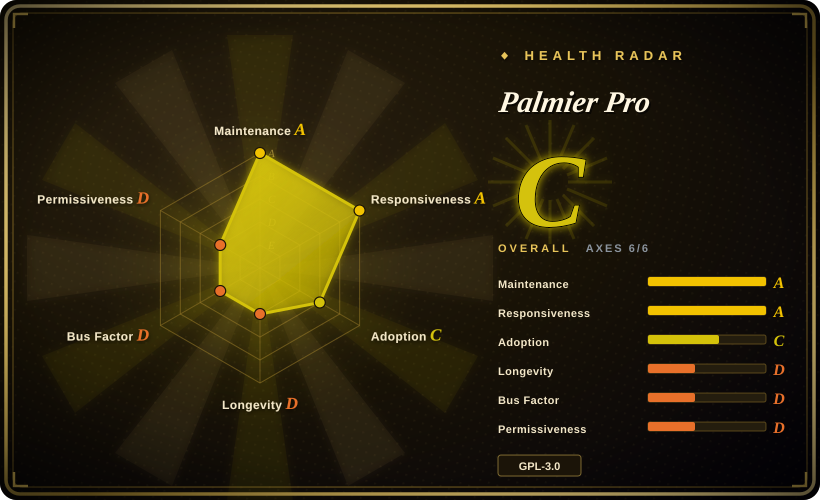
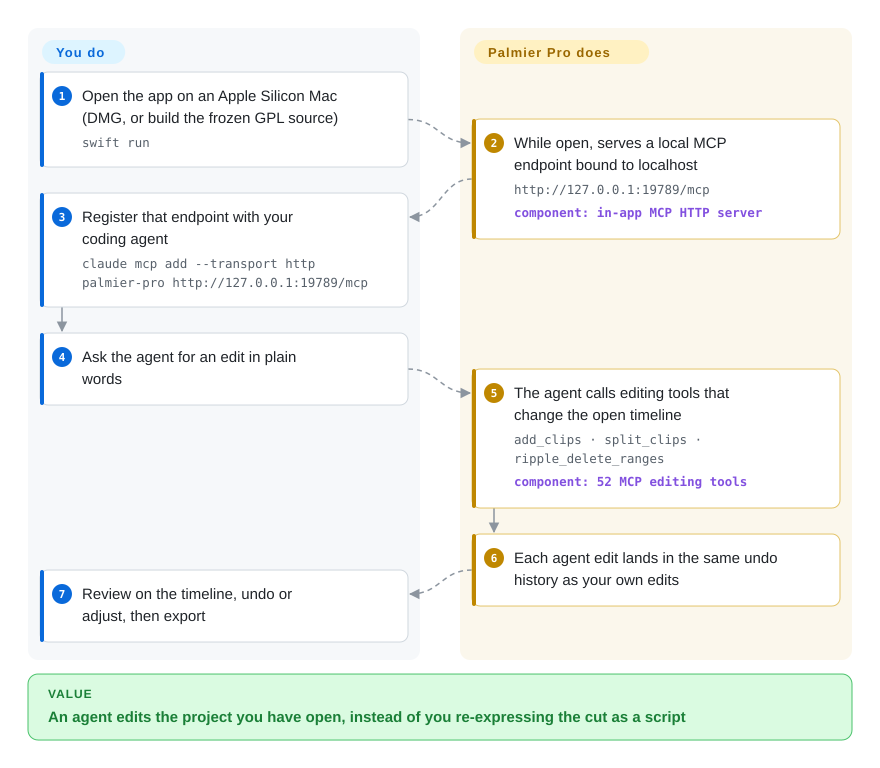

# Palmier Pro

You want Claude Code or Codex to do the tedious part of an edit — cut the dead air, add captions, lay B-roll over a talking head — but the agent can only write scripts, while your edit lives in an editor it cannot touch. Palmier Pro is a native macOS editor that opens a local door (an MCP server) so the agent edits the same timeline you are looking at; note that only its source up to v0.7.6 is open, later builds are proprietary.

## When to use

You make short-form or talking-head video on an Apple Silicon Mac and already live in Claude Code, Codex or Cursor. The work you want to hand off is concrete: "remove the pauses between sentences, add word-level captions, cut to the second camera when the guest speaks". With a script-based tool you would describe the cut in Python or JSON and then re-open the result in a GUI to fix it; with a GUI-only editor the agent has no way in. You reach for Palmier Pro because the agent and you work on the **same open project**: the app exposes 52 editing tools over a localhost MCP endpoint, its own UI edits and the agent's edits go through the same operations and the same undo history, and you can watch, undo and correct each change on the timeline. Generation of new footage (Seedance, Kling, Nano Banana Pro and others) is built into the editor, billed through a Palmier account.

The deciding tradeoff against its closest substitutes: [Concat](concat.md) is also a native editor with an automation surface, but it is cross-platform, fully offline and AGPL, with a JSON-RPC/gRPC server rather than an MCP tool set; [video-use](../../video-production/video-use.md) lets an agent cut raw takes into a finished file with ffmpeg, with no editor in the loop. Pick Palmier Pro when you want to stay in a real timeline and review agent edits there, you are on macOS 26 with Apple Silicon, and you accept that the maintained app is now a proprietary binary while the open source is a frozen snapshot.

## How it works

Palmier Pro is a Swift application built on Apple's media stack (AVFoundation for decoding and playback, Core Image with custom Metal kernels for effects and colour). While the app is open it runs a small HTTP server on your own machine that speaks MCP — the Model Context Protocol, a standard way for an AI agent to discover and call tools. You register that address with your agent once; after that, when you ask for an edit, the agent calls tools such as `add_clips`, `split_clips` or `ripple_delete_ranges` (delete a range and close the gap), and the app applies them to the timeline you have open. Think of it as giving the agent a second mouse on your project rather than asking it to write a recipe you then cook by hand. What the app does for you: the timeline model, rendering, the tool contracts, validation of each tool call and a single undo history for both of you. What you do: open the project, say what you want, review the result and export (to a video file, or to FCPXML / Final Cut Pro 7 XML for Resolve, Final Cut or Premiere). An in-app chat agent does the same through your own Anthropic/OpenAI key or Palmier credits; AI generation of new clips always goes through Palmier's hosted backend.

<!-- flow-steps:begin (generated from flows/palmier-pro.json by tools/flow_card.py — do not edit) -->

Text version of the flow

1. **You**: Open the app on an Apple Silicon Mac (DMG, or build the frozen GPL source) — `swift run`
2. **Palmier Pro**: While open, serves a local MCP endpoint bound to localhost — `http://127.0.0.1:19789/mcp` — component: `in-app MCP HTTP server`
3. **You**: Register that endpoint with your coding agent — `claude mcp add --transport http palmier-pro http://127.0.0.1:19789/mcp`
4. **You**: Ask the agent for an edit in plain words
5. **Palmier Pro**: The agent calls editing tools that change the open timeline — `add_clips · split_clips · ripple_delete_ranges` — component: `52 MCP editing tools`
6. **Palmier Pro**: Each agent edit lands in the same undo history as your own edits
7. **You**: Review on the timeline, undo or adjust, then export

**Value**: An agent edits the project you have open, instead of you re-expressing the cut as a script

<!-- flow-steps:end -->

## When NOT to use

- **You need an open-source editor that will keep getting fixes.** Only the source up to the `last-gpl-source` tag (2026-08-24, matching v0.7.6) is GPL-3.0; releases after v0.7.6 are proprietary, their source is not published, and the repository stopped accepting contributions on 2026-08-28. Choose [Concat](concat.md) or Kdenlive (not indexed) for an editor whose current version is open, because a frozen snapshot receives no security or compatibility fixes from its authors.
- **You are not on macOS 26 with Apple Silicon.** The README and `Package.swift` require macOS 26 (Tahoe) on M-series Macs, and the project guide says not to add support for other OS versions or architectures. On Windows or Linux use [Concat](concat.md) or Kdenlive (not indexed); in a browser follow [OpenCut](opencut.md).
- **You want unattended batch rendering on a server.** The MCP server only exists while the GUI app is running on a Mac, it is one app instance with its open project, and a studio asking about headless and parallel reel production (issue #302) was answered with "email us". For templated renders in CI use [Remotion](../../video-production/remotion.md); for Python batch cutting use [MoviePy](../video-audio/editing-and-cutting/moviepy.md).
- **You need AI generation without a vendor account, or with your own model keys.** Clip generation calls Palmier's Convex backend (`generations:submit`) and is charged in Palmier credits; the backend is not in the repository, and a self-built binary without Palmier's Clerk/Convex keys marks the account backend as misconfigured. If you want to own the generation pipeline, script the provider APIs yourself or use a pipeline such as [OpenMontage](../../video-production/open-montage.md).
- **Other local processes on the Mac are not trusted.** The MCP endpoint is bound to `127.0.0.1` and checks the `Origin` header, but it has no token; any local process can drive the open project, as issue #302 points out. Keep it closed on shared machines, or use [Concat](concat.md), whose local server uses a per-run token.
- **You are building your own editor or headless editing service.** Forking a frozen single-vendor Swift app ties you to macOS 26 and to GPL obligations; use [MLT](../video-audio/editing-and-cutting/mlt.md) for a reusable timeline engine instead.
- **Your team edits in 剪映 / CapCut.** Palmier Pro exports FCPXML and FCP7 XML, not 剪映 drafts (a request for that export, issue #580, is open). Use [pyJianYingDraft](../nle-automation/pyjianyingdraft.md) or [JianYing Editor Skill](../nle-automation/jianying-editor-skill.md) to have an agent write 剪映 projects.

## Comparison

| Alternative | In index | Our verdict | Tradeoff |
|---|---|---|---|
| [Concat](concat.md) | ✅ | If you need a native editor an agent can drive on Windows, Linux or macOS, fully offline and with an open current version, pick Concat; pick Palmier Pro only when you are on macOS 26 and want MCP editing tools plus built-in generation. | Concat gains platform reach, offline speech and a token-protected server; it pays with a one-maintainer beta, AGPL obligations and no MCP tool set. |
| [OpenCut](opencut.md) | ✅ | Follow OpenCut when a browser-based open editor matters more than working agent integration today; choose Palmier Pro when an agent has to edit your timeline now. | OpenCut gains browser reach and an open MIT codebase; its current repository is mid-rewrite and ships no usable build, and it has no agent tool surface. |
| [video-use](../../video-production/video-use.md) | ✅ | When the job is "turn a folder of raw takes into a finished cut" and you do not need to review in a timeline, pick video-use; pick Palmier Pro when you want to see, undo and adjust each agent edit in an editor. | video-use gains portability (any OS with ffmpeg) and no GUI; you lose interactive review, and it needs an ElevenLabs Scribe key for transcripts. |
| Kdenlive | not indexed | For a long-lived, fully open desktop editor on Linux, Windows or macOS, pick Kdenlive; pick Palmier Pro only for its MCP agent editing and built-in generation. Not added in this tab-intake batch. | Kdenlive gains a decade-old KDE project with GPL source for its current version; it has no MCP agent surface or built-in AI generation. |
| Final Cut Pro | not a repo | If you need a mature, supported Mac NLE for paid client work, pick Final Cut Pro; use Palmier Pro for agent-driven rough cuts and hand off via FCPXML. | Final Cut Pro is Apple's closed commercial application: stable and complete, but no MCP agent surface and no source. Palmier Pro's FCPXML export lets you combine them. |

## Tech stack

- **Language / UI:** Swift 6.2 (a single SwiftPM executable target), SwiftUI plus AppKit; the project guide states macOS 26 and arm64 only.
- **Media:** AVFoundation for decode, playback and export; Core Image with 12 custom Metal kernels (chroma key, curves, LUT, grain, glow, vignette and others) compiled by a SwiftPM build plugin; exporters for video files, FCPXML and XMEML (Final Cut Pro 7 XML), plus an HDR exporter.
- **Agent surface:** `modelcontextprotocol/swift-sdk` for the MCP HTTP server (52 tools in `ToolName`); an in-app agent with an Anthropic/OpenAI bring-your-own-key client or a Palmier-hosted client; a bundled `mcpb` package for one-click Claude Desktop install.
- **Account and generation backend:** Clerk (sign-in) and Convex (jobs, uploads, credits) client SDKs; the backend itself is not in this repository.
- **Optional build traits:** `BundledSpeech` (MLX, `speech-swift` for voice activity detection and speech enhancement) and `ProductionTelemetry` (Sentry, PostHog). Also Sparkle (updates), `swift-transformers`, Lottie.

## Dependencies

- **Hardware / OS:** an Apple Silicon Mac on macOS 26 (Tahoe) or later — no Intel, Windows or Linux build.
- **For the maintained binary:** nothing to install beyond the DMG; updates arrive through Sparkle from this repository's `appcast.xml`.
- **For AI generation and hosted agent chat:** a Palmier account and credits (network calls to Palmier's backend and, behind it, the model providers).
- **For the in-app agent without credits:** your own Anthropic or OpenAI API key.
- **For agent editing from outside:** an MCP-capable client (Claude Code, Codex, Cursor or Claude Desktop per the README).
- **To build the GPL source:** Xcode's Swift 6.2 toolchain; `scripts/bundle.sh` expects Clerk/Convex settings in a `.env` file for the account features, and the signing identity defaults to Palmier's own.

## Ops difficulty

**Low to run the binary, medium-to-high to own the open version.** As a user it is a desktop app: install the DMG, sign in if you want generation, and add one MCP line to your agent. There is no server of yours to operate, but generation cost is metered credits, and the local MCP port is an unauthenticated control surface on your machine. Owning the GPL snapshot instead means building a Swift 6.2 app yourself, doing without the account backend (or writing your own), signing and notarising it, and carrying every future macOS and dependency fix alone, since upstream no longer publishes source.

## Health & viability

- **Maintenance (2026-09-28):** the *product* is active — v0.10.1 shipped 2026-09-26 after roughly weekly 0.x releases — but the *open source* is not: the last source change is the `last-gpl-source` tag (2026-08-24), and main has only appcast and licence-notice commits since "Retire public source development" (#578, 2026-08-28). Release notes for v0.10.x cite PR numbers that do not exist in this repository, so development continues in a private one.
- **Governance / bus factor:** a single vendor, Palmier, Inc. (Y Combinator S24 per the README badge). One maintainer (`htin1`) holds about 1,005 of ~1,100 commits and a second (`mricopeng`) 52; everyone else has 10 or fewer.
- **Backing & Lindy:** created 2026-04-07, about six months old. Too young for a Lindy prior, and the relicence removes the "old and still active" path for the open code: a young repository whose open line has already stopped.
- **Adoption:** about 14.5k stars and 1.1k forks in six months and roughly 98k downloads across the last 30 release assets (2026-09-28). Stars measure attention to the whole product, most of which is now closed. The most-starred fork continuing the GPL code (`TimLai666/fronda`) had 19 stars and no push since 2026-07-30.
- **Risk flags:** relicensed from GPL-3.0 to a proprietary binary licence after v0.7.6 (`BINARY_LICENSE.md` forbids copying, modifying and reverse engineering later binaries); generation locked to the vendor's backend and credits; optional telemetry (Sentry, PostHog) in production builds; a no-token localhost control port.

## Caveats (unverified)

- [推断] Development continuing privately is inferred from v0.10.1 release notes citing PR numbers #142–#145, which return 404 in the public repository (checked 2026-09-28); the vendor has not stated where the code now lives.
- [未验证] That the frozen GPL source builds and runs usefully without Palmier's Clerk/Convex keys was not tested: the code sets an `isMisconfigured` state instead of crashing, while the `bundle.sh` message still says the app "will fatalError on launch". Editing, MCP and bring-your-own-key chat should not need the backend [推断], but nothing was built here.
- [未验证] Supported generation models (Seedance, Kling, Nano Banana Pro and others) and pricing are author-stated and change per release; no generation was run.
- [未验证] Star, fork, download and commit counts (14,482 / 1,129 / ~97.9k over 30 releases / ~1,100) are point-in-time GitHub API values from 2026-09-28.
- [未验证] The Y Combinator S24 affiliation comes from the README badge only.
- [推断] Headless and parallel limits for batch production are inferred from the architecture (MCP server inside the GUI process) and the unanswered issue #302, not from a test.
